# Part 1

## Lecture 1

From Continuous-Time to Discrete Signals 从连续时间信号到离散信号

连续时间 continuous-time(CT) 信号的数字处理基本步骤： 

在模数（A/D）转换器之前使用抗混叠滤波器。

模数（A/D）转换器通过对 CT 信号进行采样，生成有限数量的离散值。

数字信号处理 (DSP) 系统根据具体应用处理离散时间信号，这是我们的重点。

数模（D/A）转换器将处理后的离散序列转换为连续时间信号。D/A 之后的重构滤波器可消除基带之外的任何成分。

这些功能块在不同的应用中都很常见，例如音频、图像或文本处理应用。

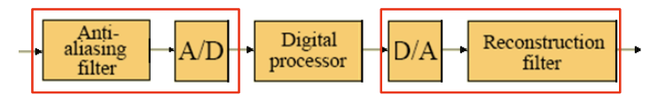

Digital Signal Processing 数字信号处理

DSP 的目标：从信号中提取有用信息。

DSP 算法取决于信号的类型和信号所携带信息的特征。

多种信号表示（如时域和变换域）对于 DSP 至关重要。

数字滤波是 DSP 中应用最广泛的操作： 通过某些频率成分、阻断其他频率成分。

我们将重点介绍单速率和多速率系统的数字滤波器。

Sampling Process采样过程

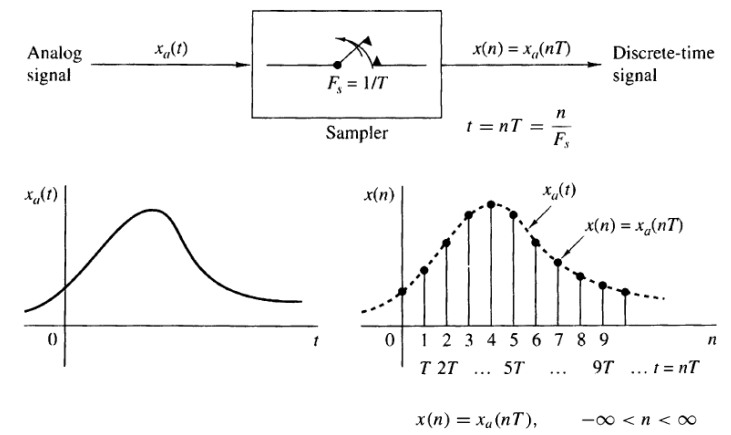

𝑓 和 𝜔是以赫兹和弧度/秒为单位的归一化频率

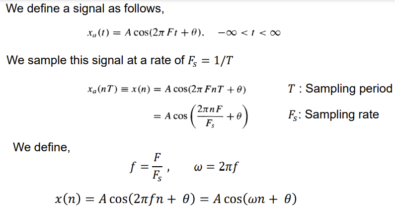

A/D Conversion A/D 转换

不同的连续时间（模拟）信号在采样后可能会产生相同的离散时间信号。请看下面的例子

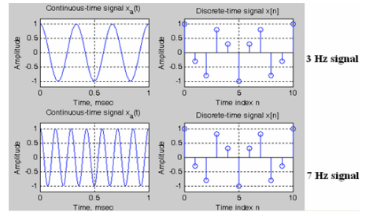

采样设计：将连续时间信号 x(t) 表示为离散时间信号 x(n)，以便日后从 x(n) 中恢复 x(t)。

数字形式 x(n) 是 x(t) 的近似值。采样的目的是以可接受的成本获得可接受的近似精度。

采样过程的两个关键参数： 

- 取样频率 𝐹𝑠 

- 每个样本值的位数 

取样设计中的权衡： 

- 𝐹𝑠 和 #bits 应该低，以降低计算成本。

- 𝐹𝑠 和 #bits 应该高，以获得更好的采样精度。

原始信号 x(t) 应从其数字形式 x(n) 恢复，失真度应在可接受范围内。

Aliasing Formula & Sampling Theorem 混叠公式和采样定理

Effects of Sampling in the Frequency Domain 频域采样的影响

假设 ga (t) 是连续时间信号，在时间时刻 t = nT 时进行采样，生成数字序列，T 为采样周期。

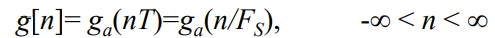

采样频率 Sampling frequency: FS = 1/T Hz

弧度采样频率Radian sampling frequency: ΩT = 2piFS

ga (t) 的频域表示由其连续时间傅里叶变换（CTFT）给出： 

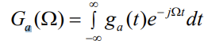

g[n] 的频域表示由其离散时间傅里叶变换 (DTFT) 给出：

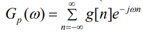

DTFT: 分析变换

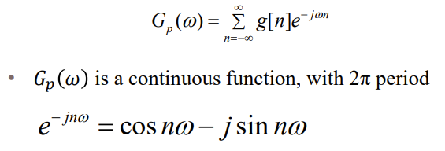

逆 DTFT：合成变换

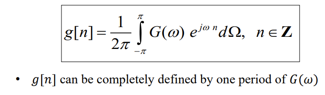

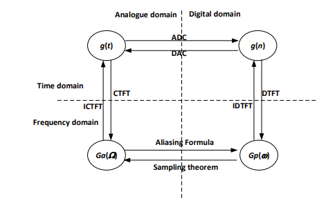

- 函数与信号域的关系 

- ICTFT 是逆 CTFT；IDTFT 是逆 DTFT 

从 CTFT 推导出 DTFT 

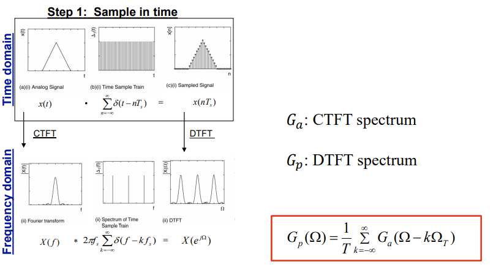

可以证明，采样信号的 DTFT 表示为

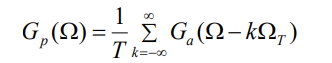

其中，Ga (Ω) 是 ga (t) 的 CTFT。

上式被称为消隐公式。理解这个公式对于理解奈奎斯特采样定理至关重要。产生混叠的原因是采样不足，即 Ω𝑇 太小。

Gp (Ω) 是 Ω 的周期函数，由 Ga (Ω) 的移位和缩放复制品之和组成，移位为 ΩT = 2piFT 的整数倍，缩放为 1/T

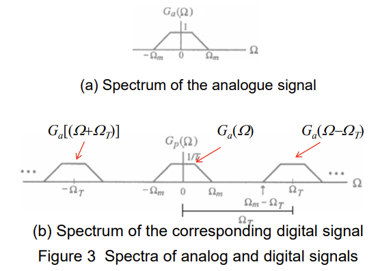

k = 0 时的 Gp (Ω) 项是基带部分（与 Ga (Ω)/T 相同），当 |k| > 0 时，其他各项是 Ga (Ω)/T 的频率偏移部分。

该频率范围被称为基带或奈奎斯特频带，它包含了信号的全部信息：

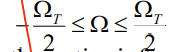

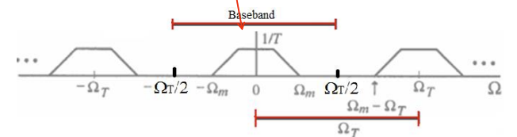

显然，如果 ΩT > 2Ωm（其中 Ωm 是信号中的最大频率），Ga (Ω)/T 产生 Gp (Ω) 的移位复制品之间就不会重叠。

另一方面，如下图所示，如果 ΩT < 2Ωm，Ga (Ω)/T 的移位复制品之间就会出现重叠，即所谓的混叠效应aliasing effects。

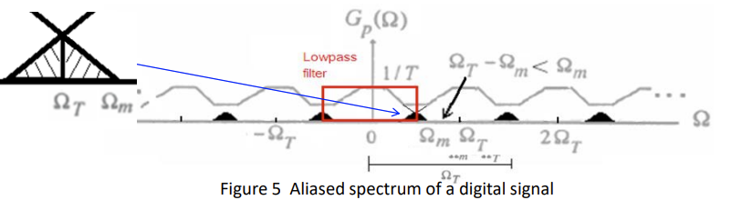

如果 ΩT < 2Ωm，由于移位复制品的重叠，则无法通过 DAC 滤波恢复频谱 Ga (Ω)。这是因为紧靠基带外的部分复制品的失真折回或混叠到基带中（见暗区）。

滤波器低通带宽内的部分就是恢复信号的频谱。发生混叠时，原始信号无法完美恢复/重建。

混叠造成的失真量取决于采样频率

示例：正弦信号的混叠

考虑 xa (t) = cos (w0 t)，其中 w0 = 2piF0 ，在 F= ±F0 处有频谱线（CTFT）（见图 (a)）。

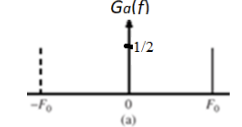

图 (b) 显示了当 Fs /2 < F0 时采样信号 x(n) 的线谱。

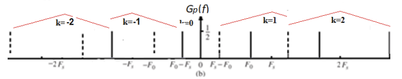

重建始终基于基频范围 |F|≤ Fs /2（见图 (c)）。其他频率被低通滤波器抑制。

Sampling Theorem 取样定理

假设 ga (t) 是一个带限信号，当 |Ω| > Ωm 时，CTFT Ga (Ω) = 0，那么如果 ΩT > 2Ωm，其中 ΩT = 2pi/T，则 ga (t) 由其采样 ga (nT)唯一确定，-∞< n < ∞。

ΩT > 2Ωm 这一条件通常被称为奈奎斯特条件Nyquist condition。

频率 ΩT /2 通常被称为折叠频率folding frequency。

ga (t) 中包含的最高频率 Ωm 通常被称为奈奎斯特频率Nyquist frequency，因为它决定了从其样本中完全恢复 ga (t) 所必须使用的最小采样频率 ΩT = 2Ωm 。

频率 2Ωm 被称为奈奎斯特速率Nyquist rate。

例：

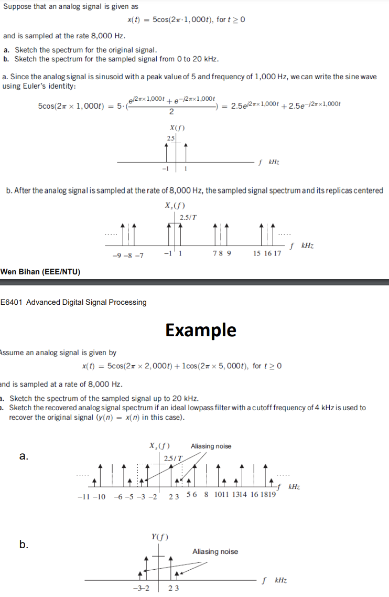

- 过采样 Oversampling - 采样频率高于奈奎斯特采样率，这将在后面的章节中讨论 

- 低采样 Undersampling - 采样频率低于奈奎斯特采样率，这将始终避免

- 临界采样 Critical sampling - 采样频率等于奈奎斯特采样率，这在实践中并不常用 

应用示例 ： 

- 在数字电话中，3.4 kHz 的信号带宽可用于电话通话，而采样率为 8 kHz，大于信号带宽的两倍。

- 在高质量的模拟音乐信号处理中，20 kHz 的带宽已被确定用于保持保真度。因此，在光盘（CD）音乐系统中，使用的采样率为 44.1 kHz，略高于信号带宽的两倍。

- 采样频率通常会受到系统实施限制的影响。

总结：

了解混叠效应对 DSP 研究非常重要，因为采样频率直接关系到性能和计算成本。如果不充分了解这种效应，就很难理解频谱，如数字序列的 DFT 或系统传递函数。更多信息，请参阅 Proakis 一书的第 6.1 节。

要点： 了解混叠公式和采样定理 ▪ 从数字采样中恢复原始信号的条件和方法是什么？音频和图像信号有哪些混叠现象？

问题： 各种信号的最基本要素是什么？无法单独描述所有信号，需要统一的方法。

让-巴蒂斯特-傅里叶（Jean Baptiste Fourier，1768-1830 年）给出了一种解决方案。他得出结论，所有信号都可以通过组合不同频率和振幅的正弦波产生。

DTFT - Representation in Frequency Domain 频域表示法

离散时间傅里叶变换 (DTFT) 通常用于观察数字信号 x(n) 的频率内容。

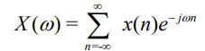

信号 x(n) 可以通过以下方法从连续 X(w) 中恢复出来

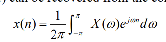

周期特性（消隐公式的基本结果）： 我们总是能观察到一个周期的频谱，即从 0 到 FT Hz，其中 FT 是采样频率。

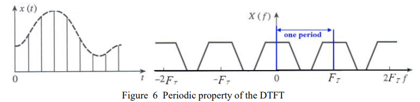

我们通常只使用频谱的前半部分

频谱通常以频率 0 ≤ f < FT 和弧度频率 0 ≤ w < wT =2piFT 的形式给出。频谱的其他部分是这一周期的重复

或归一化频率 0 ≤ f / FT < 1.0 和归一化弧度频率 0 ≤ w ≤ 2pi

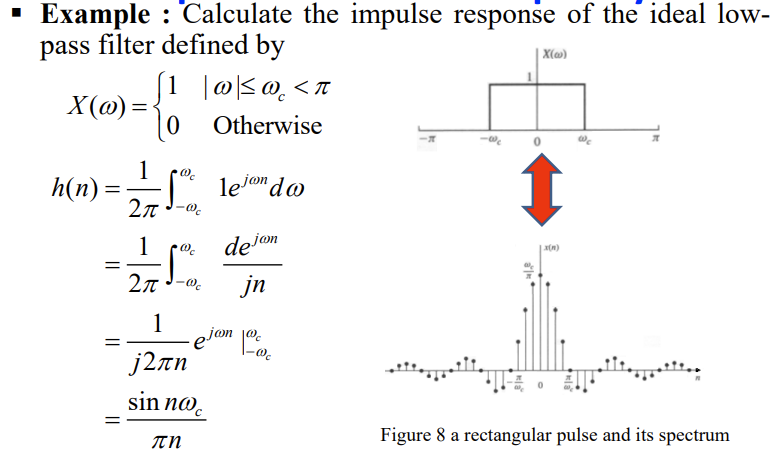

这种反应不是因果关系，无法实现（只存在于理论中）

如果一个系统的当前输出仅取决于输入的当前值和过去值，则该系统被称为因果系统(causal)。例如，x[n+1] 是未来的信号，x[n-1] 是过去的信号，那么

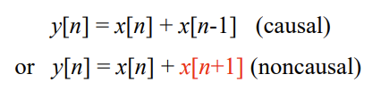

必须采取措施改变系统的因果性。例如，在频率响应中增加额外的相位，或在系统脉冲响应中增加时域延迟。

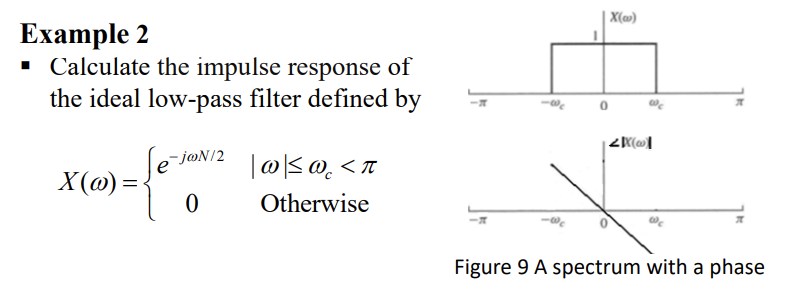

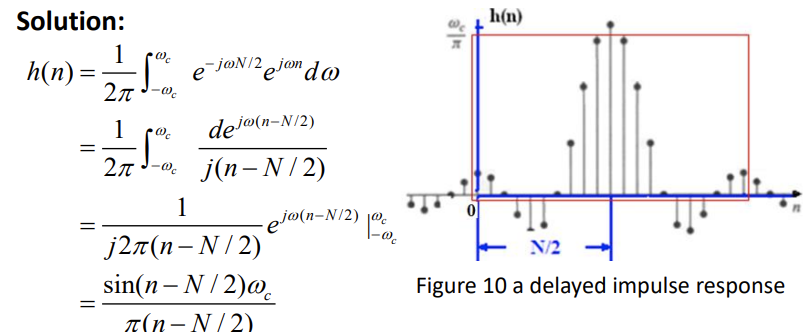

为了因果关系和可实现性，h(n) 必须在有限的持续时间内，并按序列长度的二分之一移动（见上图方框内的响应） 

响应的有限长度将导致 - 通带和阻带中的波纹 - 阻带和通带之间的过渡带。

离散时间系统的描述如下

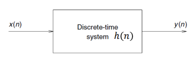

在本课程中，我们将只处理线性时间不变 linear-time invariant（LTI）系统。

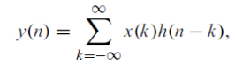

写为：

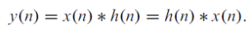

∗ 是卷积算子。

请熟记离散时间变量傅里叶变换表中的所有等式

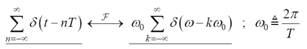

Discrete Fourier Transform 离散傅立叶变换

对于 N 点输入序列，离散傅里叶变换 (DFT) 的定义为

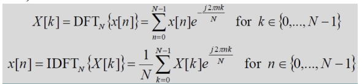

X(k) 是离散的，可视为 DTFT 在频域的采样。

因此，DFT 的分辨率为 FT /N（以赫兹为单位）或（2piF/N，以弧度为单位），其中 FT 是信号的采样频率。

例如，如果信号的采样频率为 8 kHz，则 1024 点 DFT 的一个点表示 8000/1024 Hz 的分辨率。

DFT 通常以其快速算法（FFT）用于实际计算。相比之下，DTFT 更多用于理论表述。

从 CTFT 推导出 DFT

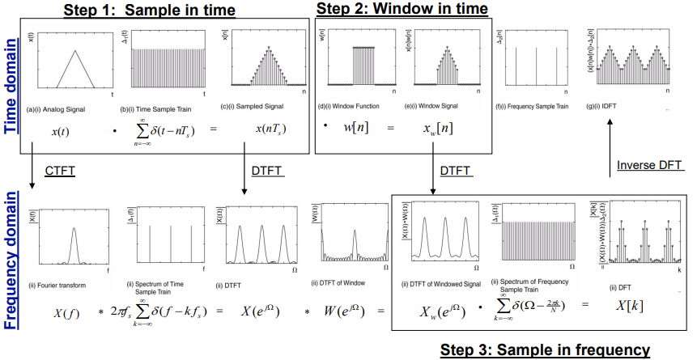

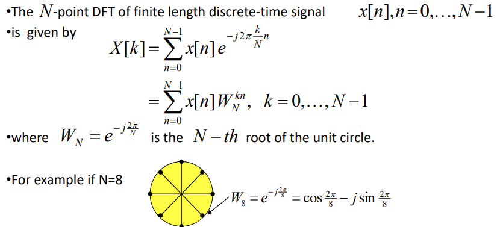

展开后，我们得到以下线性方程组 

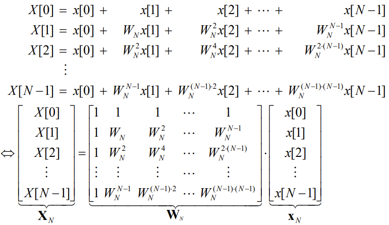

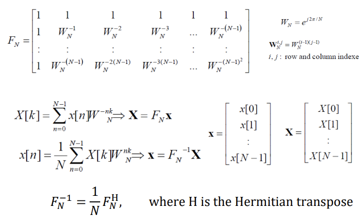

2、3 和 4 的 DFT 矩阵如下、

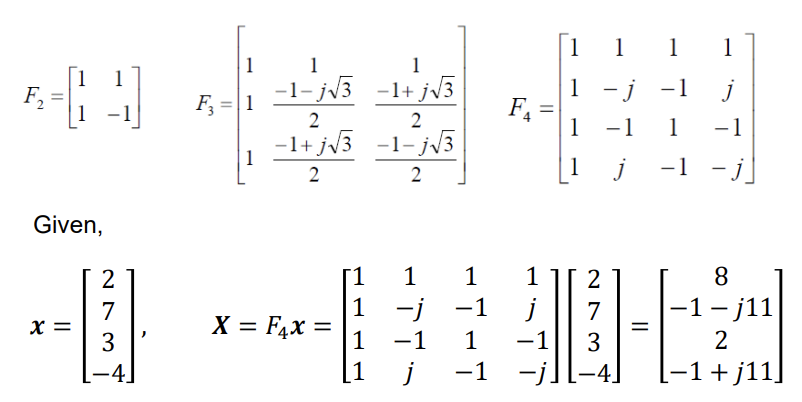

Discrete-Time Short-Time Fourier Transform 离散时间短时傅里叶变换

短时离散时间傅里叶变换（STFT）是一种在时频域揭示信号频谱时变特性的简单方法。

频段 n0 的频谱表示为

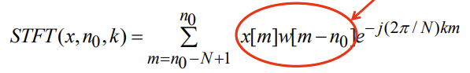

其中，w[n] 是一个 N 点窗口函数，用于将输入划分为 N 个点段。

STFT 是点-N DFT 的序列。x(n) 的频谱图定义为 |STFT(x, n0 , k)| 或 log |STFT(x,n0,k)|，它是 n0 和 k 的函数。

Fast Fourier Transform快速傅立叶变换 (FFT)

在实际应用中，快速傅立叶变换（FFT）被广泛用于计算 DFT。N 点 DFT 定义为

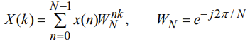

FFT 基于变换核 WN 的对称和周期特性。例如

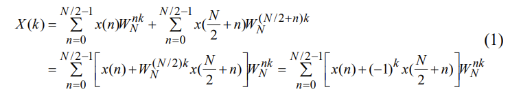

然后，在 k = 0、1......、N/2 时，我们有两个 N/2 点 DFT 

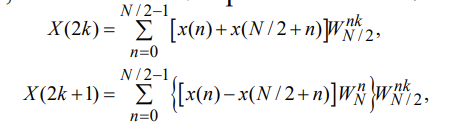

蝴蝶计算是

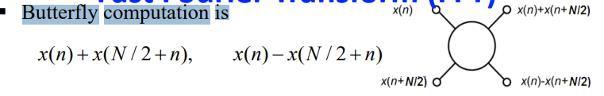

重复上述分解步骤，每个 N/2 点 DFT 可以分解成另外两个 N/4 点 DFT

这样的程序可以重复进行，直到得到 2 点 DFT，这也是一种蝶式计算（见图）

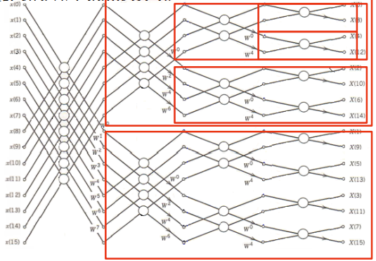

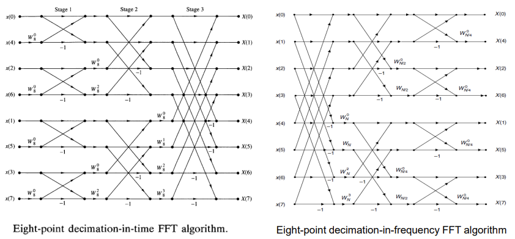

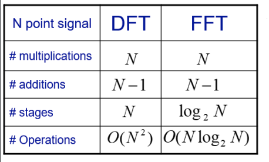

总之，N 点 DFT 将有 (N/2)log2N 个蝴蝶 

每个蝴蝶需要两个复数加法和一个复数乘法。

N 点 DFT 的直接计算需要 N2 次复数乘法和 N(N-1) 次复数加法 

FFT 节省的复数乘法次数为 2N/log2N 倍。例如，N =1024 时可节省 204.8 倍。

Radix-2 算法要求 N 的大小是 2 的幂次。

许多其他类型的快速算法都能处理 N 为合成数的情况。

Zero-Padding a Signal 信号零填充

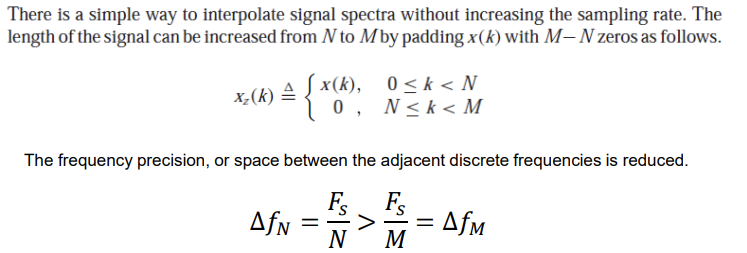

重要提示：填充零点可提高 DFT/FFT 的精度，但不能提高分辨率。FFT 的分辨率由瑞利极限决定 Rayleigh limit，即 ∆𝑓𝑁 = 𝐹𝑠 / N。

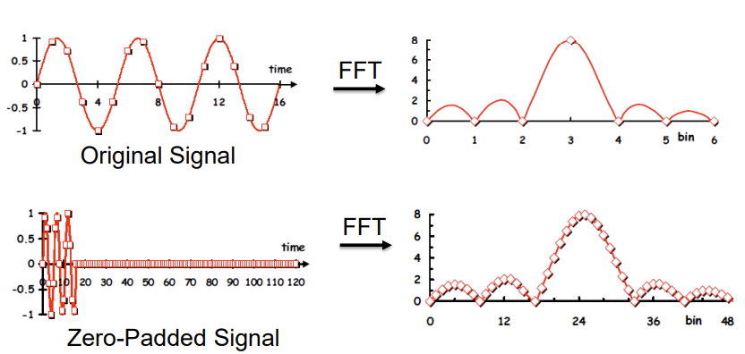

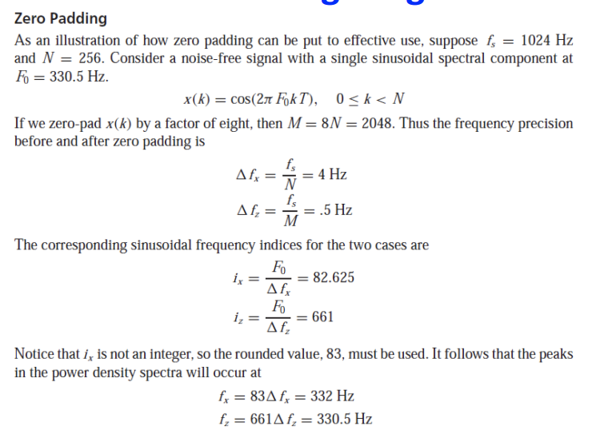

总结：

我们只能复习 DTFT 和 DFT 的基础知识。必要时，需要自学教材。

我们只能复习 DTFT 和 DFT 的基础知识。必要时，需要自学教材。

- 充分了解信号在频域中的表示方法

- 能够使用 DTFT 和 DFT 表示信号

- 熟悉 DTFT 和 DFT 的特性 

- 基本了解时频表示法 STFT 和 FFT。

o CFT - 连续傅里叶变换，用于模拟信号，时域和频域连续 

o DTFT - 离散时间傅里叶变换，用于数字信号，时域离散，频域连续 

o DFT - 离散傅里叶变换，用于数字信号，时域和频域均离散。

o STFT - 短时傅里叶变换，用于带窗口的长信号，时域和频域均离散。

o 频域中弧度频率（弧度）和频率（赫兹）的使用 w=2pif 用于模拟信号，归一化弧度频率和频率用于数字信号 w=2pif/FT

DTFT 和 DFT 之间的关系

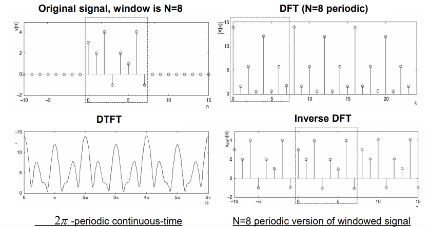

DFT resolution DFT 分辨率

请注意，DFT 的 N 个点覆盖了 0 和 𝑓𝑠 之间的模拟频率。

采样频率，即频率样本之间的间隔为 𝑓𝑠 / N，被定义为 DFT 分辨率或 DFT 频率间隔 frequency spacing。

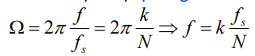

是 DFT 元素的频率。当 k = N/2 时，就达到了 𝑓𝑠 / 2 Hz 的奈奎斯特极限，因此 DFT 的各点可以完全描述 DFT 的幅度和相位频谱。

频率间隔越小，分辨率越高；频率间隔越大，分辨率越低。如果采样频率恒定，则使用的点越多，分辨率就越高，这样频率间距就越小，就能获得频谱的细节。

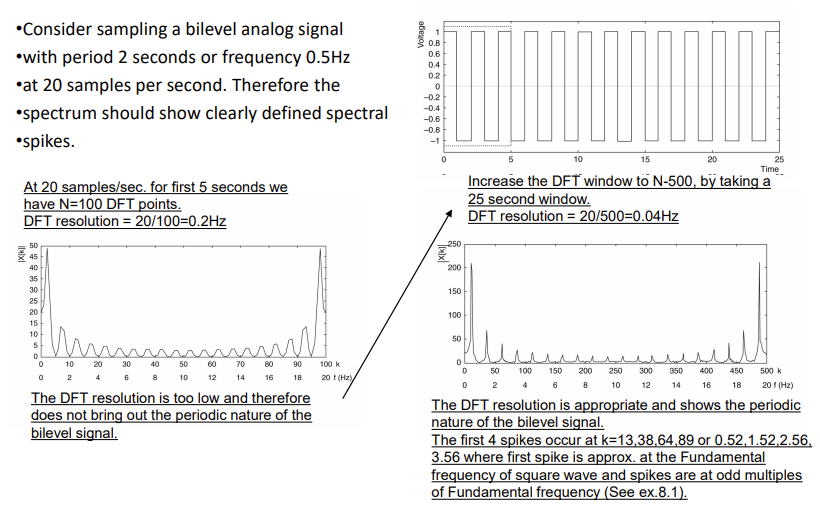

DFT 是一种重要的数字信号处理工具，但由于计算量大，在 DSP 软件包中并不实用 

快速傅立叶变换的计算效率很高，可得到与 DFT 相同的结果。

FFT 算法包括 

- 时间内去量化 FFT 将信号 x[n] 分解为子序列（如 Radix-2 时间内去量化 FFT） 

-  频率内去量化 FFT 将频谱值 X[k] 分解为子序列 

大多数算法遵循分而治之的原则

Radix-2 decimation in time FFT 时间 FFT 中的 Radix-2 抽取

考虑长度为 N 的信号，让 N 为 2 的幂

分而治之：该方法依赖于将计算分成两部分，例如，N→N/2→N/4→N/8......

原则：1 N 点计算等同于 2 N/2 点计算，等等......

一步 Radix-2 分时 FFT

一个阶段的 Radix-2 分时 FFT 可以从 2 个 N/2 点 FFT 和产生一个 N 点 FFT。每个 N/2 点 FFT 可由 2 N/4 点 FFT 得到，以此类推，继续向后得到 2 点 FFT。

DFT 和 FFT 的运算次数 

The Processing Systems of Digital Signals and Their Classifications数字信号的处理系统及其分类

LTI 离散系统 

▪ 描述信号处理系统 - 传递函数 

▪ 线性时不变（LTI）数字传递函数 

传递函数的类型 

- 基于其脉冲响应 h(n) 的长度：

  - 有限脉冲响应 (FIR) 传递函数，是非递归的 
  
  - 无限脉冲响应 (IIR) 传递函数，是递归的 

- 基于频率选择响应的数字传递函数，我们有 
  
  - 基于幅度函数 |H(e jw)| 的形状进行分类 
  
  - 基于相位函数 θ() 的形式进行分类

Classification Based on Mag. Characteristics

通过特定频率而不失真数字滤波器在这些频率上的频率响应等于 1，而在所有其他频率上的频率响应等于 0 。

频率响应取值为 1 的频率范围称为通带passband 

频率响应取值为零的频率范围称为阻带stopband 

四种常用的具有实脉冲响应的理想数字滤波器的频率响应如图所示 

这些规格的反 DTFT 通常称为脉冲响应 h(n)，它是一个时域函数。

wc 或 wc1 和 wc2 的频率称为截止频率 

这些理想滤波器在通带的幅度响应等于 1，在阻带的幅度响应等于 0，并且在任何地方的相位都为 0，即产生输出时没有延迟。

具有 “砖墙brick wall ”频率响应的理想滤波器不是因果关系，无法用有限长度 LTI 滤波器实现。

Ideal Characteristics of Standard Filters 标准过滤器的理想特性

总结：

为了开发稳定且可实现的传递函数，理想的频率响应规格被放宽，在通带和阻带之间加入了一个过渡带。

这一近似值允许幅值响应从通带的最大值缓慢衰减到阻带的零值。

图 2 显示了低通滤波器的典型幅值响应规格。

Classification Based on Phase Characteristics

希望通过一定频率范围内的输入信号成分时，幅度和相位都不失真、 

如图所示，传递函数在相关频带内应表现出统一的幅度响应和线性相位响应。

由于阻带中的信号分量被阻断，因此阻带中的相位响应可以是任何形状。

如果我们选择 n0 = N/2，N 为正整数，那么截断和移位近似值

将是一个长度为 N 的因果线性相位 FIR 滤波器

上述规格近似于 HLP(e j) 的线性相位传递函数。

如何实现过滤器？过滤器的结构 

Digital Filter Structures

一般来说，无限脉冲响应（IIR）有限时间系统的表达式为

具有无限长的脉冲响应。

有限脉冲响应（FIR）滤波器是线性时间不变（LTI）离散时间系统卷积和的一种特殊情况。

LTI 数字滤波器的实际实现可以采用软件或硬件形式，具体取决于应用情况

一个实际问题是，无论在哪种情况下，由于有限字长效应，信号样本和滤波器系数都无法以无限精度表示 

由于有限精度运算，直接实现数字滤波器和可能无法提供令人满意的性能 

开发替代实现方法并选择在有限精度运算下提供令人满意性能的结构具有实际意义 

使用相互连接的基本构件进行结构表示是实现 LTI 数字滤波器硬件或软件的第一步 

为了实现 LTI 数字滤波器、 输入输出关系必须由有效的计算算法来描述

Filter Structures – Basic Building Blocks 过滤器结构--基本构件

LTI 数字滤波器的计算算法可以用信号框图的形式方便地表示出来，其基本构件如下所示

方框图表示法的优点 - 通过检查易于写出计算算法 - 通过分析方框图易于确定输出和输入之间的明确关系

Filter Structures – Analysis of Block Diagrams 滤波器结构 - 方框图分析

易于操作和推导其他等效框图，产生不同的计算算法 - 易于确定硬件要求 - 更易于直接从传递函数开发框图表示法

步骤：

▪ 将每个加法器的输出信号写成其输入信号之和的表达式， ▪ 根据所有内部信号建立一组与滤波器输入和输出信号相关的方程 ▪ 消除不需要的内部变量，得到输出信号作为输入信号和作为乘法器系数的滤波器参数的函数的表达式

示例 分析下面的级联晶格结构，为简洁起见，不显示信号变量的 Z 依赖性 

Filter Structures – Canonic Structures  过滤器结构 - 调谐结构 

如果框图表示中的延迟数等于传递函数的阶数，则数字滤波器结构为调谐结构，否则为非调谐结构。

上图所示结构是非调谐结构，因为它使用两个延迟来实现一阶差分方程

通常情况下，一个调谐结构所需的实施成本最低

例：

Equivalent FIR Filter Structures 等效 FIR 滤波器结构

可能有助于减少字长效应和硬件复杂性

Filter Structures - Equivalent Structures 滤波器结构 - 等效结构

如果两个数字滤波器结构具有相同的传递函数，则定义为等效结构 

▪ 从给定实现生成等效结构的一个简单方法是通过转置操作，具体如下 

- 反转所有路径方向 

- 用加法器替换剔除节点，反之亦然 

- 交换输入和输出节点

所有其他开发等效结构的方法都基于针对每种结构的特定算法。

实现相同传递函数的等效结构有无数种。由于不可能开发所有等效实现方法，我们主要讨论一些常用结构

Filter Structures – Basic FIR Filter Structure 滤波器结构 - 基本 FIR 滤波器结构

在某些情况下，可以开发出量化效应最小的结构。阶数为 N 的因果 FIR 滤波器的传递函数 H(z) 的特点是

是 z -1 的多项式。

在时域中，上述 FIR 滤波器的输出输入关系式为

阶数为 N 的 FIR 滤波器具有 N+1 个系数，一般需要 N+1 个乘法器和 N 个 2 输入加法器

滤波器结构 - 直接形式 FIR

乘法器系数正是传递函数系数的结构称为直接形式结构。

在 N = 4 的情况下，FIR 滤波器的直接形式实现可以很容易地从卷积和描述中发展出来，如下所示

直接形式结构也称为分接延迟线或横向滤波器

前面所示的直接形式结构的转置如下所示

这两种直接形式结构在延迟方面都是卡侬式的 

▪ 观察延时元件的排列和用于转置结构的系数的位置，以验证转置操作。

总结：

滤波器的类型和分类。能够根据以 z 域表示的传递函数分析滤波器的类型 ▪ 能够从给定的信号流图推导出滤波器传递函数 ▪ 能够从给定的滤波器结构推导出等效结构。

Representation of a Filter 过滤器的表示方法

如何转换为频域表示法： ▪ 通过 z 变换获得传递函数 

Equivalent FIR Filter Structures 等效 FIR 滤波器结构 

可能有助于降低字长效应和硬件复杂性

Filter Structures – Basic FIR Filter Structure 滤波器结构 - 基本 FIR 滤波器结构 

在某些情况下，可以开发出量化效应最小的结构。阶数为 N 的因果 FIR 滤波器的传递函数 H(z) 的特征是

在时域中，上述 FIR 滤波器的输出输入关系式为

阶数为 N 的 FIR 滤波器具有 N+1 个系数，一般需要 N+1 个乘法器和 N 个 2 输入加法器

Filter Structures – Direct Form FIR 滤波器结构 - 直接形式 FIR

乘法器系数正是传递函数系数的结构称为直接形式结构。

在 N = 4 的情况下，FIR 滤波器的直接形式实现可以很容易地从卷积和描述中发展出来，如下所示

Filter Structures – Cascaded Form FIR滤波器结构 - 级联形式 FIR

高阶 FIR 传输函数可以由一阶和二阶 FIR 部分级联实现

N = 6 的级联实现如图所示

系数 β1k 和 β2k 是直接形式的系数函数

Filter Structures – Linear Phase FIR 滤波器结构 - 线性相位 FIR

中间一大段

可以利用线性相位 FIR 滤波器的对称（或不对称）特性，将乘法器数量减少到直接形式实现方法的近一半。

对于偶数滤波器长度的 II 型 FIR 传递函数，也可以采用类似的分解方法

注：长度为 7 的 FIR 滤波器的 I 型线性相位结构需要 4 个乘法器，而直接形式的实现需要 7 个乘法器。

注：长度为 8 的 FIR 滤波器的 II 型线性相位结构需要 4 个乘法器，而直接形式的实现需要 8 个乘法器

Specifications of Filters 过滤器规格

数字滤波器设计目标： 确定可实现的传递函数 G(z)，逼近给定的频率响应规格。

一般分为有限脉冲响应（FIR）和无限脉冲响应（IIR）两类。

IIR 滤波器的 G(z) 应该是两个 z 多项式的稳定实有理函数。

FIR 滤波器的 G(z) 是一个多项式，并且始终稳定，为什么？

数字滤波器设计是推导传递函数 G(z) 以逼近预期规格的过程。

大多数应用都会指定数字滤波器的幅度和/或相位（延迟）响应。

我们感兴趣的问题是如何根据给定的幅值响应规格开发可实现的近似值。

我们主要讨论 FIR 滤波器的幅值近似 

数字滤波器在通带和阻带的幅值响应规格是根据一些可接受的公差给出的 

此外，还规定了通带和阻带之间的过渡带 

例如，数字低通滤波器的幅度响应 G(e jw) 如图所示 

同样，其他类型的滤波器也有过渡带。

G(e jw) 是 w 的周期函数，|G(e jw)| 是实系数滤波器的频谱幅度，是 w 的偶函数。因此，滤波器规格仅适用于 0 ≤ w≤ pi 的频率范围。

规格通常以损耗函数 A() = -201og |G(e j)| dB 表示 

在这里，通带中的幅度最大值被指定为统一值（或 0 dB） 

在数字滤波器设计中，需要使用以下方法计算归一化频带边缘频率（单位为 Hz

对于 FIR 数字滤波器的设计，传递函数是 z -1 的实系数多项式 

如果需要线性相位，滤波器系数必须满足以下约束条件：h[n] = ± h[N - n]，n = 0，1，...，N/2-1 或 (N+1)/2-1。

FIR 滤波器的优点： - 可以设计出精确的线性相位， - 在系数量化的情况下，滤波器结构总是稳定的 

FIR 滤波器的缺点： - FIR 滤波器的阶数大大高于满足相同振幅规格的等效 IIR 滤波器的阶数，因此 FIR 滤波器的计算复杂度更高（为什么？）

如何计算滤波器系数以满足规范要求？、

Digital Filter Design – Basic Approach 数字滤波器设计--基本方法

FIR 滤波器的设计基于对指定幅度响应的直接近似，并增加了对线性相位的要求。

阶数为 N 的 FIR 滤波器的设计可通过寻找长度为（N+1）的脉冲响应样本 {h[n]} 或其频率响应的（N+1）样本 H(e j) 来完成 

▪ FIR 滤波器设计的三种常用方法 - 窗口法 - 频率采样法 - 基于计算机的优化方法 

▪ 我们将重点讨论窗口法。

设计 FIR 数字滤波器 - 窗口法

一大段

Why and What is Multi-Rate Signal
Processing? 为什么要进行多速率信号处理？

采样理论：DSP 的基本概念，FT 大于等于 2Fmax，其中 Fmax 是信号的带宽或最大频率。

合适的采样率决定了处理系统的计算效率和/或精度。为了获得更好的性能，采样率应尽可能高，字长应尽可能长。

不过，无论何时何地，只要涉及计算复杂性，采样率和字长都应尽可能小。

许多应用的输入采样率已经预先确定，而功能模块或系统的输出通常需要不同的采样率。

例如，广播使用 32 kHz 采样频率，数字 CD 使用 44.1 kHz 采样频率，数字音频磁带使用 48 kHz 采样频率，所有这些都包含在一个高保真系统中。

低通滤波器输出的带宽小于 W。

滤波器之后的其他处理系统有可能使用更小的采样频率，即通信系统中的解复用操作。

需要在其他处理过程中使用合适的采样频率，从而有效降低整体计算复杂度。

在同一系统中，经常使用多种采样率，以最大限度地降低计算复杂度，达到可接受的性能。

将信号从给定的采样率转换为另一种采样率的过程称为采样率转换（SRC）；使用多种采样率的系统称为多速率 DSP 系统；

采样率转换也可以通过将信号通过 D/A 转换器、必要时进行滤波以及按所需速率对产生的信号进行重新采样来实现。

由于在复杂的数字信号处理系统中通常需要进行采样率转换，因此转换最好在数字域中进行，这样性能更好，处理成本更低。

要从采样率为 Fx 的给定数字信号生成采样率为 Fy 的数字信号 , 

我们需要一个线性时变系统；

输出 y(m) 是来自 x(n) 的估计版本；

注意 y(m) 和 x(n) 使用不同的时间指数 m 和 n。

系统为 x(n)的第 i 个采样提供平坦的振幅响应和时间延迟 t i。特别是，t i 对于不同的 i 是时变的，这意味着滤波器是时变的；

一般来说，y(n) 应提供与 x(n) 相同的信息，使它们都能重建相同的原始信号。

我们将研究系统 h(n,m)的要求和设计，其中 n 和 m 是输入和输出的时间索引。 多速率处理有几个优点，包括  更少的计算需求；

更少的滤波器系数和信号历史存储； 更低阶的滤波器设计/实现；

更少的有限运算效应。

这些优势必须与处理采样率变化所需的硬件和软件实施开销的额外复杂性相权衡。
# Part 2

## Introduction and mathematical background 导言和数学背景

### Definition and taxonomy of systems and signals 系统、信号的分类

系统的定义 system

系统是一个实体，它操纵一个或多个信号来实现某种功能，并反过来产生新的信号。

系统的分类：

信号的定义 signal

信号传递有关物理现象性质的信息，是时间、空间或任何其他独立变量的函数

信号的分类：

Deterministic signals 确定性信号

确定性信号是指可以通过重复过程精确再现的信号。

Chaotic signals 混沌信号

混沌信号来自一个混沌系统，该系统由参数固定的非线性微分方程耦合系统定义。混沌系统对初始条件非常敏感，因此只能在短期内预测。

>例：流体湍流和雷达海杂波。

Random signals 随机信号

随机信号是一种无法以可预测的方式重复的信号，也就是说，它包含一个随机变量。

>例：收音机或电视机等电子设备电阻器中产生的热噪声电压 
气温和气压等气象现象随时间随机波动，或 x[n] = 10cos(2πn-θ)，其中 θ 是随机变量，统计上均匀分布在 (-π,π) 范围内。
语音，如果它被视为来自一般语音过程的所有可能信号

两个关键： Mean、Variance 均值、方差

### Random variables and statistics 随机变量和统计

Discrete random variables 离散随机变量

离散型随机变量（r.v.） X 最多有可数的可能值。

>让 X 表示 r.v.，它被定义为两个公平骰子的和。样本空间由 S={(1,1),(1,2),(1,3),...,(6,4),(6,5),(6,6)} 给出，大小为 36。考虑 X = 4 的事件，则 E ={(1,3),(2,2),(3,1)} ⊂ S 且 P(E) =P({X =4})= 3/36。

Probability mass function 概率质量函数

X 的概率质量函数（p.m.f）定义为 p(a) =P({X =a})>0

所有p（a）之和等于1

Cumulative distribution function 累积分布函数c.d.f.

R.v.X 的累积分布函数（c.d.f）F 定义如下： F(a) = P({X≤a})

Continuous random variables 连续随机变量

一个连续的随机变量（r.v. X）可以有无数个可能的值。

Probability density function 概率密度函数p.d.f.

Cumulative distribution function 累积分布函数

Expectation of a random variable 随机变量的期望值

X 的期望值是 X 可能取值的加权平均值，每个值都是 X 取该值的概率

R.v. X 的期望值称为 X 的均值或第一矩。mean or the first moment

Variance of a random variable 随机变量的方差

随机变量 X 的方差是 X 偏离其期望值的期望平方

>$V(X) = E(X^2)-(E(X))^2$

常见函数的均值方差：

离散随机变量：

连续随机变量：

Jointly distributed discrete random variables 联合分布离散随机变量

X 和 Y 的联合概率质量函数定义为 p(x,y) = P({X =x,Y =y})

Jointly distributed continuous random variables 联合分布的连续随机变量

如果满足以下条件，则 X 和 Y 的联合概率密度函数定义为 f (x,y)

Independent random variables 独立随机变量

随机变量 X 和 Y 是独立的，如果对于所有 a、b： P({X ≤a,Y ≤b})=P({X ≤a})P({Y ≤b})

>如果 X 和 Y 是独立的，那么对于任意函数 g 和 h，E[g(X)h(Y)] = E[g(X)]E[h(Y)]。

Correlation and Covariance of two random variables 两个随机变量的相关性和协方差

两个随机变量 X 和 Y 的相关性由 ρXY =corr(X,Y)=E[XY] 定义，衡量两个变量如何相互影响。

两个随机变量 X 和 Y 的协方差定义为 σXY =cov(X,Y) =  ρXY-µXµY，衡量一个随机变量与另一个随机变量的偏差。

>如果 X 和 Y 是独立的 R.v.，则 cov(X,Y) = 0

练习：

1、Calculate the mean and the variance of the random variable uniformly distributed（均匀分布） over the interval (−π,π)

2、 Show that var(X+Y)=var(X)+var(Y)+2cov(X,Y)

### Stochastic processes and ensemble statistics 随机过程和集合统计

Stochastic/random process 随机/随机过程

随机/随机过程是描述某个（物理）过程随时间演变的所有可能时间函数的族或集合：{X(t,S),t∈T}  其中，t 是时间索引，S 是所有可能样本函数的集合（样本空间）。

如果 T 是一个可数集，那么 X[n,S] 是一个离散时间过程。如果 T 是实线的区间，那么 X(t,S) 是连续时间过程。

Realization of a Stochastic Process 实现随机过程

集合的样本函数 x(t,s) 称为过程的实现。

>下图展示了一组与全球不同城市气温相对应的波形。这是一组时间函数或随机过程。任何特定城市的气温波形都是随机过程的一次实现或样本函数。

>

Statistical (ensemble) averages 统计（集合）平均值

考虑在时间瞬间 t =ti 时采样的连续随机过程 X(t)，则 Xti =X(ti) 是一个随机变量，其相应的 p.d.f. 为 f (xti)，r.v.的第 m 个矩取为

>

Correlation 相关性

考虑两个随机变量 Xt1，Xt2，其中 Xti = X(ti)，i = 1，2。Xt1 和 Xt2 之间的统计（集合）相关性由联合矩给出。

它取决于时间时刻 t1、t2，称为随机过程的自相关性 autocorrelation。

Autocovariance 自方差

自方差函数的定义是 

其中 µX(ti) = E[Xti],i = 1,2.

Statistical (ensemble) averages for joint random processes 联合随机过程的统计（集合）平均值

两个过程 X(t) 和 Y(t) 的交叉相关函数cross-correlation function由联合矩定义

Cross-covariance 交叉方差

两个过程 X(t) 和 Y(t) 的交叉协方差函数定义为 cXY(t1,t2) = γXY(t1,t2)-µX(t1)µY(t2) (28) 其中 µX(t1) = E[Xt1 ]，µY(t2) = E[Yt2 ]。

>如果 cXY(t1,t2) = 0，则 X(t) 和 Y(t) 互不相关；如果 E[Xt1 Yt2 ] = 0，则 X(t) 和 Y(t) 在统计上是正交的 statistically orthogonal。独立一定不相关，但反之不一定成立

Stationary stochastic process 静态随机过程

对于所有 τ 和所有 n，如果两组随机变量的联合概率密度函数相等，即 f (xt1 ,xt2 ,......xtn ) = f (xt1+τ,xt2+τ,.....xtn+τ) ，则随机过程是静止的。

Auto-correlation, auto-covariance, cross-correlation of stationary processes 静止过程的自相关、自协方差、交叉相关

自相关函数和自协方差函数取决于时间差 t1 -t2 = τ，即

而两个共同且单独静止过程的交叉相关分别为

Wide-sense or weakly stationary random process广义或弱静态随机过程

如果一个过程的均值和方差都是有限且恒定的，并且其自相关函数只取决于样本出现的时间差或滞后时间，那么这个过程就是广义或弱静止的。

练习：

Ergodicity 遍历性

如果从单一样本函数或单一实现得到的时间平均值等于统计（集合）平均值，且概率为 1，则随机过程具有遍历性 ergodic

Discrete-time random signals 离散时间随机信号

离散时间随机信号 X[n] 可以通过对连续时间随机信号 X(t) 进行均匀采样得到，因此可以得出类似的统计特性

White noise/sequences白色噪音/序列

白序列 w[n] 被定义为不相关的随机变量，其均值 µW =0，方差为 σ2 W。

如果自协方差由下式给出，则广义平稳过程 W[n] 称为白过程

Discrete ergodic random signal statistics 离散遍历随机信号统计

下表总结了离散时间遍历随机过程的统计特性

练习：

###  Power density spectrum 功率密度频谱

静止随机过程是一个无限能量信号，因此不存在傅里叶变换。相反，随机过程的功率密度谱给出了随机过程的频谱特征，它被定义为自相关函数 γxx(τ)的傅里叶变换

反傅里叶变换的计算公式为

由于 E[X2 t ] = γxx(0)代表随机过程的平均功率，即 Γxx(F)下的面积，因此 Γxx(F)是功率作为频率函数的分布情况

Cross-power density spectrum 交叉功率密度谱

考虑两个联合静止随机过程 X(t) 和 Y(t) 具有交叉相关性 γXY (τ) ，则交叉功率密度谱定义为 γXY(τ) 的傅立叶变换

Power density spectrum of discrete random processes 离散随机过程的功率密度谱

离散随机过程 X[n] 的功率密度谱为

练习：

###  Innovations representation of a stationary random process 静态随机过程的创新表示

在这里，我们将证明广义静态随机过程 x[n] 可以表示为由白噪声过程 w[n] 激发的因果可逆线性系统 H(z) 的输出。

反过来，如果反因果滤波器的输入是广义静态随机过程 x[n]，那么输出就是白噪声过程 w[n] 。

> 1/H(z) is the noise whitening filter and w[n] is the innovations process associated with the stationary random process x[n].

>证明过程：

>

Rational power spectra 有理功率谱

假设弱静态随机过程 x[n] 的功率谱密度是一个有理函数

其中 B(z) 和 A(z) 的根都在 z 平面的单位圆内。那么从 w[n] 生成 x[n] 的线性滤波器的计算公式为

其中，{bk}和{ak}分别是决定 H（z）零点和极点位置的滤波器系数

因此，H(z) 是因果、稳定和最小相位线性系统，1/H(z) 也是因果、稳定和最小相位线性系统。因此，随机过程 x[n] 唯一地代表了创新过程 w[n] 的统计特性，反之亦然。

考虑一个稳定的实线性时变系统 H(z)。其输入 w(n) 是一个一般的广义静止过程（不一定是白色的），具有自相关函数 γww[m] 和 Z 变换 Γww(z)。那么它的输出 x(n) 也是一个广义静止过程，具有自相关函数 γxx[m]和 Z 变换 Γxx(z)。我们有

然后，我们可以得到功率密度频谱如下:

练习：

对于公式 (61) 中由 H(z) 定义的线性系统，输出 x[n] 与输入 w[n] 的关系为

Autoregressive (AR(p)) process 自回归过程

设 b0 =1，bk =0，k >0，则线性滤波器

H(z)=1/A(z)

是一个全极性滤波器，其输入输出关系为

因此，用于产生创新值的消噪滤波器 (1/H(z)) 是一个全零滤波器

Moving average (MA(q)) process 移动平均过程

设 ak =0，k ≥1，则线性滤波器

H(z) =B(z)

是全零滤波器，输入输出关系为

因此，MA 过程的噪声消除滤波器 (1/H(z)) 是一个全极滤波器

Autroregressive and moving average (ARMA(p,q)) process 自回归移动平均过程

考虑在 Z 平面上具有有限个零点和极点的线性滤波器

H(z) = B(z)/A(z)

那么相应的差分方程为

因此，用于从 x[n] 生成创新过程 w[n] 的消噪滤波器 1/H(z) = A(z)/B(z) 是一个极点为零的滤波器。

Relationships between filter parameters and autocorrelation sequence

滤波器参数与自相关序列之间的关系

>

练习：

有讲解，记得看

## Linear prediction and optimum linear filters 线性预测和最佳线性滤波器

在设计通信系统、控制系统和地球物理时，需要设计滤波器来进行信号估计。需要从统计学角度看最佳滤波器设计。这里我们考虑：

线性滤波器

“最佳" ↔ 均方误差最小化 （MSE）

静止过程的二阶统计（自相关和互相关）。

Forward linear prediction 前向预测

设 x[n] 为静止随机过程。

问题：如何通过观察静止随机过程的过去值来预测该过程的未来值？阶次为 p 的一步正向线性预测器 ˆ x[n]，通过过去值 x[n-1],x[n-2],---,x[n-p]的加权线性组合来预测 x[n] 的值。其定义为

其中，{-ap[k]}p k=1 是线性组合中的权重，称为阶数为 p 的一步前向线性预测器的预测系数。

>例：取 p =3，设 n =0。给定 x[-3],x[-2],x[-1]，我们希望找到 ap[k],k = 1,2,3，使得 ˆ x[0] = -ap[1]x[-1]-ap[2]x[-2]-ap[3]x[-3] 是 x[0] 的前向线性预测器。

x[n] 的预测值 x[n] 与 ˆ x[n] 之间的差值称为前向预测误差 forward prediction error

当ap[0]=1时，

Prediction-error filter 预测误差过滤器

线性预测等同于线性滤波，预测器嵌入在线性滤波器中

其中，{x[n]} 为输入序列，{fp[n]} 为输出序列。

下图所示的直接形式 FIR 滤波器是预测滤波器的等效实现

fp[n] 的 Z 变换如下

Mean-square forward linear prediction error前向线性预测均方误差

前向线性预测误差 fp[n] 的均方值为

Ef p 是预测系数 ap[k] 的二次函数。

Minimum mean-square prediction error最小均方预测误差

Ef p 的最小化会导致以下线性方程组

称为线性预测因子系数的正态方程。最小均方预测误差简单来说就是

直接形式 FIR 滤波器等效于下图所示的全零网格滤波器：

网格滤波器一般由以下一组阶递归方程描述

其中 {Km} 称为反射系数或部分系数。

网格参数集 Km 与 A(z) 的系数集 al 是一一映射的。

在下文中，为了简化讨论，我们假设所有系数 {Km}、{al} 都是实数。

{Km} ⇒ {al}

在 A0(z) =1 时，计算

最后阶段的结果是

然后，我们得到 aP(1),...,aP(P)。

{al} ⇒ {Km}

AP(z) =A(z) 和 KP =aP. 那么

>例：P =3：K1 =1/4，K2 =1/2，K3 =1/3，均为实数。在 A0(z) =1 时，我们有

>

>例如，给定传递函数描述的 FIR 滤波器：

>

>相应的反射系数 {Km} 如下所示

>

>

晶格结构 Lattice structures在数字信号处理中应用广泛。其中一个显著的特性是，在 |Km| <1, ∀ m情况下，A(z) 的零点都在|z| = 1 内

Backward linear prediction 后向线性预测

假设数据序列 x[n]、x[n-1]......、x[n-(p-1)]是从静态随机过程中得到的。问题:如何通过观察过程过去的值来预测 x[n-p] 的值？

阶次为 p 的一步后向线性预测器 ˆ x[n-p]，通过过去值 x[n],x[n-1],---,x[n-(p-1)]的加权线性组合来预测 x[n-p] 的值。其定义如下

其中，{-bp[k]}p-1 k=0 称为阶数为 p 的一步后向线性预测器的预测系数 prediction coefficients。

>例：取 p =3，设 n =0。给定 x[-2],x[-1],x[0]，我们希望找到 bp[k],k = 0,1,2，使得 ˆ x[-3] =-bp[0]x[0]-bp[1]x[-1]-bp[2]x[-2] 是 x[-3] 的后向线性预测器。

Backward prediction error 后向预测误差

值 x[n-p] 与 x[n-p] 的预测值 ˆ x[n-p] 之间的差值称为后向预测误差：

在 z 域：

后向线性预测器的加权系数是前向线性预测器系数的复共轭系数，但顺序相反，即

bp[k] = a∗p[p−k],k = 0,1,...,p

因此，

这意味着系统函数 Bp(z) 的 FIR 滤波器的零点是 Ap(z) 零点的共轭倒数。Bp(z) 被称为 Ap(z) 的倒数或反向多项式。

Minimum mean-square backward linear prediction error 最小均方反向线性预测误差

后向线性预测误差 gp[n] 的均方值为

其中

需要注意的是，Eg p 是预测系数 ap[k] 的二次函数，Eg p 的最小化与公式 (87) 中给出的线性方程组相同。最小均方反向线性预测误差为

Relationship of an AR process to linear prediction AR 过程与线性预测的关系

在AR（p）过程中，自相关序列与参数的关系如下：

这就是所谓的 “尤勒-瓦尔克条件 eYule-Walker equations”或 “矩阵形式”

其中，σ2 w 是白噪声过程的方差

注意，如果基础过程 x[n] 是 AR(p)，那么 AR(p)过程的参数 {ak} 正是第 p 阶预测器的预测系数 ap[k]，即比较公式 (101) 和公式 (87) 中的正态方程。

第 p 阶预测器的最小均方误差（MMSE）等于白噪声过程的方差，即 εf p = σ2 w。 

因此，具有系统函数 Ap(z) 的预测误差滤波器是一个噪声白化滤波器，它产生创新过程 w[n]。

Solution of the normal equations正常方程的解法

下面是正常方程的紧凑形式

ap(0)=1。得到的 MMSE 由式 (88) 给出，上式可以用下面一组增强正态方程表示

前向预测误差均方值的最小化归结为预测系数的正态方程求解。

Matrix form of augmented normal equations 增强正则方程的矩阵形式

假设 p =3，则公式 (105) 变为

或矩阵形式

其中 γxx[−m] =γxx[m]

注意自相关矩阵的 Toeplitz1 对称性。

两种计算效率较高的迭代求解方法是

列文森-杜宾算法 Levinson-Durbin algorithm： 该算法由 Levinson 于 1947 年提出，Durbin 于 1959 年对其进行了修改，适用于串行处理，计算复杂度为 O(p2)。
 
舒尔算法 Schur Algorithm： 该算法是 1917 年舒尔提出的，计算反射系数2 的时间为 O(p2)，但如果使用并行处理器，计算时间可达到 O(p)。

这两种算法都利用了自相关矩阵的托普利兹对称特性。

Levinson-Durbin algorithm列文森-杜宾算法

该方法从 p = 1 阶的预测器开始，然后递增阶数，利用低阶解来获得下一个高阶的解

Wiener filter for Filtering and Prediction 用于过滤和预测的维纳滤波器

考虑输入信号 x[n] = s[n]+w[n]，其中 s[n] 是期望信号，w[n] 是不期望的噪声或干扰。问题：设计一个线性滤波器 H(z)，在保持所需信号 s[n] 特性的同时，消除或滤除不需要的噪声或干扰，使滤波器的输出 y(n) 近似于某个指定（参考）的所需信号 d(n)。

Three types of linear estimation problems三类线性估计问题

线性估计问题被称为：

如果参考信号 d[n] = s[n]，即设计 H(z) 以抑制 w[n] 和 y[n]≈s[n]，则进行信号滤波。 filtering

如果参考信号 d[n] = s[n+D],D>0，则进行信号预测 signal prediction。请注意，这与之前考虑的线性预测（d[n] = x[n+D],D>0）相关，但更为一般。

如果参考信号 d[n] = s[n-D],D>0，则信号平滑 signal smoothing。

在下文中，我们假设 s[n]、w[n]、d[n] 均值为零、 是广义静止的。

Wiener filter维纳滤波器

最佳线性滤波器 h[n] 被称为最小均方误差意义上的维纳滤波器

其中，Eh M =E |e[n]|2，e[n] =d[n]-y[n] 。 

维纳滤波器可以设计为 FIR 或 IIR。对于 IIR 滤波器，假定输入数据 x[n] 在无限的过去都是可用的。

Designing FIR Wiener filters设计 FIR 维纳滤波器

假设滤波器的长度为 M，系数为 {h[k]}M-1 那么输出 y[n] 取决于有限数据集 x[n]、x[n-1]......、x[n-(M-1)]、

最优的维纳 FIR 滤波器是通过最小化预期输出 d[n] 和 y[n] 之间误差的均方值来实现的，即

Wiener-Hopf Equation维纳-霍普夫方程

由于公式 (115) 是滤波器系数 h=h[0],h[1],...h[M -1] t 的二次函数，因此 Eh M 的最小化可归结为求解线性方程组

其中，γxx[l] 是输入序列 x[n] 的自相关，γdx[l] 是期望序列 d[n] 与输入序列 x[n] 之间的交叉相关，n = 0,..., M -1 。式 (116) 被称为维纳-霍普夫方程，相当于线性预测中的正则方程

Matrix form of the Wiener-Hopf equation维纳-霍普夫方程的矩阵形式

式 (116) 可以矩阵形式写成
ΓMhM =γd

其中，ΓM 是元素为 Γlk = γxx[l-k]的 M×M（赫米特）托普利兹矩阵，γd 是元素为 γdx[l]的 M×1 交叉相关向量，l =0,1,...,M-1。

因此，最佳滤波器系数为 hopt = Γ-1 M γd，使用维纳滤波器得到的 MSE 为

Wiener-Hopf equations for filtering用于滤波的维纳-霍普夫方程

其中，σ2 d = E |d[n]|2。

如果我们考虑过滤 d[n] = s[n]的问题，并进一步假设 s[n] 和 w[n] 是不相关的随机序列，即

已知γss[k]、γww[k]，则维纳-霍普夫方程或正则方程为

如果我们考虑预测问题 d[n] = s[n+D],D>0，并进一步假设 s[n] 和 w[n] 是不相关的随机序列，即

已知γss[k]、γww[k]，则预测滤波器的维纳-霍普夫方程为

需要注意的是，需要反演的相关矩阵是托普利兹矩阵，可以使用 Levinson-Durbin 算法求解最佳滤波器系数。

Example: FIR Wiener filter design范例： FIR 维纳滤波器设计

Orthogonality principle in linear mean-square estimation线性均方估计中的正交原则

设 v0、v1、v2 为三个给定向量，c1、c2 为两个标量，则

 ^v0 = c1v1+c2v2.

对于 c1、c2 的哪个值，ve = v0-^v0 的距离最小？

众所周知，当选择 c1 和 c2 时，ve 与 v1 和 v2 正交（即垂直），距离最小。

考虑滤波器的输出，即估计值

是数据所跨子空间中的一个向量

x[n−k],k =0,1,··· ,M−1.

估计误差 e[n] = d[n]-ˆ d[n]是一个从 d[n] 到 ˆ d[n] 的矢量（见图 10），正交原则指出，当 h[k] 的选择使得误差与估计中的每个数据点正交时，均方误差 Eh M 将最小化

E[e[n]x[n−k]] = 0,k = 0,1,2,··· ,M −1

因此，最小 MSE 为

当且仅当式 (117) 中的Γxx 是非奇异值时，最佳 FIR Wiener 滤波器或 Wiener-Hopf 方程的解才是唯一的。

Geometric interpretation of the linear MSE problem 线性 MSE 问题的几何解释

IIR Wiener filter IIR 维纳滤波器

当 M 变为无穷大时，FIR 滤波器 H(z) 变为 IIR 因果滤波器

那么误差 e(n) = d(n)-ˆ d(n) 的均方值为

是 H(z) 的单位脉冲响应 {h[k]} 的二次函数

应用正交原则，即 E[e[n]x[n-m]] = 0，∀m ≥ 0，可得出以下维纳-霍普夫方程：

以 hopt[k] 作为解，相应的最小 MSE 为

注意到 (139) 仅在 m > 0 时成立，因此维纳-霍普夫方程无法直接通过 Z 变换得到

回顾：静态随机过程 x[n] 可以用方差为 σ2 ˜ w = 1 的创新过程（白序列）激励的最小相位系统 G(z) 的输出来表示，其中 G(z) 可以从 Γxx(z)（γxx[m]的 z 变换）的谱因式分解中获得

Example: IIR Wiener filter design范例： IIR Wiener 滤波器设计

证明在课程中
## Power spectrum estimation