# EE6483-Artificial Intelligence and Data Mining

## 概述

课本：

1. Textbooks:
George F. Luger : Artificial Intelligence Structures and Strategies for Complex Problem Solving. 6± Edition, Addison Wesley, 2009.
2. Pang-ning Tan, Michael Steinbach, Vipin Kumar, Introduction toData Mining, Pearson, 2od Edition 2019.
3. lan Goodfellow,Yoshua Bengio and Aaron Courville, DeepLearning. MIT Press, 2016.(Q325.5.G651)
   
## 第一部分 Symbolic AI & Data Mining 符号人工智能&数据挖掘

### Topic 1：Introduction to AI & Brief History 人工智能概述与历史

#### 什么是AI？
>"Our Attempt to Build Models of Ourselves" - Elaine Rich, Utexas - first textbook in Al

试图建立自我模型
Al是计算机科学领域的一门学科，专注于创造能够模拟人类认知功能的智能机器

__研究和设计智能代理：__

与现实世界互动的能力

- 能够感知、理解并采取行动

推理和规划

- 解决新问题和做出决定
- 应对不确定性的能力

学习和适应

- 不断更新我们的内部模型

>Elaine Rich and Kevin Knight: Al is the study of how to make computers do things at which, at the moment, people are better.

>Stuart Russell and Peter Norvig: [Al] has to do with smart programs, so let's get on and write some.

>Astro Teller: AI is the attempt to make computers do what they do in the movies.

__为什么要AI？__

>"AI can have two purposes. One is to use the power of computers to augment human thinking, just as we use motors to augment human or horse power. Robotics and expert systems are major branches of that. The other is to use a computer's artificial intelligence to understand how humans think in a humanoid way.If you test your programs not merely by what they can accomplish, but how they accomplish i, they you're really doing cognitive science;you'reusing AI to understand the human mind." - Herbert Simon

- 增强人类的思维
- 理解人类是如何思考的

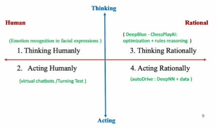

__人类智能与人工智能__

- Human vision vs. Computational vision
- Human brain vs. Artificial neural network
>“AI is the new Electricity." - Prof Andrew NG

#### AI简史
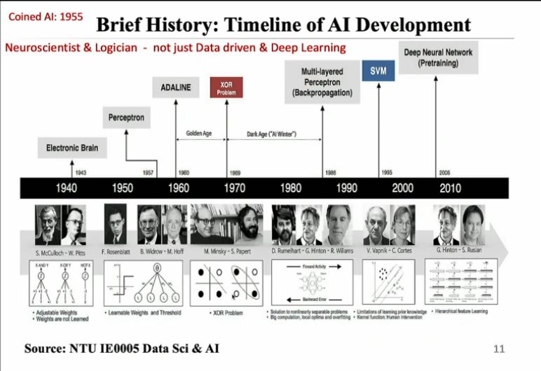
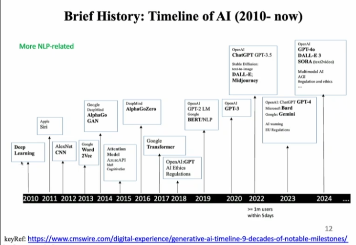

#### Symbolic Al 符号人工智能
“老式人工智能”（GOFAI）--依赖于使用符号、规则和逻辑对知识进行显式表示。

主要特征：

- 使用符号来表示对象、概念和关系
- 使用基于规则的系统来操作符号和进行推理
- 强调人类可读和可解释的表征

应用：

- 用于医疗诊断和决策支持的专家系统
- 使用语法和语法规则的NLP
- 使用规则评估和选择棋步的游戏

优势：

- 可明确表示领域知识
- 支持类人推理和基于逻辑的决策
- 在决策过程中提供可解释性和可追溯性

挑战：

- 难以处理不确定性和不完整信息从大型数据集学习的能力有限
- 难以处理复杂的非符号任务

#### Neural Networks 神经网络
Boolean algebra (George Boole, 1847)

- 逻辑定律
- 现代计算机科学的核心
- 集成电路的设计 (lC)

McCulloch & Pitts, 1943

- 提出了生物神经元的简单模型
- 人工神经网络：大脑建模

Turing Test 图灵测试

图灵测试以英国计算机科学家、密码分析家和数学家艾伦-图灵的名字命名，是一种判断计算机是否能够像人类一样思考的方法
>2014 June: Eugene Goostman (Al-chatbot) passed the test 

#### AI的应用
- 游戏
- 自动推理和定理证明
- 自然语言理解：LLM
- 计算机视觉
- 机器人学
- 其他

例：象棋、围棋、Dota2
>gamer bots are 'huge milestone' of AI

>Kasparov or Deep Blue
卡斯帕罗夫将不得不盯着棋盘 360 年，才能检验出深蓝在三分钟内评估出的棋步。

>AlphaGo Zero 和 Alpha Zero
AlphaGo Zero： 在没有人类输入的情况下学习围棋--不是从数据（人类棋谱）中学习，而是从自我对弈中学习，从零开始学习，击败 AlphaGo！

>OpenAI Five win Dota 2
2018年8月23日 OpenAl 在与人类 Dota2 职业选手的首次对决中大获全胜。

>Automatic Theorem Proving 自动定理证明
DeepMind 在 Dec2021 期的《自然》（Nature）杂志上发表论文，利用机器学习求解结理论和表示理论。

>来自 BARD 的更新
下面是一些使用 Al 进行自动定理证明的最新进展的具体例子：
2021 年，来自 Google Al 和牛津大学的一组研究人员使用 LLM 证明了一个新的数学定理。该定理与核理论有关，以前被认为用传统方法难以证明。
2022 年，加州大学伯克利分校的一个研究小组利用强化学习训练了一个 Al 定理证明器，它可以学习证明命题逻辑领域的定理。Al 定理证明器能够学会证明以前认为用传统方法难以证明的定理。
2023 年，开发新的基于 Al 的定理证明器，使用 LLM 生成自然语言证明；使用强化学习训练 Al 定理证明器，使自动定理证明更加高效和有效

>Amazon Echo =>Google LaMDA
Echo 和其他 Alexa 设备可让您立即连接 Alexa，只需语音即可播放音乐、控制智能家居、获取信息、新闻、天气等。

>ChatGPT OpenAI Nov 2022

>面部/语音识别
顶级技术和供应商： 谷歌、苹果、Facebook、亚马逊、微软（GAFAM）

>使用生成模型的计算机视觉

>汽车自动驾驶

>Robotics机器人
机器人通过医师资格考试

>Large Language Models (LLM)大型语言模型
chatGPT & BARD
基于深度学习（Deep Learning）的大型语言模型，拥有数十亿/数十亿个参数，以自我监督的方式在大型语料库中进行预训练。大型模型具有小型模型所不具备的能力。
NLP-自然语言模型

>Computer vision 计算机视觉

>AlphaFold -Google DeepMind

>DALL-E 2

>SORA

>Civil Rights?
Sophia获得了公民身份

#### AI的挑战
- 有偏见的假新闻/评论
- 缺乏常识
- 难以处理模糊性
- 深度伪造
- 在现实世界中自动驾驶

#### 人工智能的阶段
- 第 1 级：聊天机器人（ChatBots），拥有对话语言的人工智能
- 第 2 级：推理者（Reasoners），人类水平的问题解决
- 第 3 级：代理（Agent），能够采取行动的系统
- 第 4 级：创新者（Innovators），能够帮助发明的人工智能
- 第 5 级：组织（Organizations）： 能够完成组织工作的 Al

#### 总结
- 人工智能简介：人类的理性/思考/行动
- 简史 :从逻辑符号人工智能到NN/深度学习 弱人工智能、强人工智能、超人工智能
- 人工智能应用和 SOTA：游戏、NLP、计算机视觉、机器人、专家系统=>作诗、通过医学考试、编写代码
- 关键领域的挑战：数据/模型；硬件；人工智能监管/治理
- 竞赛：技术力量与智慧
### Topic 2：Structures and Strategies for State Space Search 状态空间搜索的结构和策略

Symbolic AI 符号人工智能：自上而下；不是从数据中学习，也不是像NN那样自下而上

明确定义并使用符号和规则来表示和操作知识以执行任务。

>玩国际象棋游戏？

>符号： K 代表国王；Q 代表皇后；R 代表车；

>规则：车走直线

>操作：使用符号和规则走棋

#### AI & Search 人工智能与搜索
人工智能研究者最关心的两个基本问题

- Knowledge Representation 知识表示（用语言捕捉知识）-以适合计算机操作的方式捕捉知识

- Search 搜索（解决问题的技术）-系统地探索问题状态空间

State Space Representation 状态空间表示法（SSR）： 定义可能的状态；根据规则在这些状态之间转换：观察/行动

状态空间表示法用于模拟系统可能出现的不同配置，并找出可能的路径，从而找到解决方案。

>8-puzzle Problem（数字华容道）

>最初情况是一个Start State；每种移动情况是一个State；所有情况是一个State Space

>Car Diagnosis Problem 汽车诊断问题

>一步一步向下检查

Problem states 问题状态：初始知识及其推断，例如

- 重新分算的中间步骤
- 棋盘游戏（如国际象棋和围棋）中不同的棋盘配置

State space 状态空间：问题状态的集合

Inference rules 推理规则：从初始知识推断新知识

State Space Representation and Search 状态空间表示和搜索：表示；规则；操作/操纵

- 从问题领域中具有属性和关系的对象中获取知识
- 通过推理规则获得新知识
- 在状态空间中搜索，找到问题的解决方案

用搜索算法解决问题：

- 输入：问题 P
- 预处理：定义状态和状态空间、定义运算符、定义起始状态和目标状态
- 处理：启动搜索算法，寻找从起始状态到目标状态的路径

Knowledge Representation 知识表示

- Predicate calculus：Al 的一种形式化（计算机友好）语言
用于描述对象的属性和对象之间的关系（问题状态和关联规则）
- Graphs 图
- Artificial Neural Networks 神经网络-网络 + 权重

>Example :1. All cats have tails,2. Tom is a cat. ==> 3. Tom has a tail.

state space representation 状态空间表示:
>一个农民要带着他的狐狸、小鸡和谷物过河，每次过河时，他的船只能载他自己和他的一件物品。如果一只无人看守的狐狸吃掉了小鸡，一只无人看守的小鸡吃掉了谷物，他该如何过河？

形式为（L，R）的状态

- L代表左岸，R代表右岸
- L、R包括：C鸡、F狐狸、G谷子、Fm农民
- 初始状态：({C, F, G, Fm}, {})
- 目标状态：({}, {C, F, G, Fm})
- 一个合法状态：({F, G}, {C, Fm})
- 状态空间：

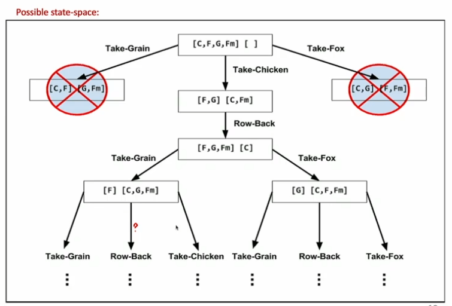

#### Symbolic AI vs sub-Symbolic AI
状态空间 vs 神经网络

符号主义中，智能体的知识和推理能力基于符号的逻辑推理，而准智能体则通过学习和模式识别来获取知识和推理能力。准智能体的特点是不依赖于完整的符号逻辑表示，并且其行为和推理能力是由底层的数学模型和算法所决定的。

>七桥问题 Konigsberg Problem
是否能一笔画？

>偶数度节点有偶数条弧线将其与邻近节点连接起来。奇数度节点有奇数条弧。

>欧拉结论 Euler's conclusion： 除非一个图恰好包含 0 个或 2 个奇数度的节点，否则不可能按照柯尼斯堡桥问题所描述的方式在图上行走。

>如果有 2 个奇数度节点，行走可以从第一个节点开始，在第二个节点结束；如果没有奇数度节点，行走可以从同一个节点开始，在同一个节点结束。

设计和实施搜索算法的成功程度取决于程序员分析问题的能力。

没有适用于所有问题的普遍优越的搜索算法，这也被称为 “无免费午餐定理 No-Free-Lunch Theorem”。

搜索数据结构：图Graph、树Tree 等

>井字棋：362880种情况

>状态：[N, A, S, GD]

>N是图的节点或状态集。

>A 是节点之间的区域（或链接）的集合。

>S 是 N 的非空子集，包含问题的起始状态。

>GD，N 的非空子集，包含目标状态或问题。GD 中的状态可以用以下两种方式描述： 搜索过程中访问状态的可测量属性、搜索路径的应用属性

>从S到GD即为一个解决路径

>井字棋搜索结构为树；华容道搜索结构为图

##### 练习 1：两个水壶问题
给你一个 4 升的空水壶 (J4)、一个 3 升的空水壶 (J3) 和一个无限量供水的水龙头。有一个排水口。目的是在 J4 中得到正好 2 升的水。

假设问题的状态表示为 (x,y)，其中 x 和 y 分别表示 J4 和 J3 的内容：（J4,J3）

1) 写出初始状态和目标状态

2) 完整列出所需的算子。其中两个运算符是：1. 从水龙头注入 J4；2. 将 J4 倒入排水口

3) 画出任意一个解决方案的搜索图/树。

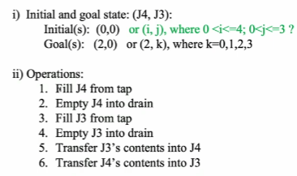

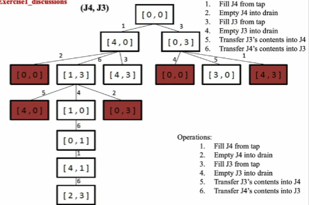

>另一个例子：Traveling Salesman Problem (TSP)旅行推销员问题 ：推销员需要找到最短的路径，访问 N 个城市，每个城市只访问一次，然后返回出发城市。

#### Search Strategies 搜索策略
我们从以下几个方面对策略进行评估：

- 完整性 completeness--如果存在解决方案，它是否总能找到解决方案？ 
- 时间复杂性 time complexity--生成/扩展的节点数量
- 空间复杂性 space complexity--内存中节点的最大数量
- 最佳性 optimality--它是否总能找到成本最低的解决方案？

时间和空间复杂度的衡量单位是：

- b 树的最大分支系数
- d 最小成本解的深度
- m 状态空间的最大深度

Un-informed Search = blind search 无信息搜索 = 盲目搜索

Informed Search = heuristics-applied search 有信息搜索 = 应用启发式搜索

##### Data-driven search 数据驱动搜索：
Facts&Rules=>newFacts=>...=>Goal

- 从给定的问题事实和一组改变状态的动作或规则开始
- 将规则应用于事实，产生新的事实，再由规则产生更多新的事实
- 继续，直到（我们希望！）产生一条通往目标的路径
- 这种方法有时被称为前向连锁forward chaining

##### Goal-driven search目标驱动搜索
Goal=>subGoals=>...=>Facts

- 从目标出发
- 看看有哪些事实可以导向这个目标
- 这些事实成为搜索的新目标或子目标
- 继续搜索，通过连续的子目标向后搜索，直到（我们希望！）回到问题的事实为止
- 这就找到了从数据到目标的移动链或规则，尽管是以相反的顺序进行的
- 这种方法也被称为逆向链法 backward chaining

Data-driven vs Goal-driven:

- 两者都搜索相同的状态空间
- 但搜索的顺序和实际状态数可能不同
- 首选策略由问题本身的属性决定

数据驱动搜索和目标驱动搜索的混合体

>Example：确认或否认你们的一个朋友，比如约翰，是托马斯-杰弗逊的后代这一说法（假设隔了10代）

- 如果我们通过约翰的祖先向托马斯-杰斐逊搜索，我们需要搜索 $2^{10}$ 个祖先，因为一个人有两个父母。
- 如果从托马斯-杰斐逊（Thomas Jefferson）向约翰（John）搜索，我们需要搜索 $N^{10}$ 个后代，其中 N 是一个人的平均子女数。如果 N>2，这比之前的方法工作量更大。
- 但是，如果已知托马斯-杰斐逊的所有后代，但已知约翰的祖先却很少，我们就别无选择了。

##### 练习 2：数据驱动搜索 vs 目标驱动搜索
对于下列问题，你会使用数据驱动搜索还是目标驱动搜索？

- GO 游戏程序；
- 医疗诊断程序。

#### 小结
Symbolic Artificial Intelligence 符号人工智能

Problem States 问题状态

Operators/Inference Rules 运算符/推理规则

State Space 状态空间

Knowledge Representations 知识表示：

- Predicate Calculus /Neural Network 谓词演算/神经网络
- Graph/Tree 图/树

Konigsberg Problem & Euler Conclusion 柯尼斯堡问题和欧拉结论

为什么用状态空间图

图术语

- Node/Arch/Path/Tree 节点/弧/路径/树
- Directed/Rooted Graphs 有向图/根图
- Parent, Siblings/Ancestor/Descendant 父图、同胞图/祖图/子孙图

State Space Approach 状态空间方法示例

- Tic-Tac-Toe/8-puzzle/Farmer 井字游戏/8-字谜/农夫
- Water Jug Problem 水壶问题

Search strategies 搜索策略：data/goal-driven 数据/目标驱动型

**How to Systematically Search a Graph 如何系统地搜索图表**

为什么要搜索图？

- 图搜索用于探索搜索某个节点（目标）的状态空间 
- 它还可用于搜索两个节点之间的路径、检查图是否包含循环或是否连通等。

#### Backtracking Search 回溯搜索

- Depth-first search for CSPs 深度优先搜索 
- Basic uninformed search for CSP 基本无信息搜索（Constraint Satisfaction Problem）

##### Notations of Backtracking 回溯符号

- CS = Current State 当前状态（当前正在考虑的状态） 
- SL = State List 状态列表（当前路径上的状态列表。如果找到了目标，SL 将包含解决方案路径上的有序状态列表） 
- NSL = New State List 新状态列表（新状态列表包含等待评估的节点，即尚未生成和搜索其后代的节点） 
- DE = Dead Ends 死胡同（其后代未包含目标节点的状态列表。如果再次遇到这些状态，它们将作为 DE 中的元素被删除并消除）
- CS = Current State 当前状态（总是等于最近添加到 SL 中的状态，代表当前正在探索的解决方案路径的 “前沿”）

##### Procedure of Backtracking 回溯程序
- 从起始状态开始
- 追踪路径，直到到达目标或 “死胡同” 
- 如果找到目标，则退出并返回解法路径
- 如果到达死胡同，则 “回溯” 到路径上有未检查同级节点（死胡同）的最近节点，并继续沿着其中一个分支前进 
  
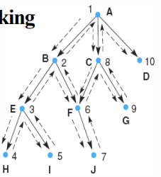

##### Recursive at Each Node 每个节点的递归
- 如果当前状态 S 不符合目标描述的要求，则生成其第一个子节点 Schild-l，并对该节点递归应用回溯程序 
- 如果回溯程序没有在以 Schild-1 为根的子图中找到目标节点，则对其同胞 Schild-2 重复该程序 
- 这样一直进行下去，直到某个子节点的某个子节点是目标节点，或者所有子节点都已搜索完毕。

##### Main ideas used in Backtracking - LIFO
1. 使用未处理状态列表（NSL），允许算法返回（回溯）到这些状态中的任意一个
2. 一个 “坏 ”状态 DE 列表，防止算法重试无用状态 
3. 当前求解路径上的节点列表（SL），如果找到目标，则返回该列表 
4. 明确检查这些列表中新状态的成员资格，以防止出现循环

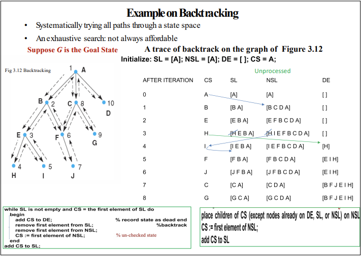

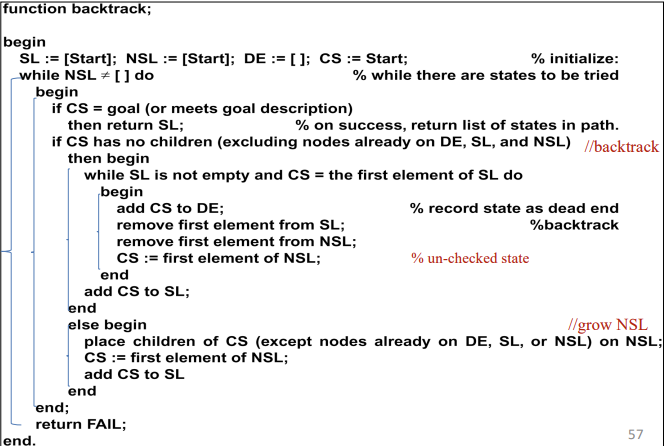

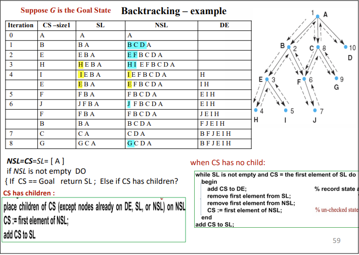

##### 练习 3

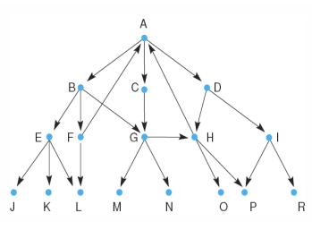

#### Breadth-First Search 广度优先搜索 
- 逐级探索搜索空间 
- 只有当某一级没有状态可探索时，算法才会进入下一级 

##### 广度优先搜索的实现 - FIFO

两个列表： 
- 打开 open - 已生成但其子状态尚未检查 
- 关闭 closed - 已检查过的状态 -

从open的左边（开始）移除祖先状态，从open的右边（结束）添加后代状态。

open 以队列或先进先出（FIFO）结构的形式进行维护。

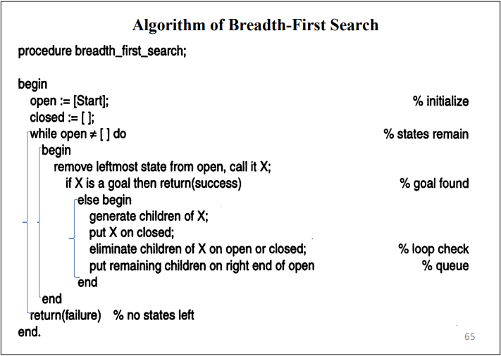

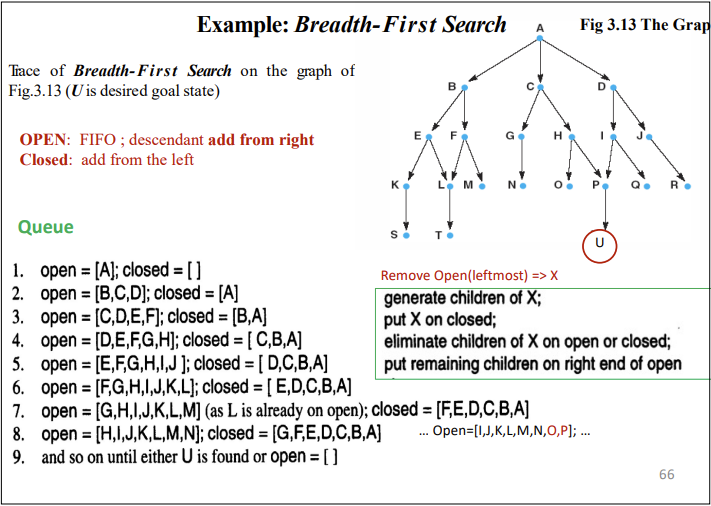

##### 广度优先搜索的局限性
如果分支因子 B（子代的平均数量）很大，可能会阻止算法利用可用空间找到解 

- 广度优先搜索的空间利用率（以开放状态的数量来衡量）是任何时候路径长度或第 n 层上 $B^n$ 个状态的指数函数。

#### Depth-First Search 深度优先搜索

当检查一个状态时，先检查它的所有子状态及其后代，然后再检查它的任何同级状态

- 只有在找不到一个状态的后代时，才考虑它的同级状态 

前面讨论过的回溯算法实现了深度优先搜索。

##### 深度优先搜索的替代实施
- 从 open 的左侧（开头）添加和删除后代状态 
- 将 open 保持为堆栈或后进先出（LIFO）结构
- 以上述方式组织 open 会使搜索偏向于最近生成的状态，从而使搜索具有深度优先顺序

两个列表： 

- open--已生成但其子状态尚未检查的状态--类似于 backtrack 中的 NSL 
- closed--已检查过的状态--是 backtrack 中 DE 和 SL 的结合体

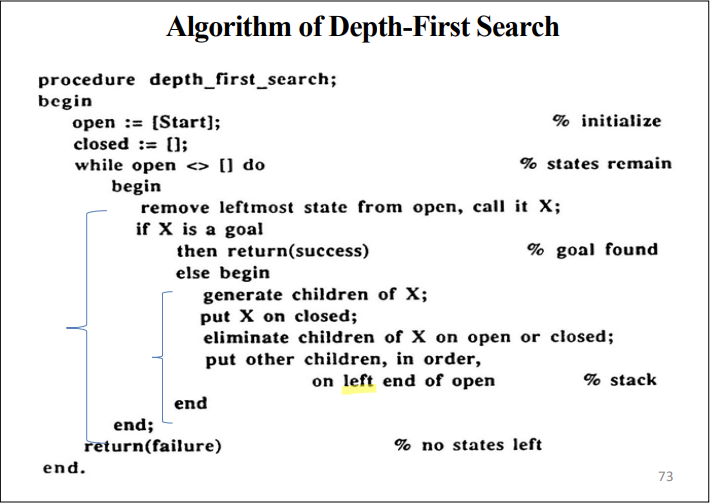

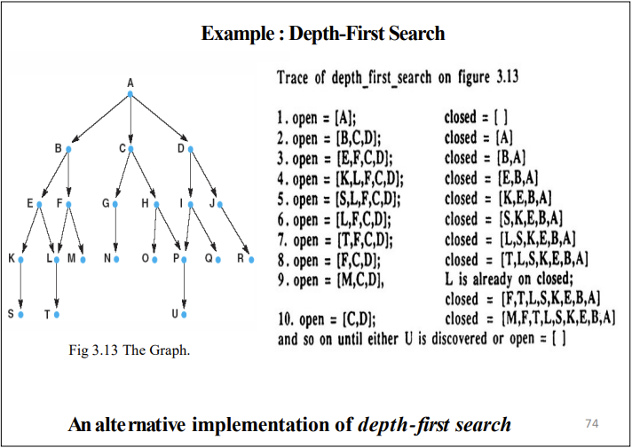

#### 优势：Breadth-First & Depth-First 

广度优先搜索的优势： 

- 找到从起始状态到目标的最短路径 
- 永远不会陷入盲目的探索 

深度优先搜索的优势 

- 深度优先搜索需要的内存更少，因为只存储当前路径上的节点 $B*n$. 这与广度优先搜索形成鲜明对比，在广度优先搜索中，要存储迄今为止生成的所有树 $B^n$ 

关于广度优先搜索的讨论 

- 如果分支因子 B（子代的平均数量）很大，可能会阻止算法利用可用空间找到解 
- 广度优先搜索的空间利用率（以开放状态的数量来衡量）是任何时候路径长度或第 n 层上 $B^n$ 个状态的指数函数。

关于深度优先搜索的讨论 

- 深度优先搜索能快速进入深度搜索空间。

- 深度优先搜索可能会 “迷失 ”在图的深处，错过通往目标的较短路径，甚至陷入无限长的路径中。

- 深度优先搜索的空间占用是路径长度的线性函数。在每一级，open 只保留单个状态的子状态，或 B 乘以 n 个状态，深入空间 n 级

#### Depth‐First Search with Iterative Deepening 深度优先搜索与迭代深化

- 首先对空间进行深度为一的深度优先搜索 
- 如果找不到目标，则进行深度为二的深度优先搜索。我们每次都将深度边界增加一个。
- 每次迭代时，算法都会执行一次完整的深度优先搜索，直到达到当前深度边界。两次迭代之间不保留状态空间的任何信息

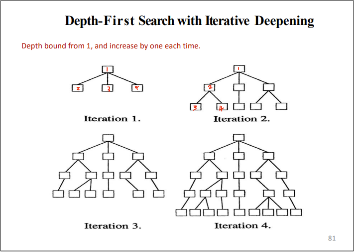

关于迭代深化的深度优先搜索的讨论

- 由于算法以逐级方式搜索空间，因此可以保证找到通往目标的最短路径
- 由于每次迭代都只进行深度优先搜索，因此任何级别 n 的空间使用量都是 B 乘以 n，其中 B 是节点的平均子节点数

##### 练习 4

从节点 A 开始，在下图中执行广度优先搜索和深度优先搜索。节点按字母顺序访问，例如，B 在 C 之前。请解释哪种搜索方式能以较少的节点数找到目标节点 G。

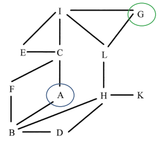

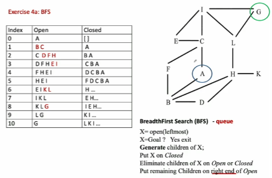

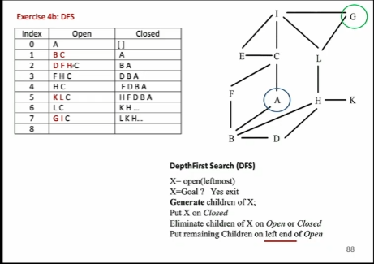

#### 小结
- Systematically search a Graph 图

  Backtracking Algorithm 逆向追踪算法（深度优先，FILO）

- Systematically search a Tree/Graph 树/图
  
  BFS: Breadth First Search 广度优先搜索 （FIFO）

知识表示

- Symbols, logic, rules 符号、逻辑、规则
- Communicate 交流：可被人类和计算机理解
- Can be processed 可处理：结构和计算机语言
- Symbolic AI 符号人工智能：谓词演算；状态空间图

搜索策略

- Data-driven vs Goal-driven 数据驱动与目标驱动
- Graph: Back-tracking 图：回溯 
- BFS: Breadth-First : FIFO 队列; 最短路径; $B^n$ 
- DFS: Depth-First： FILO 堆栈；死胡同；B*n 
- DFS-ID：Depth-Iterative 深度迭代：Depth-bound 深度约束

### topic 3：Heuristic Search & Gaming 启发式搜索与游戏策略

#### Search Strategies 搜索策略 

通过选择节点扩展的顺序来定义策略 

根据以下方面对策略进行评估：

- completeness 完整性--如果存在解决方案，是否总能找到？ 
- time complexity 时间复杂性--生成/扩展的节点数 
- space complexity 空间复杂性--内存中的最大节点数 
- optimality 最佳性--是否总能找到成本最低的解决方案？

时间和空间复杂性的衡量标准是 

- b- 搜索树的最大分支系数 
- d- 最小成本解的深度 
- m- 状态空间的最大深度（可能是 ∞） 

Uninformed Search = blind search

Informed Search = heuristics-applied search

#### Uninformed vs Informed Search Strategies 不知情搜索策略与知情搜索策略

无信息搜索策略仅使用问题定义中的可用信息。

- 系统生成新状态 
- 效率低 
- 常用方法：广度优先搜索 BFS、深度优先搜索 DFS、迭代深化搜索 Iterative Deepening search

知情策略使用特定问题的知识来指导搜索。

- 使用评价函数来估算每个节点的 “可取性”
- 通常效率更高
- 常用方法：爬山法 Hill-Climbing、最佳优先（贪婪） Best-First (Greedy)、A*

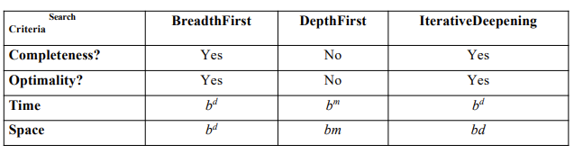

#### Heuristic Search 启发式搜索

启发式（heuristic）一词（adj）的字面意思是：

- 基于个人发现和经验的学习
- 在发现过程中帮助他人（盟友/对手） 

启发式（heuristics）一词（n）的字面意思是：

- （研究）利用经验和实际努力来寻找问题的答案或提高性能 

在状态空间搜索中，启发式被正式表述为：

- 在状态空间中选择最有可能找到可接受问题解决方案的分支的规则

**为什么用启发式搜索？**

我们不得不使用启发式方法，因为寻找解决方案的计算成本往往过高 

- 在许多问题中，状态空间的增长是组合爆炸性的，可能状态的数量会随着搜索深度的增加而呈指数级或系数级增长 
- 在这种情况下，穷举式蛮力搜索技术可能无法在任何实际时间内找到解 
- 启发式方法通过引导搜索沿着空间中最“有希望”的路径进行，从而解决上述复杂性问题 
- 通过消除状态及其后代，启发式算法有望战胜状态空间图的组合爆炸，并找到可接受的答案 
- 例如，国际象棋、围棋、“大型”TSP（n > 25）

**启发式算法的局限性**

- 启发式算法只是一种有根据的猜测。由于启发式算法使用的信息有限，如对当前评估状态的描述，因此很少能准确预测搜索过程中状态空间的行为 
- 启发式算法可能会将搜索算法引向次优解，或根本找不到任何解。这种启发式搜索的固有局限性无法通过 “更好的”启发式或更高效的搜索算法来消除。

**Two Key Components of Heuristic Search 启发式搜索的两个关键组成部分**

每个启发式搜索都由两部分组成

- 一个启发式度量 
- 一个使用启发式度量搜索状态空间的算法

>Tic-Tac-Toe Example 井字棋

>h(i) = 状态 i 的获胜次数

>每次选取获胜可能最大的

##### 启发式搜索算法--爬坡算法 Hill Climbing

爬山：最简单的方法

- 以一个急切但目光短浅的登山者命名
- 爬山策略在搜索中扩展当前节点并评估其子节点
- 选择最好的子节点进行进一步扩展；其同级或父代节点均不保留
- 当搜索达到比任何子节点都好的状态时停止搜索
- 一个模式：贪心算法 greedy

爬山策略的局限性

- 错误的启发式搜索可能会导致无限的路径，从而导致失败
- 爬山策略也可能会陷入局部最大值
- 如果局部最大值不是目标，算法就找不到解
- 一般来说，启发式搜索需要一个更明智的算法；最佳优先搜索提供了这一点 best-first search

惯例：
- 如果启发式 heuristics = 适配性或优良性 fitness or goodness，则越大越好： “爬山”、“局部最大值"。
- 如果启发式 heuristics = cost 成本，则越小越好： “梯度下降”、“局部最小值”。

##### The Best-First Algorithm最优优先算法

- 从仅包含初始状态的 OPEN 开始 
- 在找到目标或 OPEN 上没有节点之前，执行以下操作：

    (a) 挑选 OPEN 上的最佳节点 
    (b) 生成其后继节点 
    (c) 对于每个后继节点，执行： 
        i. 如果之前未生成，则对其进行评估，将其添加到 OPEN，并记录其父节点 
        ii. 如果先前已生成，如果新路径比先前路径更好，则更改父节点。更新从起始状态到达该节点的成本
        iii. 如果已经在closed中了：若新路径比原路径好，就将其拿出closed并放到open中
    
>best-first is not best-only

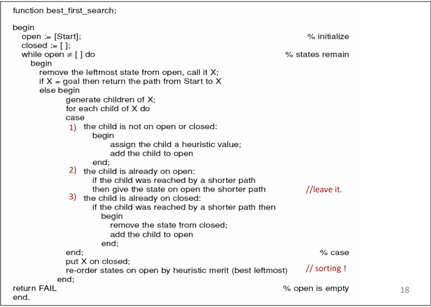

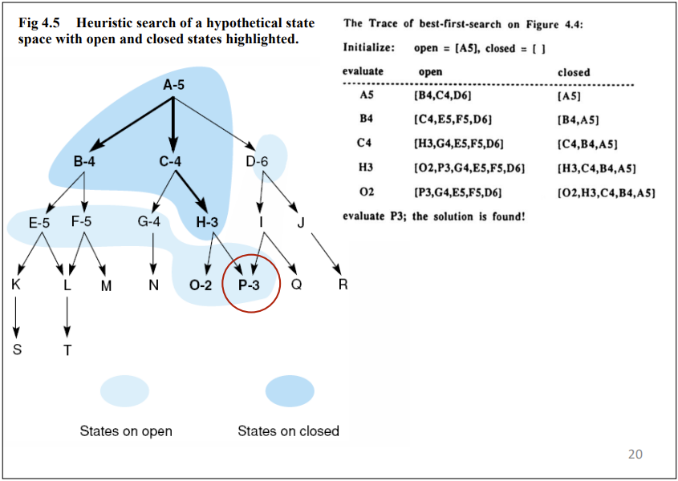

#### 小结

Informed Search 知情搜索

Heuristic Search 启发式搜索概念

- Heuristic function 启发式函数
- Search algorithm 搜索算法
- 获取 h 的示例
 
Heuristic Search algorithms 启发式搜索算法

- Hill-climbing 爬山法
- The Best-First search 最佳优先搜索

>Example: Designing Heuristics

>在数字华容道中

>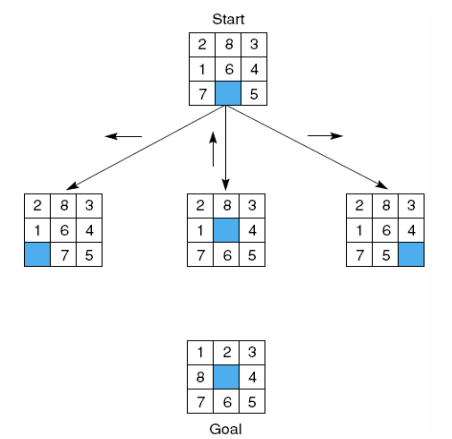

>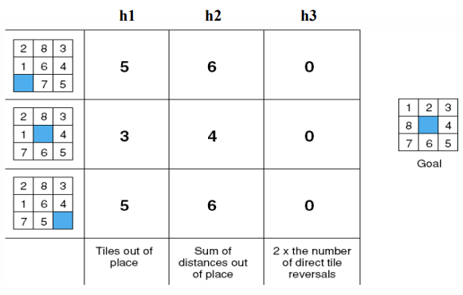

>这里使用了3种不同的h：h1为不在正确位置的数量；h2为相距正确位置距离总和（单个距离为横坐标差+纵坐标差）；h3为位置刚好相反的块数

#### Devising Heuristics 设计启发式方法

设计好的启发式算法是很困难的

- 我们的目标是利用有限的信息找到一个单一的状态描述符single
state descriptor，并据此做出明智的选择 
- 以上针对 8 字谜提出的每种启发式算法都忽略了一些关键信息，因此有待改进 
- 设计好的启发式算法是一个经验empirical问题； 由于启发式是易错的，因此搜索算法有可能会被误导，走上一条无法实现目标的道路。
- 因为启发式是易错的fallible，所以搜索算法有可能会被误导，导致无法达到目标。深度计depth count可用于检测无果路径，以尽量减少这种危险。

depth count 深度计数可以添加到每个状态的启发式评估中，以偏向于搜索图中较浅的状态 

- 这使得评估函数（成本）f 成为两个部分的总和：f(n) = g(n) + h(n) 
- g(n)：路径成本函数 path-cost function = 从初始状态到当前状态 n 的成本，或者测量从起始状态（深度计数 depth count）到任何状态 n 的路径的实际长度（没有关于目标成本的信息）。
- h(n)：启发式函数 heuristic function = 从 n 到目标状态的最便宜路径 cheapest path 的估计成本。
- h(n) *不大于*实际成本（可采纳 admissible）(决定了启发函数得到最佳solution)

>An admissible heuristic is one that never overestimates the cost to reach the goal.

>A*搜索能找到最优解的充分条件:

>1.搜索树上存在着从起始点到目标点的最优路径

>2.问题域是有限的

>3.所有结点的子结点的成本>0

>4.h(n) =< h*(n) (h*(n)为从节点n到目标点的实际成本，注意h*(n)和h(n*)的不同)

##### The Best-First 最优优先

f(n) = g(n) + h(n)

- g(n) : path-cost function = cost from start state to state n 路径成本函数 = 从起始状态到状态 n 的成本
- h(n): heuristic function =Estimated cost from n to a goal state. 启发式函数 = 从 n 到目标状态的估计成本

##### Greedy Best-First 贪婪最优优先
f(n) = g(n) + h(n)

- g(n) : path-cost function = 0 路径成本函数 = 0
- h(n): heuristic function =Estimated cost from n to a goal state 启发式函数 = 从 n 到目标状态的估计成本。
- 使用启发式优先处理更接近目标的节点（速度） 

##### A*（A-star）算法

A* 搜索结合了广度优先搜索（Breadth First Search）和贪婪优先搜索（Greedy Best First）的优点。

- 与广度优先搜索一样，它能找到最短路径；与贪婪优先搜索一样，它的速度也很快。

- 每次迭代，A* 都会在前沿选择一个节点，该节点的最小值为： g(n) -从源点出发的步数 + h(n) 到目标点的近似步数
- g(n) 与 BFS 类似，首先查看靠近源的节点（彻底性）；h(n)与 “贪婪最佳优先”类似，使用启发式方法优先处理更接近目标的节点（速度） 
- h(n) is always under-estimated/same as the actual cost from n to a goal. i.e., h(n)≤h*(n) where h*(n) is the true cost from n.(Also require h(n)≥0, so h(G)=0 for any goal G.) A* search is optimal , When h(n) is admissible

>example: 数字华容道

>f(n) = g(n) + h(n)
> - g(n) 测量从任何状态 n 到起始状态的实际路径长度(depth count)，这里是实际移动步数
> - h(n) 是状态 n 的可接受启发式估计，这里是没在正确位置的数量

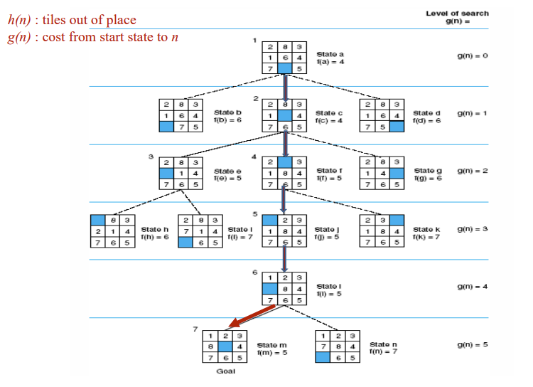

>注意这里还是需要best-first search的，因此需要一个open组来进行，每次选取里面最小f(n)的一个继续向下

>Example: (greedy) Best-First to Find a Path from Arad to Bucharest 

>h(n)：评估函数 = 从 n 到Bucharest 的直线距离

>g(n) = 0 (greedy)

>因为两点之间直线最短，因此可以保证h(n)一定是可采纳的 admissible

>Example: A* to Find a Path from Arad to Bucharest

>f(n) = h(n) + g(n)

>h(n) = 从 n 到 Bucharest 的直线距离
g(n) = 从 n 到 Arad 的之前走过的距离

##### Properties of Greedy Best-First vs A*
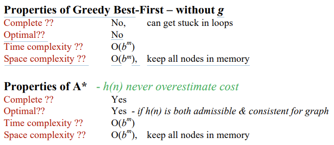

>完整性completeness 如果存在解决方案，是否总能找到？

>最优性optimality 它是否总能找到成本最低的解决方案？

>时间复杂性time complexity 生成/扩展的节点数 

>空间复杂性space complexity 内存中的最大节点数

#### 练习 5

1. 从图 1 中的节点 A 开始 “手动运行 ”贪心的最佳优先算法，其中每个节点的成本启发式度量值为 h。

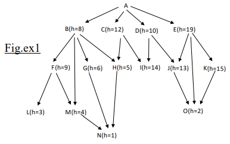

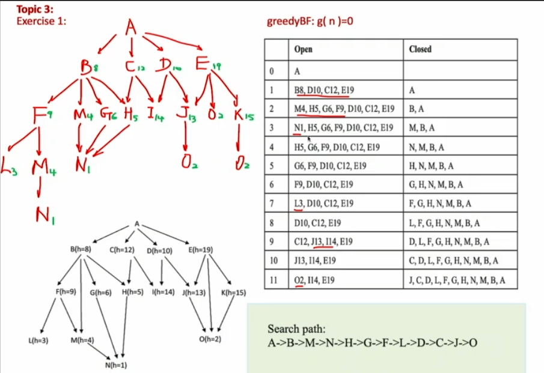

2. 有时，一个问题并没有很好的评估函数，但有一种很好的比较方法：一种不用给节点赋数值就能知道一个节点是否比另一个节点好的方法。这足以进行最佳优先搜索吗？

can do Best-First search without knowing the exact f(n)-
measure(ranking is the key)只要我们能从打开的所有状态中选出最佳状态，最佳优先搜索就能正常进行。

3. 如图 3 所示，针对状态 n 和目标状态 G 的 8 字谜问题，计算出两个启发式 h1(n) 和 h2(n)，其中 h1(n)= 错位瓷砖数，h2(n) = 曼哈顿总距离。

h1 = 14; h2 = 6

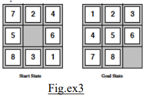

#### 小结

Heuristics 启发式：将经验/技能/知识 => 功能/规则/测量转换

Informed Search Algorithms 知情搜索算法： 
- Hill-Climbing 爬山算法 
- Best First / Greedy Best First /A* 最佳先行 / 贪婪最佳先行 /A*

- 启发式函数用于估计最短路径的成本
- 好的启发式方法可以大大减少搜索空间/成本 
- Best-First search 最佳优先搜索找最低 f 
- Greedy Best-First 贪婪的 “最佳第一搜索 ”找最低的 h (不完整，不一定最优 )
- A* 搜索扩展最低 g+h，其中 h 是可接受的 
  - 完整且最优 
  - 最优效率（对于前向搜索而言，最多可打破平局）
  
可接受的启发式方法：对于所有 n 0 <= h(n) <= h*(n)；对于任何目标状态 G, h(G)=0

#### Gaming 博弈策略
Search vs Games 搜索与博弈 

- 搜索 - 没有对手；解法是寻找目标的（启发式）方法；启发式方法和 CSP 技术可以找到最优解；评价函数：估计通过给定节点从起点到目标的成本
    >例如：路径规划、安排活动... 

- 博弈--对手/对手 + 时间；解法是策略，是针对对手每种可能的回复而指定的棋步；时间限制迫使我们采用近似解法；评估功能：评估对局位置的 “好坏” 
    >例如：国际象棋、国际跳棋、围棋...

策略: 自己最大，对手最小

- 最大值：试图最小化对手在每个状态下的最大回报 
- 穷举搜索 

缺点:

- 需要分析的棋步数量会迅速增加
- 计算能力限制了算法的深度

>Game Tree 以井字棋为例：

>draw = 0；1 = win；-1 = lose

将博弈看作搜索问题：

- 初始状态 Initial state：初始棋盘配置和谁先下一步棋的指示
- 算子 Operators：合法棋步 
- 终结测试 Terminal test：确定对局何时结束。对局结束的状态：终结状态 
- 实用函数（回报函数） Utility function：返回一个数字分数，量化对局结果

##### Minimax Algorithm：游戏中的启发式方法
穷举搜索图上的最小值程序 - 游戏树

- 双人博弈比简单的谜题更为复杂，因为对手的行动是不可预测的。
- 在进行状态空间可以穷尽的博弈时，主要困难在于如何考虑对手的行动。
- 最简单的解决方案是假设对手使用相同的状态空间知识，并运用这些知识不断努力赢得博弈 
- 在此假设下，Minimax 实现了博弈搜索 
- 博弈中的对手被称为 MIN 和 MAX

>Example: The Game NIM

>玩 NIM 游戏时，双方之间的桌子上摆放着一些火柴；每次移动时，玩家必须将一堆火柴分成两堆，每堆中的火柴数量各不相同。第一个无法再走棋的玩家输掉游戏。对于合理数量的火柴，状态空间是可以穷尽搜索的。

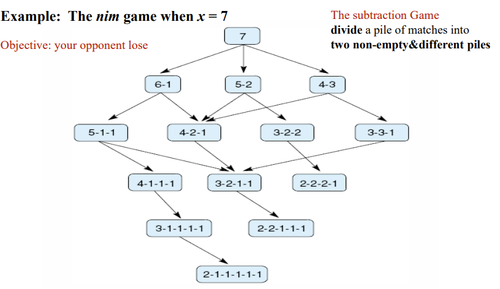

最小值算法 The Minimax Algorithm：

在实现 MINIMAX 算法时，我们会根据对局中的下一步是 MIN 还是 MAX 来标注搜索空间中的每一层。

- 每个叶节点的值为 1 或 0，取决于是 MAX 获胜还是 MIN 获胜。根据规则，MINIMAX 会通过连续的父节点在图中向上传播这些值： 
  - 如果父节点是 MAX 节点，则赋予其子节点的最大值 
  - 如果父节点是 MIN 节点，则赋予其子节点最小值 
- 这样分配给每个状态的值就表示了该棋手有望达到的最佳状态的值。这些推导出的值用于从可能的棋步中进行选择
  
Minimax Search Strategy

完美决策--如果没有时间限制，3 步流程 ：

1. 生成整个博弈树，直至终端状态 
2. 计算效用 
- 评估每个终端状态的效用 
- 确定终端状态父代的最佳效用 
- 对其父级状态重复上述过程，直至到达根状态。
3. 选择最佳移动（即效用值最高的移动）

> 例子1：NIM

>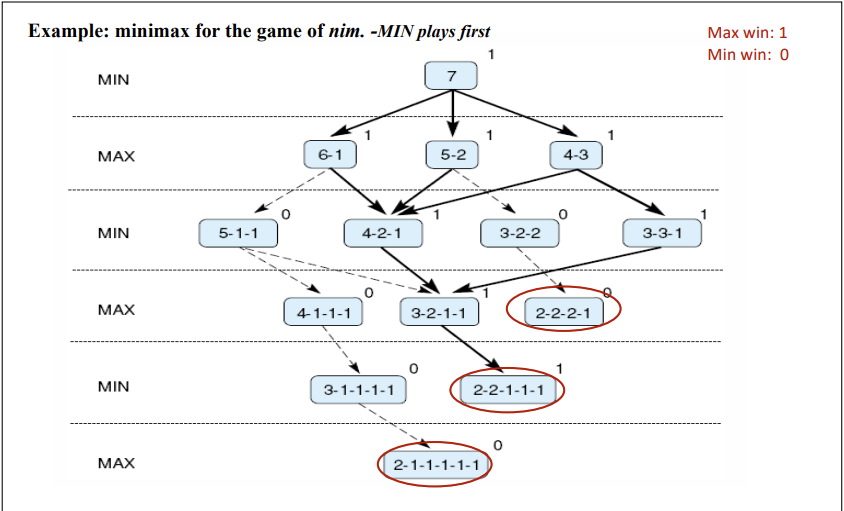

如果时间/空间有限 ：

1. 用估计位置的可取性取代效用函数 
- 评估函数
1. 部分树搜索 
- 例如，深度限制 
- 用截止测试取代终点测试

>例子2：井字棋

>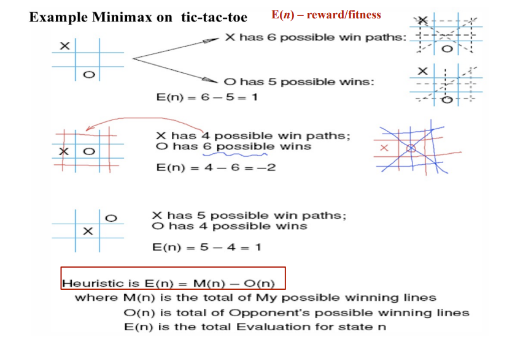

>可以向下看2步，用2步后的结果作为端点，评估状态并向前（n-move look-ahead Horizon）注意，向前到对手时选所有情况最小的，向下选最大的(如果对面连线则为-无穷)

>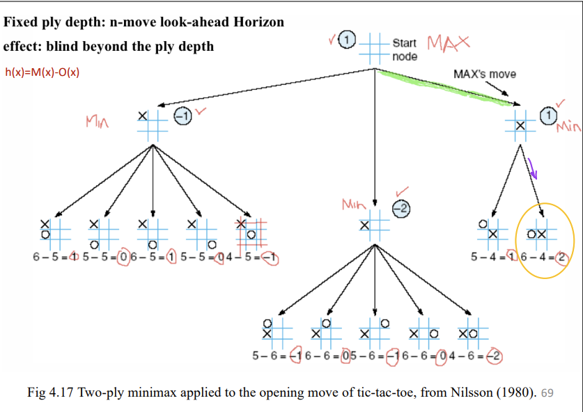

>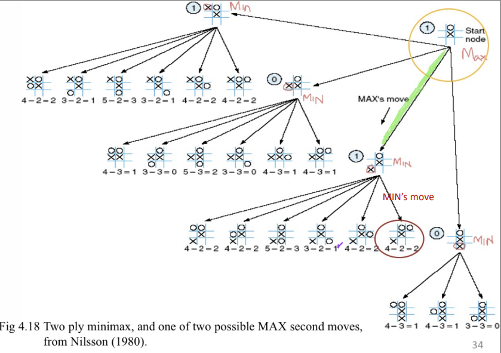

属性：

- 完整吗Complete？是，如果树是有限的（国际象棋有特定规则）
- 最优Optimal？是，对最优对手 
- 时间复杂性？O(bm ) 
- 空间复杂度？O(b*m)（深度优先探索） 

>国际象棋：对于 “合理 ”对局，b=35，m=100 ，因此精确解完全不可行 => 搜索效率至关重要

#### 练习 6 在图所示的树上执行minimax

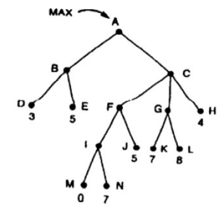

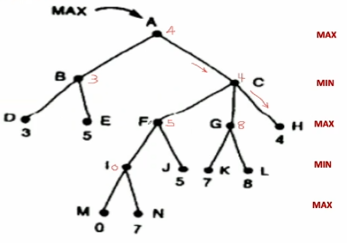

##### The Alpha-Beta Algorithm 阿尔法-贝塔算法

ALPHA-BETA 算法能够得出与 MINIMAX 算法相同的结论，但评估的节点更少。它能让我们在搜索空间中剪除prune out一定数量的状态。

beta cut-off（minimize）

- 以深度优先的方式下降到全层深度，并对一个状态及其所有同级状态应用我们的启发式评估。假设这些都是 MIN 节点 
- 然后将这些 MIN 值的最大值备份到父节点（MAX 节点），并将其作为潜在的 beta 截止点提供给祖节点
- 如果其他子代的任何值等于或大于该贝塔值，则下传到其他子代，并终止对其父代的探索。

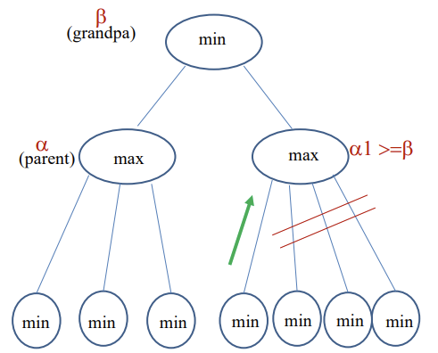

>规则：如果任何 MAX 节点的 alpha 值大于或等于其任何 MIN 节点祖先的 beta 值，则可在该节点下方停止搜索。

alpha cut-off（maximize）

- 以深度优先的方式下降到全层深度，并对一个状态及其所有同级状态应用我们的启发式评估。假设这些都是 MAX 节点 
- 然后将这些 MAX 值的最小值备份到父节点（MIN 节点），并提供给祖节点作为潜在的 alpha 截止点
- 如果其他子代的任何值等于或小于该 alpha 值，则下传到其他子代，并终止对其父代的探索

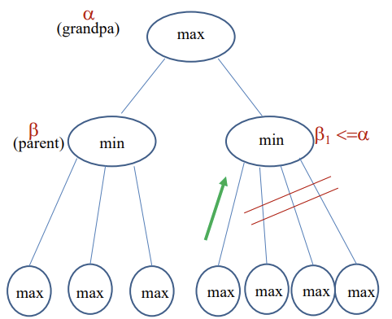

>规则：可在任何beta值小于或等于其任何最大祖先的alpha值的 MIN 节点下方停止搜索

总结：

根据阿尔法和贝塔值，终止搜索的两条规则是 

- 如果任何 MIN 节点的 beta 值小于或等于其任何 MAX 祖先的 alpha 值，则可以在该节点下方停止搜索。
- 在任何 MAX 节点下方停止搜索，该节点的alpha值大于或等于其任何 MIN 节点祖先的beta值。
- 阿尔法-贝塔剪枝表达了第 n 层节点和第 n+2 层节点之间的关系，在这种关系下，整个子树都根植于第 n+1 层

>从上到下，alpha值指代MAX，开始都是负无穷；beta值指代MIN，开始都是正无穷。看左枝时，若更新后的MAX alpha值大于MIN的beta值，就不用再考虑右枝；若更新后的MIN beta值大于MAX的alpha值，就不用再考虑右枝

>这里左右枝不需要比较上传，直接先传左树枝比较，如果发现不满足剪切条件再去看右枝更新

>严格按照深度优先LRM遍历

>其实际效果就是很简单的，在 Minimax Algorithm算法向上传递时严格按照左右中遍历节点，并把左枝已经排除的右枝减掉。

举例：

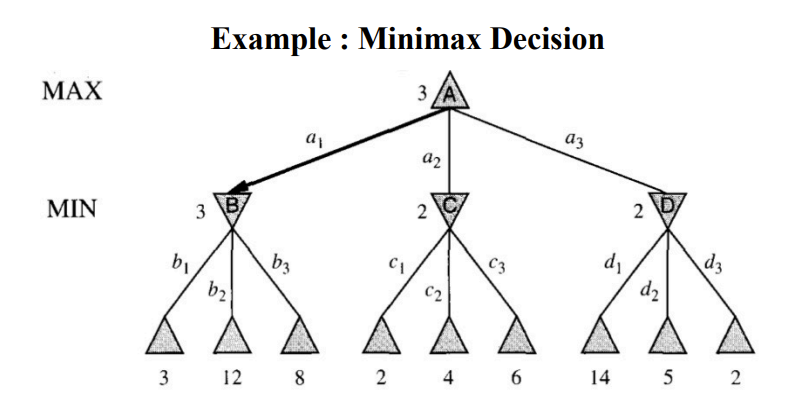

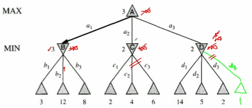

>也可以用range表示alpha beta
>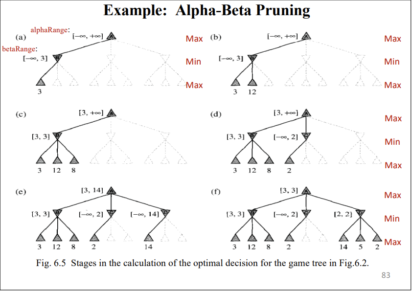

>The Alpha-Beta Algorithm不会影响结果，但仍然不够

#### 练习 7

1. 对图中的树进行
   
(i) 从左到右的阿尔法-贝塔修剪；

(ii) 从右到左的阿尔法-贝塔修剪。讨论为什么会出现不同的修剪。

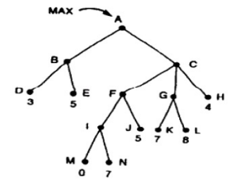

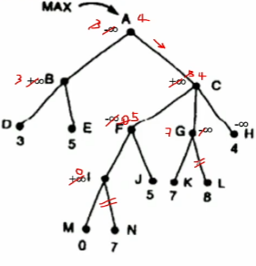

>注意在更新I后，不仅要比较F，还要比较A（因此会减掉N）即生成的每个新alpha要与之前所有beta比较，所有beta要与之前所有alpha比较

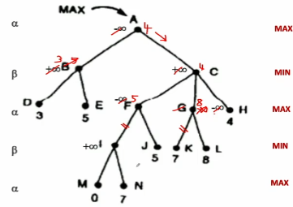

2. 考虑图中的博弈树。使用从左到右的 alpha-beta 剪枝法探索这棵树。指出树中被剪切掉的所有节点。指出获胜路径。

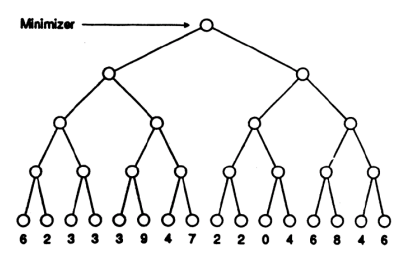

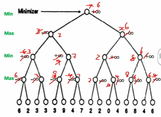

>一个方法就是标好alpha、beta初始值（负无穷、正无穷）、之后更新时：若打破了之前正负无穷的大小状态，就剪枝。

##### Monte Carlo Tree Search 蒙特卡洛树搜索 MCTS

是一种启发式搜索算法，适用于某些决策过程，尤其是人工智能游戏中的决策过程。

2006 年，法国计算机科学家描述了蒙特卡洛方法在游戏树搜索中的应用，并创造了这一名称。

它已被用于棋盘游戏 围棋、国际象棋和将棋等其他棋盘游戏，以及桥牌、拼字游戏、Poke.... 等信息不完整的游戏。

许多其他应用： 现实世界的规划、优化......

主要理念： MCTS 建立了一棵部分映射到整个游戏树的统计树；统计树引导人工智能找到游戏树中最有趣的节点。节点的价值由模拟决定。

MC 方法：利用随机性解决原则上可能是确定性的问题

#### 小结

Minimax

- 整棵博弈树 
- 终端的效用值 
- 假设相同的知识

Alpha-Beta pruning

- 阿尔法-贝塔值 
- DFS 
- 两种规则

### topic 4：Introduction to Data Mining & Association Analysis 数据挖掘简介与关联分析

#### Data数据

What is Data？

数据对象data objects及其属性attributes的集合 

- 属性是对象的属性或特征 
- 
>例如：人的眼睛颜色、温度等

>属性也称为变量、字段、特性或特征 

- 属性集合描述了一个对象 
- 对象也称为记录、点、案例、样本、实体或实例

Data Matrix 数据矩阵

如果数据对象具有相同的固定数字属性集，则可将数据对象视为多维空间中的点，其中每个维度代表一个不同的属性 
> 此类数据集可用 m*n 矩阵表示，其中有 m 行（每个对象一行）和 n 列（每个属性一列）

Transaction Data 交易数据

记录数据的一种特殊类型，每条记录（交易）涉及一组项目。

>例如，考虑一家杂货店。顾客在一次购物中购买的一系列产品构成一次交易，而购买的单个产品就是项目。

Graph data, Genomic Sequence data 图表数据、基因组序列数据

>Domo, Inc. is a cloud software company based in American Fork, Utah, United States. It specializes in business intelligence tools and data visualization

Data, Information, Knowledge 数据、信息、知识

- 数据：是指任何可由计算机处理的事实（文字）、数字或文本。
- 信息： 所有这些数据之间的模式、关联或关系可以提供信息。
- 知识： 信息可以转化为有关历史模式和未来趋势的知识。

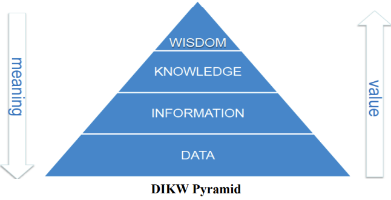

#### Data Mining 数据挖掘

What is Data Mining?

>Discovering interesting patterns from large amounts of data stored in information repositories. ~ J.W. Han 

>Non-trivial process of identifying valid, novel, potentially useful, ultimately understandable patterns of data. ~ U. Fayyad

>The process of automatically discovering useful information in large data repositories… to find novel and useful patterns that might otherwise remain unknown. ~P.-N.Tan 

从数据中发现知识： 从海量数据中提取有趣的（非琐碎的、隐含的、以前未知的和潜在有用的）模式或知识。

>以下活动是否属于数据挖掘任务？

>- 根据性别划分公司客户。F

>- 根据学生识别号对学生数据库进行排序。F

>- 计算选修 IE4483 的电子电气工程学生人数。F

>- 利用历史记录预测一家公司未来的股票价格。T

>- 提取声波的频率。F

>- 监测病人的心率是否异常。T

>- 从互联网上搜索信息，寻找捕捉稀有或传奇小精灵的地点，如 “Articuno”、“Blastoise”、“Ditto ”等。F

>注意：Data Mining不是搜索数据库，需要发现“新”模式

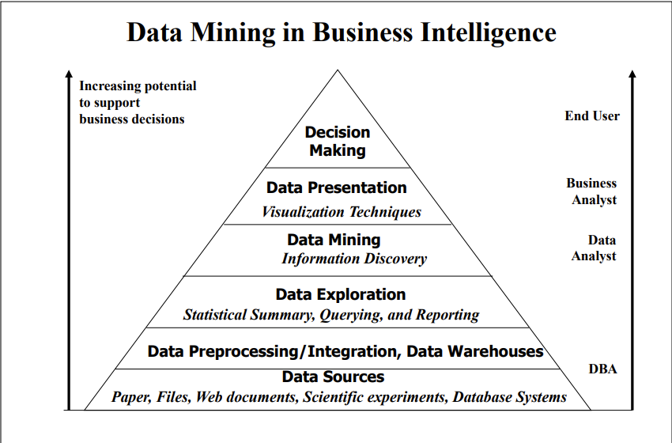

KDD Process：来自 ML 和统计学的典型观点

- 数据挖掘是数据库知识发现（KDD）的关键步骤
- 数据预处理通常是整个知识发现过程中最费力、最耗时的步骤。
- 后处理确保只保留有效和有用的结果并进一步加以利用、

数据挖掘任务

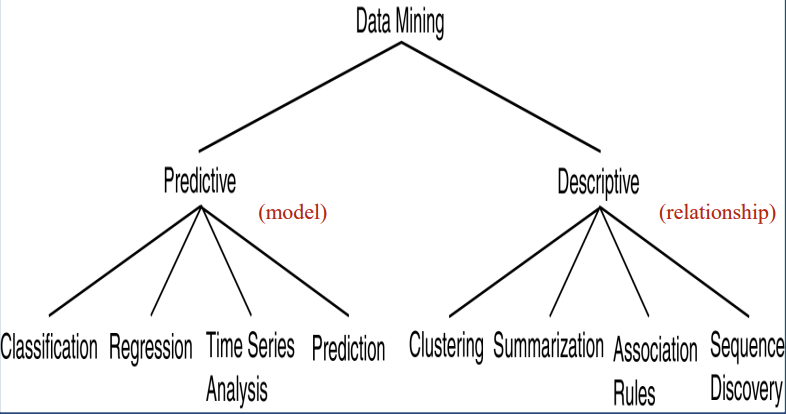

数据挖掘的主要功能

- 归纳 Generalization
- 关联 Association
- 分类和预测 Classification and Prediction
- 聚类分析 Cluster analysis
- 离群值分析 Outlier Analysis

对哪类数据进行挖掘？

- 关系数据库 
- 数据仓库 
- 事务数据库 
- 高级数据库和信息库 
  o 对象关系数据库 
  o 空间和时间数据 
  o 时间序列数据 
  o 流数据 
  o 多媒体数据库 
  o 异构和传统数据库 
  o 文本数据库和 WWW 
  o 社交媒体 
  o 云数据

应用：

- 市场或业务数据分析和决策支持

>市场分析和管理:目标营销、客户关系管理 (CRM)、市场篮子分析、交叉销售、市场细分 

>风险分析和管理:预测、客户保留、改进承保、质量控制、竞争分析 

>欺诈检测和异常模式（异常值）检测 

- 其他应用
  o 文本挖掘（新闻组、电子邮件、文档）和网络挖掘 
  o 医学和 DNA/生物数据分析 
  o 社交媒体和多媒体数据分析 
  o 教育数据分析 
  o 医疗保健 ....

数据挖掘的主要问题

- 挖掘方法 
>从不同数据类型（如生物、网络）中挖掘不同类型的知识 性能：效率、有效性和可扩展性 模式评估：趣味性问题 纳入背景知识 处理噪音和不完整数据 并行、分布式和增量挖掘方法 将发现的知识与现有知识整合：知识融合 

- 用户交互 
> 数据挖掘查询语言和临时挖掘 数据挖掘结果的表达和可视化 多层次抽象知识的交互式挖掘 

- 应用和社会影响
>特定领域数据挖掘和隐形数据挖掘 保护数据的安全性、完整性和隐私性

#### 练习 7
1. 1998 年，美国连锁超市沃尔玛知道，购买芭比娃娃的顾客（每 20 秒售出一个）有 60% 的可能会购买三种糖果中的一种。有了这样的信息，沃尔玛能做什么呢？沃尔玛商品部主管李-斯科特说："我一点头绪也没有。你能为增加沃尔玛的业务做些什么？

{芭比娃娃}->{糖果}

>买了芭比娃娃的都会买糖果，置信度60%，且支持度较高（每20s卖出一个）

建议：两种商品放在较近地方、设置特殊优惠

2. 使用您熟悉的现实生活中的数据集或应用程序，分别举例说明以下数据挖掘功能：关联、回归和聚类。association, regression, and clustering

- association 关联分析旨在发现表明数据属性之间存在密切关联/关系的模式，例如，识别经常在一个篮子中一起购买的杂货或经常一起依次访问的网页。
- regression 回归分析旨在创建模型来描述变量之间的关系。它可用于根据其他变量的值预测某些变量的值；例如，根据过去几天的气温预测明天的气温t =f（xl，x2，...x），创建一个模型来预测对象的标签。
- clustering 聚类的目的是将对象或数据点分成若干组，使同组的对象/数据比其他组的对象/数据更相似，例如，将电影或电视节目聚类为动作、冒险、戏剧、浪漫、喜剧等不同类型。
- 
#### Association Analysis 关联分析

从数据中发现有趣或有用的模式、规律和趋势： interesting or useful patterns, regularities and trends

>- 哪些产品经常一起购买？
>- 购买个人电脑后的后续购买情况如何？ 
>- 哪些 DNA 对这种新药敏感？ 
>- 如何自动对网络文档进行分类？ 
>- 哪些博客和论坛用户可能反社会？

关联规则挖掘 Association Rule Mining

关联规则挖掘 = 搜索数据集中项目之间的关系。

- 在信息库中查找项目集或对象集之间的频繁模式、关联、相关性或因果结构。
- 频繁模式：在数据库中频繁出现的模式（项目集、序列等）。
- 规则形式： X -> Y(箭头左边称为先决条件（antecedent），箭头右边称为结果（consequent）)

基本概念 

- 假设 I = { i1, i2, ... id } 是数据集中 d 个项目items的集合 
- 假设 T={t1, t2, ..., tN } 是市场篮子数据中 N 个交易transactions的集合，其中 N=|T|。
- 每个 tj 都是 I 的子集，包含从 I 中选择的一个或多个项目。
- 由零个或多个项目组成的集合称为项目集。
- 如果一个项集包含 k 个项，则称为 k 项集，例如 例如：{面包、可乐、牛奶}是一个 3 项集。
- 空（或空）集是指不包含任何项的项集。
- 如果项集 X 的所有项都是项集 Y 的项，那么项集 Y 就是项集 X 的超集 superset，或者说项集 X 是项集 Y 的子集 subset。

>注意这里子集有点违背常识，多的是少的子集

- 如果 X 是 tj 的子集，则称事务 tj 包含项目集 X。
- 项集的支持数support count σ(X) 是指包含项集 X 的事务transactions数量。
- 支持度Support：σ(X) / |T|
- 关联规则association rule是 X->Y 形式的蕴含 例：{Diaper, Milk}->{Beer},代表买了前两者和啤酒订单的关系，注意两者交集不能为空！
- 关联规则的强度strength可以用支持度和置信度来衡量
- 支持度Support表示一条规则在给定数据集中的适用频率
-  置信度Confidence表示 Y 中的项目在包含 X 的事务中出现的频率。

>注意support和support count的区别（前者为比例，后者为数）
  
Support & Confidence

事务数据集 T 中关联规则 X->Y 的支持度和置信度的正式定义：

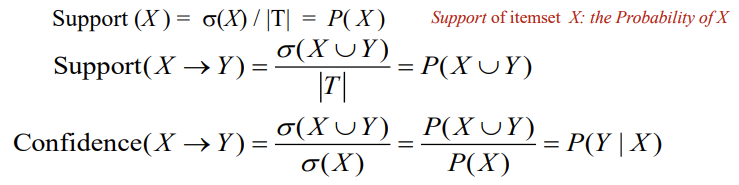

>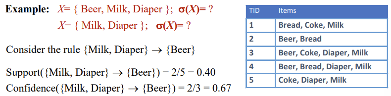

#### Association Rule Mining (ARM) 关联规则挖掘 

给定一组事务 T，找出所有支持度≥ minsup 和置信度≥ minconf 的规则 (X->Y)，其中 minsup 和 minconf 是相应的支持度和置信度阈值。

>粗暴的方法是计算每条可能规则的支持度和置信度。然而，这种方法的计算成本很高。

ARM 中的两项任务

为了降低关联规则挖掘的计算复杂度，我们可以将问题分为两个子任务： 

1. Frequent Itemset Generation 频繁项集生成： 找到满足 minsup 阈值的所有项集。这些项集被称为频繁项集。
2. Rule Generation 规则生成： 从频繁项集中提取所有高置信度规则。这些规则称为强规则。

- 频繁项集生成所需的计算量通常比规则生成所需的计算量大。

##### 常项集生成

网格结构可用于枚举所有可能的项集

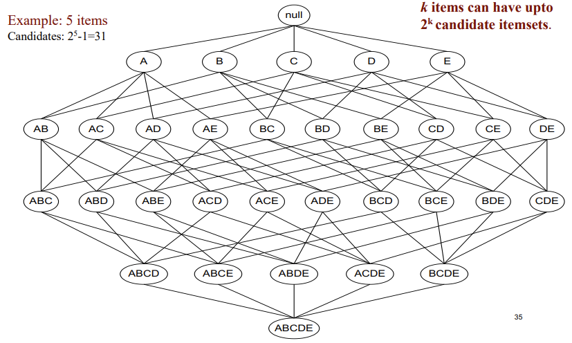

- 一个包含 k 个项的数据集最多可以有 $2^k -1$ 个可能的项集。
- 寻找频繁项集的一种粗暴方法是确定网格结构中每个候选项集的支持数。
- 这种方法需要 O(NMw) 次比较，其中 N 是事务数，M = $2^k -1$ 是候选项集数，w 是最大事务宽度。

1. 减少候选项集的数量 (M)。
2. 减少比较次数

The Apriori Principle Apriori 原则:

为了降低频繁项集生成的计算复杂度，我们可以 

如果一个项集是频繁的，那么它的所有子集也一定是频繁的。

- Apriori 原则可用于消除一些候选项集，而无需知道它们的支持数。
- 通过使用更先进的数据结构来存储候选项集或压缩数据集，可以减少比较次数。

>上图若AC不是频繁项，那么ACB、ACD等也一定不是；反之，若CDE是频繁项，那么CD、C、DE、E等也一定是频繁项

##### Apriori 算法 

1. 设 k =1； 
2. 生成所有长度为 1 的频繁项集； 
3. 重复以下步骤，直到没有新的频繁项集出现： 
    3.1 从频繁 k 项集中生成候选 (k+1) 项集； 
    3.2 删除候选 (k+1)-项集中不频繁出现的 k-项集； 
    3.3 通过扫描数据集，计算每个候选项集的支持率； 
    3.4 删除所有不频繁的候选项集。

原则：

- Apriori 算法使用基于支持的剪枝来控制候选项集的指数增长。
- 它通过合并一对频繁出现的 k 个项目集来生成候选generates candidate (k+1)-项目集，前提是前 k-1 个项目完全相同。
- 在生成每个候选 (k+1)- 项目集时，都会使用额外的候选剪枝candidate pruning步骤，以确保候选集的剩余 k 个子集是频繁的。否则，保证候选项是不频繁的。
  
>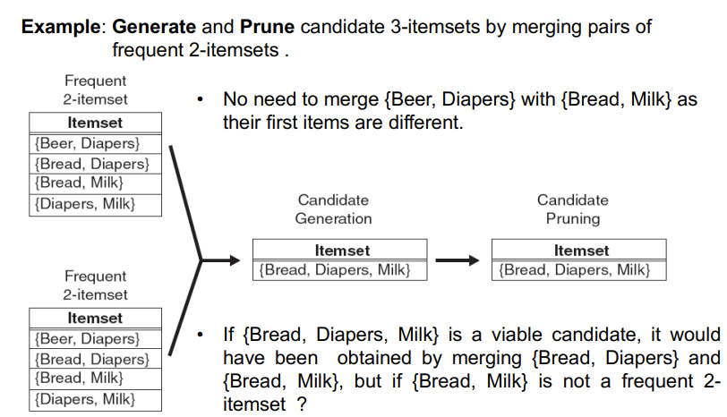

>组合生成下一级，若其中包含一个不是本级频繁项的子集，则将其剪除。必须保证本级都是频繁的！

>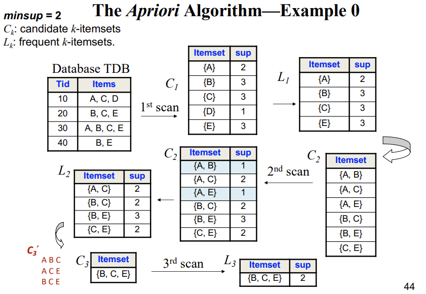

#### 练习 8

考虑以下交易数据集，其中每个字母代表一个项目

(a) 假设最小支持率为 30%。使用 Apriori 算法找出数据集中的所有频繁项集。
(b) 请给出两条最小置信度为 60% 的关联规则。

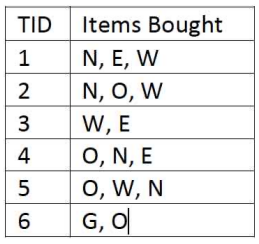

6*0.3=1.8≈2

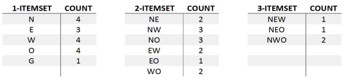

##### FP-Growth 算法

FP-Growth（频繁模式增长frequent pattern growth）通过将频繁项表示为一棵 FP 树（频繁模式树）来压缩数据集。

- FP 树的构建方法是每次读取一个事务数据集，并将每个事务映射到 FP 树中的一条路径上，在这条路径上，非频繁项被丢弃，频繁项按支持计数降序排序。
- 如果不同的事务有几个共同的项目，它们在 FP 树中的路径可能会重叠。
- 一旦构建了 FP 树，FP-Growth 就会使用递归分而治之的方法来挖掘频繁项集。

FP-Growth 对于挖掘长频繁项集和短频繁项集都很有效，而且可以扩展。它比 Apriori 算法快一个数量级。

FP-Growth 算法的关键步骤 

1. 为数据集的压缩表示构建 FP 树。
2. 为头表中的每个项目构建条件模式库conditional pattern base。
3. 根据每个条件模式库构建条件 FP 树conditional FP-tree。
4. 递归挖掘条件 FP 树，并增长迄今为止获得的频繁项集。如果条件 FP 树只包含一条路径，则只需枚举所有项集即可。

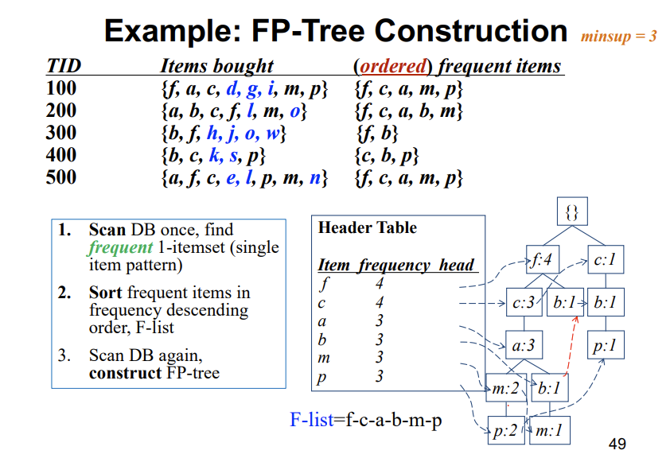

> Header Table 为所有高于频率的单集；
> Ordered frequent items 是将单元非频率删去后产生的
> 将ordered扫描一遍来生成树，字母右侧代表出现次数（每个链条从右上{}开始）
> 最后要将所有链接起来，链上的数字之和应与该字母总数一致

Construct Conditional Pattern Base 构建条件模式库

从 FP 树中频繁项头表的底部开始 ，沿着每个频繁项的链接遍历 FP 树。将该项的所有转换前缀路径累积起来，形成条件模式库

>每一条路径其实都是一条前缀路径（prefix path）。简而言之，一条前缀路径是介于所查找元素项与树根节点之间的所有内容。

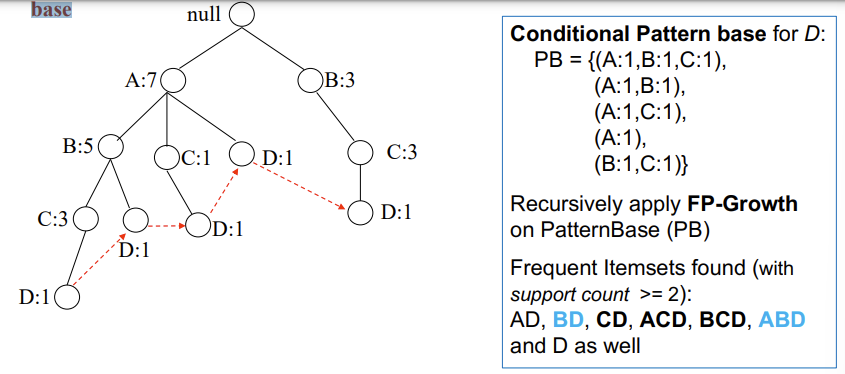

>如何发现某个频繁元素项的所在的路径？利用先前创建的头指针表和FP树中的相似元素节点指针，我们已经有了每个元素对应的单链表，因而可以直接获取。

对于每一个频繁项，都要创建一棵条件FP树。可以使用刚才发现的条件模式基作为输入数据，并通过相同的建树代码来构建这些树。

>注意这里构建的每一个条件FP树都要把不频繁项剔除

有了FP树和条件FP树，我们就可以在前两步的基础上递归得查找频繁项集。算法递归地在条件FP树上挖掘频繁项集，直到所有项都被处理

FP-Growth的原则

模式增长属性：

假设 a 是数据库中的一个频繁项集，B 是 a 的条件模式库，b 是 B 中的一个项集。 如果 b 在 B 中是频繁的，那么 a  b 就是数据库中的一个频繁项集。

评价：

FP-树：一种新型数据结构，用于存储压缩的、有关频繁模式的关键信息，结构紧凑而完整，适用于频繁模式挖掘。

FP-Growth：大型数据库中频繁模式的高效挖掘方法：使用高度紧凑的 FP 树，本质上是一种分而治之的方法。

#### 练习 9
1) 使用 FP-Growth 算法从以下数据集中找出 minsup = 2 的所有频繁项集。
2) 使用 Apriori 算法查找频繁项集。

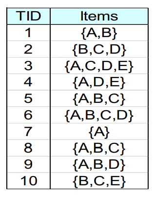

1) FP-Growth：首先生成每个项的出现次数，并把低于minsup = 2的一元项去掉（本例中没有）将其列入“1-itemste——Count-σ”中
   
  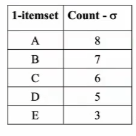

将Items中的非频繁项删去，得到新的sorted f-list TDB

  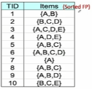

生成FP-Tree

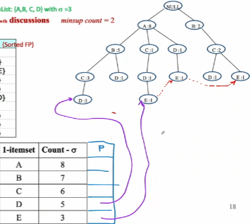

寻找conditional pattern base。以E为例：将包含E的项目提取出来：CPB-E:(ACD:1,AD:1,BC:1)=>(A:2;B:1;c:2;D:2)，去掉B（因为小于minsup），得到新以E为底的FP(ACD:1,AD:1,C:1) fp|E

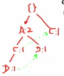

根据这个新FP树，可以求得以E为底的其他CPB，如CPB-D|E:{AC:1,A:1}，去掉C变成A:2；CPB-C|E:{A:1}，没有FP树；CPB-A|E为空。生成的新fp-list如下

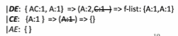

然后依次考虑DCBA。这里给出CPB-D：

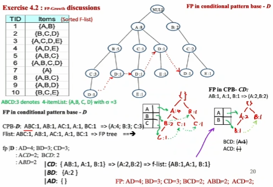

>注意这里BD也有一个list别忘了

理论上每个项目都要递归向上（如fp|DE）最后生成全部fp

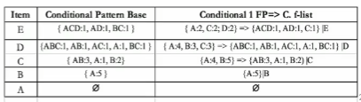

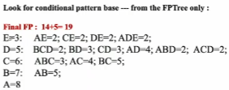

#### Association Rule Generation 关联规则生成

给定一个频繁项集 Y，找出所有非空子集 X 属于 Y，使得 X -> Y - X 满足最小置信度要求。

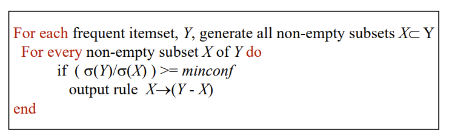

给定频繁项集： Y = {牛奶、花生酱、面包}；k=3

Y 的所有非空子集： X1={牛奶}，X2={花生酱}，X3={面包}，X4={牛奶、花生酱}，X5={牛奶、面包}，X6={花生酱、面包}

k=3; 总共 2^3-2=6 候选规则 Xi -> Y- Xi : 

{牛奶} -> {花生酱，面包}，{花生酱} -> {牛奶，面包}，{面包}-> {牛奶、花生酱}，{牛奶、花生酱} -> {面包}，{牛奶、面包} ->{花生酱}, {花生酱、面包} ->{牛奶}

#### 练习 10

考虑以下交易数据集，其中每个字母代表一个项目。

(a) 假设最小支持率为 30%。使用 Apriori 算法找出数据集中的所有频繁项集。

(b) 给出两个最小置信度为 60% 的关联规则。

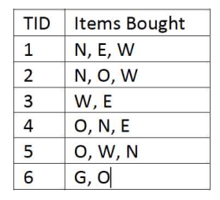

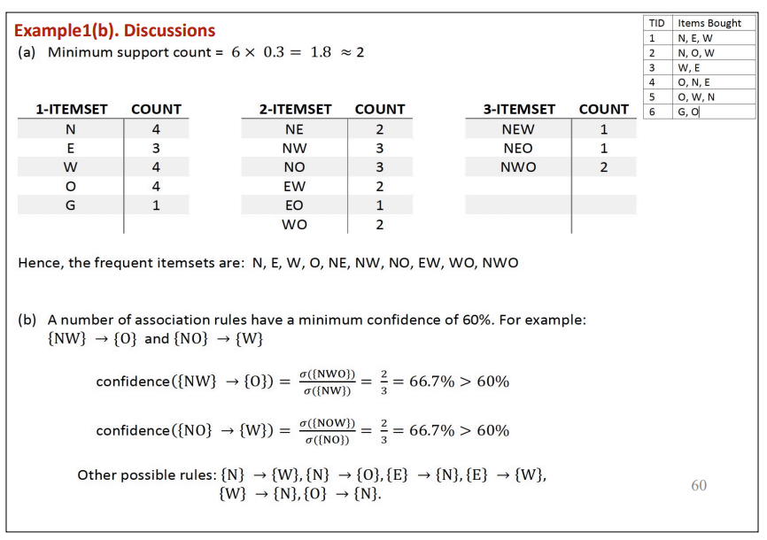

>X->Y指的是在X发生的情况下Y发生的概率

#### Confidence-Based Pruning 基于置信度的剪枝

如果一条规则 X->Y-X 不满足置信度阈值，那么任何规则 X'-> Y-X'（其中 X' 是 X 的子集）也一定不满足置信度阈值。

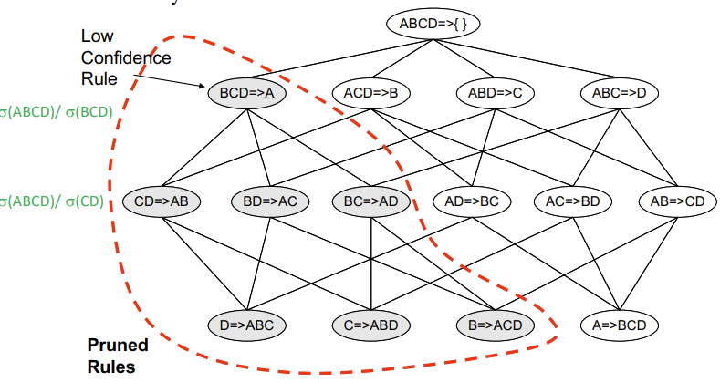

Association Rules Generation 关联规则生成

候选规则是通过合并规则结果中具有相同前缀的两条规则生成的。

规则示例 
1.Rule 1: {Diapers} => {BabyWipes} [Support = 0.2, Confidence = 0.8] 
2.Rule 2: {Diapers} => {Milk} [Support = 0.15, Confidence = 0.3] 

生成候选规则，- 在前件（左侧）中共享相同的前缀

候选规则：{Diapers} => {BabyWipes, Milk} 

如果规则 1 或规则 2 不满足置信度阈值，则可删除该规则

#### 练习 11

1) 如果 {A,B,C,D} 是一个频繁项集，列出可能的候选规则。
   
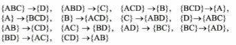

>候选规则：2^4 -2 =14

2) 如果{B, C} => {A,D}不是强规则，则列出可剪枝的规则。

B=>ACD、C=>ABD

>即{B, C}子集，在图中为向下剪枝

#### Lift 爬升度

关联分析有可能产生大量关联规则（模式）。其中一些强关联规则可能并不有趣。

虽然置信度 P(Coffee|Tea) 很高，但该规则具有误导性，因为支持度 P(Coffee) 甚至更高。(喝茶的人喝咖啡，也有可能是本来就喝咖啡)

可以使用有趣度量来增强支持-置信度量，以识别有趣的关联规则。

Lift 是两个项目集 X 和 Y 之间的简单相关性度量，定义为：

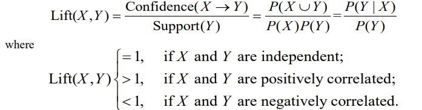

以喝茶和咖啡的人为例，Lift (Tea, Coffee) = 0.9375，这表明喝茶的人和喝咖啡的人之间存在轻微的负相关。

>结果发生的概率越大，越可能表示两者无关，<1则为负相关

#### Maximal Frequent Itemset最大频繁项集 & Closed Frequent Itemset 封闭频繁项集

>- 最大频繁项集是可以衍生出所有频繁项集的最小项集。
>- 它们为产生超长频繁项集的数据集提供了一种紧凑的表示方法。
>- 但是，最大频繁项集不包含其子集的支持信息。
>- 要确定非最大频繁项集的支持计数，还需要对数据集进行额外处理。

>- 封闭项集可以在不丢失支持信息的情况下提供最小的项集表示。
>- 如果没有一个紧邻超集具有与 X 完全相同的支持数，那么 X 就是封闭的； 
>- 如果至少有一个紧邻超集具有与 X 相同的支持数，那么 X 就不是封闭的； 
>- 如果一个项目集是封闭的，并且其支持数大于或等于 minsup，那么它就是封闭频繁项目集。
>- 封闭频繁项集可用于确定非封闭频繁项集的支持数。
>- 所有最大频繁项集都是封闭的，因为没有一个最大频繁项集能与其直接超集具有相同的支持数。

#### 小结

- 关联规则挖掘的目的是找到 X->Y 形式的所有强关联规则，这些规则满足最小支持阈值（P ≥ minsup）和最小置信度阈值（P ≥ minconf）。
- 关联规则挖掘首先要找到满足 minsup 阈值的所有频繁项集，然后从找到的频繁项集中提取满足 minconf 阈值的所有强置信度规则。
- Apriori 算法和 FP-Growth 算法是从数据集中挖掘频繁项集的有效方法。
- 最大频繁项集/封闭频繁项集 Maximal frequent itemset/Closed frequent itemset
- 并非所有强关联规则都是有趣的。规则（模式）评估指标，如相关性指标 Lift，可用于挖掘有趣的规则。

#### 额外练习

下列应用是否属于人工智能？

a) 手机上的指纹触摸 ID 
b) 从一种语言到另一种语言的语音翻译 
c) 条码扫描器 
d) 仅基于关键词的网络搜索引擎 
e) 适应交通状况的 GPS 导航设备 

>a) 生物识别系统（仅存储信息） 
b) 很可能是人工智能--NLP 系统 
c) 信号处理 
d) 信息检索/数据库 
e) 很可能是人工智能：实时；更高智能

一个人必须带着狐狸、鹅和一袋豌豆过河。每次渡河，他的船只能载他自己或他自己和他的一件物品。假设在任何时候，一只无人看守的狐狸都会吃掉鹅；一只无人看守的鹅也会吃掉豌豆。我们需要设计一个状态空间问题求解系统，来模拟这个人最终如何带着他的所有财产过河。假设 - 每个状态以 (L, R) 的形式表示，其中 L 表示左岸的物品清单；R 表示右岸的物品清单。- 人和他的物品从右岸开始写日记。- 可以包含在 L 或 R 中的项目有 人 (M)；鹅 (G)；狐狸 (F)；豌豆 (P)。

(i) 使用上述给定的符号和假设，写出跨河问题的初始状态和目标状态。
(ii) 列出系统在上述约束条件下所需的运算符/动作。
(iii) 建立部分状态空间，通过状态空间搜索解决问题。显示任意一种可能解法的搜索树，指出应用于每条边的算子。

>目标状态：（{M,F,G,P },{}）；初始状态：（{},{M,F,G,P}）； 
(ii) 系统所需的运算符/操作列表：（1）取 F；（2）取 G；（3）取 P；（4）不取。
(iii) 可能的解决方案示例：
 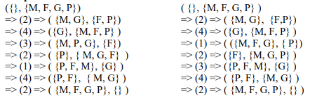

假设起始点为A，目标为I，为深度优先搜索（DFS）、广度优先搜索（BFS）、迭代深化搜索（IDS）（起始深度=1）提供下图所示节点的搜索顺序。显示每一步在开放列表和封闭列表中的更新。

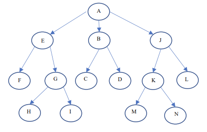

>(i) DFS: AEF, GH, I
(ii) BFS: A, EBJ, FGCDKL, HI
(iii) IDS:
Depth: 1 AE, BJ
Depth: 2 AEF, G, BC, D, JK, L
Depth: 3 AEF, GH, I 

假设 A 是下图 中的起始状态，M 是目标状态，其中 h 表示每个状态的启发式值（成本）。
(i) 对该图应用贪婪的最佳优先搜索算法找到目标状态 M，并说明当评价函数仅依赖于 h 时，Open 和 Closed 的更新情况。 
(ii) 简要说明 (i) 中的贪婪算法是否找到了通往目标状态 M 的较短路径。
(iii) 使用评价函数：f(n) = g(n) + h(n)，其中 g(n) 测量从状态 n 到起始状态 A 的实际路径深度，h(n) 是从状态 n 到目标的启发式估计，如 (i) 所给。用每个状态的 f(n) 来说明更新后的图 。
(iv) 对 (iii) 中更新后的图 2.1 应用最佳优先搜索，以找到目标，并显示 “打开 ”和 “关闭 ”的更新。与 (i) 相比，现在能找到更好的解决方案吗？

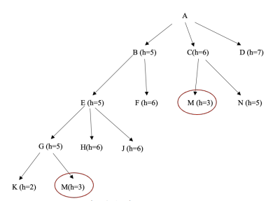

>(i)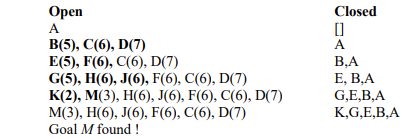
(ii)贪心算法找到了目标状态 M，但没有找到最优解--另一条更短的路径可以到达 M：A=>C=>M。
(iii)&(iiii)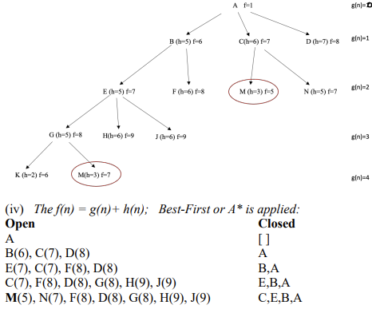

考虑图中的博弈树，假设第一个玩家是最大化玩家。第一个玩家应该选择哪一个分支？博弈最终会以哪种状态结束？请简要解释您的答案。

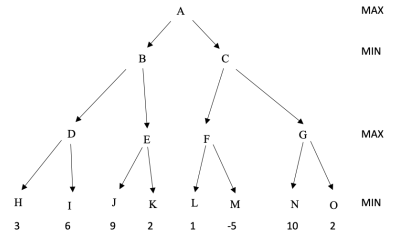

>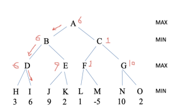
由于第一个玩家是最大化玩家，它选择了通往节点 B 的路径。它选择通往节点 D 的路径....。游戏将在节点 I 结束，得分为 6

考虑上图中给出的博弈树，并假设第一个玩家是最大化玩家。
(i) 假设使用阿尔法-贝塔剪枝法从左向右搜索节点，请列出所有不会被检查的节点。
(ii) 假设使用阿尔法-贝塔剪枝法从右到左搜索节点，请列出所有将不被检查的节点。

>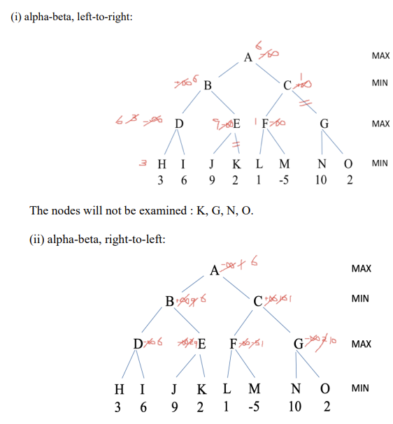

## 第二部分 Machine Learning

### Introduction to Machine Learning

#### 1.Machine Learning

“机器学习是一个研究领域，它赋予计算机在没有明确编程的情况下进行学习的能力。”  --阿瑟-L-塞缪尔，人工智能先驱，1959 年。

- 机器学习使用计算方法（而非显式编程）从数据（或经验）中学习底层过程或模式，从而做出正确的决策或预测。

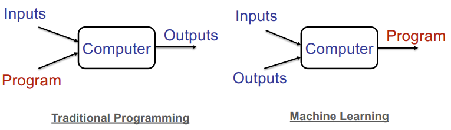

#### 2.Deep Learning

深度学习是机器学习的一个子领域，它利用人工神经网络从大型数据集中学习。深度学习算法的准确性通常会随着数据量的增加而提高。机器学习和深度学习在物体检测、语音识别、语言翻译、产品推荐、自主导航等各种任务中都取得了最先进的性能。

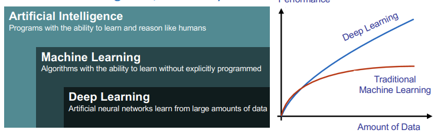

#### Types of Machine Learning

监督学习Supervised Learning - 给定一组输入和目标输出（标签），学习从输入到输出的函数（映射），尽可能减少误差。

典型问题： - 分类 - 回归

常用方法： – K-Nearest Neighbors – Decision Trees – Support Vector Machines – Neural Networks – Linear Regression – Logistic Regression 

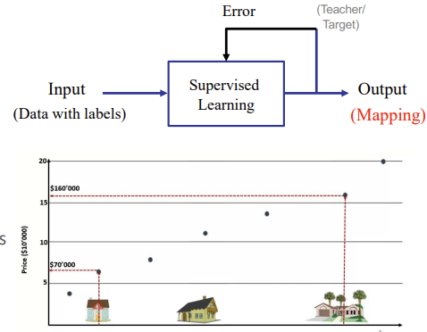

无监督学习Unsupervised Learning - 给定一组目标输出未知的输入，从数据中找出有意义的模式。

典型问题： - 聚类 - 关联分析 - 降维
 
流行方法： - K-Means、分层聚类 - Apriori 算法 - 关联规则挖掘 - 主成分分析 (PCA) 

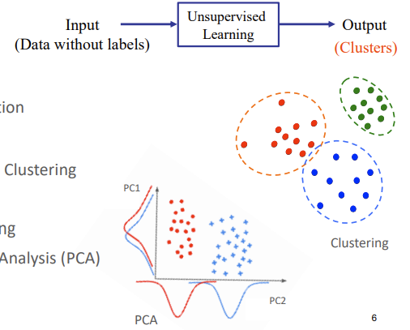

强化学习Reinforcement Learning - 给定环境或任务的状态以及获得的奖励或惩罚，学习如何行动或行为（策略）以获得最大奖励。

典型问题： - 游戏 - 机器人控制 - 策略规划

常用方法： - Q 学习 - 深度 Q 网络

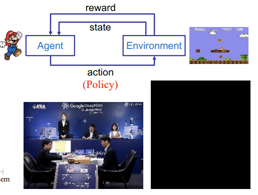

#### 3.Brief History

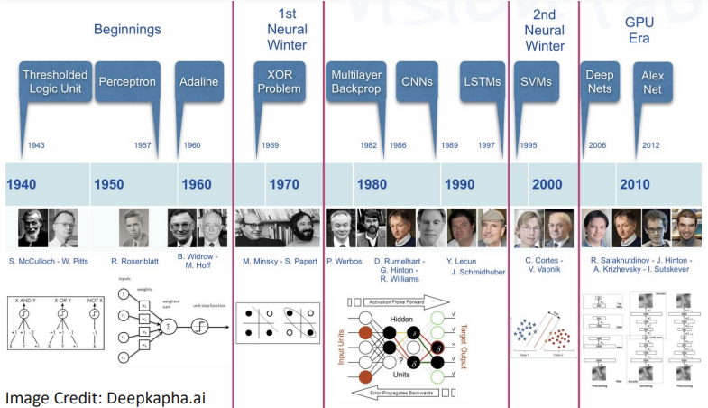

1943 - McCulloch 和 Pitts 的神经元模型--提出了一种可解决 AND、OR、NOT 问题的生物神经元 

1957 - Frank Rosenblatt 的感知器--一种简化的大脑神经元运行数学模型

1969 - 明斯基和帕帕特关于 “感知器 ”的著作 - 对感知器局限性的严谨分析 - 第一个人工智能冬季的开始 

1974 年--反向传播（BP）--保罗-韦伯斯（Paul Werbos）第一个提出将反向传播用于神经网络。- 1986 年--Rumelhart 和 Hinton 独立制定了 BP，并证明它确实有效。

1989 年 - Yann LeCun 的 LeNet - AT&T 贝尔实验室的 Yann LeCun 演示了反向传播在手写邮政编码识别中的实际应用。- 卷积神经网络 (CNN) 和 MNIST 的起源。

1997 - 长短期记忆 (LSTM) - 由 Schmidhuber 和 Hochreiter 提出，用于解决训练递归神经网络的问题，即梯度消失和爆炸问题。

20 世纪 90 年代中期至 2000 年代神经网络的人工智能寒冬，部分原因是出现了其他新方法，如支持向量机 (SVM)。

2012 年 - ImageNet 竞赛 AlexNet（具有池化和卷积层的 CNN）以 %15.3 的错误率赢得了 ImageNet 竞赛，而第二名的错误率为 %26.2。

#### 5.Image Datasets

MNIST (1998) - 60,000 个示例，10 个类别 - 图像尺寸：28x28x1 

CIFAR-10/CIFAR-100 (2009) - 60,000 个示例，10 或 100 个类别 - 图像尺寸：32x32x3

ImageNet (2010) - ~1400 万张图像，20000 多个类别 - 图像大小：全分辨率

#### 6.Applications

机器学习应用实例 - 新闻聚合与欺诈新闻检测 - 自然语言处理 - 虚拟助手 - 娱乐 - 视觉识别 - 欺诈检测 - 医疗保健 - 个性化服务 - 发育迟缓检测 - 图像着色 - 为无声电影添加声音 - 自动机器翻译 - 自动手写生成 - 自动游戏 - 语言翻译 - 像素还原 - 照片描述 - 选举预测 - 深度做梦 - 自动驾驶汽车

Object Detection

YOLO (You Only Look Once) 实时物体检测

Image Understanding

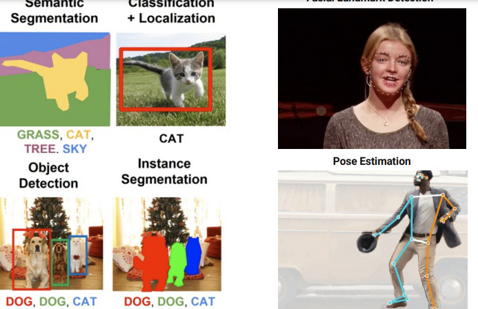

Image Impainting

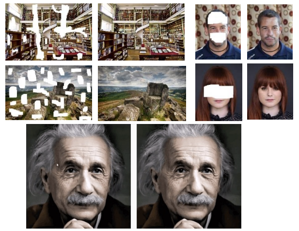

Fast photo style

给定一张内容照片和一张风格照片，代码就能将风格照片的风格转移到内容照片上。

Image Animation

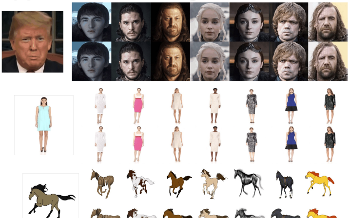

StyleGAN 利用无监督学习生成图像的风格生成对抗网络

DeepFake 图像或视频中的人物被替换成其他人的肖像。

Large Language Models

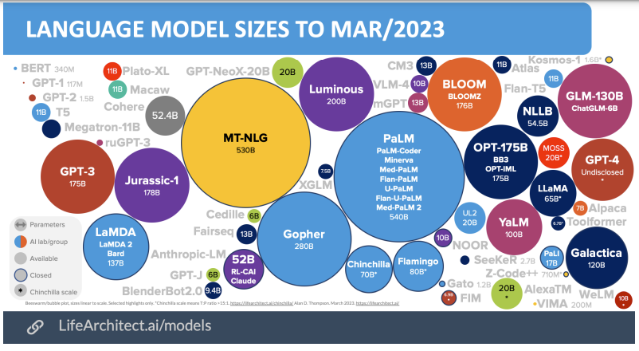

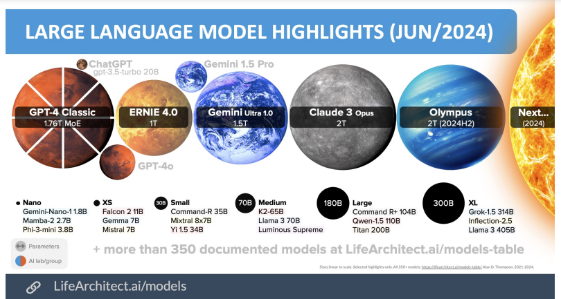

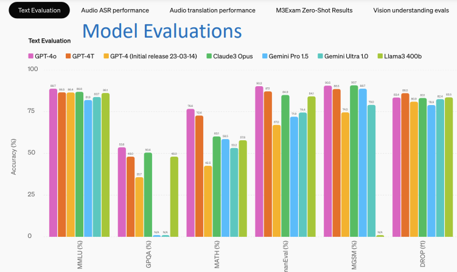

Generative AI 根据自然语言描述（称为 “提示”）生成数字图像而开发的机器学习模型

Outpainting by DALL-E

DragGan： 一款生成式人工智能编辑工具，用户可使用拖放界面轻松更改照片。

OpenAI 的 Sora 可根据文字说明创建逼真而富有想象力的场景

总结：

- 机器学习旨在赋予计算机从数据中学习的能力，而无需明确的编程。

- 监督学习使用一组（有标签的）训练数据来模拟输入和输出之间的关系（函数/映射），其中输入和目标输出都是已知的。
  
- 无监督学习是从输出（标签）未知的数据中发现潜在的模式或结构。
  
- 强化学习通过优化获得的奖励，确定在特定环境/任务下应采取的最佳行动或决策。
  
- 机器学习已经取得了最先进的性能，并实现了许多有用的应用。

- 目前正在开发生成式人工智能模型，用于创建音频、代码、图像和文本等内容。虽然它们提供了许多潜在的应用，但也引发了许多伦理问题

### Classification and Decision Trees

#### Classification

分类是根据对象的特征或属性，将其分配到预定义的类别中。

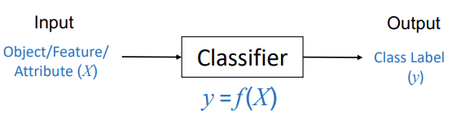

应用：垃圾邮件和非垃圾邮件分类、语音识别、图像分类、欺诈/合法信用卡交易等。

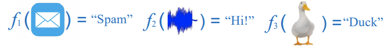

分类的两个主要步骤： 1) 基于训练数据集构建分类模型（分类器）的训练（学习）步骤；2) 使用分类器预测测试或新（未见）数据的类别标签的分类步骤。

分类模型通常是一个函数或映射，即 y = f(X)，它可以预测数据样本 X 的类别标签 y。所学模型应能很好地拟合训练数据。如果模型也能很好地预测测试（未见）数据的类别标签，那么它就具有很好的泛化能力。

Typical Classification Approach 

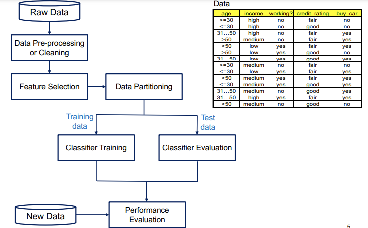

#### Data Samples and Attributes

数据样本 X 可以用 n 维属性向量 X={x1, x2,..., xn} 表示。数据样本也称为数据点、示例、对象、实例或图元。

每个样本 X 都属于一个预定义的类，由类标签 y 指定。类标签通常是离散值，且无序。

四种类型（见下一张幻灯片的表格）： - 名义类型和序数类型是分类和定性属性； - 间隔类型和比率类型是数值和定量属性。

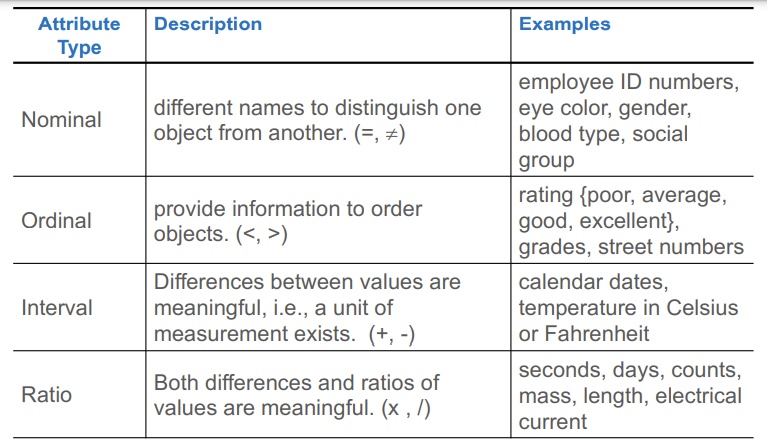

Classification Models

常用分类模型 - 决策树 - 基于规则的分类 - K-最近邻分类 - 支持向量机 - 神经网络 - 贝叶斯分类器 - 集合方法

#### Decision Trees

决策树具有类似流程图的树形结构，其中 每个节点（根节点和内部节点）表示对某个属性的测试；每个分支表示测试的结果；每个叶节点（终端节点）表示类别标签。最顶端的节点是根节点。

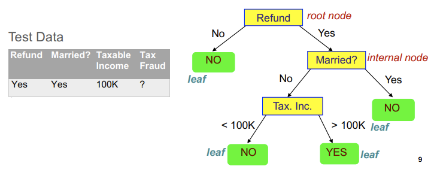

决策树通过对样本的属性提出一系列问题来对样本进行分类。在二叉决策树中，每个节点（叶节点除外）都会恰好分成另外两个节点。非二叉树允许每个节点分支成两个以上的节点

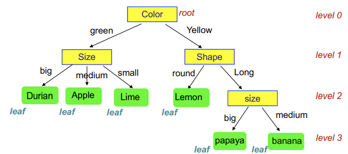

举例说明： 对某人是否受 COVID-19 影响进行分类。

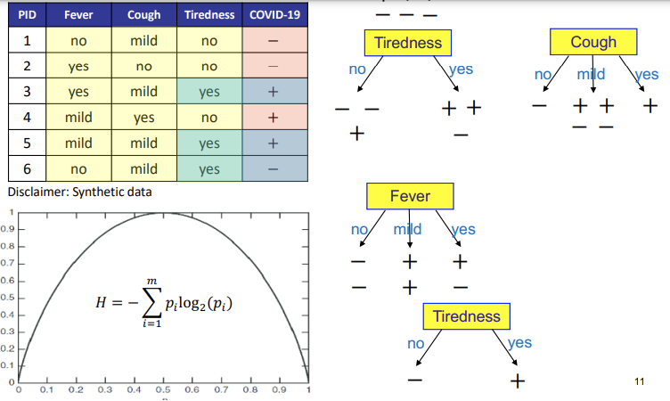

大多数决策树构建算法都采用自顶向下的方法，以带有类别标签的训练集（D）为基础。

在构建决策树时，训练集 D 会被递归分割成更小的子集。如果一个子集中的所有样本都属于同一类别，那么该节点就会成为标有该类别的叶子节点。否则，就会使用属性选择度量来确定哪个属性能最好地分离样本。

得分最高的属性被选为进一步分割数据的属性。对每个结果子集的处理过程都是递归的。

#### Attribute Selection Measures

常用的属性选择度量包括信息增益information gain、增益比gain ratio和基尼指数Gini index。

考虑一组训练样本 D，其类别标签有 m 个不同的值，表示 m 个不同的类别 ci（i = 1，...，m）。设 Ci,D 是 D 中 ci 类样本的集合。

Information Gain

ID3^ 算法使用信息增益作为属性选择的衡量标准。ID3 算法最大限度地减少分区结果中的信息量（熵/不确定性），以达到最小的随机性或 “不纯度”。

有 m 个不同类别的 D 中的信息量可定义为

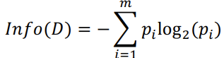

其中，m 是类别数，pi 是 D 中的样本属于类别 ci 的概率，计算公式为 |Ci,D| / |D|。

如果使用属性 A 将 D 分成 v 个子集 {D1、D2、......、Dv}，得到的信息是

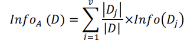

信息增益的定义是原始信息（分割前）与剩余信息（A 分割 D 后）之差： 

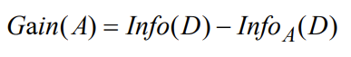

选择信息增益（Gain(A)）最高的属性 A 作为分割属性。

ID3 算法将递归应用于每个分区，直到所有样本都被唯一分类或不再可能获得更多信息增益。

Information Gain - Example

下面是一个医疗中心的病人数据集。主要关注点是病人是否感染了流感病毒（Flu）。

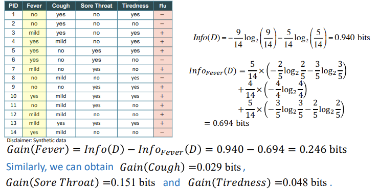

由于 “发烧 ”属性具有最高的信息增益，因此被选为分割属性。

使用 “发烧 ”属性分割病人数据集：

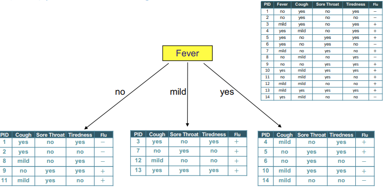

Gain Ratio

信息增益往往有利于多类测试。为了克服这一局限性，ID3 的后继者 C4.5^ 采用了增益比，即用 “分割信息 ”对信息增益进行归一化处理，其值为 

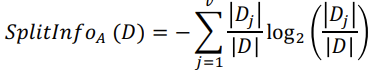

是将训练集 D 按属性 A 分成 v 个分区后产生的信息。

增益比定义为 

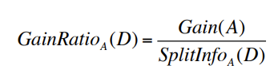

选择增益比最大的属性作为分割属性。

上例中，使用 “咳嗽 ”属性将病人数据集分割成三个部分（无、轻微和有）的增益比可以得到

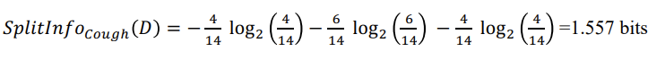

由于Gain = 0.029 bits ，我们有 

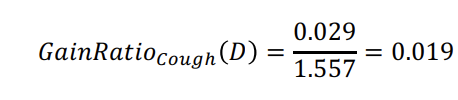

Gini Index

在 CART^ 中使用时，基尼指数衡量 D 的不纯度为

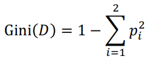

其中，pi 是 D 中样本属于 Ci 类别的概率，可计算为 |Ci,D| / |D|。

基尼指数考虑了每个属性的二元分割。
例如，如果按属性 A 进行二元分割，得到 D1 和 D2 分区，则基尼指数为

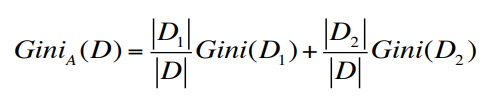

对于离散属性，选择基尼指数最小的属性作为分割属性。对于连续属性，考虑每个可能的分割点，将 D 分割为集合 D1（A ≤ 分割点）和集合 D2（A > 分割点）。选择基尼指数最小的分割点作为分割属性。基尼指数的降低可计算为

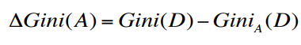

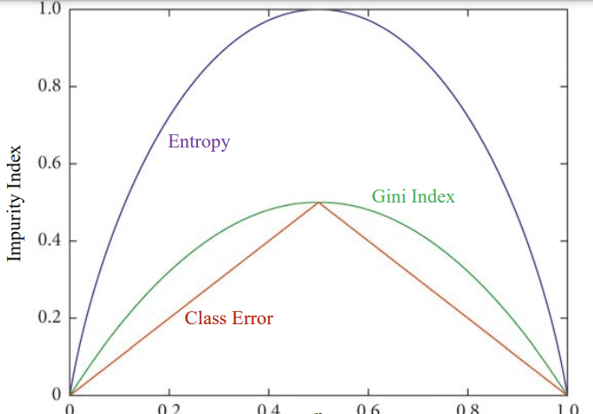

Tree Pruning

在实践中，训练数据集中的噪声或异常值可能会形成分支。树修剪可以解决这种过度拟合问题，方法是使用属性选择措施来评估分割的好坏，并删除不可靠的分支。

在预剪枝方法中，通过使用子集样本中最常出现的类别标记的叶节点来提前结束树的构建，从而对树进行剪枝。

在后修剪方法中，从 “完全生长 ”的树中移除子树。每个被移除的子树都会被一个叶节点取代，并标注该子树中最常出现的类别。

剪枝前后的决策树

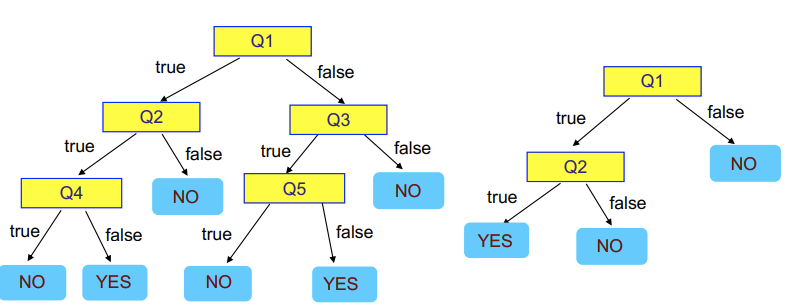

Advantages of Decision Trees

决策树的计算成本很低。一旦建立了决策树，对测试样本进行分类的速度相对较快，最坏情况下的复杂度为 O(w)，其中 w 是决策树的最大深度（层次）。易于解释。对噪声和冗余属性相当稳健。可避免过度拟合问题。不需要特定类型的属性概率分布。分类准确率可与其他方法相媲美。

Random Forests

随机森林是一种集合分类器，可利用多棵决策树的力量做出决策。

它由一组（集合）不相关的决策树组成，这些决策树是通过以下方法构建的 

特征随机性：每棵决策树都是由随机特征子集构建的。

分组（自举法聚合）：每棵决策树都是在训练集中的不同样本（替换）上进行训练的。

随机森林将单个决策树的输出结合起来，通过多数票（群众的智慧）产生最终输出。- 随机森林比决策树更准确，能有效处理缺失数据，并减少过度拟合的问题。

#### Classifier Performance Measures

分类器的性能可以通过测量其在测试集上的准确率来评估，测试集由训练过程中未使用的数据组成。

考虑两类样本。假设 P 是阳性样本（相关类别的样本）的数量，N 是阴性样本（所有其他样本）的数量。

定义 

- 真阳性（TP）：分类器正确标记的阳性样本数。
  
- 真阴性 (TN)：分类器正确标注的阴性样本数。
  
- 假阳性 (FP)：被分类器错误标记为阳性的阴性样本数。
  
- 假阴性 (FN)：被分类器错误标记为阴性的阳性样本数。

这些术语可归纳为以下混淆矩阵：

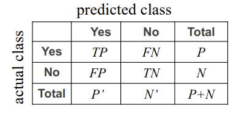

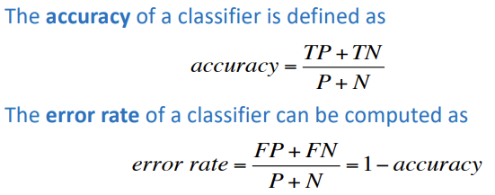

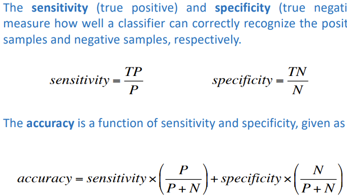

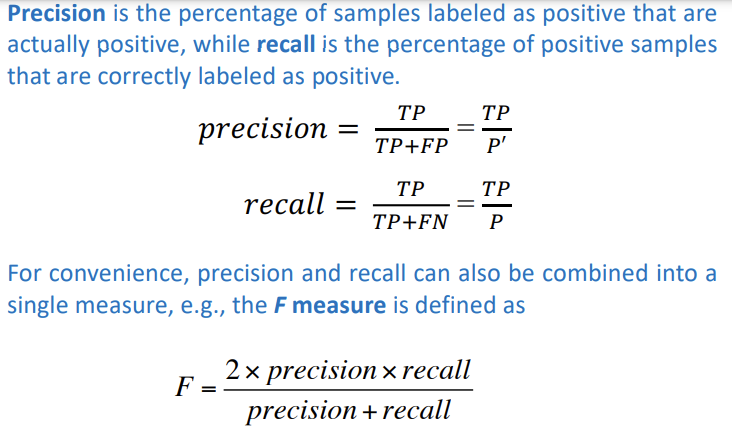

接收者工作特征曲线下面积（AUC）用于衡量不同阈值设置下的分类性能。

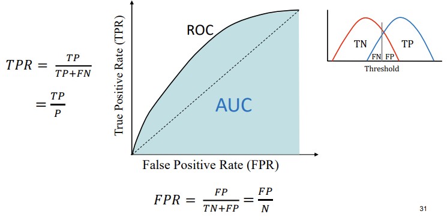

下面是一个医疗数据集的混淆矩阵，其中流感病毒的类别值为是和否。

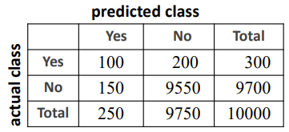

可获得以下性能指标

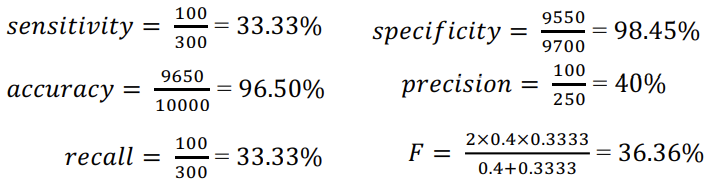

分类器的性能还可从以下几个方面进行评估： 

- 速度Speed：生成和应用分类器所需的计算成本。
  
- 鲁棒性Robustness：分类器对噪声数据或缺失值数据做出正确预测的能力。
  
- 可扩展性Scalability：在大量数据的情况下高效构建分类器的能力。
  
- 可解释性Interpretability：分类器可提供的理解和洞察程度。

为了评估分类器的准确性，我们可以使用以下方法将数据分为训练集和测试集： 

- The Handout Method： 将数据随机分成两个独立的集，即训练集和测试集。通常，三分之二的数据构成训练集，剩下的三分之一构成测试集。训练集用于学习分类器，然后通过测试集评估分类器的准确性。

- Cross-Validation： 在 k 倍交叉验证中，数据被随机划分为 k 个互斥的子集，称为 “折叠”，即 D1、D2......、Dk，每个子集的大小大致相同。训练和测试各进行 k 次。在每次迭代 i 中，保留分区 Di 作为测试集，其余分区共同用于学习分类器

- Leave-one-out： 只留一个样本是 k 倍交叉验证的一种特殊情况，即每次只留一个样本进行测试。

总结：

分类包括训练模型来预测数据的类别。四种类型的属性：名义、顺序、区间和比率。决策树通过提出一系列有关属性的问题对对象进行分类。属性选择措施用于选择最佳属性，将数据样本分成子集。分类器的构建和评估需要将标注数据集划分为训练集和测试集，前者用于学习分类器，后者用于估算所学分类器的性能。许多性能指标都可以用来评估分类器。

### Nearest Neighbor Classifiers and Support Vector Machines

#### Nearest Neighbor Classifiers

为每个测试样本指定最接近训练样本的类别标签。需要一种测量方法来评估两个样本之间的相似性（或不相似性/距离）。需要最少的训练，但需要存储所有训练样本（及其标签），并需要大量的分类计算。

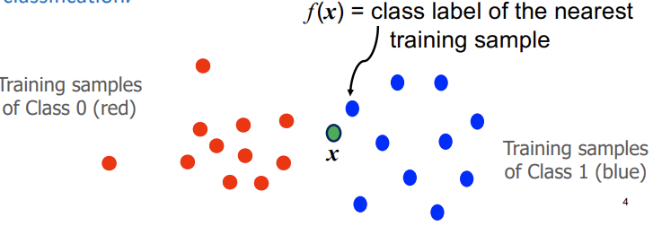

K-Nearest Neighbor Classifiers

为了对噪声样本或复杂的分类问题保持稳健，可对最接近的训练样本的类别标签进行多数票分配。

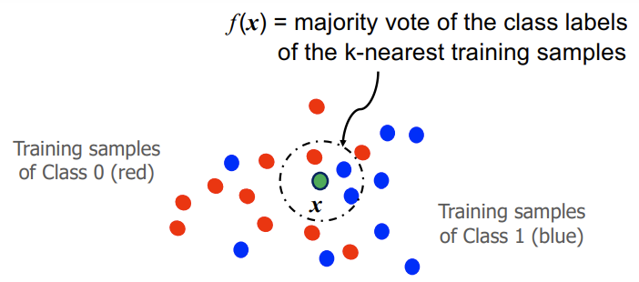

• Dissimilarity Measures

距离通常用于测量两个数据样本或属性之间的差异。 nd 维空间中两个数据点 x 和 y 之间的闵科夫斯基距离定义为 

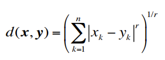

其中，r 是一个参数，xk 和 yk 分别是 x 和 y 的第 k 个分量（属性）。

当 r = 1 时，d(x, y) 被称为城市街区（曼哈顿、出租车或 L1 规范）city block (Manhattan,taxicab, or L1 norm)距离： 

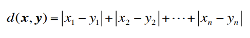

当 r = 2 时，d(x, y) 是欧氏距离

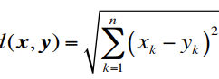

当 r = ∞ 时，d(x, y) 是超距（Lmax 或 L∞ norm）距离，即 x 和 y 的任何相应属性之间的最大差值。

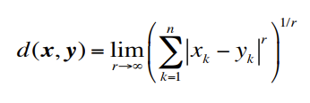

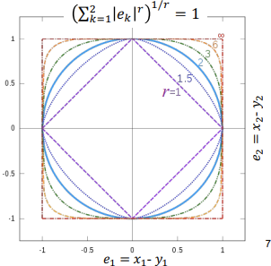

当 r ≥ 1 时，闵科夫斯基距离具有这些有用的特性： 

1) 正性Positivity a) 对于所有 x 和 y，d(x, y) ≥ 0 b) 只有当 x = y 时，d(x, y) = 0 

2) 对称性Symmetry 对于所有 x 和 y，d(x, y) = d(y, x) 
   
3) 三角不等式Triangle Inequality 对于所有 x、y 和 z，d(x, z) ≤ d(x, y)+d(y, z)。

满足上述三个性质的度量称为metrics。有些度量不满足其中一个或多个度量性质。

余弦相似性Cosine similarity通常用于测量文档相似性，文档通常用向量表示，每个属性表示文档中出现特定术语（单词）的频率。两个属性向量 x 和 y 的余弦相似度定义为

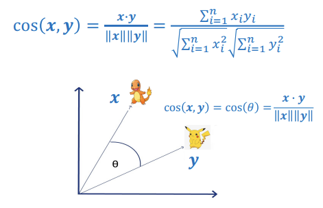

K-Nearest Neighbor Classifiers

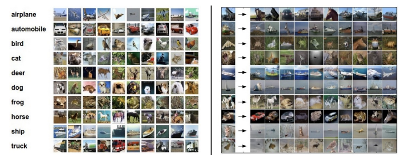

左图：CIFAR-10 数据集中的图像样本（60,000 幅 32x32 像素的图像；10 个等级）。

右图：测试图像样本及其在训练集中的前 10 个近邻（根据像素差异）。

#### Support Vector Machines(SVMs)

支持向量机（SVM）是一种有监督的机器学习模型，已取得了可喜的成果。基本的 SVM 是一种二元分类器，通过它，两个类别的样本被一个超平面（例如：..、

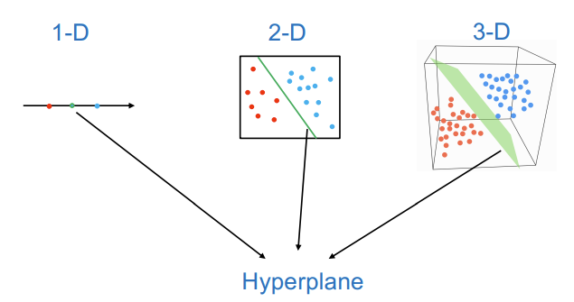

#### Maximum Margin Hyperplanes

许多超平面可以将训练样本分为不同的类别，但它们在未见样本上的表现可能不尽相同。

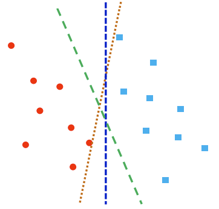

每个决策边界 Di'都与一对超平面 di1'（和 di2'）相关联，它们之间的距离被定义为分类器的边际值。

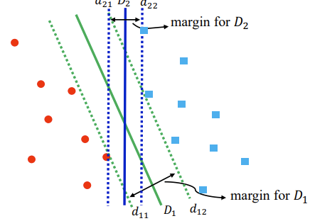

SVM 选择最大边际超平面作为分类器的决策边界。在上面的例子中， D1 就是最大边际超平面。

SVM: Linear Decision Boundary

考虑 N 个训练样本。每个样本用（xi'，y1'）表示，其中yi'∈-1,1 是类标签。线性分类器的决策边界可以写成

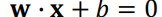

其中 w 和 b 是模型的参数

样本xi'的类别标签yi'可通过以下方式获得 

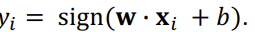

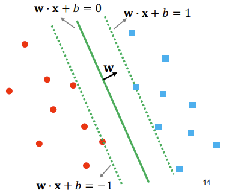

位于决策边界的样本必须满足公式 (1)，例如，如果 x1 和 x2 是位于决策边界的两个样本，则

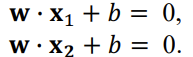

将上述两个等式相减就得出了结果： 

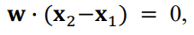

其中 x2 - x1 是一个平行于决策边界的向量。由于上述点积为零，因此 w 的方向必须垂直于决策边界。

如果 xa 位于决策边界之上，而 xc 位于决策边界之下，那么我们有

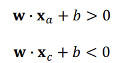

将所有正方形标记为 “+1 类”，将所有圆形标记为“-1 类”；任何测试实例 z 的标记都可以通过以下方式预测： 

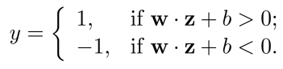

SVM: Margin

假设平行于决策边界并穿过两个最近样本的两个超平面的距离为

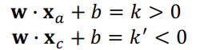

我们可以调整参数 w 和 b 的比例，将两个超平面表示为

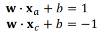

边际值 d 的计算公式为

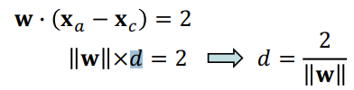

样本 xa 和 xc 被称为支持向量。

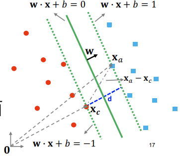

Linear SVM Model

SVM 通过学习决策边界的参数 w 和 b 来满足所有训练样本的要求，具体如下：
 
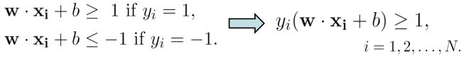

此外，决策边界的边际值 d 必须最大：

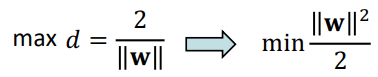

SVM 可以通过标准拉格朗日乘法求解以下约束优化问题来学习。

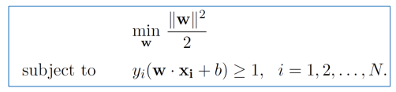

#### SVM for Non-separable Cases

考虑两个新样本 P 和 N。

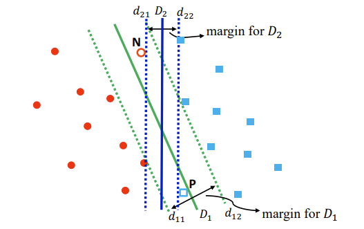

虽然边界D1( 的边际值大于边界D2) 的边际值，但边界D2 的训练误差为零；哪个决策边界更好？

软边际方法： 为了在边际宽度和训练误差之间进行权衡，可以学习一个允许较小训练误差的决策边界。随着新的训练样本 P 和 N 的出现，决策边界不再满足原有的约束条件： 

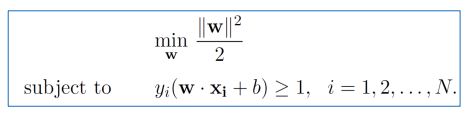

可以通过使用松弛变量 ξi > 1 来放松不等式约束，以适应偏差：

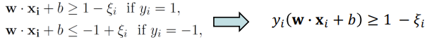

对于不可分离的情况，SVM 学习可表述为以下带有松弛变量的约束优化问题：

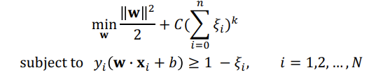

对于不可分离的情况，SVM 学习可以选择参数 C 和 k，以便对训练样本的错误分类进行惩罚。

约束优化问题可通过提出拉格朗日对偶优化问题来解决，这与可分离情况下的问题类似。

测试阶段： 测试样本的标签同样可以预测为 sign(wx+b)：

#### SVM for Multiple Classes

基本 SVM 只能区分两个类别。- 使用 SVM 对 k 个类别进行分类： 

(1) 一个人对抗其他人：

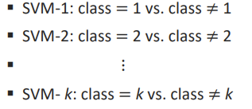

使用所有 k 个分类器对测试样本进行评估，如果 SVM-i 的决策函数值最高，则将其标记为第 i 类。

(2) 一对一： 

使用上述分类器对测试样本进行评估，如果 i 类得票最高，则将其标记为 i 类

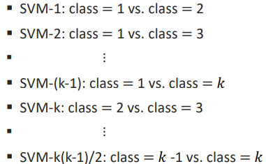

总结：

近邻分类器将最近的训练样本的类别标签分配给测试样本。它需要衡量两个样本之间的相似性/不相似性。它只需要最少的训练，但需要存储所有训练样本及其标签，并需要大量的分类计算。SVM 通过最大化两个超平面之间的边际来学习二元分类的决策边界。SVM 采用软边际方法来学习决策边界，可以容忍较小的训练误差。对于可分和不可分的情况，SVM 的学习都可以通过提出拉格朗日对偶优化问题来解决。SVM 可以扩展到多类分类。

### Neural Networks

#### Neural Networks

神经网络旨在模仿生物神经系统的功能，以解决分类问题。

人脑主要由神经元（约 1011 个）组成，神经元通过轴突和树突相互连接。轴突和树突之间的接触点称为突触（~1015）。在脉冲的反复刺激下，大脑通过改变神经元之间的突触连接进行学习。

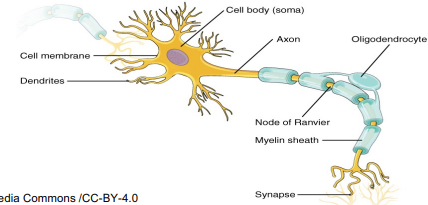

#### Multilayer Perceptrons

感知器可以接收输入 x1、x2......、xn，并通过比较加权X和与某个阈值 b，产生输出值 y（类别），即 0 或 1。

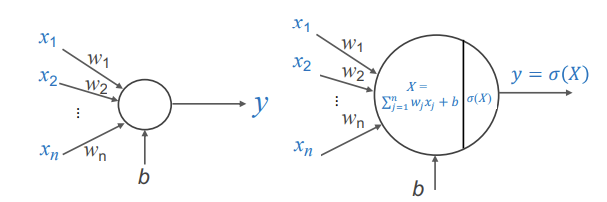

感知器的输出可表示如下

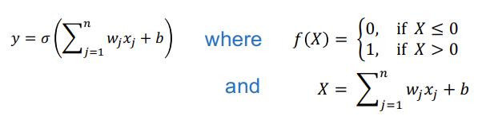

感知器模型可以用更简洁的形式表达： 

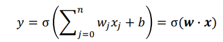

其中，x0=1，w0= b，wx 是权重向量 w 与输入向量 x 的点积。

感知器的决策边界可通过设置 wx = 0 得到，它是一个超平面，将输入分为 0 和 1 两类。因此，感知器可以充当线性分类器。

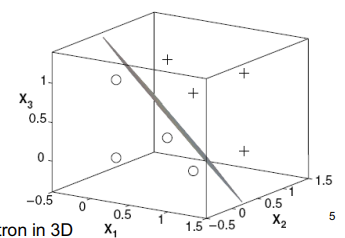

线性可分类示例

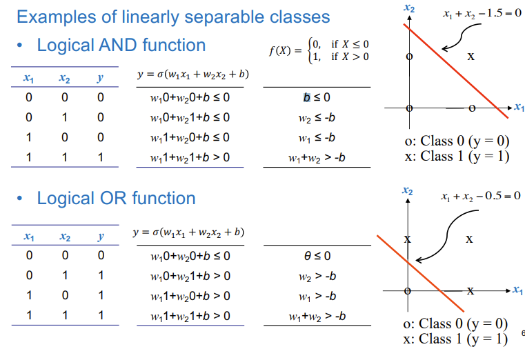

线性不可分割类举例

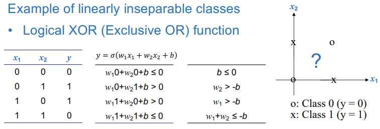

逻辑 XOR 函数可通过使用多个感知器来构建

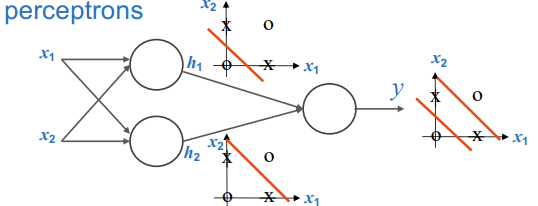

Neural Networks

神经网络是一组相互连接的感知器。多层感知器（MLP）是一种由多层感知器组成的前馈神经网络，如下图所示。

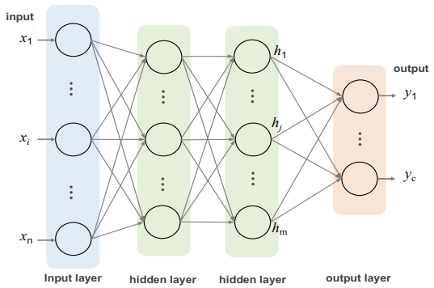

MLP 通常由一个输入层、一个或多个隐藏层和一个输出层组成，各层之间由权重可调的链接连接。隐层和输出层中的每个感知器单元将前一层单元输出的加权和作为输入，加上偏置bias，然后将净输入应用于与单元相关的激活函数activation function。

利用非线性激活函数和足够多的隐藏层/单元及训练样本，MLP 可以近似任何分类函数。这使得 MLP 成为通用近似器universal approximators。

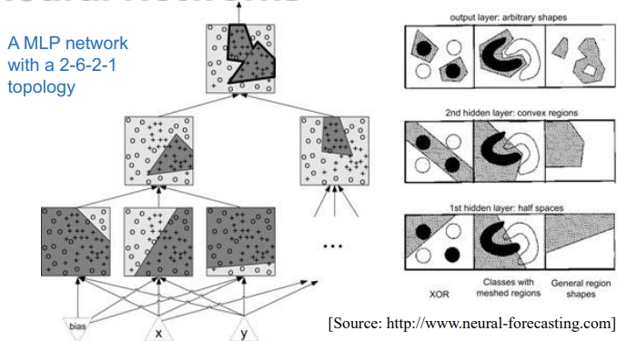

具有三层的 MLP 可以逼近任何有界函数。第一隐层的单元形成超平面，将输入空间划分为半空间。第二隐层的单元将超平面组合成凸区域。然后，输出单元将这些凸区域合并成任意形状的区域，这些区域可以是凸的，也可以是非凸的，甚至是不相连的。

#### Activation Functions

常用激活函数 

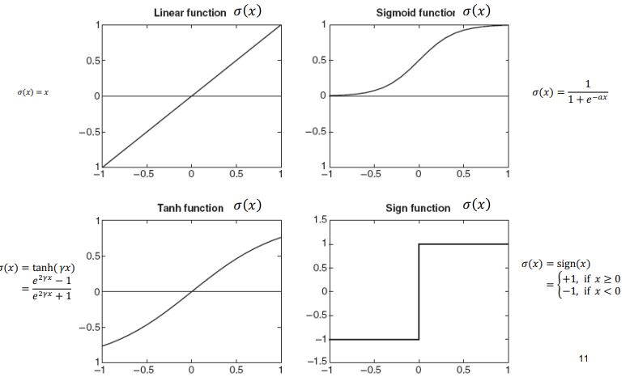

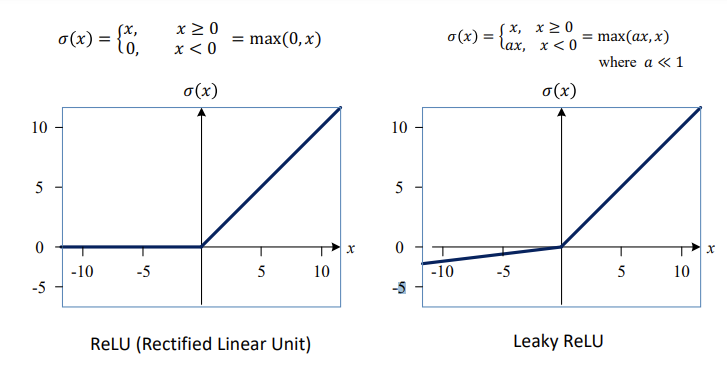

#### Backpropagation Algorithm

反向传播可以学习 MLP 的权重和偏置。其工作原理是迭代处理一组训练样本，将每个样本的预测结果与目标输出进行比较，目标输出可以是类别标签（用于分类任务）或连续值（用于回归任务）。

该算法通过调整权重来最小化误差（成本/损失）函数，该函数用于测量网络预测值与目标输出值之间的差值。调整以 “后向 ”方向进行，从输出层开始，通过隐藏层移动到第一隐藏层（因此称为反向传播）。

并不能保证权重最终会收敛以结束学习过程。

Gradient Descent

梯度下降是一种迭代优化算法，用于寻找函数的最小值。

它通常用于机器学习，通过迭代更新参数（或权重）来最小化误差/成本/损失函数J(w)的陡坡下降方向，而陡坡下降方向是由局部梯度的负值（与参数有关）决定的。

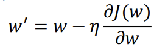

学习率η是一个超参数，它决定了每次迭代时更新的大小。选择最佳学习率是一项挑战。因此，随机梯度下降和自适应学习率等技术常常被用来改善优化效果。

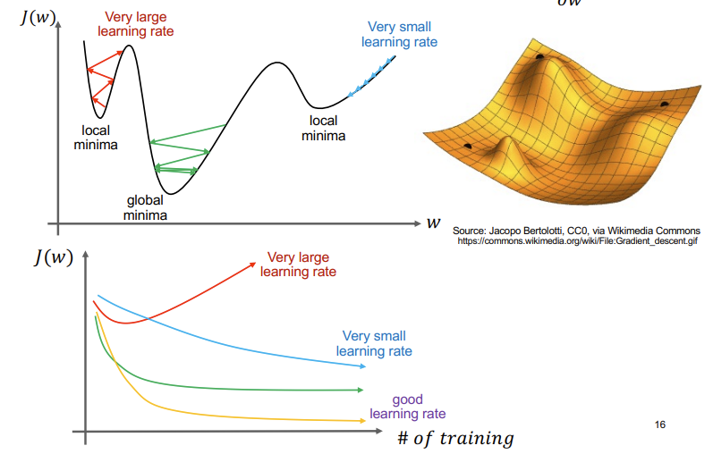

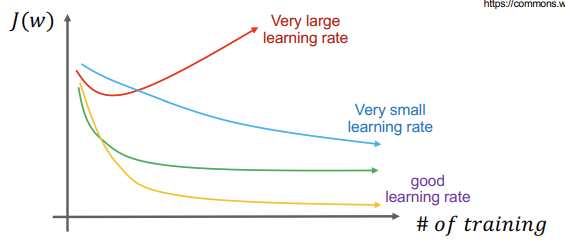

考虑使用梯度下降的反向传播法来最小化平方误差之和（损失函数）：

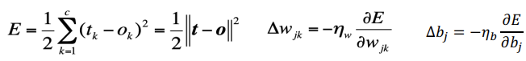

其中，t 和 o 分别为目标矢量和网络输出矢量

反向传播算法的关键步骤是

1) 初始化所有权重和偏置。

2) 将输入向前传播，并计算每个输出和隐藏单元的净输入 netj 和输出 oj。

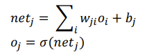

其中，σ(x) 是激活函数

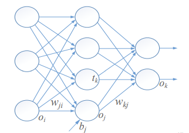

3) 通过更新每个输出和隐藏单元的误差，向后传播误差。

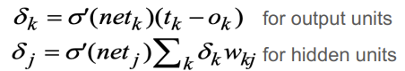

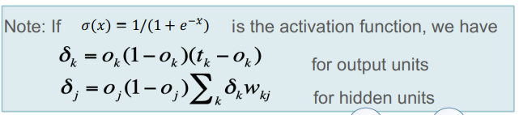

4) 更新权重和偏差，具体如下

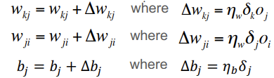

其中，ηw 和 ηb 是学习率。

重复步骤 (2) 至 (4)，直至满足终止条件，例如误差函数值低于预定义阈值。所有更新都小于某个预定阈值。达到预定的更新总数。

权重和偏置可以通过不同的方式进行更新：个案更新： 在提交每个数据样本后进行更新。历时更新： 增量是累积的，只有在训练集中的所有样本都呈现后才进行更新。随机梯度下降： 随机选择少量数据样本进行更新。

重复这一过程，直到使用完训练集中的所有样本。

例：

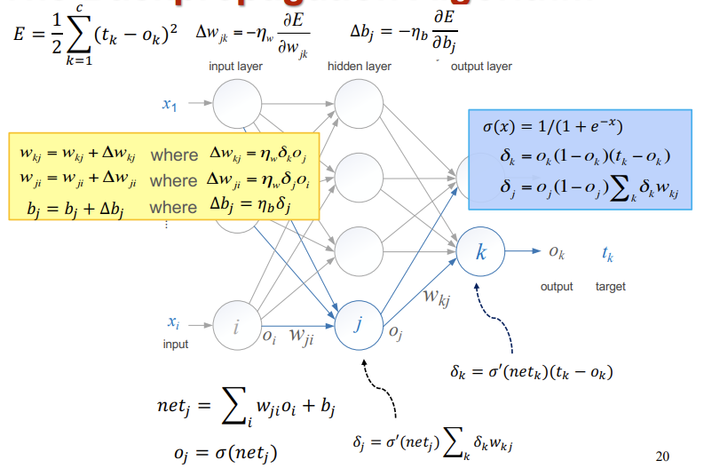

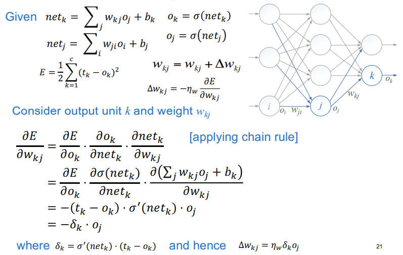

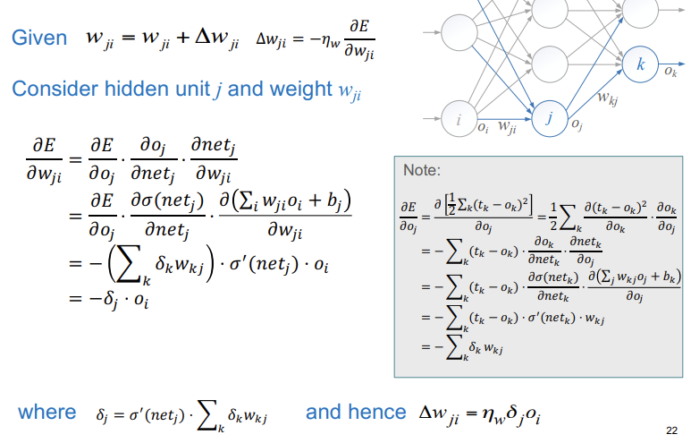

请看下面的 MLP。表中给出了训练样本 x=（1,0,1）（类标签为 1）、初始权重和偏差。假设学习率为 0.9。

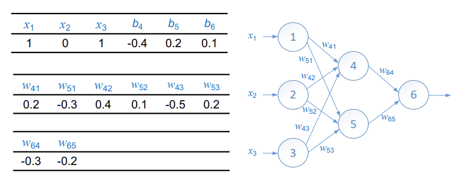

给定训练样本 x=(1,0,1)，每个单元的净输入和输出计算公式为

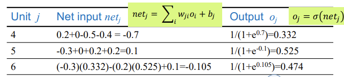

每个单元的误差可求得

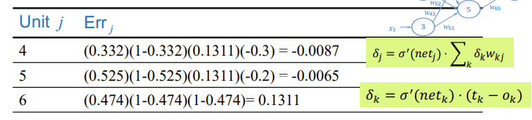

权重和偏差可更新为

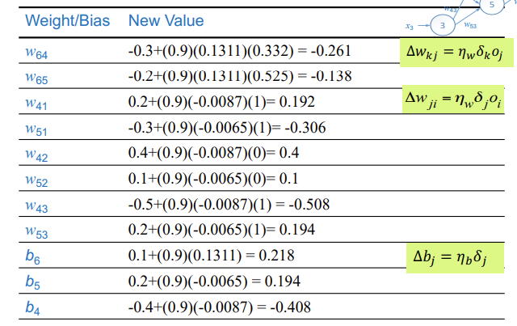

• Convolutional Neural Networks

在全连接神经网络中，神经元之间的每个连接都有一个相关的权重。这种全连接神经网络无法有效扩展图像数据。

例如，考虑一幅大小为 200x200x3 的图像（即 200（宽）x 200（高）像素，每个像素有 3 个颜色通道）。一个有 10 个神经元的全连接层以这些像素为输入，总共有 200x200x3x10 =1,200,000 个权值。

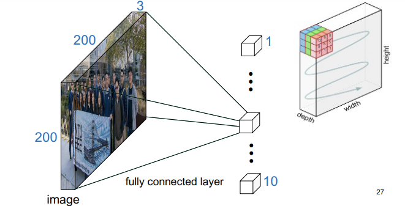

过多的参数可能会导致过度拟合问题。

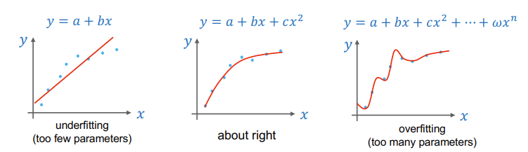

过多的参数可能会导致所学模型与训练数据拟合得很好，但却无法泛化到新的样本（测试数据）。

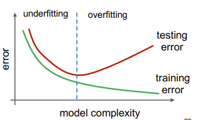

卷积神经网络（CNN 或 ConvNet）是多层感知器（MLP）的一种专门（或简化）形式，其权重通过卷积滤波器共享。

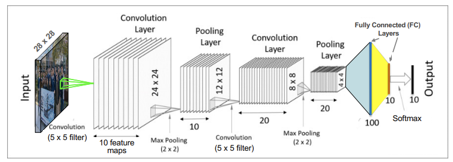

通常，具有三层以上的神经网络被称为深度学习网络。

Convolution Demo

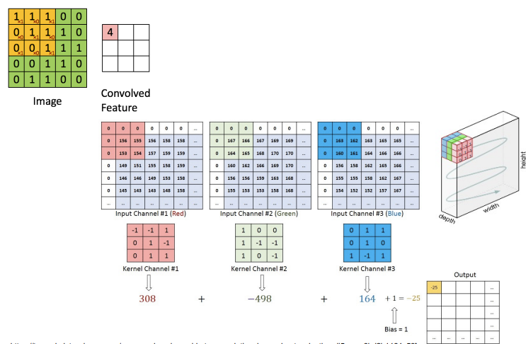

共享权重 w 被称为滤波器filters或内核kernels。卷积层的输出称为特征图feature maps或激活图activation maps。

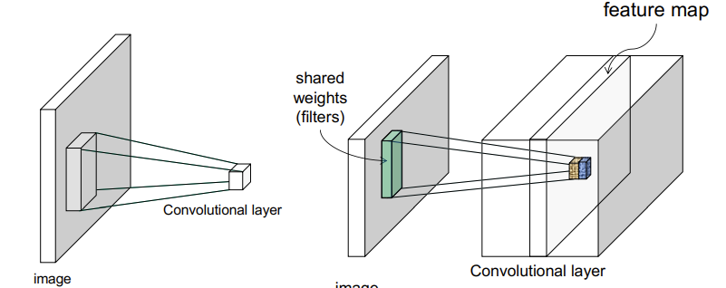

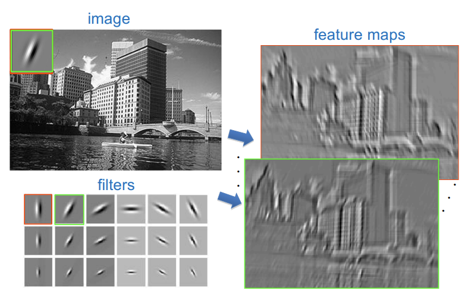

每个卷积层（或特征图）都是通过对输入数据的一个子集应用一组相同的权重（滤波器）而生成的。每个卷积层中的特征图数量与所用滤波器的数量相对应。每个特征图的大小取决于滤波器的大小和其他操作，如跨距、零填充和池化。与一般神经网络相比，CNN 能有效减少参数（权重）的数量。

步长Stride控制滤波器如何卷积和移动输入，以减小输出的大小。

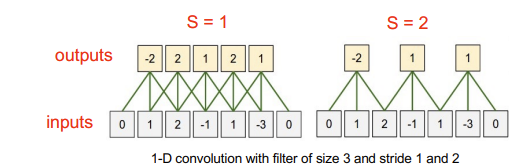

零填充（Zero padding）在输入的边界周围填充零，以调整输入和输出的大小

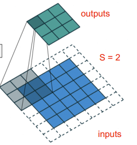

池化Pooling是一种降采样操作，可减少输出量的空间维度。它有助于减少参数数量、计算要求和过度拟合。最大池化是最常用的方法。其他选项包括平均池化和 L2 正态池化。

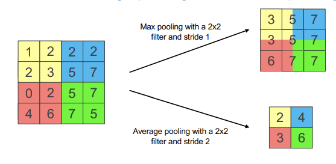

正则化Regularization用于防止神经网络过度拟合训练数据集。这可以通过在原始代价函数J(w)中添加惩罚项R(w)来实现。这种惩罚抑制了较大的权重值，有助于防止过度拟合：

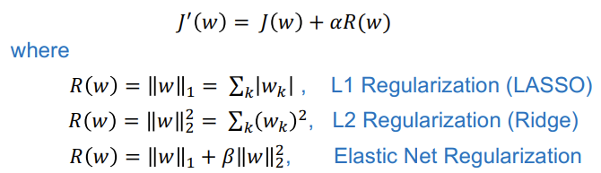

当验证误差达到或开始增加时，还可以提前停止训练过程early stopping，从而实现正规化。

卷积层可以看作是在宽度、高度和深度三个维度上组织起来的神经元。

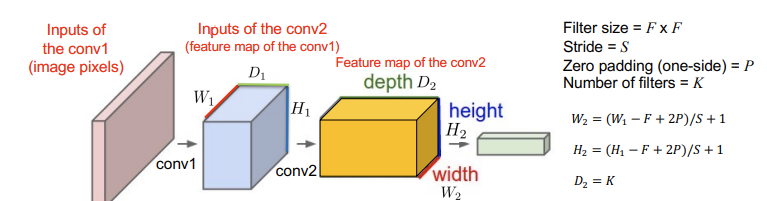

例如，如果 conv2 对输入体积应用 K 个核，并沿深度维度堆叠这些特征图，那么输出体积的深度将为D2 = K

输入图像也可以有深度维度。例如，CIFAR-10 的输入图像尺寸分别为 32x32x3（宽度、高度和深度）。

Famous ConvNets

LeNet-5 (1998)

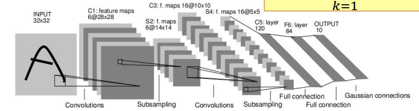

Yann LeCunn 开发的卷积网络首次成功应用于读取邮政编码和数字等任务。

2 个卷积层（带平均池）+ 3 个全连接层，带 sigmoid 或 tanh 激活函数。输出层使用 Softmax 函数进行分类：

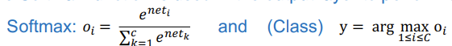

ImageNet 大规模视觉识别挑战赛（ILSVRC）。分类任务包括 120 万张训练集图像，每张图像都标有 1000 个类别中的一个类别，这些类别涵盖各种物体、动物和场景。100,000 张测试集图像与数据集一起发布，但为了防止参赛队对测试集过度拟合，标签被隐藏起来。每个参赛团队预测 5 个类别（1000 个类别中的 5 个），如果 5 个预测中至少有一个是基本事实，则图像被正确分类。

AlexNet (2012)

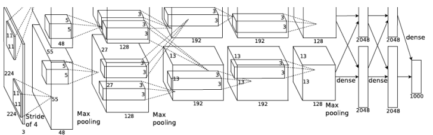

与 LeNet 框架相似。七个隐藏层和 6000 万个参数。使用 ReLU 激活函数进行最大池化。在两台 GPU 上训练一周

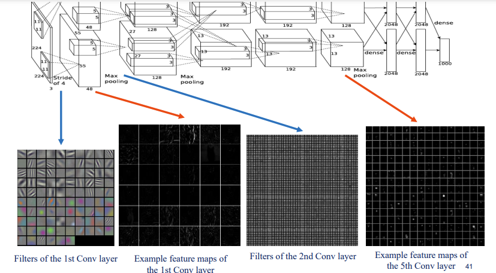

什么让 CNN Layers 感到兴奋？

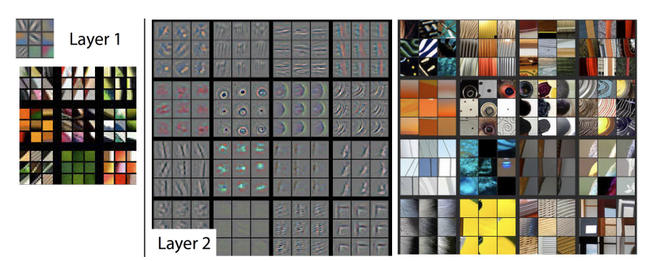

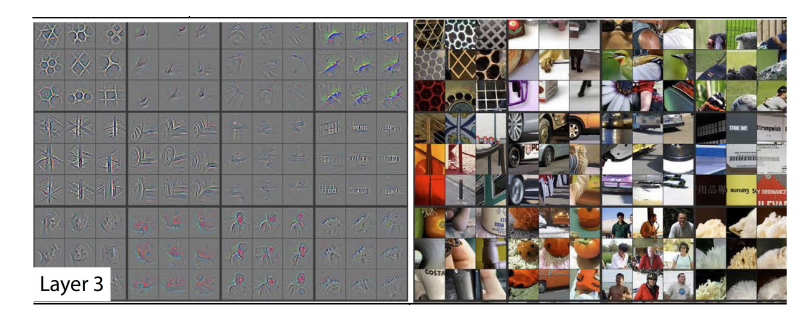

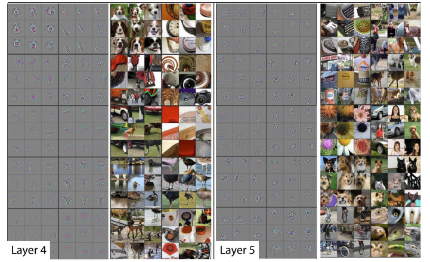

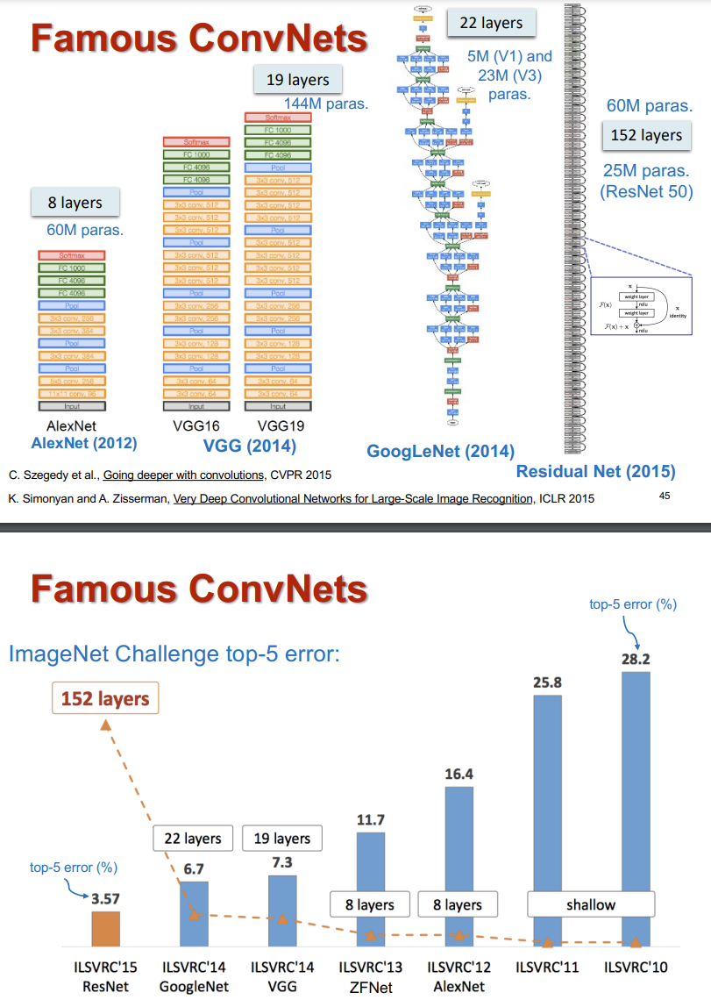

#### Recurrent Neural Networks

递归神经网络 (RNN) 设计用于处理文本、语音、时间序列数据和生物序列等序列数据。RNN 可以有不同数量的层，每一层根据其特定的时间步处理输入。RNN 中的每一层都使用相同的网络参数集，层结构在各时间步中重复。这些参数是跨时间共享的。

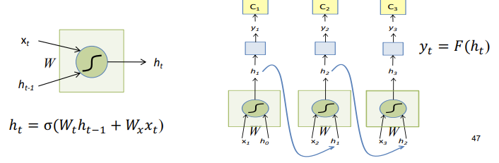

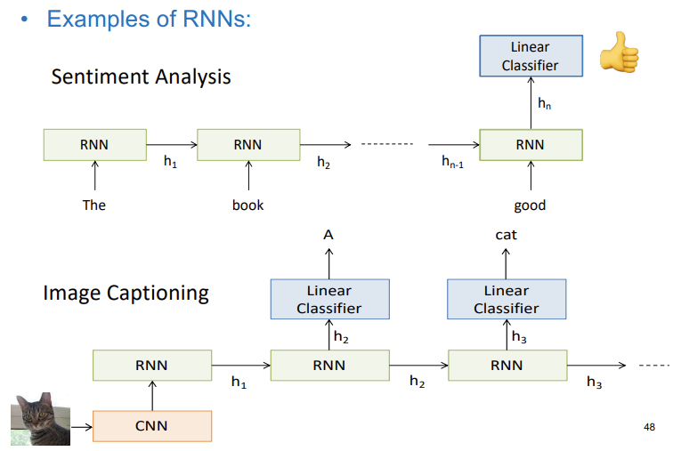

#### Autoencoders

自动编码器将输入数据编码为潜在空间表示法，并根据该表示法重建输入数据（有一些变化）。

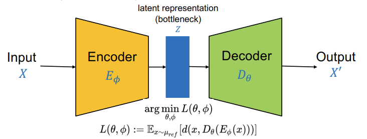

人们设计了不同类型的自动编码器，用于数据压缩、还原（图像内绘、去噪、超分辨率）、分类、检测、分割、生成、翻译、总结等。

Applications of Autoencoders

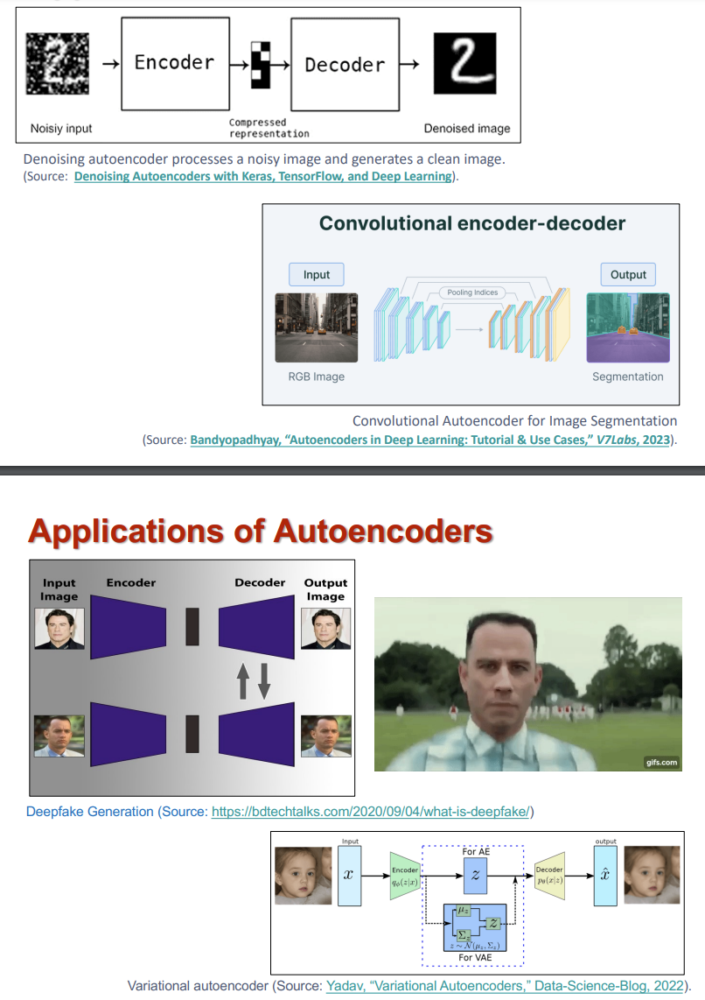

#### Generative Adversarial Networks(GANs)

GAN 可以生成与训练数据非常相似的高质量样本（如图像）。

生成器网络 G 生成逼真的样本。判别网络 D 确定样本是来自训练集（真实样本）还是生成器网络（虚假样本）。

这两个网络在生成器参数的作用下目标函数最小化，在判别器参数的作用下目标函数最大化，以此反复训练：

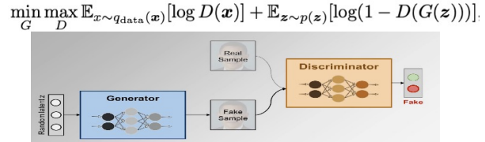

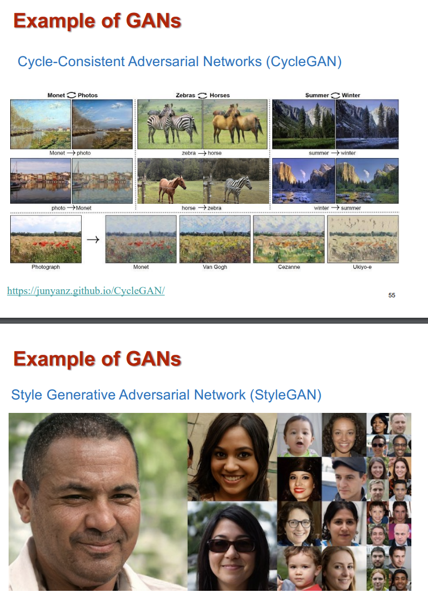

#### Transformers

编码器处理输入序列并将其转换为矢量化表示。解码器处理输入序列的整个矢量化表示，并逐个元素生成输出序列。

多头注意模块使用自我注意机制--利用查询 Q、关键字 K 和值 V 以及它们之间的交互作用--来发现元素之间的关系，并确定每个元素对输入序列意义的贡献。

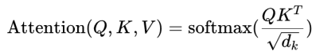

定位编码提供输入元素的相对位置信息，并将这些信息纳入处理过程。

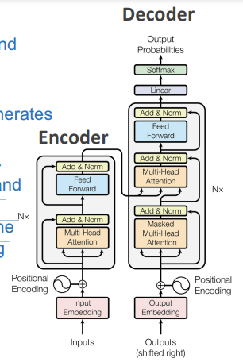

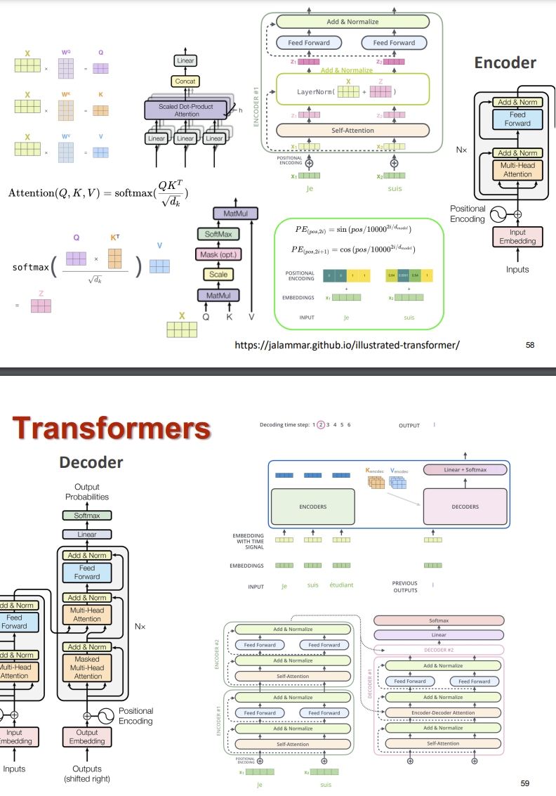

Diffusion Models

扩散模型，如 DALLE-2、Imagen 和稳定扩散模型，可用于通过提示生成各种高分辨率图像。

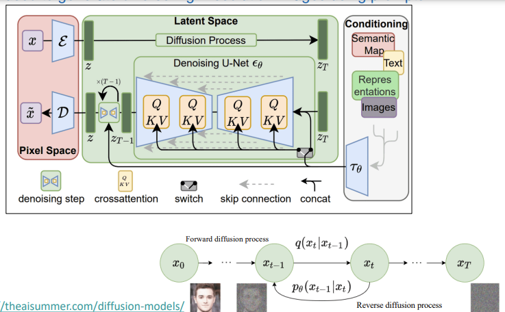

总结

感知器是一种线性分类器，其决策边界由超平面定义。多层感知器（MLP）可近似任何分类函数。- 卷积神经网络（CNN）专为图像分析任务而设计。- 递归神经网络（RNN）适用于处理连续数据，如语音和动作识别。- 自动编码器可将输入数据编码到潜在空间表示中，并根据该表示重建输入数据（有一定的变化）。- 生成对抗网络（GAN）通过优化两个网络之间的相互作用来创建高质量的数据样本。- 变形网络使用自我注意机制，与 RNN 模型相比，通常需要更少的训练时间。它促成了许多大型语言模型（LLM）的开发，包括 ChatGPT。

## 第三部分

### Unsupervised Learning - Clustering & Regression

#### Clustering

##### Concept of Clustering

From classification to clustering

如果我们没有标签呢？哪些像素组成花朵？

需要找到数据内在结构/同组内的相似性

聚类是（典型的）无监督学习： 无监督学习：自组织学习，有助于发现数据集中的未知模式，而无需预先存在标签

聚类： 给定一组数据样本，目标是对数据进行分组/组织，使同组数据之间的相似度高于其他组数据。

聚类Cluster：一组彼此相似的数据。

无监督学习：自组织学习，有助于发现数据集中的未知模式，而无需预先存在标签。

分类是有监督的： - 在训练中提供类标签。- 学习分类器来预测未见数据的类标签。

聚类是无监督的： - 不提供预先存在的标签。- 了解基础数据的结构/组织。

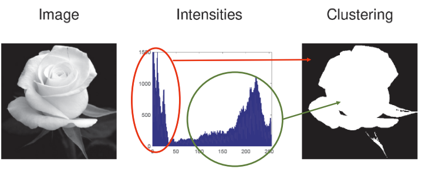

##### Distance Metrics

给定一组 N 个数据样本/点 {𝒙1 , 𝒙2 , ... , 𝒙𝑖 , ... 𝒙𝑁} ，我们要对其进行聚类。

假定每个数据样本都是一个 d 维向量，我们将其写成列向量： 

我们将任意两个数据样本 𝒙𝑖 和 𝒙𝑗 之间的距离定义为

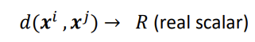

距离度量是满足以下条件的 (𝑅𝑑 × 𝑅𝑑) → 𝑅 的函数：

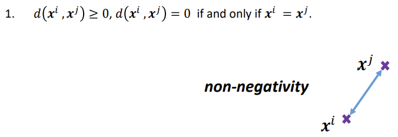

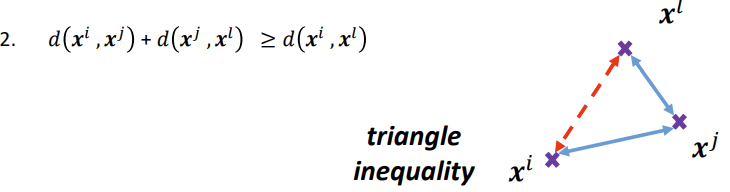

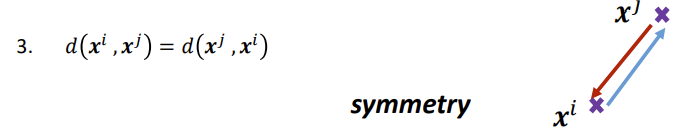

Example of distances:

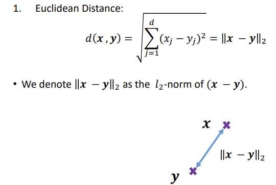

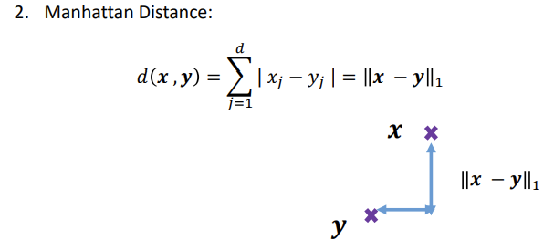

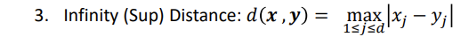

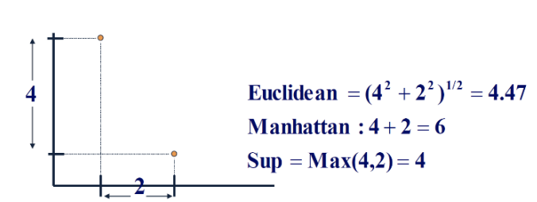

Clustering Algorithms

- 划分算法 - K-Means - 高斯混合 - 光谱聚类 
  
- 层次算法 - 聚合 - 分裂

• Partition Algorithm分区算法

将数据样本聚类为不重叠的子集（群组）。每个数据样本正好在一个群组中。

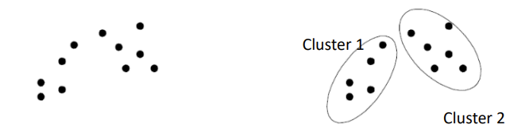

• Hierarchical Algorithm

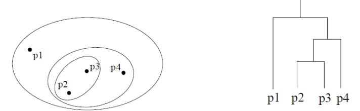

一组嵌套的群组，组织成一棵分层树。

##### K-Means

距离度量：通常，我们使用欧氏距离

聚类中心/中心点： 𝜇𝑘 = 属于该聚类的数据点的平均值。、

分割数据点： 每个数据点只属于一个群集。

初始化：随机选取 K 个点作为聚类中心 𝜇𝑘 。

在以下步骤 1 和 2 之间迭代： 

1. 根据给定的距离度量，将每个数据点 𝒙𝑖 分配到最近的聚类中心，即找到 𝜇𝑘 ，使 𝑑 (𝒙𝑖 , 𝜇𝑘) 最小。
  
2. 更新聚类中心 𝜇𝑘 为其分配数据点的平均值。

停止标准：当积分分配没有变化时。

K-Means Example 1

假设我们的任务是将二维空间中的以下八个点聚类为 K = 3 个聚类： 
a1(2,10)、a2(2,5)、a3(8,4)、b1(5,8)、b2(7,5)、b3(6,4)、c1(1,2)、c2(4,9)。

距离函数为欧氏距离。

假设最初我们分别指定 A1、B1 和 C1 为每个聚类的中心。

应用 K 均值估计最终的三个聚类

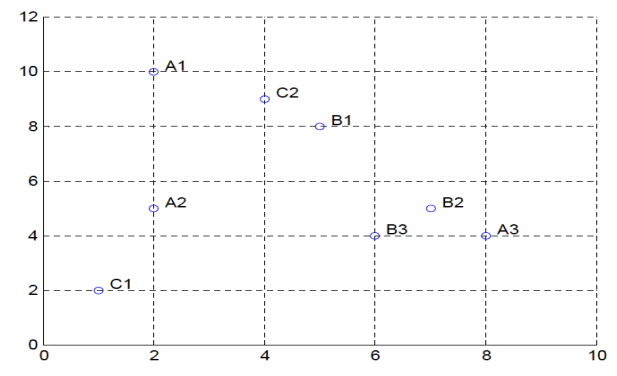

给定三个初始聚类中心 A1、B1 和 C1。

步骤 1：通过计算数据点与中心的距离（即下图矩阵中黄色高亮列的距离），确定哪个数据点属于哪个聚类：

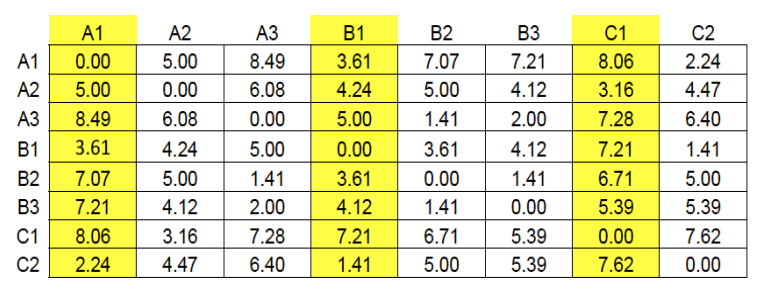

Cluster 1={A1}, Cluster 2={B1, B2, B3, A3, C2}, Cluster 3={A2, C1}

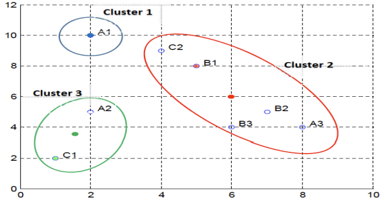

步骤 2：第一轮迭代后的聚类中心可以通过计算每个聚类所属的所有数据点的平均值来获得： 

C1 = (2, 10); C2 = (6, 6); C3 = (1.5, 3.5)

重复步骤 1：通过计算数据点到新中心 C1、C2 和 C3 的距离，确定哪个数据点属于哪个聚类。

停止标准：当点的分配没有变化时

K-Means 可以优化什么成本函数？

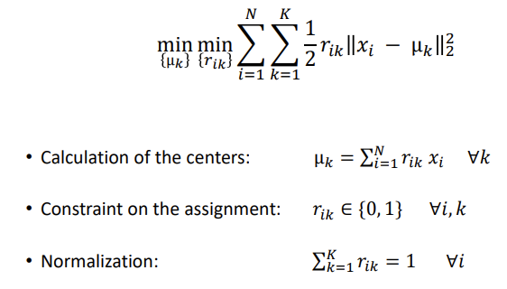

Is the algorithm good?

- 优点 - 简单而有效 - 易于实施 
- 
- 缺点： - 需要选择 K - 停留在较差的局部最小值 - 需要适当的距离度量标准

不同的初始化 -> 局部最小值

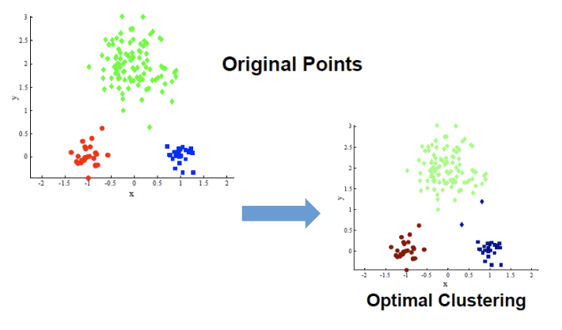

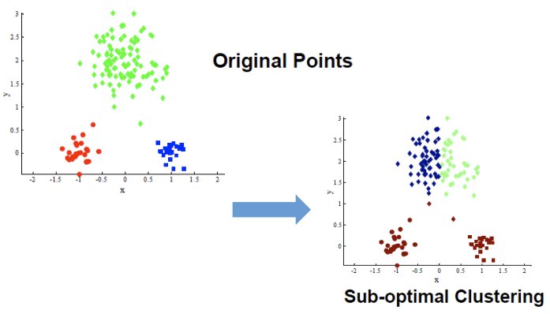

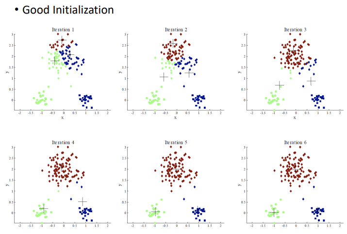

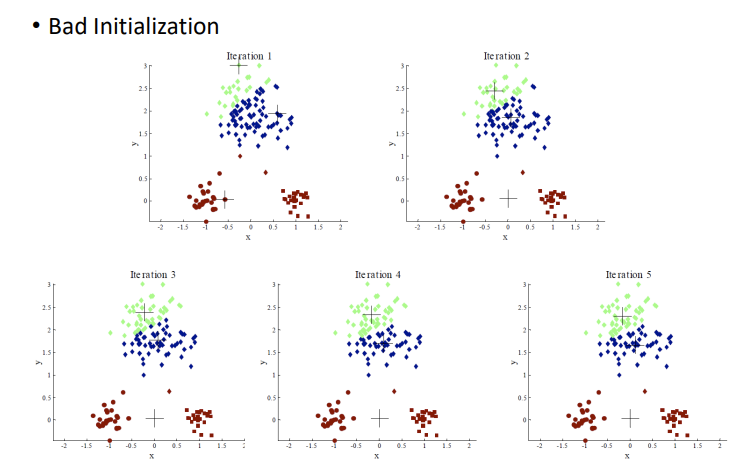

需要更好的衡量标准

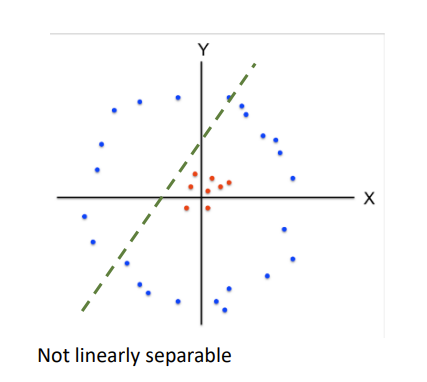

##### Hierarchical Agglomerative Clustering (HAC)

分层聚类算法（HAC）以单个聚类的点为起点，每一步都合并最接近的一对聚类，直到只剩下一个聚类（或 K 个聚类）。K 是一个给定的数字。

如何合并？- 合并距离最小的一对聚类

初始化： 每个对象都是一个群集。

迭代： 合并距离最小的两个聚类。

停止标准： 所有对象合并为一个簇。或只剩下 K 个簇

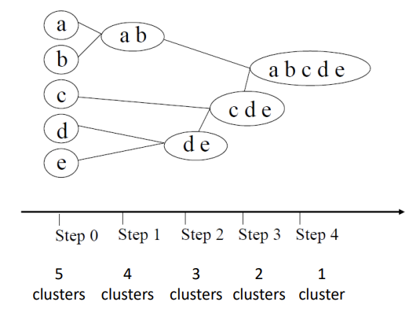

AC 可以可视化为树枝图--一种记录合并序列的树状图。

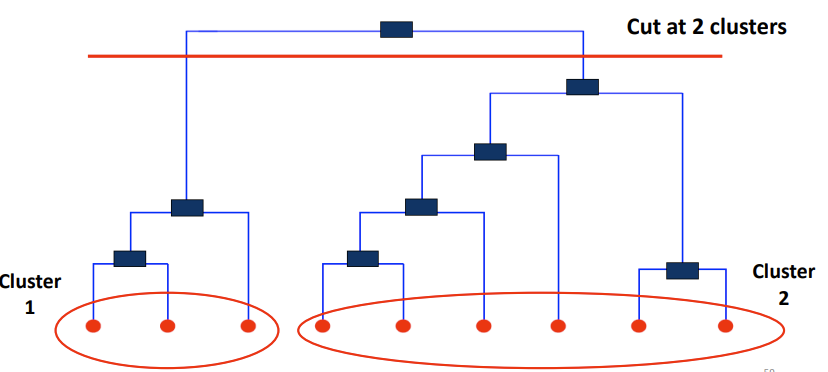

HAC 的优势 

无需假设/预先定义聚类的数量。- 只要在相应的层级上 “切割 ”树枝图，就能得到任何具有所需聚类数目 K 的聚类结果。- 结果与初始化无关。

如何定义两个聚类之间的距离？

MIN / 单链：每个群组中任意两对数据样本之间的最小距离。

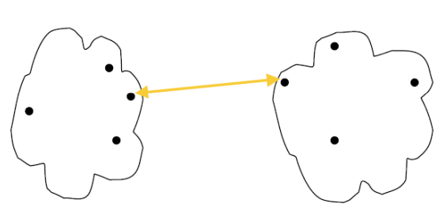

MAX / Complete Linkage：每个群组中任意两对数据样本之间的最大距离。

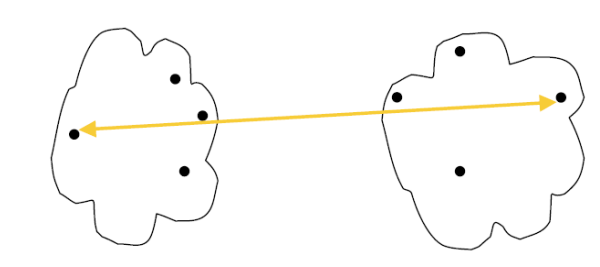

平均关联度：每个群组中所有两对数据样本之间的平均距离。

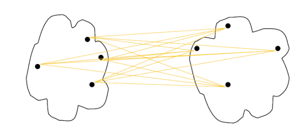

中心点距离：每个聚类的数据样本平均值（即中心点）之间的距离。

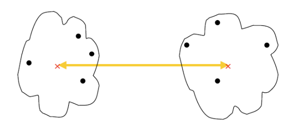

如何确定距离最小的聚类对？

将样本在空间中可视化。合并最接近的两个群组（点）。 合并下一个最近的集群。直到只剩下一个集群。或剩下给定的 K 个集群

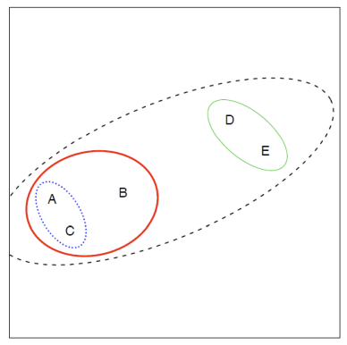

等价地，我们得到了显示 HAC 流程的树枝图

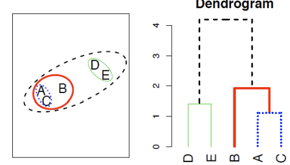

树枝图的 y 轴显示每一步合并时聚类之间的距离

Example: HAC

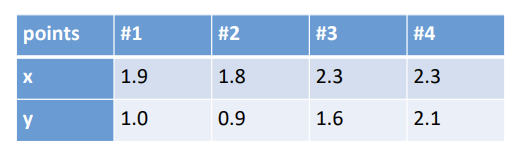

Distance = Centroid Distance

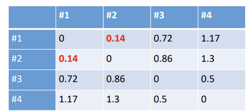

K-Means vs. HAC

K-Means 

✓ 简单而便宜的算法 

✘ 结果对初始化很敏感 

✘ 聚类的数量需要预先定义 

HAC 

✓ 确定性算法，即不是随机的。

✓ 向我们展示不同 K 选择下的一系列聚类结果。

✘ 比 K-Means 更耗费内存和计算资源

#### Regression

##### Concept of Regression

From Classification to Regression

分类是预测一个离散的类别标签： - 它可以以离散类别标签概率的形式输出一个连续值。准确率 = 在所有预测中正确分类的百分比。

回归是预测一个连续的量： - 它可以以整数的形式预测离散值。准确率 = 均方根误差。

##### Linear Regression

调节器Regressor：预测 𝑦 ∈ 𝑅 ( 输出 )- 标量 、来自 𝒙 ∈ 𝑅𝑑 (数据点) - 向量或标量

线性回归： 𝑦 可通过 𝒘𝑇 𝒙 + 𝑏，𝒘 ∈ 𝑅𝑑 和 𝒘𝑇 表示其转置（行向量）。

训练：根据训练数据找出最佳𝒘。- 训练数据集包含 N 个数据点 𝒙1, ... , 𝒙𝑖, ... 𝒙𝑁, 以及它们的基本真相 𝑦1, ... , 𝑦𝑖, ... 𝑦𝑁。

求 𝑓𝒘,𝑏(𝒙) = 𝒘𝑇𝒙 + 𝑏，使𝑙2 损失最小化

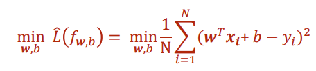

损失函数：𝒘𝑇𝒙𝒊+ 𝑏 与𝑦𝑖之间的均方误差。

##### Examples

考虑简单的一维数据回归：

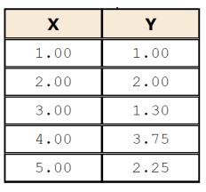

在 𝑥 - 𝑦 平面上绘制数据点：

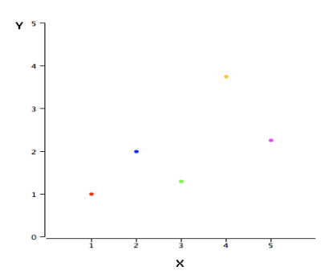

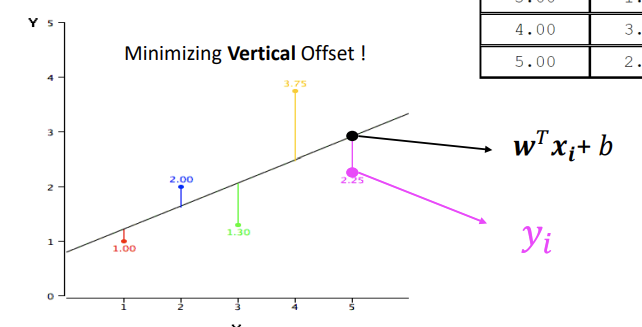

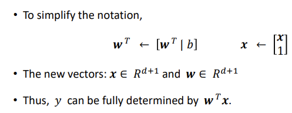

以矩阵形式写出问题： 

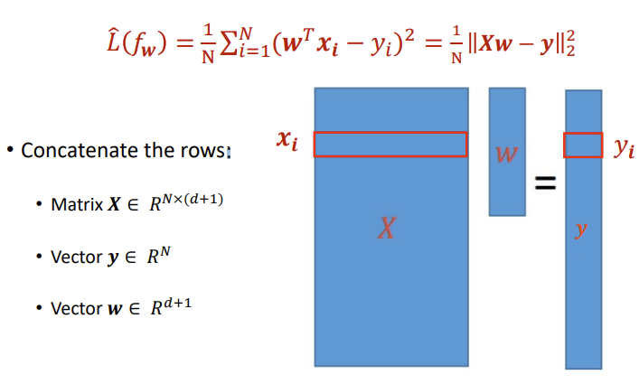

##### Derivation of Linear Regression

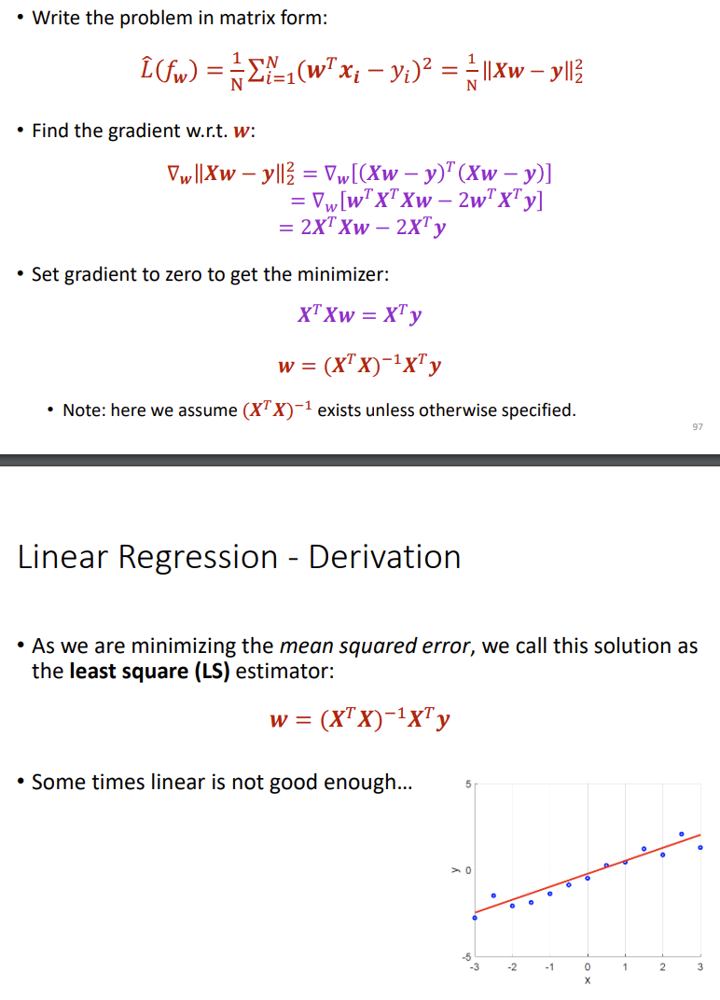

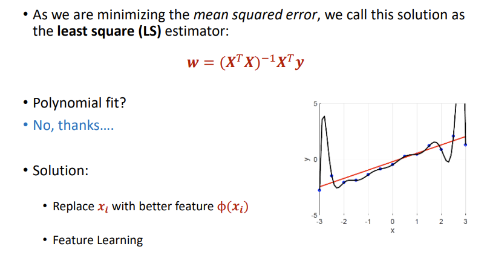

总结：

回归和分类有什么区别？

分类是预测离散类标签。回归是预测连续的数量。

训练线性回归器的损失函数是什么？

损失函数： 𝒘𝑇𝒙𝒊+ 𝑏 与 𝑦𝑖 之间的均方误差。最小化垂直偏移。

例：

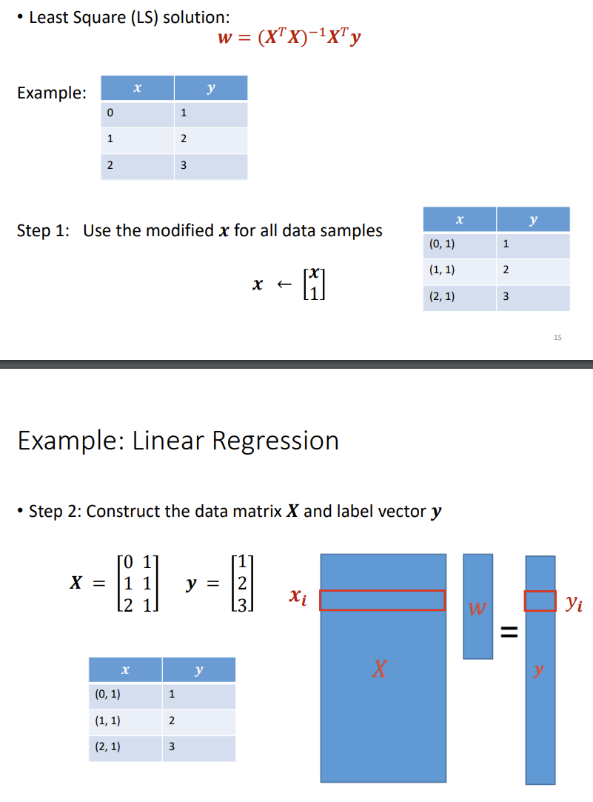

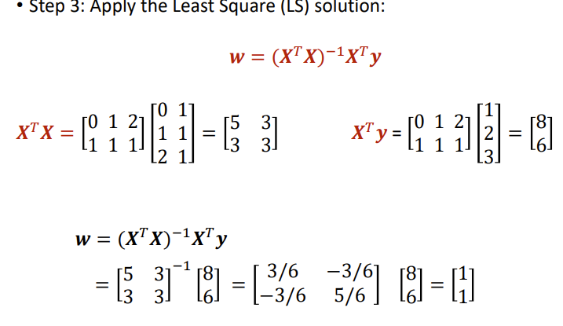

### Regularization and Optimization for Deep Models

####  Learning and Supervision

Types of Supervisions

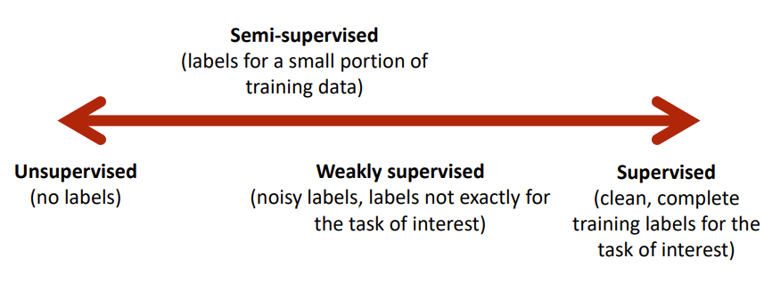

Framework of Supervised Learning

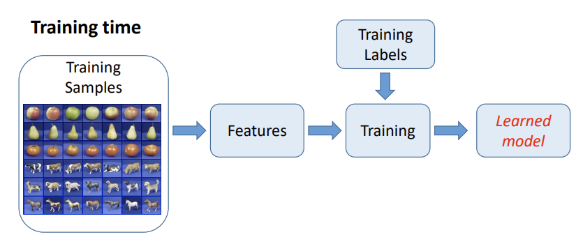

The Basic Supervised Learning Framework

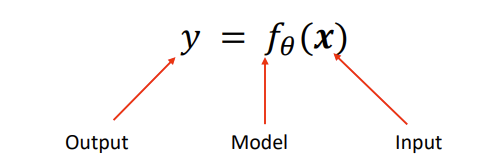

学习/训练：给定标注示例的训练集 {(𝒙1, 𝑦1), ... , (𝒙𝑁, 𝑦𝑁)}，估计预测函数/模型 𝑓𝜃 的参数𝜽。

推理/测试：将学习到的𝒇𝜽 应用于未见过的测试示例 𝒙，并输出预测值 𝑦 = 𝑓𝜃(𝒙) 

Learning Effectiveness

潜在问题 、

1. 是否有足够的数据进行监督？- 过度拟合

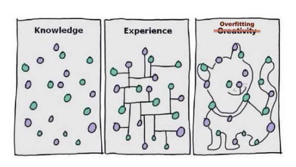

2. 您的模型是否足够复杂/丰富？- 拟合不足

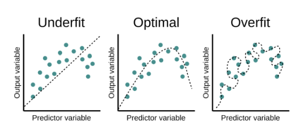

挑战 1. 我们永远不知道从输入到输出的确切模型映射。2. 我们永远不知道数据的分布情况

我们在实践中的做法： 

1. 我们对模型做出某些假设 - 例如，在使用线性分类器时，我们假设分类器是线性的。

2. 我们使用经验风险最小化--例如，我们将训练数据集的平均预测误差最小化。

#### Bias and Variance

两种近似方法都会给学习带来潜在的误差 

1. 偏差Bias：学习算法或模型中的错误假设导致的误差。- 例如，使用线性回归逼近二阶函数。
   
2. 方差Variance： 由于学习对训练集中的微小波动非常敏感而造成的误差。- 例如，拟合有限训练数据的噪声。

我们关心的总 “误差 ”是什么？- 预期误差：对于从底层分布中随机抽取的未来测试样本，预期误差 = 我们预期它被 𝑓𝜃(. ) 错误分类的可能性。

在实践中，如何测量预期误差？- 测试误差/验证误差

训练分类器 𝑓𝜃(𝑥)

预期误差： - 对于从底层分布中随机抽取的项目，我们预期其被错误分类的可能性为 𝑓𝜃(.)。

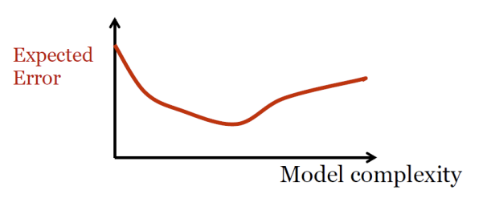

模型复杂性（非正式）： - 我们需要学习 𝑓𝜃(. ) 中多少个自由参数？- 例如，神经网络的复杂度取决于隐藏的神经元。

偏差： - 由于学习算法中的错误/不准确假设而产生的错误类型。- 当模型（过于）简单时，偏差较高 

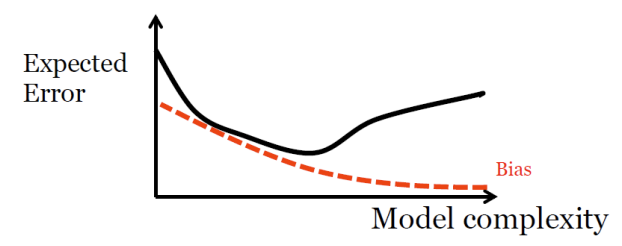

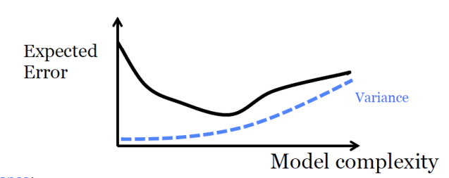

方差： - 由于模型对训练集中微小波动的敏感性而产生的误差类型。- 方差随模型复杂度的增加而增加

分类器的预期误差 ≈ 偏差 + 方差 (+ 噪音) 

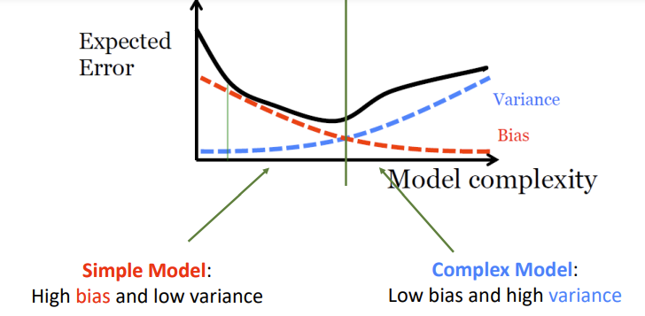

偏差与（模型）方差之间的权衡 - 靶心（中心）= 目标模型；飞镖（十字）= 学习模型

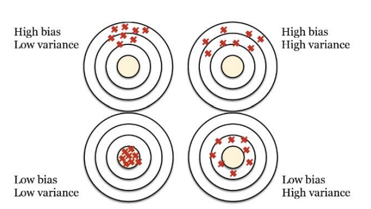

Basics on statistical learning theory (optional)

分类器的预期误差 ≈ 偏差 + 方差，如何用数学方法得出？

我们需要使用机器学习统计工具。

#### Theoretical Analysis of Statistical Learning Theory (optional)

- 经验风险最小化如何逼近预期/真实风险。
  
- 经验：从有限的数据量中计算得出，我们可以获得

- 预期：从真实数据分布中计算得出，在实践中无法获得

#### Overfitting and Underfitting

What is a good model?

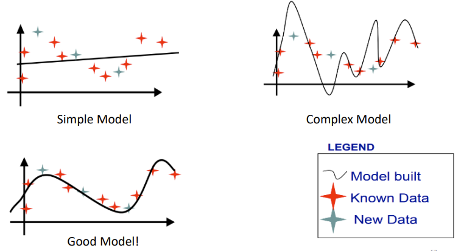

简单模型 - 高偏差 - 导致算法忽略输入特征与目标输出之间的相关关系。

复杂模型 - 高方差 - 导致算法对训练集中的噪声建模。

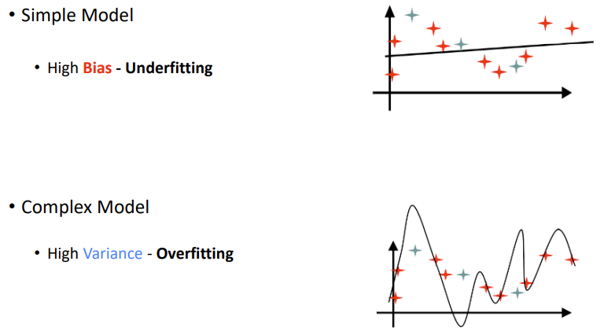

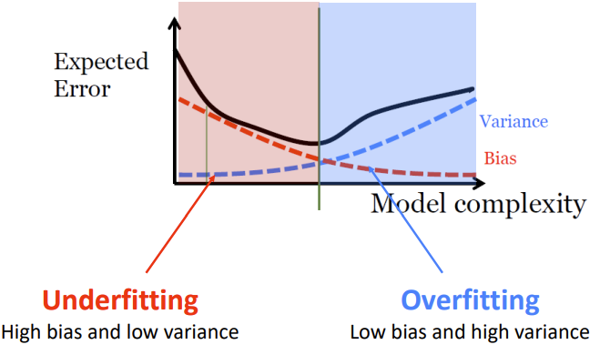

通过训练和测试/验证误差衡量过度拟合情况

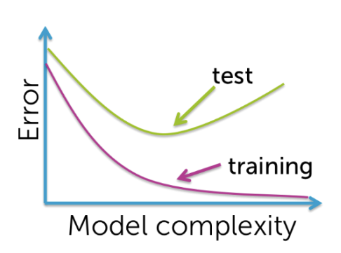

Overfitting ≈ Testing / Validation Error – Training Error

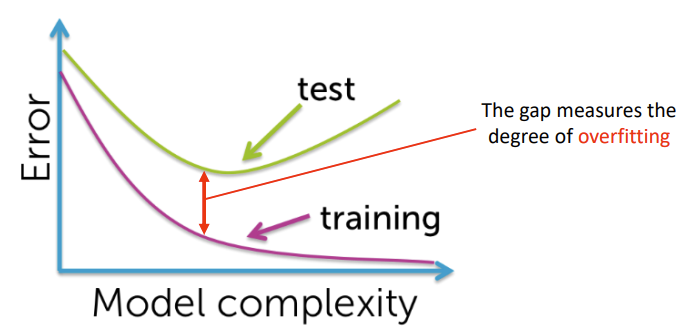

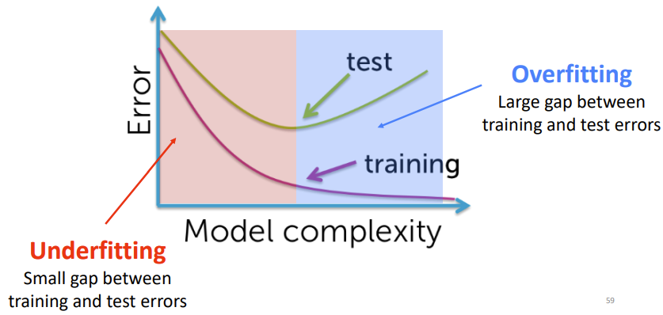

偏差-方差权衡： 

- 在两个误差源之间最小化的基本困境，这两个误差源阻碍了 ML 算法在训练集之外的泛化。
  
- 偏差是指学习算法中错误假设产生的误差。高偏差会导致算法忽略特征与目标输出之间的相关关系（例如，模型过于简单-->拟合不足）。
  
- 方差是对训练集微小波动的敏感性所产生的误差。高方差会导致算法对训练数据中的随机噪音而不是目标输出进行建模（例如，模型过于复杂 -> 过度拟合）。

#### Model Diagnosis and Optimization 

如何监控预期误差？

- 从已知标签的数据中分离出一个验证数据集。

- 在训练数据上学习参数。
  
- 在验证数据（即 “模拟 ”测试集）上测量准确率。

偷看验证集，防止过拟合和欠拟合。

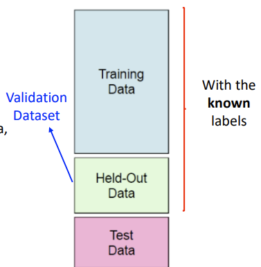

Model training diagnosis

重要统计数据： - 训练/验证/测试误差曲线 

训练参数： 1. 学习率 2. 模型正规化 3. 迭代次数/历时

Diagnosing learning rates

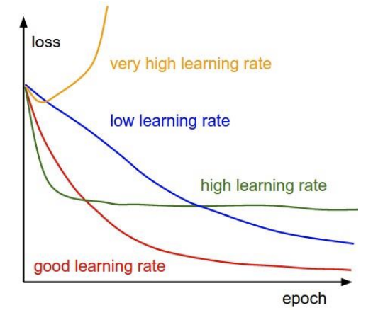

Regularization to prevent overfitting

在学习神经网络方面的解决方案： 

1. 通过降低模型的表现力来限制模型的复杂性。

- 丢弃： 在训练过程中，某些层的输出会被随机忽略或 “丢弃”。

- 早期停止： 每训练几次就对模型进行采样，检查模型在验证集上的运行情况，并在验证误差达到最小值时停止训练。

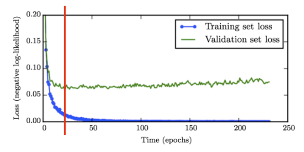

权重共享： 我们可以强制每个神经元的参数相同，而不是对每个神经元进行独立训练。举例说明 递归神经网络 (RNN)。

2. 增加训练数据的复杂性/大小，以减少方差。
   
- 增加更多 “真实 ”的训练数据 

- 数据扩充：以现实但随机的方式修改可用数据，以增加训练过程中看到的数据的多样性

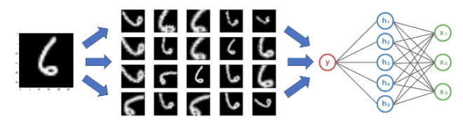

Data augmentation

引入未在训练数据中充分采样的变换 

- 几何：翻转、旋转、剪切、多种作物 

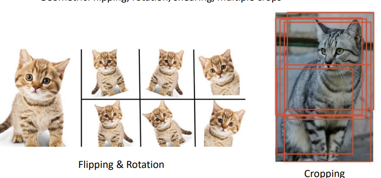

光度测量：色彩转换 

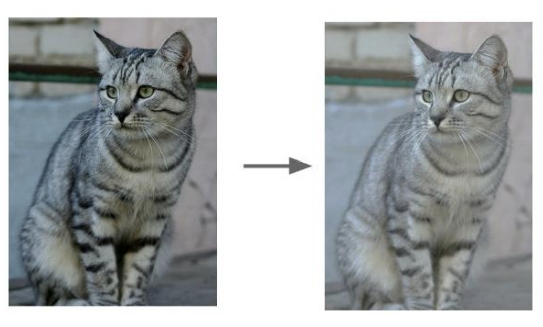

其他：缩放、添加噪音、压缩伪影、镜头变形等。

仅受数据假设和时间/内存限制！

避免引入明显的人工痕迹

3. 简化数据分布和维度。
   
- 降维

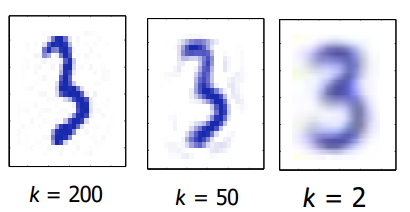

### Dimensionality Reduction

#### Concept of Dimensionality Reduction

Unsupervised Learning

• Clustering

• Dimensionality Reduction

降维 - 简化复杂高维数据的另一种方法。- 用低维实值向量汇总数据。

目标：找到最合适的低维子空间来表示 (𝑥𝑖 )𝑖=1 𝑁 。

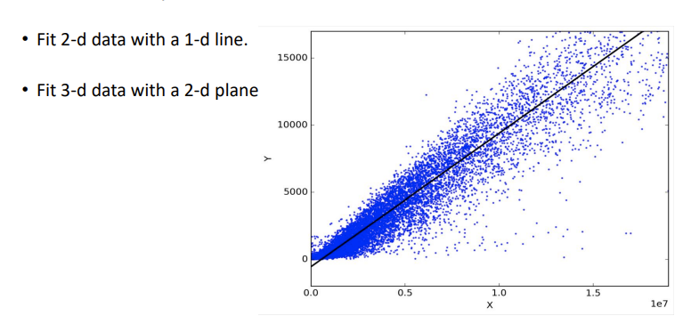

- 给定 d 维数据点 

- 将其转换为 r < d 维数据点

- 信息损失最小

Example: Reduce Data from 2D to 1D

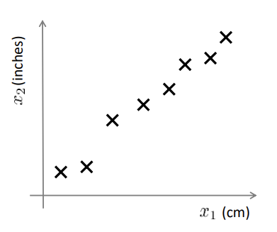

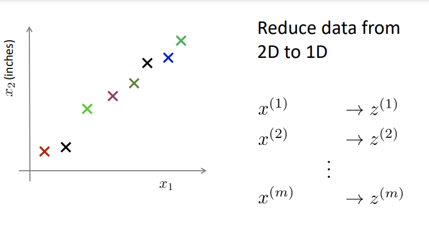

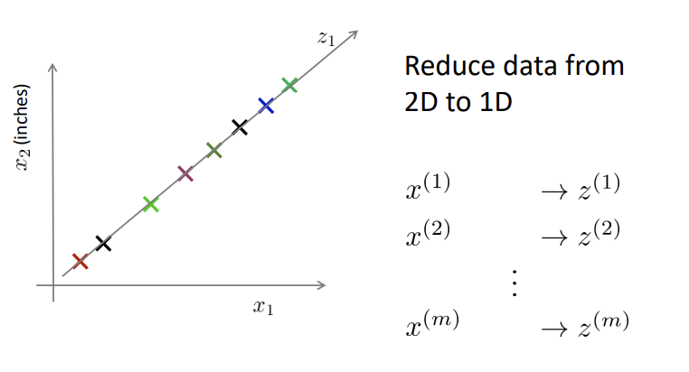

Example: Reduce Data from 3D to 2D

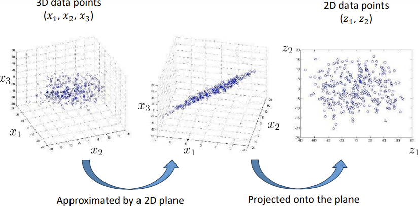

Why Dimensionality Reduction?

高维度有什么问题？

高维度 = 大量特征 - 处理系统复杂 - 算法效率低下 - 过度拟合噪声或其他数据破坏。

消除特征冗余和噪声 - 防止过度拟合 - 降低模型复杂性 - 简化数据分布 - 更好地实现可视化

#### Principal Component Analysis (PCA)

主成分分析法（PCA）--简单而流行的方法。- 无监督学习。- 学习用于数据投影的 “最佳 ”低维子空间。

对 “最佳 ”有两种解释： 1. 预测数据的均方误差 (MSE) 最小。2. 投影数据的方差最大化。

这两个目标可通过应用 PCA 进行降维同时实现。

1. 预测数据的均方误差（MSE）最小。

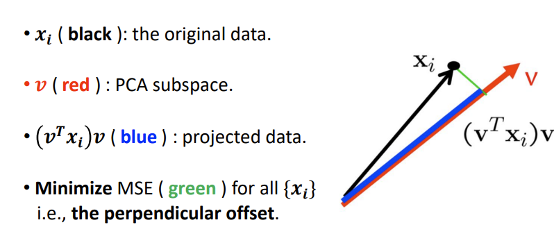

2. 最大化预测数据的方差。

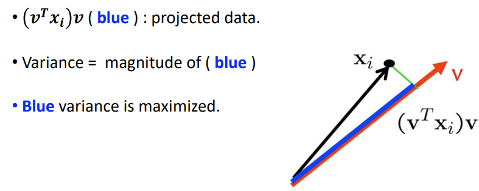

Minimizing MSE <=> Maximizing Projected Variance

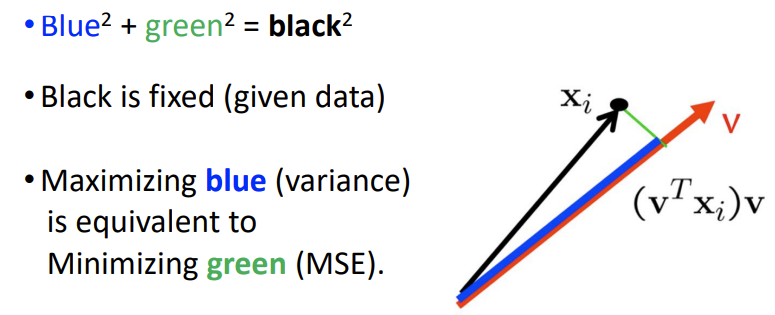

Example: PCA

以下哪个𝒗 产生的预计方差更大？

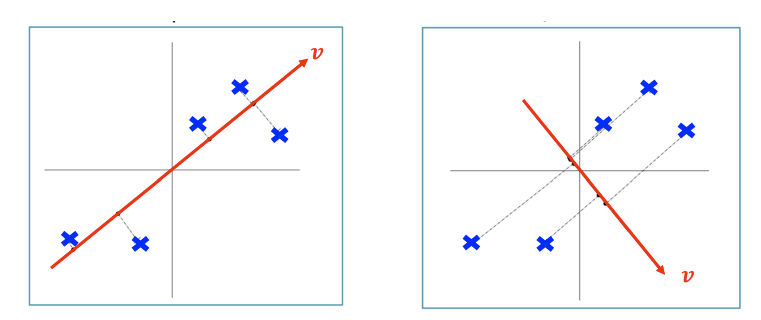

找出投影平均值 𝒖 - 计算每个点到平均值之间的距离 𝒅𝒊 - 投影数据的方差

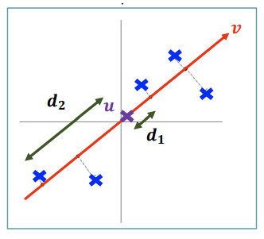

左边的子空间 𝒗 产生较高的预测方差

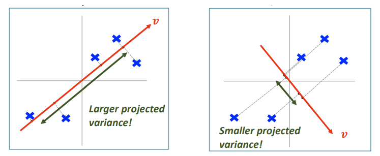

哪一个𝒗 产生的预测 MSE 较小？

左边的子空间 𝒗 产生较小的投影 MSE - 较小的垂直偏移

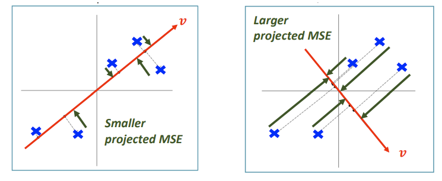

#### How to derive PCA (not examed)

#### Examples

MNIST 数据集中手写数字的表示：

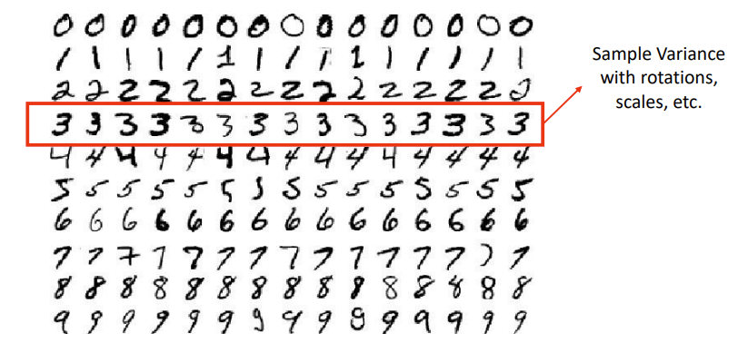

PCA 提供了更稳健、更不变的特征。

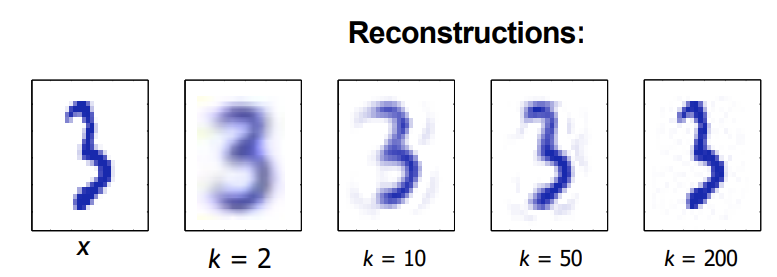

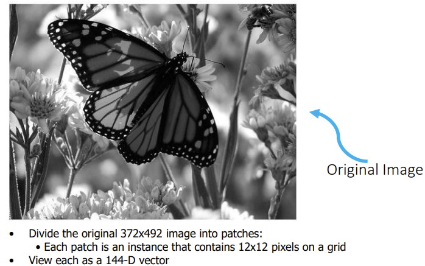

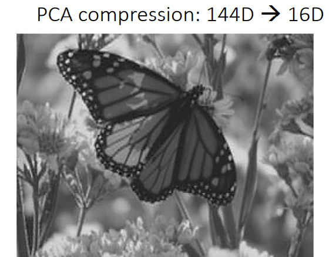

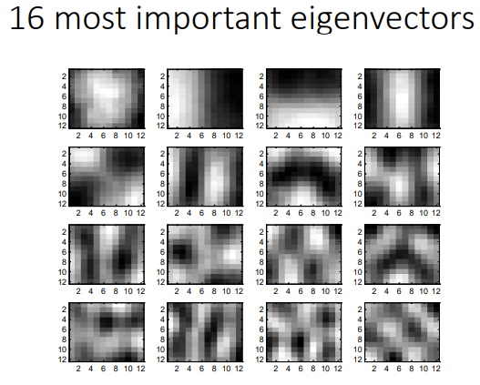

### Bayesian Inference

#### Probability and Conditional Probability

From deterministic to probabilistic learning

训练深度神经网络进行分类： - 确定性模型：相同的输入总是有相同的输出。

训练深度神经网络进行分类： - 确定性推理：相同的输入有相同的输出。

贝叶斯推理 - 掷两次硬币，会有什么结果？- 这个实验有 4 种可能的结果 𝑆 = {𝐻𝐻, 𝐻𝑇, 𝑇𝐻, 𝑇𝑇} - 概率模型： 𝑃𝑟𝑜𝑏 𝐻𝐻 = 0.25

Basic Concepts in Probability Theory

概念和符号：

- h = 假设或事件。

- D = 一组数据（如训练数据）。

- P(h) = 假设 h 成立的概率。
  
- P(D) = 观察到训练数据 D 的概率。

- P(D|h) = 当 h 成立时观察到 D 的概率。(读作 “给定 h 时 D 的概率”、“以 h 为条件的 D 的概率”）。

我们之所以对 P(h|D)感兴趣，是因为 - 我们总是从历史/知识中学习。- 我们通常可以获得训练数据 D。- 我们需要知道 P(h|D)，目的是找到给定数据的最可能的假设。

Joint and Conditional Probability

- 条件概率 𝑃 (𝐴 | 𝐵) ：在 B 发生的情况下 A 发生的概率。

- 联合概率 𝑃 (𝐴, 𝐵)：A 和 B 同时发生的概率。
  
- 𝑃 (𝐴, 𝐵) = 𝑃 (𝐴|𝐵) ∗ 𝑃(𝐵)

#### Bayes’ Theorem

贝叶斯定理的简单形式：

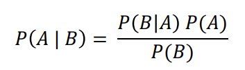

如何推导定理？

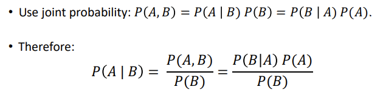

给定 P(B) 是一个常数，比例形式：

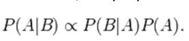

有时，P(B) 也可以计算为 

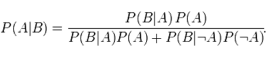

这是基于总概率法则： 

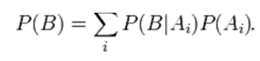

现在，我们可以预测𝑃(ℎ|𝐷)：

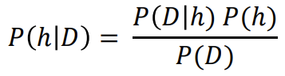

- 我们将使用一些术语： 

- 先验概率 𝑃(ℎ)：在观察𝐷之前对𝑃 的先验知识。

- 后验概率 𝑃 (ℎ|𝐷) ：观察到𝐷 之后对ℎ 的概率。

- 概率 𝑃 (𝐷|ℎ) ：在给出 ℎ 的情况下观测到 𝐷 的可能性。

最大后验（MAP）假设：

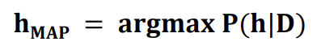

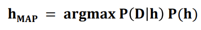

如果 P(h)不变，则 MAP 等同于最大似然法 (ML)：

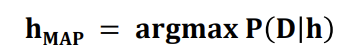

例:

- 假设我们要抛一枚公平的硬币两次。两次都是正面的概率是多少？
  
- 假设我们要掷两次一枚公平的硬币。假设第一次掷硬币的结果是人头，那么两次都是人头的概率是多少？

- 参加我们的 IE4483 考试的有来自 EEE 和 IEM 的学生。只有 50% 的 IEM 学生和 30% 的 EEE 学生通过考试。鉴于全班 60% 的学生都是 EEE 学生，那么在通过考试的学生中，IEM 学生的比例是多少？

- 你是一个游戏节目的参赛者。你看到三扇紧闭的门，其中一扇门后面有奖品。你选择了一扇门，主持人打开了另外一扇门，并告诉你门后没有奖品。然后他给了你一个机会，让你换到剩下的那扇门。你应该接受吗？

#### Naïve Bayes

如果 A 和 B 都是单一属性，就很简单。但如果我们有多个条件或查询事件呢？如何表示它们的条件概率？

从简单示例扩展到大型训练数据集。单一属性->多个属性

𝑃 (𝑎1, 𝑎2|𝑣𝑗)与 𝑃(𝑎1|𝑣𝑗)和 𝑃(𝑎2|𝑣𝑗)有何关系？- Naïve Bayes 假设： 

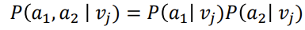

Naïve Bayes 假设： - 条件独立假设 - 某些特征的值与其他特征的值是有条件独立的。

数学形式：

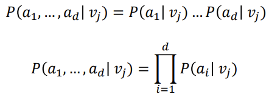

Naïve Bayes - Example

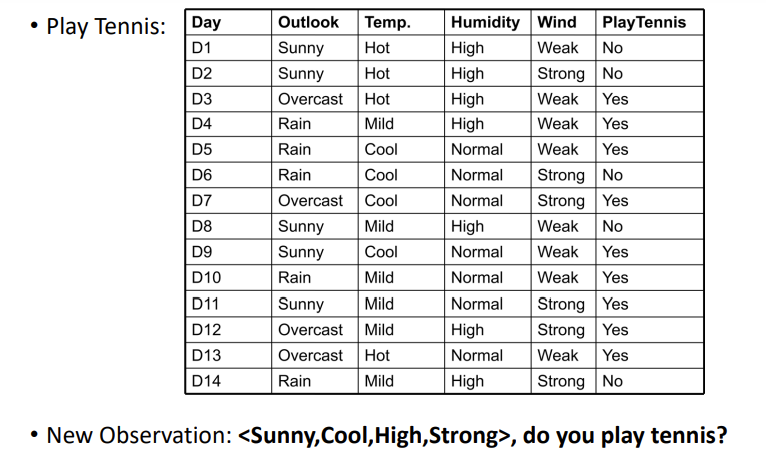

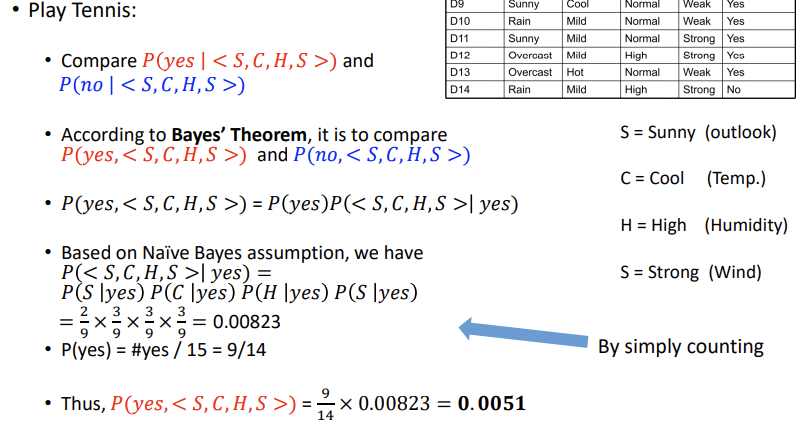

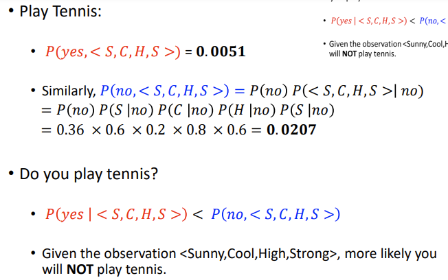

### Low-Dimensionality （not）