# Week 1

# Week 2

# Week 3

## Term Weighting Schemes 术语加权方案

- Term Weighting Schemes involves calculating and assigning a numerical value to each term, aiming to assess its significance in differentiating a specific document from the rest.
- 术语加权方案包括计算和分配每个术语的数值，目的是评估其在区分特定文档与其他文档方面的重要性。

▪ Term Weighting seeks to represent the importance of a chosen query term in the corpus.术语加权旨在表示所选查询术语在语料库中的重要性。

▪ Common term weighting schemes include 常见的术语加权方案包括

- TF-IDF
- BM25

### TF-IDF

Term Frequency-Inverse Document Frequency (TF- IDF)术语频率-反向文档频率

Term Frequency refers to how often a term appears across a particular document.术语频率是指术语在特定文档中出现的频率。

Inverse Document Frequency refers to the relative rarity of a term in the collection of documents.反向文档频率指的是术语在文档集合中的相对稀有程度。

▪ The final TF-IDF value is obtained by multiplying these values together. 将这些值相乘，就得到了最终的 TF-IDF 值。

▪ The higher the TF-IDF score, the more important or relevant the term is; as a term gets less relevant, its TF-IDF score will approach 0. TF-IDF 分数越高，说明术语越重要或越相关；随着术语的相关性降低，其 TF-IDF 分数将趋近于 0。

Term Frequency can be calculated in multiple ways:

- The raw count of how often a term appears in the document. 术语在文档中出现频率的原始计数。$tf_{t,d}$
- Term frequency adjusted for document length.根据文件长度调整的术语频率。$\frac{tf_{t,d}}{n.words}$
- Logarithmically Scaled.对数缩放。$1+log(tf_{t,d})$
- Boolean Frequency (1 if term appears in document, 0 if term does not appear in document).布尔频率（1 表示术语出现在文档中，0 表示术语未出现在文档中）。

Inverse document frequency can be defined as:

\[
    idf(t,D) = log(\frac{N}{count(d \in D:t \in d)})
\]

- Where N is the total number of documents (d) in the corpus (D).其中，N 是语料库（D）中的文档总数（d）。
- The denominator is the number of documents where the term t appears in.分母是术语 t 出现的文档数。
- If a term does not appear in the corpus, a divide by zero error may occur. This can be avoided using the following equation:如果一个术语没有出现在语料库中，可能会出现除以零的错误。使用下面的公式可以避免这种情况：

\[
    idf(t,D) = log(\frac{1+N}{1+count(d \in D:t \in d)})+1
\]

TF-IDF is simply defined as:

\[
    tf(t,D) · idf(t,D) 
\]

- The higher the TF-IDF score the more important or relevant the term is; as a term gets less relevant, its TF-IDF score will approach 0.TF-IDF 分数越高，表示该词越重要或越相关；随着词的相关性降低，其 TF-IDF 分数将趋近于 0。
- TF-IDF vectorization involves calculating the TF-IDF score for every word in your corpus relative to that document and then putting that information into a vector.TF-IDF 向量化涉及计算语料库中每个词相对于该文档的 TF-IDF 分数，然后将该信息放入一个向量中。
- Each document in the corpus would have its own vector, and the vector would have a TF-IDF score for every single word in the entire collection of documents.语料库中的每个文档都将有自己的向量，而向量中将包含整个文档集合中每个单词的 TF-IDF 分数。
- The similarity between the documents can be derived from the cosine similarity between the two vectors.文档之间的相似性可以通过两个向量之间的余弦相似性得出。

TF- IDF vectorization with SKLearn:

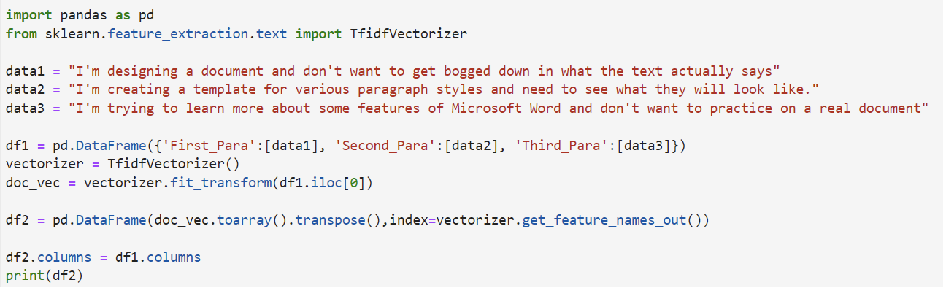

Words that appear more across each document have a higher TF-IDF score, while words that are unique to each document have a TF- IDF score of 0.在每篇文档中出现次数较多的词的 TF-IDF 分数较高，而每篇文档中独有的词的 TF-IDF 分数为 0。

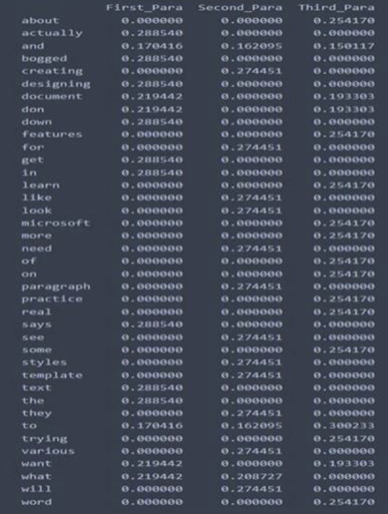

Advantages：

▪ Efficiency:
It is computationally efficient to calculate TF-IDF scores for documents, especially compared to more complex natural language processing techniques.为文档计算 TF-IDF 分数的计算效率很高，尤其是与更复杂的自然语言处理技术相比。
▪ Language Agnostic:
TF-IDF can be applied to documents in any language, making it versatile for multilingual text analysis.TF-IDF 可应用于任何语言的文档，因此可用于多语言文本分析。
▪ No Supervised Training:
TF-IDF doesn't require a training phase with labeled data, making it readily applicable to various tasks without the need for extensive training data.TF-IDF 不需要标注数据的训练阶段，因此无需大量训练数据就能轻松完成各种任务。

Limitations：

▪ No Semantics:
TF-IDF treats words as independent units and doesn't consider the semantics or relationships between words.TF-IDF 将单词视为独立单元，不考虑单词之间的语义或关系。
▪ Term Frequency Bias:
Terms that appear more frequently tend to receive higher weights, which can lead to overemphasis on common words that are not very informative.出现频率较高的词往往会获得较高的权重，这可能会导致过分强调信息量不大的普通词。
▪ Vocabulary Size:
The size of the vocabulary (unique terms across the corpus) can become a computational challenge for large datasets, and rare terms might not receive accurate IDF values.对于大型数据集来说，词汇量（整个语料库中的唯一术语）的大小可能会成为计算上的一个挑战，罕见术语可能无法获得准确的 IDF 值。

### BM25

Best Match 25 (BM25)

BM25 is an algorithm that considers both term frequency (TF) and document length normalization to determine the relevance of a document to a given query.BM25 是一种同时考虑术语频率 (TF) 和文档长度归一化的算法，用于确定文档与给定查询的相关性。
▪ It follows the probabilistic retrieval framework, which assumes that relevant and non-relevant documents follow different statistical distributions.它遵循概率检索框架，该框架假定相关文档和非相关文档遵循不同的统计分布。

\[
    BM25(D,Q)=\sum_{i=1}^nIDF(q_i)\cdot \frac{TF(q_i,D)\cdot(k_1+1)}{TF(q_i,D)+k_1\cdot (1-b+b\cdot \frac{|D|}{avgdl})}
\]

Where:
▪ IDF(q) represents the inverse document frequency of the query term q. IDF(q) 表示查询词 q 的反文档频率。
▪ TF(q, D) denotes the modified term frequency of term q in document D.TF(q, D) 表示术语 q 在文档 D 中的修正词频。
▪ |D| represents the length of document D. |D| 表示文档 D 的长度。
▪ avgdl is the average document length in the corpus.avgdl 是语料库中文档的平均长度。
▪ Parameters k1 and b are tunable constants that control the impact of term frequency saturation and document length normalisation, respectively.参数 k1 和 b 是可调常数，分别控制词频饱和和文档长度归一化的影响。

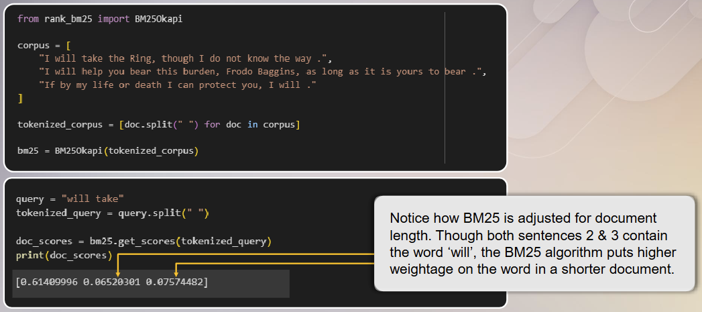

请注意 BM25 是如何根据文件长度进行调整的。虽然句子 2 和 3 都包含 “will ”一词，但在较短的文档中，BM25 算法对该词赋予了更高的权重。

Advantages
▪ Information Retrieval:
BM25 is known to be effective in information retrieval tasks. It often outperforms traditional TF-IDF weighting, especially when dealing with large and diverse text corpora.众所周知，BM25 在信息检索任务中非常有效。它的性能往往优于传统的 TF-IDF 加权法，尤其是在处理大型和多样化的文本语料库时。
▪ Balanced Term Frequency:
BM25 addresses the issue of term frequency saturation by introducing the parameter 'k.' This makes it more robust in handling documents with varying term frequencies, preventing common terms from dominating the score.BM25 通过引入参数 “k ”来解决词频饱和的问题。这使得它在处理具有不同词频的文档时更加稳健，从而避免了常见词在得分中占主导地位。

Limitations
▪ No Semantics:
Similarly to TF-IDF, BM25 does not take into account the semantics of a document.与 TF-IDF 类似，BM25 也不考虑文档的语义。
▪ Sparse Data:
BM25 may not perform as well when dealing with very sparse data or extremely short documents because it relies on term frequencies and document lengths to calculate scores. 当处理非常稀疏的数据或极短的文档时，BM25 的表现可能会不尽如人意，因为它依赖于术语频率和文档长度来计算分数。

## Topic Modeling 主题建模 

Topic Modeling is an unsupervised method for document classification, aiming to discover and extract hidden thematic structures within large collections of text data.主题建模是一种用于文档分类的无监督方法，旨在发现和提取大量文本数据集合中隐藏的主题结构。

▪ This is achieved by analysing word co-occurrence patterns within unstructured text data.这是通过分析非结构化文本数据中的词语共现模式来实现的。
▪ The hidden thematic structures can then be used to classify and summarise the available data.隐藏的主题结构可用于对现有数据进行分类和总结。
▪ Common Topic modelling techniques include:常见的主题建模技术包括:

- LDA
- LSA
- NMF

### LDA

Latent Dirichlet Allocation (LDA)潜在德里希勒分配

LDA aims to find the representative words for a topic and classify a document based on the occurrence of these wordsLDA 的目的是找到一个主题的代表词，并根据这些词的出现情况对文档进行分类

▪ LDA consists of 2 parts:
- Words belonging to a document.属于文档的词语。
- Words belonging to a topic.属于主题的词语。
▪ LDA works off a Bag-Of-Words approach – the order and semantics of a word is not consideredLDA 采用 “词袋 ”方法工作--不考虑词的顺序和语义
▪ LDA requires the user to set a predetermined number of topics, k.LDA 要求用户设置预定的主题数 k。

Algorithm:

Go through each document in the corpus and randomly assign each word in the document to one of k topics.浏览语料库中的每份文档，并将文档中的每个词随机分配给 k 个主题之一。

 For each document d, go through each word w and find:

▪ 𝒑(𝒕𝒐𝒑𝒊𝒄 𝒕|𝒅𝒐𝒄𝒖𝒎𝒆𝒏𝒕 𝒅): The proportion of words in document d that are assigned to topic t. Captures how many words belong to topic t in document d.文档 d 中分配给主题 t 的单词比例，反映文档 d 中属于主题 t 的单词数量。

▪ 𝒑(𝒘𝒐𝒓𝒅 𝒘|𝒕𝒐𝒑𝒊𝒄 𝒕): The proportion of assignments to topic t from all documents that come from word w. Captures how many documents are in topic t due to document w.来自单词 w 的所有文档中分配给主题 t 的比例，反映了有多少文档是由于文档 w 而进入主题 t 的。

▪ Update the probability of word w belonging to topic t using:

𝒑(𝒘𝒐𝒓𝒅 𝒘 𝒃𝒆𝒍𝒐𝒏𝒈𝒔 𝒕𝒐 𝒕𝒐𝒑𝒊𝒄 𝒕) = 𝒑 (𝒕𝒐𝒑𝒊𝒄 𝒕|𝒅𝒐𝒄𝒖𝒎𝒆𝒏𝒕 𝒅)∙𝒑(𝒘𝒐𝒓𝒅 𝒘|𝒕𝒐𝒑𝒊𝒄 𝒕)

LDA in gensim:
▪ For this demonstration, we will use a compilation of COVID tweets found at:在本演示中，我们将使用 COVID 推文汇编，网址为:
https://www.kaggle.com/datasets/datatattle/covid-19-nlp-text-classification
▪ We first filter out only the tweets:我们首先只筛选出推文：

To make the data easier to process, we remove all punctuation and convert all words to lowercase.为了便于处理数据，我们删除了所有标点符号，并将所有单词转换为小写。

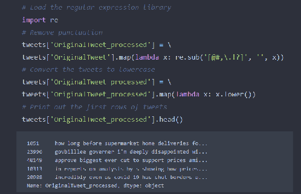

As LDA is a BOW model, we want to remove stop words that don’t carry much semantic meaning.由于 LDA 是一种 BOW 模型，我们希望删除那些没有太多语义的停滞词。

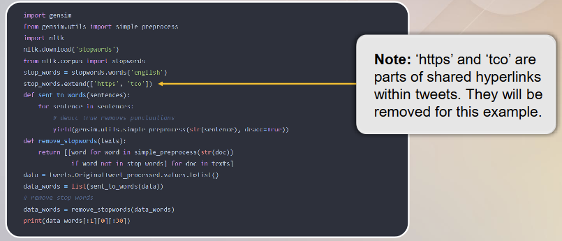

注意：“https ”和 “tco ”是推文中共享超链接的一部分。在本示例中，它们将被删除。

With k =7, we can generate the LDA scores for each word in a tweet and classify them into a topic.在 k =7 的情况下，我们可以为推文中的每个单词生成 LDA 分数，并将其归入一个主题。

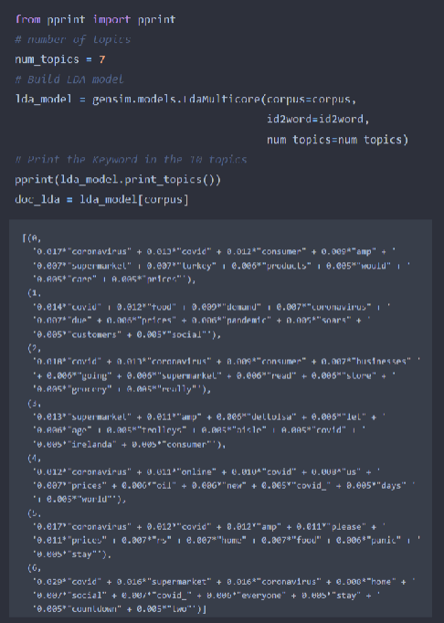

Create a dictionary of all words in the corpus 为语料库中的所有单词创建词典

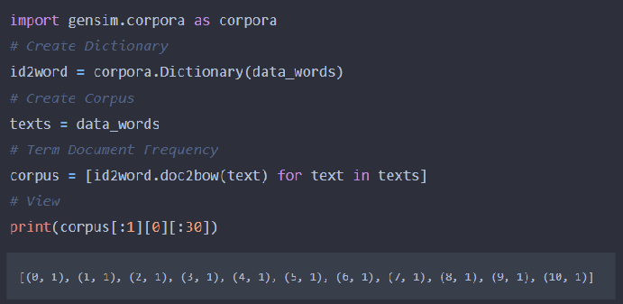

Visualisation:

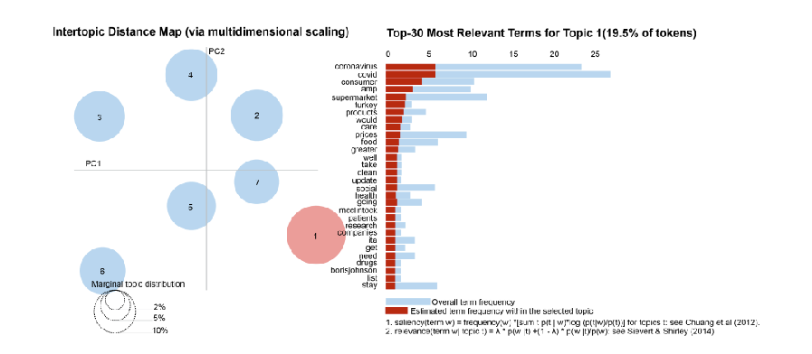

Advantages
▪ Dimensionality Reduction:
LDA reduces the dimensionality of the data by representing documents as mixtures of topics. This simplifies data representation.LDA 将文档表示为主题的混合物，从而降低了数据的维度。这简化了数据表示。
▪ Interpretability: 
The topics generated by LDA are typically represented as lists of words, making them interpretable.LDA 生成的主题通常以单词列表的形式表示，因此具有可解释性。

Limitations
▪ No Semantics:
LDA treats words independently of their context in a document. Hence, the semantics of a word are not captured with LDA.LDA 处理单词时与单词在文档中的上下文无关。因此，LDA 无法捕捉单词的语义。
▪ Preprocessing Sensitivity:
LDA is highly sensitive to the preprocessing used on data, such as stop word removal and stemming.LDA 对数据的预处理非常敏感，如删除停滞词和词干。

### LSA

Latent Semantic Analysis (LSA):潜在语义分析

LSA aims to uncover the underlying semantic structure of text data and transform it into a lower-dimensional space.LSA 旨在发掘文本数据的潜在语义结构，并将其转换为低维空间。

▪ LSA works by generating a document-term matrix.LSA 的工作原理是生成一个文档-词矩阵。
▪ The matrix is typically populated with the TF-IDF scores for each word.该矩阵通常包含每个词的 TF-IDF 分数。
▪ The matrix is then decomposed (typically with SVD) into sub-matrixes.然后将矩阵分解（通常使用 SVD）为子矩阵。

Steps

Generate a document-term matrix of shape mxn:生成 mxn 形的文档词矩阵：
The column entries can be filled by a raw count of the number of times a word appears in the document, but the TF-IDF score is usually used as it gives a better representation of the significance of the word.列项可由文档中单词出现次数的原始计数填充，但通常使用 TF-IDF 分数，因为它能更好地反映单词的重要性。

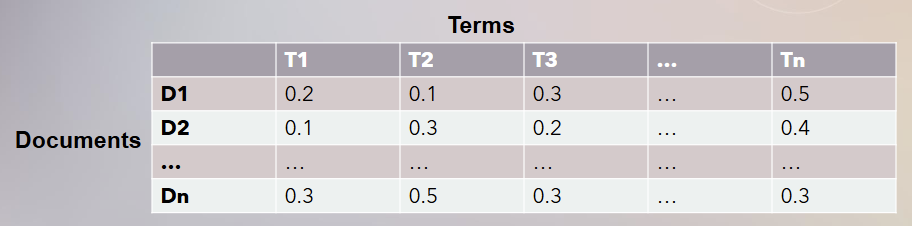

By applying SVD (explained in detail later), break the matrix down into 通过应用 SVD（稍后将详细解释），将矩阵分解为

▪ Document-Topic Matrix 𝑼𝒌文档-主题矩阵 𝑼𝒌
- Document vectors expressed in terms of topics用主题表示的文档向量

▪ Term-Topic Matrix 𝑽𝒌𝑻术语-主题矩阵 𝑽𝒌𝑻
- Term vectors in terms of topics用主题表示的术语向量

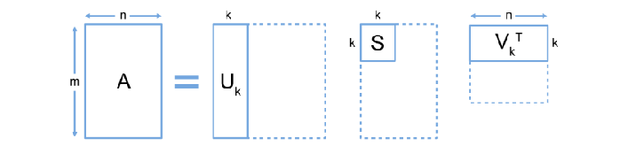

LSA in gensim

Using the same COVID dataset
▪ Stem words to reduce noise删除词干以减少噪音

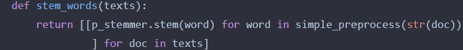

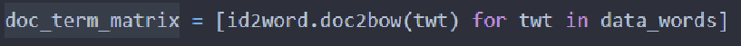

We can then build the LSA model and extract the top 10 relevant keywords.然后，我们就可以建立 LSA 模型，并提取前 10 个相关关键词。

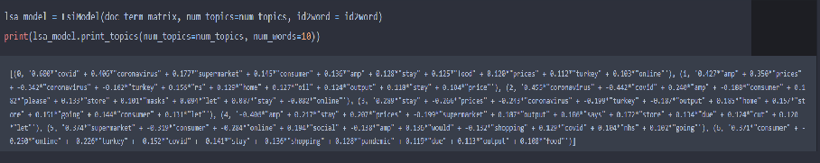

Advantages
▪ Dimensionality Reduction:
LSA reduces the dimensionality of the data by representing documents as mixtures of topics. This simplifies data representation.LSA 将文档表示为主题的混合物，从而降低了数据的维度。这简化了数据表示。
▪ Semantic Understanding:
LSA captures the underlying semantic structure of text, allowing it to identify and measure semantic similarities between words and documents, even when they don't share exact word overlap.LSA 可捕捉文本的基本语义结构，从而能够识别和测量单词与文档之间的语义相似性，即使它们没有完全的单词重叠。

Limitations
▪ Lack of Interpretability:
The reduced semantic space created by LSA lacks human interpretability. While it captures semantic relationships, it may not provide direct insights into the meaning of specific dimensions.LSA 创建的缩小语义空间缺乏人类可解释性。虽然它能捕捉语义关系，但可能无法直接洞察特定维度的含义。
▪ Preprocessing Sensitivity:
LSA is highly sensitive to the preprocessing used on data, such as stop word removal and stemming.LSA 对数据预处理非常敏感，如删除停滞词和词干。

### pLSA

Probabilistic Latent Semantic Analysis (pLSA):概率潜语义分析

pLSA is an extension of LSA that operates on a probabilistic framework.pLSA 是 LSA 的扩展，在概率框架内运行。

▪ Assumes documents are generated from a mixture of latent topics.假设文档由潜在主题混合生成。
▪ Each topic is associated with a distribution over words, and each document is assumed to be generated by selecting a topic from this mixture and then choosing words from the selected topic's word distribution.每个主题都与词的分布相关联，每个文档都被假定为通过从该混合物中选择一个主题，然后从所选主题的词分布中选择词来生成。

The goal of pLSA is to find a model that can generate the data observed within a term-document matrix.pLSA 的目标是找到一个能够生成术语-文档矩阵中观察到的数据的模型。

This means we want a function P(w,d) that will generate the corresponding entry in the word-document matrix given the word w and document d.这意味着我们需要一个函数 P(w,d)，它能在给定单词 w 和文档 d 的情况下生成单词-文档矩阵中的相应条目。

\[
    P(w,d)=P(d)\sum _tP(w|t)P(t|d)
\]

Intuitively, this means the probability of seeing a particular word in a document should be given by the product of probability of the document P(d) and sum over all topics for the conditional distribution of words given topic P(w|t) and P(t|d).直观地说，这意味着在文档中看到某个特定单词的概率应该是文档概率 P(d) 与所有主题的单词条件分布总和 P(w|t) 和 P(t|d) 的乘积。

LSA vs pLSA

LSA
▪ SVD based decomposition:
LSA is a relatively straightforward technique that relies on singular value decomposition (SVD) for dimensionality reduction. As a result, LSA is easily scalable.LSA 是一种相对简单的技术，它依靠奇异值分解（SVD）来降低维度。因此，LSA 易于扩展。
▪ Interpretability:
While LSA can reveal semantic relationships between words and documents, it may not provide human- interpretable topics, as it doesn't explicitly model topics in a probabilistic way.虽然 LSA 可以揭示单词和文档之间的语义关系，但它可能无法提供人类可解释的主题，因为它没有明确地以概率方式为主题建模。

pLSA
▪ Probabilistic modelling:
pLSA views the generation of a document as a probabilistic mixture of topics. This means pLSA is less scalable than LSA due to its higher complexity.pLSA 将文档的生成视为主题的概率混合物。这意味着 pLSA 因其更高的复杂性，其可扩展性不如 LSA。
▪ Interpretability:
pLSA is more interpretable as it explicitly defines topics as probability distributions over words, allowing users to interpret topics based on their word distributions.pLSA 的可解释性更强，因为它将主题明确定义为词的概率分布，允许用户根据词的分布来解释主题。

### NMF

Non-negative Matrix Factorisation (NMF):非负矩阵因式分解

NMF aims to find latent topics within a document by factorising a term-document matrix.NMF 的目的是通过对术语-文档矩阵进行因式分解，找到文档中的潜在主题。

The term-document matrix is factorised into 2 parts:
▪ A word-topic matrix词-主题矩阵
▪ A topic document matrix主题文档矩阵

These matrices can then be used to infer the semantic relations of words with each sentence.这些矩阵可用于推断单词与每个句子的语义关系。

Steps:

▪ Similar to LSA, a term-document matrix of size 𝒏×𝒎 normalised using TF-IDF needs to be generated.与 LSA 类似，需要生成一个大小为 𝒏×𝒎 的术语-文档矩阵，并使用 TF-IDF 进行归一化。

▪ The matrix is then factorised into two matrixes, one of n-words by k-topics and the other of k-topics by m-original documents.然后将矩阵分解为两个矩阵，一个是由 k 个主题组成的 n 个词矩阵，另一个是由 m 个原始文档组成的 k 个主题矩阵。

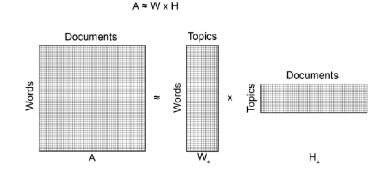

▪ Intuitively, 𝑾+ represents every topic and the terms found within the topic.直观地说，𝑾+ 表示每个主题和在主题中找到的术语。

▪ 𝑯+ represents every document and the topics found within the document.𝑯+ 代表每个文档和在文档中找到的主题。

It is assumed that all elements of matrices W and H are positive given the elements of A are positive.假设矩阵 W 和 H 的所有元素都是正数，因为 A 的元素都是正数。

When factorising the matrix, the two main cost functions that can be used are:在对矩阵进行因式分解时，可以使用两种主要的成本函数：

Generalised Kullback–Leibler Divergence广义库尔巴克-莱伯勒离差

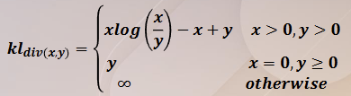

As the value of the KL-divergence reaches zero, the closeness of corresponding words increases.当 KL-发散值为零时，相应词语的接近度增加。

Frobenius Norm弗洛贝尼斯规范

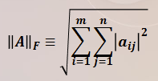

Defined as the square root of the sum of the absolute squares of its elements, the Frobenius Norm is a method of measuring how good an approximation is.Frobenius Norm 定义为其元素绝对平方和的平方根，是一种衡量近似程度的方法。

Implementation with Scikit-Learn:

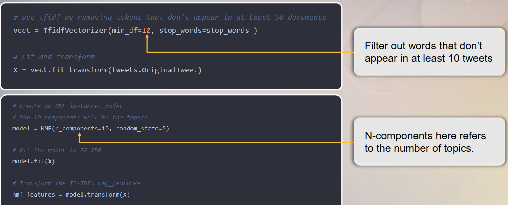

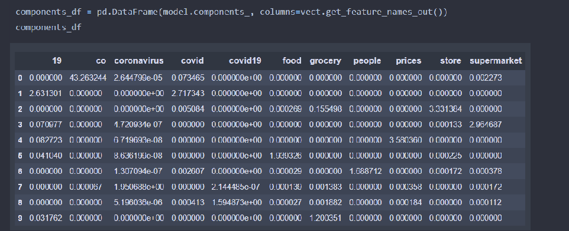

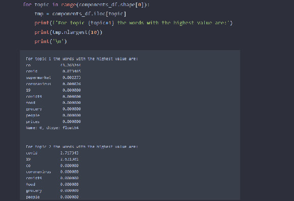

Advantages
▪ Parts-Based Representation:
NMF naturally produces parts-based representations, which is valuable in applications like image processing and text mining. It can discover fundamental components or topics within data.NMF 自然生成基于部件的表示，这在图像处理和文本挖掘等应用中非常有价值。它可以发现数据中的基本组成部分或主题。

▪ Noise Reduction:
NMF can help reduce the impact of noise in data because it focuses on capturing underlying patterns and structures rather than specific noisy details.NMF 可以帮助减少数据中噪声的影响，因为它侧重于捕捉基本模式和结构，而不是特定的噪声细节。

Limitations
▪ Non-convex Optimization:
NMF is based on non-convex optimisation, which means it may converge to local minima rather than the global minimum. The quality of results can be sensitive to initialisation.NMF 基于非凸优化，这意味着它可能会收敛到局部最小值，而不是全局最小值。结果的质量可能对初始化很敏感。
▪ Preprocessing Sensitivity:
NMF is highly sensitive to the preprocessing used on data, as well as the choice of cost function for the model.NMF 对用于数据的预处理以及模型成本函数的选择非常敏感。

Summary:

LDA
▪ A probabilistic generative model used for topic modeling in text data.用于文本数据主题建模的概率生成模型。
▪ Used to discover latent topics in text data, categorise documents into topics, or perform content recommendation based on topics. Suited for clustering tasks用于发现文本数据中的潜在主题，将文档归类为主题，或根据主题进行内容推荐。适用于聚类任务

LSA
▪ A linear algebra-based technique that uses singular value decomposition (SVD) for dimensionality reduction.一种基于线性代数的技术，使用奇异值分解（SVD）进行降维。
▪ Used to capture semantic relationships between terms and documents, improve information retrieval, or perform dimensionality reduction on text data.用于捕捉术语和文档之间的语义关系，改进信息检索，或对文本数据进行降维处理。

NMF
▪ Factorises a term- document matrix into two lower-dimensional non- negative matrices.将术语-文档矩阵析构为两个低维非负矩阵。
▪ Used to create parts-based representations to discover interpretable topics in text. NMF is valuable in scenarios where non-negativity and sparsity constraints are important.用于创建基于部分的表示法，以发现文本中可解释的主题。NMF 在非负性和稀疏性约束非常重要的情况下非常有价值。

## Dimensionality Reduction降维

Why do we need dimensionality reduction?

▪ Text data is often high-dimensional, sparse and complex.文本数据通常是高维、稀疏和复杂的。
▪ Computational requirements increase exponentially with the number of dimensions.计算要求随着维数的增加而呈指数增长。
▪ It is hence necessary to condense this data into a more usable form.因此，有必要将这些数据浓缩为更可用的形式。
▪ Vector dimensionality reduction in Natural Language Processing (NLP) is the process of reducing the number of features (dimensions) in a vector representation of text data.自然语言处理（NLP）中的矢量降维是减少文本数据矢量表示中特征（维度）数量的过程。
▪ Dimensionality Reduction techniques include:
- PCA
- SVD

### PCA
Principal Component Analysis (PCA):主成分分析

PCA is a linear technique that finds orthogonal axes in the data that capture the most variance.PCA 是一种线性技术，它能在数据中找到捕捉方差最大的正交轴。

▪ PCA aims to project the data onto a lower-dimensional space while minimizing information loss.PCA 旨在将数据投射到低维空间，同时尽量减少信息丢失。
▪ PCA works by transforming the original data to a new set of variables called the principal components (PCs), which are uncorrelated and can be ordered so that the first few PCs can retain most of the variation present in all the original variables of the dataset.PCA 的工作原理是将原始数据转换为一组新的变量，称为主成分（PC），这些主成分互不相关，可以排序，因此前几个 PC 可以保留数据集所有原始变量中存在的大部分变化。

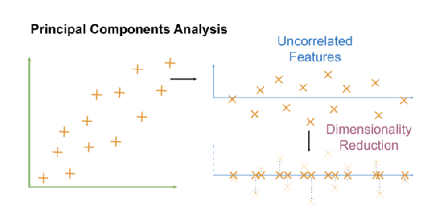

How it works:

▪ PCA aims to construct lines (2D), planes (3D) or hyperplanes (>3D) which are unit vectors orthogonal to the original features.PCA 的目的是构建与原始特征正交的单位向量线（2D）、平面（3D）或超平面（>3D）。
▪ To do this, we want to minimize the mean perpendicular distance from the PC line for all points through min 为此，我们希望通过最小值
\[
    min(\frac{1}{n}\sum _i^n(x_i^Tx_i-(u_1^Tx_1)^2))
\]
▪ The function reaches a minimum when 𝒖_𝟏= the eigenvector of the covariance matrix of x.当 𝒖_𝟏= x 的协方差矩阵的特征向量时，函数达到最小值。

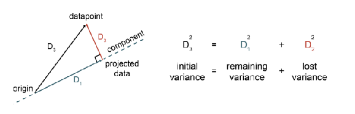

The goal is to maximize 𝐷1and minimize 𝐷2while keeping 𝐷3 constant.目标是最大化𝐷1，最小化𝐷2，同时保持𝐷3 不变。

PCA can be done manually using the following steps:

1 Standardise the data.将数据标准化。
2 Compute the covariance matrix of the dataset.计算数据集的协方差矩阵。
3 Derive the corresponding eigenvalues and eigenvectors on the normalised dataset.在标准化数据集上推导出相应的特征值和特征向量。
4 PCs can be calculated using the dot product of the eigenvectors and the standardised columns.可以使用特征向量和标准化列的点积计算 PC。

PCA in Scikit-Learn:

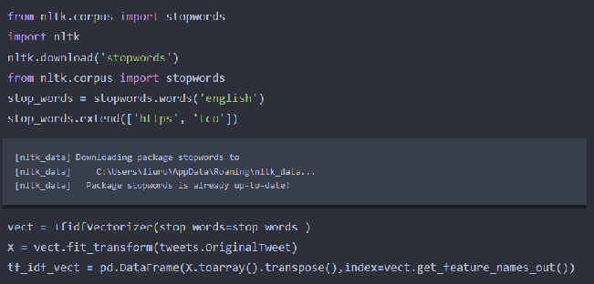

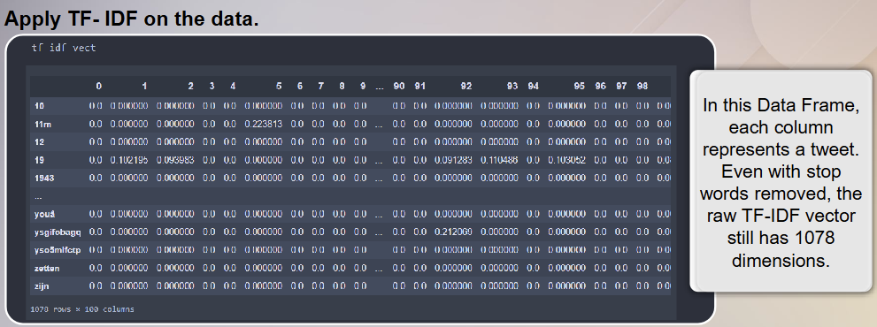

在该数据框中，每列代表一条推文。即使删除了停顿词，原始 TF-IDF 向量仍有 1078 个维度。

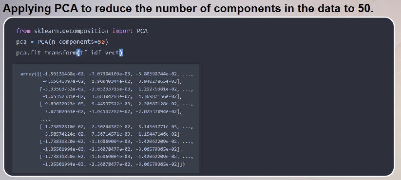

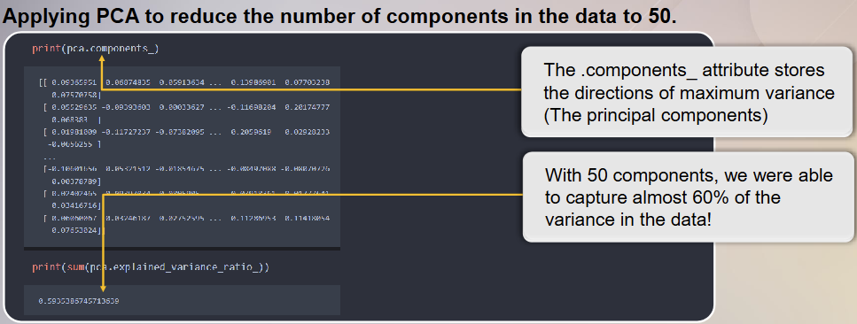

Advantages

▪ Visualisation:
PCA is valuable for visualising high-dimensional data. It projects data onto lower-dimensional spaces, making it easier to plot and analyse in 2D or 3D.PCA 对于高维数据的可视化很有价值。它可以将数据投射到低维空间，使其更易于绘制和分析二维或三维图形。
▪ Feature Engineering:
PCA can be used for feature engineering by creating new features as linear combinations of the original features. These new features may have improved discriminative power.PCA 可用于特征工程，将原始特征线性组合为新特征。这些新特征可能具有更好的判别能力。

Limitations
▪ Lack of Interpretability:
While PCA simplifies data representation, the new features (principal components) are linear combinations of the original features and may not have clear semantic meaning.虽然 PCA 简化了数据表示，但新特征（主成分）是原始特征的线性组合，可能没有明确的语义。
▪ Linearity Assumption:
PCA assumes that relationships between variables are linear. If the data contains non-linear relationships, PCA may not capture them effectively.PCA 假定变量之间的关系是线性的。如果数据包含非线性关系，则 PCA 可能无法有效捕捉这些关系。

### SVD

Singular Value Decomposition (SVD)奇异值分解

SVD aims to factorise a given matrix into three separate matrices to uncover hidden patterns and structure within the data.SVD 的目的是将给定矩阵因式分解为三个独立的矩阵，以揭示数据中隐藏的模式和结构。

Given an input matrix (a term-document matrix for NLP), SVD decomposes the matrix into 3 separate matrices:给定一个输入矩阵（NLP 的术语-文档矩阵），SVD 将矩阵分解为 3 个独立的矩阵：
▪ 𝑼: Left singular vectors matrix, representing relationships between rows in the original data. This often represents the relationship between terms and topics.左奇异向量矩阵，表示原始数据中各行之间的关系。这通常代表术语和主题之间的关系。
▪ 𝜮: Diagonal matrix of singular values, capturing the importance of each singular vector (higher values indicate more significance).奇异值对角矩阵，表示每个奇异向量的重要性（数值越大表示越重要）。
▪ 𝑽𝑻 : Right singular vectors matrix, representing relationships between columns in the original data. This often represents the relationship between documents and terms.右奇异向量矩阵，表示原始数据中列之间的关系。这通常代表文档和术语之间的关系。

A variation of SVD, k-SVD only takes into account the k largest singular values to approximate the data.作为 SVD 的一种变体，k-SVD 只考虑 k 个最大奇异值来逼近数据。

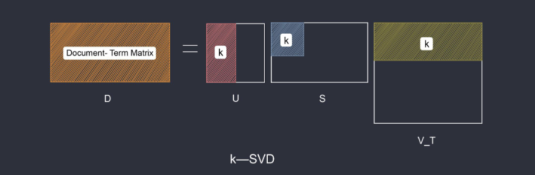

SVD in Scikit-Learn:

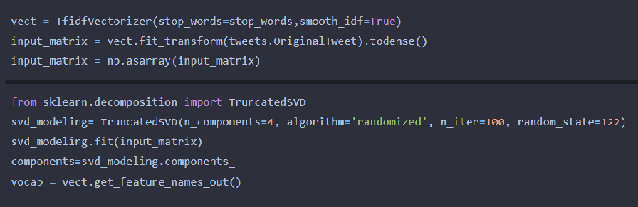

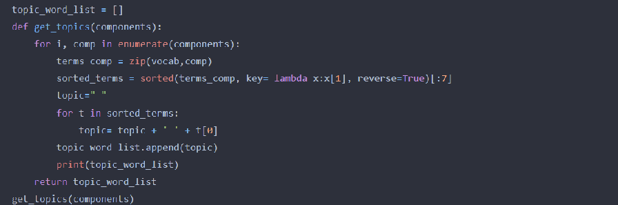

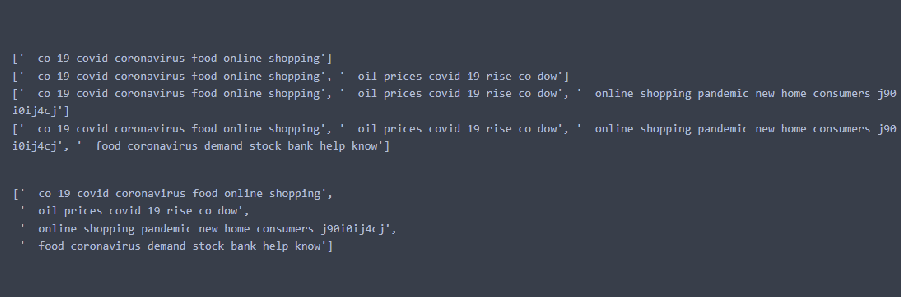

Advantages
▪ Semantic Relationships:
SVD captures semantic relationships between terms and documents. The resulting low-dimensional representations often contain meaningful information about the underlying structure of the data.SVD 可捕捉术语和文档之间的语义关系。由此产生的低维表示通常包含有关数据基本结构的有意义信息。
▪ Interpretability:
The reduced dimensions are often more interpretable, making it easier to understand and analyse the data. It aids in tasks like topic modeling and sentiment analysis.缩减后的维度通常更具可解释性，更易于理解和分析数据。它有助于主题建模和情感分析等任务。

Limitations
▪ Scaling Sensitivity:
SVD is sensitive to the scaling of features. It is essential to standardise or scale features appropriately before applying SVD.SVD 对特征的缩放很敏感。在应用 SVD 之前，必须对特征进行适当的标准化或缩放。
▪ Choosing Dimensionality:
Deciding the appropriate number of dimensions (singular values) to retain can be subjective. An incorrect choice may lead to information loss or overfitting.决定要保留的适当维数（奇异值）可能是主观的。不正确的选择可能会导致信息丢失或过度拟合。

## Summary

Term weighting schemes:
▪ Term weighting involve assigning numerical values to words in a document based on their importance, facilitating tasks like information retrieval and text analysis.术语加权涉及根据文档中词语的重要性为其分配数值，从而为信息检索和文本分析等任务提供便利。
▪ Helps prioritise relevant terms and improve the accuracy of various NLP tasks.有助于优先处理相关术语，提高各种 NLP 任务的准确性。

Topic Modeling:
▪ Topic modeling uncovers hidden thematic structures in large text collections, enabling automated discovery of topics and patterns within documents.主题建模可发现大型文本集合中隐藏的主题结构，从而自动发现文档中的主题和模式。
▪ Used for tasks like document clustering, content recommendation, and understanding the content of unstructured text data.用于文档聚类、内容推荐和理解非结构化文本数据内容等任务。

Vector Dimensionality Reduction:
▪ Vector dimensionality reduction simplifies high-dimensional data representations, improving computational efficiency and interpretability while retaining essential information.矢量降维简化了高维数据表示，提高了计算效率和可解释性，同时保留了基本信息。
▪ Transforms data into lower-dimensional spaces, aiding in visualisation, noise reduction, and data analysis.将数据转换到低维空间，有助于可视化、降噪和数据分析。

# Week 4

## Text Classification文本分类

Text classification tasks involve the labelling and classification of texts into various categories.文本分类任务涉及将文本标记和分类为不同类别。

These categories can include:
- Topics:
Topic Modelling aims to classify text into its various topics based on the contents of the text.主题建模旨在根据文本内容将文本分为不同的主题。
- Sentiment:
Sentiment analysis analyses general sentiment towards a company, person or product.情感分析分析对公司、个人或产品的一般情感。
Often applied on market research and reputation management tasks.常用于市场研究和声誉管理任务。
- Languages:
Language identification can be particularly useful in processing search engine queries.语言识别在处理搜索引擎查询时特别有用
- Authors:
Commonly used in forensics and cybersecurity.常用于取证和网络安全

Traditional ML classifiers aim to implement a generic algorithm to generate a trained model using a labelled training set.传统的 ML 分类器旨在实施一种通用算法，利用带标签的训练集生成一个训练有素的模型。

The classifier learns the characteristics of each label from the training data to assign labels to new data.分类器从训练数据中学习每个标签的特征，从而为新数据分配标签。

Text Classifiers generally feature:文本分类器一般具有以下特点：

Input:
- A document, 𝒅
- A predefined set of classes {𝒄𝟏, 𝒄𝟐, 𝒄𝟑 … 𝒄𝒋}预定义的类

Output:
- A predicted class 𝒄 ∈ 𝑪

Text classification can be achieved through:文本分类可通过以下方法实现

Rule based classifiers基于规则的分类器

ML models:ML 模型
- Naïve-Bayes
- Support Vector Machines (SVM)
- Extreme Learning Machines (ELM)
- Gaussian Processes
- Linear Regression

### Naïve Bayes

Naïve Bayes models for text classification take a BOW approach to text classification.用于文本分类的奈夫贝叶斯模型采用 BOW 方法进行文本分类。

Using the Bayes Theorem, for a document d and class c:使用贝叶斯定理，对于文档 d 和类别 c：

\[
    P(c|d)=\frac{P(d|c)P(c)}{P(d)}
\]

The most likely class 𝑐𝑐 is given by:最可能的类别 𝑐𝑐 由以下公式给出：

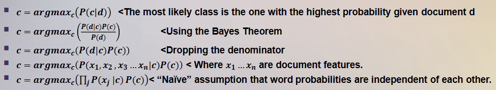

1. 最有可能的类别是文档 d 中概率最高的类别
2. 使用贝叶斯定理
3. 去分母
4. 其中，x1 ... xn 是文档特征。
5. 单词概率相互独立的 “天真 ”假设。

Using maximum likelihood estimators from the training corpus:使用训练语料库中的最大似然估计值：

Class Prior Probabilities:类别先验概率：

\[
    P(c)=\frac{count(docs labelled c)}{count(total docs)}
\]

Conditional Probabilities:条件概率

\[
    P(w_i|c)=\frac{count(docs with w_i labelled c)}{count(docs labelled c)}
\]

Zero Probability Problem

Imagine the following scenario:

 If we were trying to classify reviews into classes ‘positive’ and ‘negative’ and run across the word “excellent” in ‘review1’, which does not appear in any other positive reviews. 如果我们试图将评论分为 “正面 ”和 “负面 ”两类，并在 “review1 ”中发现了 “excellent”（“极好”）一词，而这个词并没有出现在其他任何正面评论中。

\[
    P(positive|review1) = 0
\]

because

\[
    P(excellent|positive) = 0
\]

These zero probabilities cannot be conditioned away no matter the evidence.无论证据如何，这些零概率都是无法消除的。

To avoid this issue, we introduce Laplace (or Add-One smoothing)为了避免这个问题，我们引入了拉普拉斯平滑法（或加一平滑法）

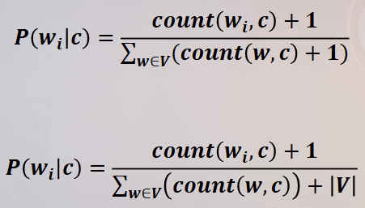

其中，V 是词汇量的大小

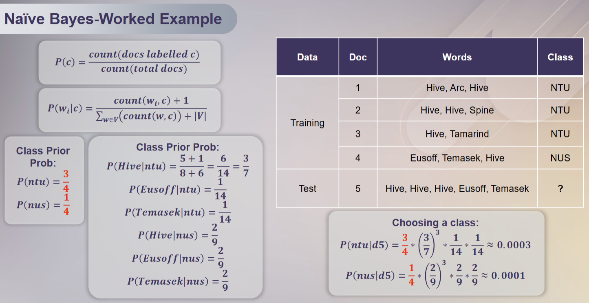

Data Preprocessing

Use RegEx to remove punctuation and special characters, convert all characters to lowercase.使用 RegEx 删除标点符号和特殊字符，将所有字符转换为小写。

Apply POS tagging and lemmatise input words 应用 POS 标记并对输入词进行词素化处理

Remove stop-words.删除停止词

Apply TF-IDF vectorisation.应用 TF-IDF 矢量化。

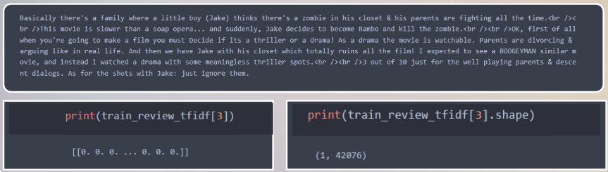

### Support Vector Machines

Support Vector Machines adopt a graphical approach to classifying data.支持向量机采用图形方法对数据进行分类。

SVMs aim to find hyperplanes that best separates data points of different classes in a high-dimensional space.SVM 的目标是在高维空间中找到最能分隔不同类别数据点的超平面。

SVMs select the hyperplane for which the closest points from the dataset are the farthest.SVM 选择与数据集最近的点距离最远的超平面。

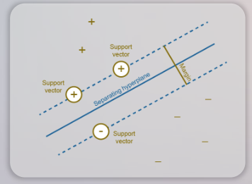

SVMs aim to maximise the margin between the hyperplanes and closest points from the dataset.SVM 的目标是最大化超平面与数据集最近点之间的边际。

To apply SVM in the context of NLP, the textual data need to be first represented as vectors. 要在 NLP 中应用 SVM，首先需要将文本数据表示为向量

- One of the most popular ways is to use TF-IDF vectorisation.最流行的方法之一是使用 TF-IDF 向量化。
- The equation of a hyperplane can be given by 超平面的方程可由 𝒘·x + b = 𝟎
- The distance between a point x to a hyperplane is 点 x 到超平面的距离为 $\frac{|wx+b|}{||w||^2}$
- The SVM algorithm aims to maximise this quantity by minimising the value of $||w||^2$ SVM 算法旨在通过最小化值来最大化这一数量。
- This is known as the ‘primal’ problem of SVMs.这就是 SVM 的 “基元 ”问题。

To optimise the SVM model, we employ a hinge loss function:为了优化 SVM 模型，我们采用了铰链损失函数：

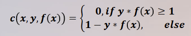

- If the predicted value and the actual value are of the same sign, the cost is 0.如果预测值和实际值符号相同，则成本为 0。
- If not, we calculate the loss value.如果不是，我们就计算损失值。
- A regularisation function, 𝑪 ∗ ||𝒘|| 𝟐 is often added to discourage the model from fitting the training data too closely and overfitting.正则化函数通常用来阻止模型过于拟合训练数据和过度拟合。

In many real-life scenarios including text processing, the data in the input space of an SVM may not be linearly separable, posing a challenge for SVMs to find a hyperplane to cut the data.在包括文本处理在内的许多实际应用场景中，SVM 输入空间中的数据可能不是线性可分离的，这就给 SVM 寻找超平面来切割数据带来了挑战。

The kernel trick addresses this limitation by mapping the data into a higher-dimensional feature space where it becomes linearly separable.核技巧通过将数据映射到更高维度的特征空间来解决这一限制，在该空间中，数据变得线性可分。

Instead of explicitly calculating the coordinates of data points in the higher-dimensional space, we compute the dot products between the data points in this space without ever computing the transformation explicitly.我们不需要明确计算高维空间中数据点的坐标，而是计算该空间中数据点之间的点积，而无需明确计算变换。

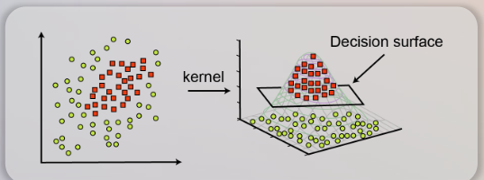

The most commonly used kernels include:最常用的内核包括

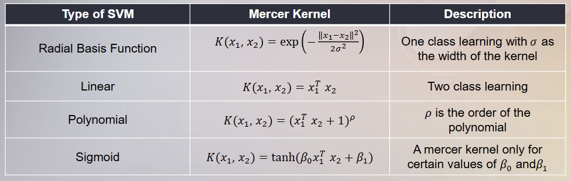

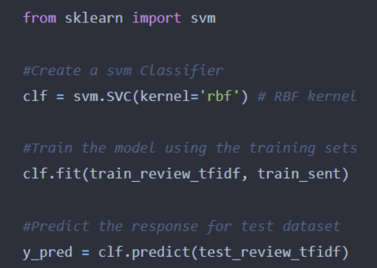

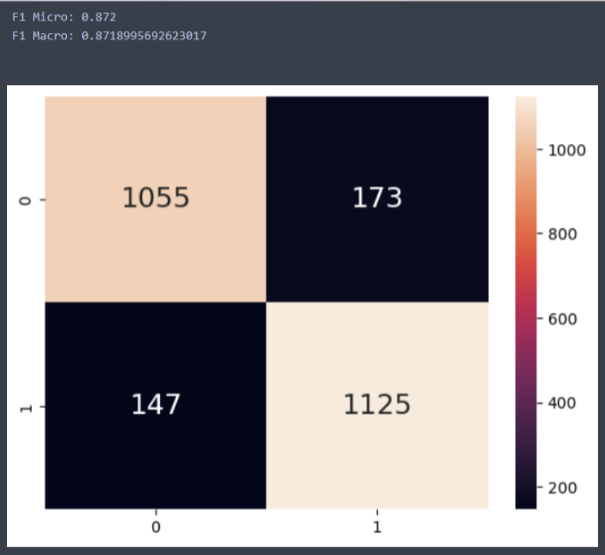

### Extreme Learning Machines (ELMs)

ELMs are shallow feedforward neural networks that feature a single hidden layer.ELM 是浅层前馈神经网络，只有一个隐藏层。

Unlike traditional neural networks, ELMs do not feature a backpropagation step.与传统神经网络不同，ELM 没有反向传播步骤。

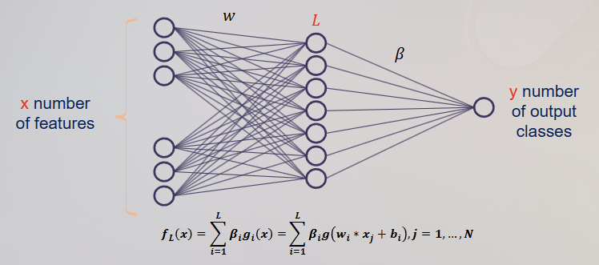

In ELMs, the weights between the input layer and the hidden layers are randomly initialized and not updated during training.在 ELM 中，输入层和隐藏层之间的权重是随机初始化的，在训练过程中不会更新。

The weights between the hidden layer and the output layer form a beta-matrix as shown below.隐藏层和输出层之间的权重构成一个贝塔矩阵，如下图所示。

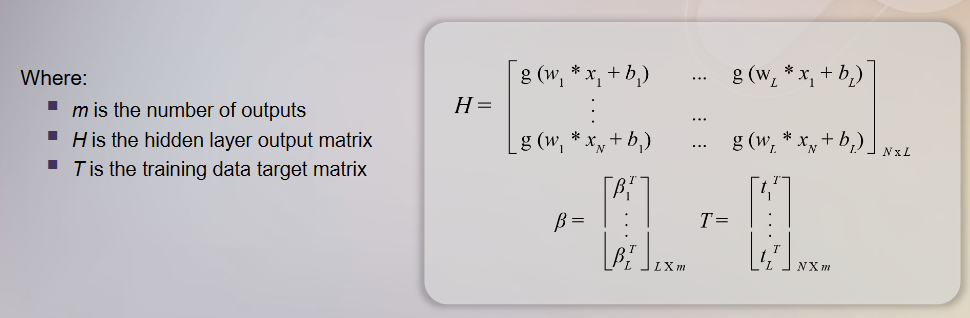

An ELM aims to find this matrix 𝛽 such that the error between the actual outputs (given by 𝐻·𝛽) and the target outputs (given by 𝑦) is minimised.ELM 的目标是找到这样一个矩阵 𝛽，使实际输出（由𝐻𝑦给出）与目标输出（由𝑦给出）之间的误差最小。

This can be formulated as an SLE given by 𝐻·𝛽 = 𝑦 这可以表述为一个 SLE

Since H is typically not square and may not have an exact inverse,由于 H 通常不是正方形，可能没有精确的倒数

We approximate 𝛽 with 𝛽 = (𝐻+) · 𝑦 
- Where 𝐻+ is the Moore-Penrose Pseudoinverse of H 其中𝐻+ 是 H 的摩尔-彭罗斯伪逆。
- In practice, 𝐻𝐻 +can be calculated using techniques like SVD.实际上，𝐻+ 可以通过 SVD 等技术计算出来。

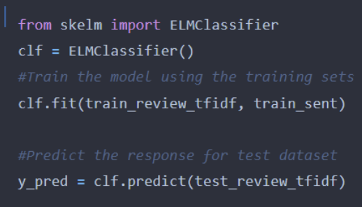

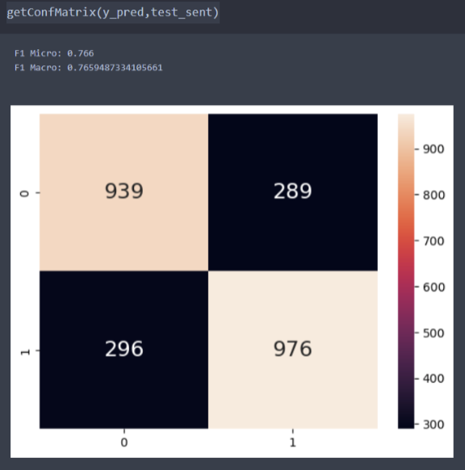

### Gaussian Processes

A Gaussian Process is a probabilistic model that defines a distribution over functions.高斯过程是一种概率模型，它定义了函数的分布。

Instead of modeling data points as fixed parameters, GPs model entire functions as random variables.GPs 不将数据点作为固定参数建模，而是将整个函数作为随机变量建模。

These functions are characterised by a mean function and a covariance function (or kernel function)这些函数的特征是均值函数和协方差函数（或核函数）

To create a GP function, we need to specify:要创建 GP 函数，我们需要指定

- A mean function, $E[f(x_i)]=\mu (x_i)$

- A covariance function aka a kernel function $Cov(f(x_i),f(x_j))=k(x_i,x_j)$又称核函数

Let 𝑲x be the kernel matrix for inputs x. The entries of this matrix are k(xi,xj). This matrix is also known as the gram matrix. 让𝑲x成为输入 x 的内核矩阵。该矩阵的条目为k(xi,xj)。这个矩阵也被称为克矩阵。

𝑲x must be positive and semidefinite for any X.对于任何 X，该矩阵都必须是正半有限矩阵。

This forms a distribution over function values at an arbitrarily finite set of points.这就形成了任意有限点集合上函数值的分布。

 Using the Kolmogorov Extension Theorem, we can extend this to be a distribution over functions, which is called a Gaussian Process.利用科尔莫哥罗夫扩展定理，我们可以将其扩展为函数的分布，这就是所谓的高斯过程。

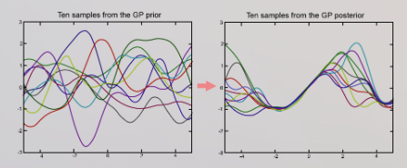

Similar to SVMs, we can choose from a range of kernel functions to map our data.与 SVM 类似，我们可以选择一系列核函数来映射数据。

A useful kernel is the RBF kernel:RBF 核是一个有用的核：

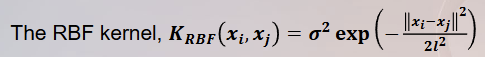

- It creates smooth, infinitely differentiable functions that are useful for modeling processes with smooth variations.它创建了平滑、无限可微的函数，可用于模拟具有平滑变化的过程。
  
- The hyperparameter 𝒍𝟐controls the length scale or the width of the kernel. Smaller values result in more wiggly functions, while larger values create smoother functions.超参数𝒍𝟐控制核的长度尺度或宽度。数值越小，函数越不稳定，数值越大，函数越平滑。

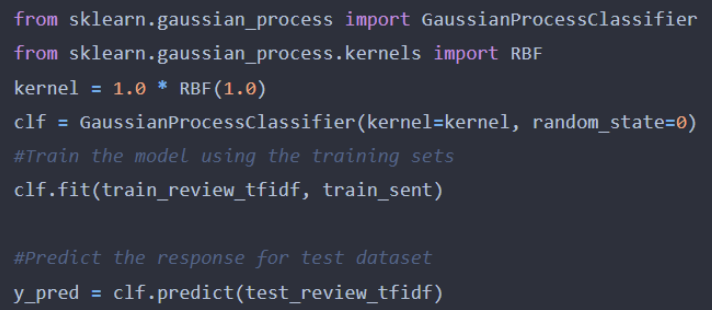

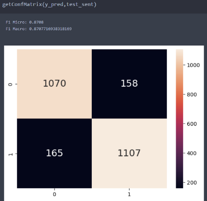

### Linear Regression

Linear Regression is a linear model that assumes the relationship between the input variables and the output is linear.线性回归是一种线性模型，假定输入变量与输出之间是线性关系。

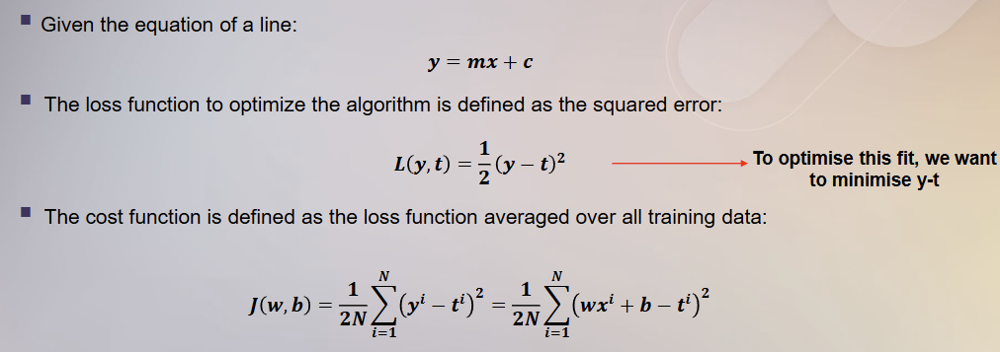

To minimise this cost function, we apply the gradient descent algorithm, where we initialise the weights and iteratively adjust them in the direction of steepest descent.为了最小化这一成本函数，我们采用了梯度下降算法，即初始化权重，并沿着最陡峭下降的方向反复调整权重。

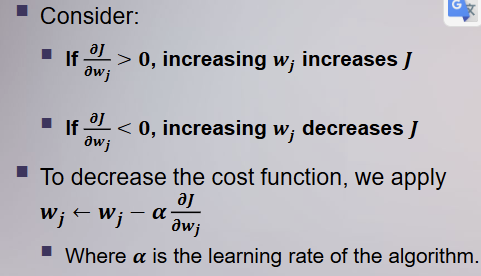

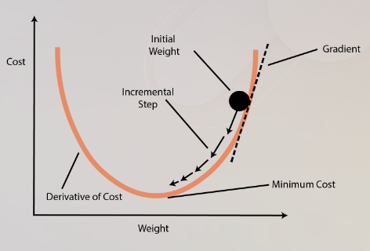

## Clustering聚类

Clustering is an unsupervised machine learning technique that aims to group data into clusters within the input space.聚类是一种无监督的机器学习技术，目的是在输入空间内将数据分组。

- The goal of clustering is to discover hidden structures in the data without any prior knowledge of the groupings.聚类的目的是发现数据中隐藏的结构，而无需事先了解分组情况。
- Clustering algorithms typically rely on a distance or similarity metric to measure how close or similar data points are in the feature space.聚类算法通常依靠距离或相似度量来衡量数据点在特征空间中的接近或相似程度。

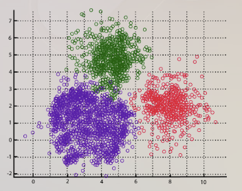

### K-Means

K-Means assumes there are k clusters among N input samples, and each data point is close to its cluster center (the mean of points in the cluster).K-Means 假设 N 个输入样本中有 k 个聚类，每个数据点都接近其聚类中心（聚类中各点的平均值）。

To compute the cluster centers, the centers are randomly initialised, then iteratively moved towards their closest data points. 在计算聚类中心时，先随机初始化中心，然后迭代移动到最接近的数据点。

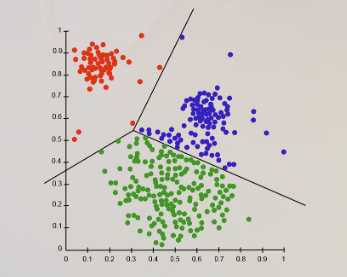

The standard K-Means algorithm works as follows:
Initialisation: The k centroids are randomly initialised within the Euclidean space.初始化： 在欧氏空间内随机初始化 k 个中心点

We then iteratively alternate between the following:然后，我们在以下几种情况之间反复交替：
- Assignment: Assign each data point to its closest cluster.分配： 将每个数据点分配到最接近的聚类中。
- Refitting: Move the centroid to the center of the new cluster.重新拟合： 将中心点移动到新聚类的中心。

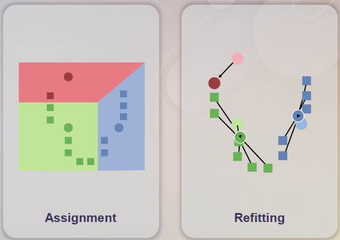

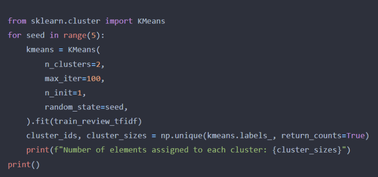

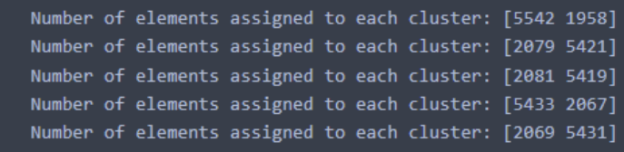

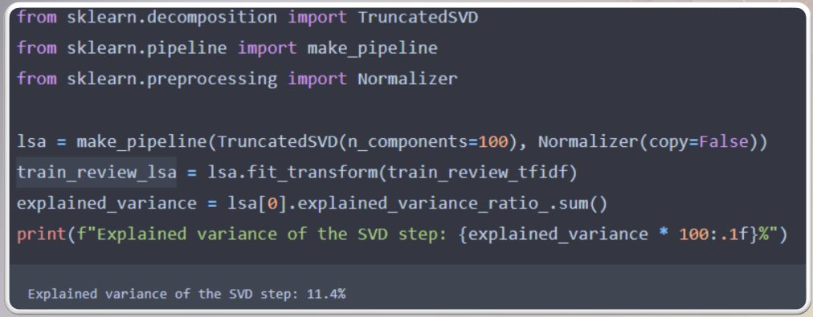

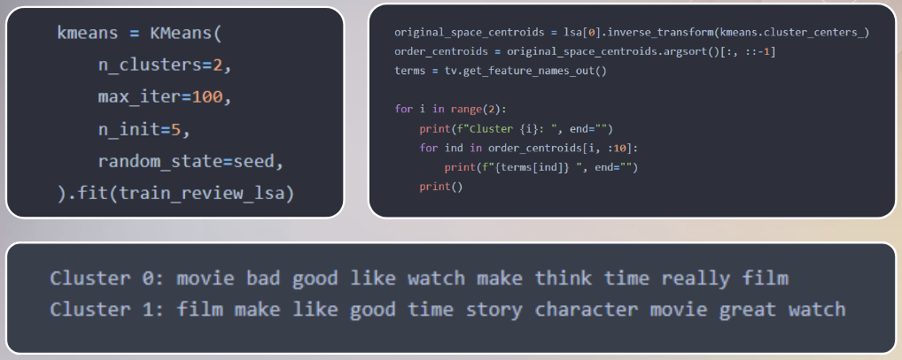

### Hierarchical Clustering

Clusters in hierarchical clustering are visually represented in a hierarchical tree called a dendrogram.分层聚类中的聚类以一种叫做树枝图的分层树直观地表示出来。

There is no need to pre-specify the number of clusters. Instead, the dendrogram can be cut at the appropriate level to obtain the desired number of clusters.无需预先指定聚类的数量。相反，可以在适当的层次上切割树枝图，以获得所需的聚类数目。

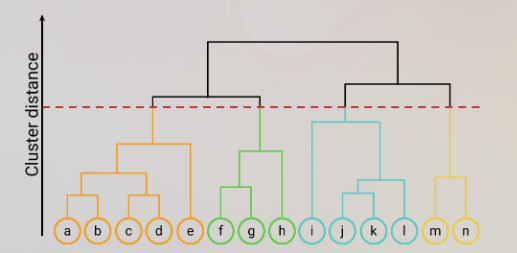

There are two general approaches to Hierarchical Clustering:

Agglomerative聚合
Each object is initiall considered its own cluster. These clusters are merged with a distance metric until only one cluster remains. On a tree, this represents a bottom-up approach.每个对象最初都被视为自己的聚类。这些簇通过距离度量进行合并，直到只剩下一个簇。在一棵树上，这是一种自下而上的方法。

Divisive分裂
Each object is initially considered as one cluster. These clusters are split with a distance metric until each object is its own cluster. On a tree, this represents a top-down approach.每个对象最初被视为一个群组。这些簇会用距离度量进行拆分，直到每个对象都成为自己的簇为止。在一棵树上，这是一种自上而下的方法。

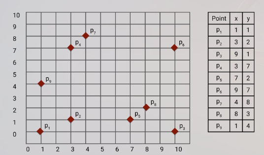

Split the data into two clusters.

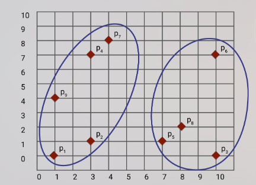

Min Linkage

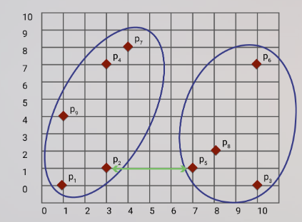

Max Linkage

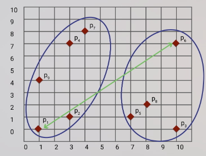

Centroid Linkage

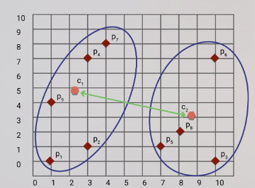

Average Linkage

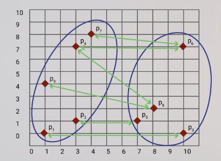

- The ward linkage method computes the variance between the clusters rather than directly measuring the distance between classes.沃德联系法计算的是聚类之间的差异，而不是直接测量类之间的距离。
- Compared to the distance-based measures described above, the Ward method is less susceptible to noise and outliers.与上述基于距离的测量方法相比，沃德方法不易受噪声和异常值的影响。

### Fuzzy Clustering

Fuzzy Clustering is similar to the K-Means algorithm with 1 key difference:模糊聚类与 K-Means 算法相似，但有一个主要区别：

Data points within the fuzzy clusters do not belong to a singular cluster.模糊聚类中的数据点不属于一个单一的聚类。

Instead, each data point has a coefficient for each cluster, representing the likelihood of the datapoint being part of that cluster.相反，每个数据点在每个聚类中都有一个系数，代表该数据点属于该聚类的可能性。

The centroid of a cluster is the mean of all points, weighted by their degree of belonging to the cluster.聚类的中心点是所有点的平均值，并根据其属于该聚类的程度进行加权。

## NLP Applications

- Many traditional ML algorithms require structured numerical input to function effectively.许多传统的 ML 算法需要结构化的数字输入才能有效运行。
- For text classification, this means we have to find a numerical representation for textual data.对于文本分类来说，这意味着我们必须为文本数据找到一种数字表示方法。
- This can come in the form of TF-IDF vectorisation or other vectorisation techniques (covered next week).其形式可以是 TF-IDF 矢量化或其他矢量化技术（下周介绍）。
- In the context of NLP, classifiers can be used to perform sentiment analysis, intent classification and authorship attribution, just to name a few.在 NLP 中，分类器可用于进行情感分析、意图分类和作者归属等。
- Similarly, clustering techniques can help us perform document clustering and tasks like spam detection.同样，聚类技术可以帮助我们执行文档聚类和垃圾邮件检测等任务。

# Week 5

## Evaluation Metrics评估指标

After the process of text classification, there is a need for us to evaluate the accuracy of our models quantitatively.文本分类过程结束后，我们需要对模型的准确性进行定量评估。

Evaluation metrics assist us in the following tasks:评估指标有助于我们完成以下任务：

Objective Comparisons客观比较
Metrics provide a common framework for assessing and comparing performance, allowing us to objectively compare the performances of our NLP models.度量标准为评估和比较性能提供了一个通用框架，使我们能够客观地比较 NLP 模型的性能。

Model Selection模型选择
Evaluation metrics help us make informed choices in selecting the best-performing model or system among multiple candidates.评估指标有助于我们做出明智的选择，从多个候选模型或系统中选出性能最佳的模型或系统。

Hyperparameter Tuning超参数调整
When tuning hyperparameters and optimising models, evaluation metrics guide the process. Evaluation metrics allow us to assess the impact of hyperparameter choices and select the set of hyperparameters that lead to the best performance.在调整超参数和优化模型时，评估指标对整个过程具有指导作用。通过评估指标，我们可以评估超参数选择的影响，并选择能带来最佳性能的超参数集。

Text models are generally split into two types;文本模型一般分为两种；

Predictive: Models trained to make predictions or classifications based on input data. These are our classification models and regression models.预测性： 根据输入数据进行预测或分类的训练模型。这些是我们的分类模型和回归模型。
Evaluation metrics include:
▪ Confusion Matrix混淆矩阵
▪ F1 ScoresF1 分数
▪ Area Under Curve (AUC-ROC)曲线下面积 (AUC-ROC)

Generative: Models trained to create new data, typically in the form of text. These come in the form of AI Chatbots, translators and text summarisers.生成： 为创建新数据而训练的模型，通常以文本形式出现。其形式包括人工智能聊天机器人、翻译器和文本摘要器。
Evaluation metrics include:
▪ BLEU
▪ ROUGE
▪ METEOR

### Confusion Matrix

A confusion matrix is an N X N matrix, where N is the number of predicted classes.混淆矩阵是一个 N X N 矩阵，其中 N 是预测类别的数量。

For a binary prediction, the confusion matrix will be a 2 x 2 matrix.对于二元预测，混淆矩阵将是一个 2 x 2 矩阵。

A 2 x 2 matrix will feature 4 different combinations of predicted and actual values.2 x 2 矩阵将包含预测值和实际值的 4 种不同组合。

▪ True Positive (TP): Accurately predicted positive values.真实正值 (TP)： 准确预测正值。
▪ True Negative (TN): Accurately predicted negative values.真负值 (TN)： 准确预测的负值。
▪ False Positive (FP): (Type 1 Error): Negative values inaccurately predicted to be positive.假阳性 (FP)：（类型 1 错误）： 不准确预测为阳性的负值。
▪ False Negative (FN): (Type 2 Error): Positive values inaccurately predicted to be negative.假阴性 (FN)：（类型 2 误差）： 不准确地将正值预测为负值。

Other metrics can be calculated from the confusion matrix, including:根据混淆矩阵还可以计算出其他指标，包括
▪ Accuracy: the proportion of the total number of predictions that are correct.准确度：正确预测占预测总数的比例。
▪ Positive Predictive Value or Precision: the proportion of positive cases that are correctly identified.阳性预测值或精确度：正确识别的阳性案例比例。
▪ Negative Predictive Value: the proportion of negative cases that are correctly identified.阴性预测值：正确识别的阴性病例比例。
▪ Sensitivity or Recall: the proportion of actual positive cases which are correctly identified.灵敏度或召回率：正确识别出的实际阳性病例的比例。
▪ Specificity: the proportion of actual negative cases which are correctly identified.特异性：正确识别出的实际阴性病例的比例。
▪ Rate: It is a measuring factor in a confusion matrix. It has also 4 types TPR, FPR, TNR, and FNR.率： 它是混淆矩阵中的一个测量因子。它也有 4 种类型：TPR、FPR、TNR 和 FNR。

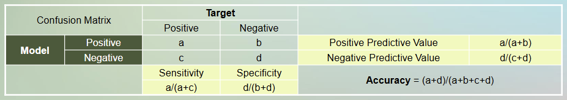

Accuracy:
▪ Defined by $\frac{𝑇𝑃+𝑇𝑁}{ 𝑇𝑃+𝑇𝑁+𝐹𝑃+𝐹𝑁}$

▪ Provides an overall assessment of the model's correctness.对模型的正确性进行总体评估。

▪ Can be misleading when dealing with imbalanced datasets, where one class significantly outnumbers the other.在处理不平衡数据集时可能会产生误导，即一个类别的数量明显多于另一个类别。

Precision:
▪ Defined by $\frac{𝑇𝑃} {𝑇𝑃+𝐹𝑃}$
▪ Quantifies the proportion of positive predictions that were correct.量化正确预测中正面预测的比例。
▪ Used in cases where false positives are costly or undesirable.用于误报代价高或不受欢迎的情况。

Recall:
▪ Defined by $\frac{𝑇𝑃}{𝑇𝑃+𝐹𝑁}$
▪ Measures the proportion of actual positive cases that were correctly identified by the model.测量模型正确识别的实际阳性病例的比例。
▪ Used when missing a positive can have serious consequences.用于漏检阳性结果会造成严重后果的情况。

### Micro and Macro Metrics

Micro and macro evaluation metrics are two different approaches to aggregating and reporting performance measures, such as precision, recall, and F1-Score.微观和宏观评价指标是汇总和报告精确度、召回率和 F1 分数等性能指标的两种不同方法。

Micro Metrics:
Aggregate the contributions of all classes to compute the average metric.汇总所有类别的贡献，计算平均度量。
▪ Micro Precision:
▪ Calculates the precision for each class individually, sums up the numerators (true positives), and divides by the sum of the denominators (true positives and false positives) across all classes.单独计算每个类别的精确度，将分子（真阳性）相加，然后除以所有类别的分母（真阳性和假阳性）之和。

$\frac{𝑇𝑃1 +𝑇𝑃2 +⋯+𝑇𝑃𝑁}{𝑇𝑃1 +𝑇𝑃2 +⋯+𝑇𝑃𝑁+ 𝐹𝑃1 +𝐹𝑃2 +⋯+𝐹𝑃𝑁}$

Macro Metrics:
Evaluate the model's performance on each class independently and then average the results.独立评估模型在每个类别上的表现，然后求取平均值。
▪ Macro Precision:
▪ Calculates the precision for each class individually and then takes the average of these precision scores.单独计算每个类别的精确度，然后取这些精确度分数的平均值。

$\frac {𝑃𝑟𝑒𝑐𝑖𝑠𝑖𝑜𝑛1 +𝑃𝑟𝑒𝑐𝑖𝑠𝑖𝑜𝑛2 +⋯+𝑃𝑟𝑒𝑐𝑖𝑠𝑖𝑜𝑛𝑁}{N}$

▪ Micro metrics are used when overall classification performance needs to be emphasized, giving equal importance to all instances. They are particularly useful when class imbalance is present, as they consider all instances collectively.微指标用于需要强调整体分类性能的情况，对所有实例给予同等重视。当存在类别不平衡时，微观指标尤其有用，因为它们会综合考虑所有实例。
▪ Macro metrics are used to evaluate the model's performance on each class independently and then average the results. They are suitable when each class is considered equally important and the model's ability to perform well on all classes is to be assessed.宏观指标用于独立评估模型在每个类别上的性能，然后将结果平均。当每个类别被认为同等重要，并且需要评估模型在所有类别上的表现能力时，这些指标就非常适合。

To apply confusion matrices, let’s use last week’s results on the IMDB dataset:

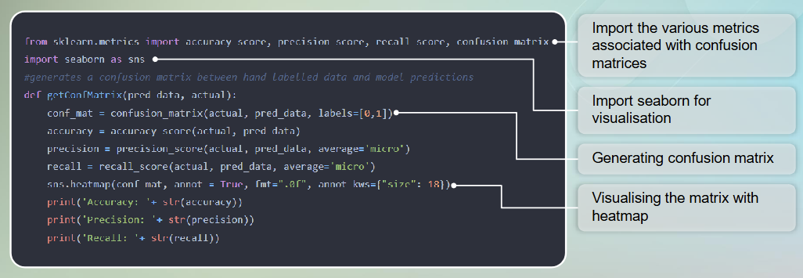

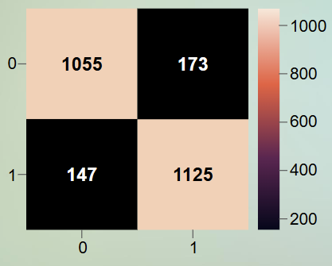

### F1 Score

▪ The harmonic mean of precision and recall values for a classification problem.分类问题的精确度和召回值的调和平均值。
▪ Allows us to optimise both precision and recall values for a classification problem.允许我们对分类问题的精确度和召回值进行优化。
▪ The formula is given by: $(\frac{𝑟𝑒𝑐𝑎𝑙𝑙^{−1}+𝑝𝑟𝑒𝑐𝑖𝑠𝑖𝑜𝑛^{−1}}{2})^{−1} = 2 ∙ \frac{𝑝𝑟𝑒𝑐𝑖𝑠𝑖𝑜𝑛∙𝑟𝑒𝑐𝑎𝑙𝑙}{𝑝𝑟𝑒𝑐𝑖𝑠𝑖𝑜𝑛+𝑟𝑒𝑐𝑎𝑙𝑙}$
▪ Harmonic mean is used in place of an arithmetic mean as it gives a more balanced measure when dealing with extreme values.使用谐平均数代替算术平均数，因为在处理极端值时，谐平均数能提供更均衡的测量。
▪ Consider an extreme scenario where we have precision of 0.9 and recall of 0.1考虑精确度为 0.9、召回率为 0.1 的极端情况。
▪ An arithmetic mean will yield 0.5, suggesting moderate performance.算术平均值为 0.5，表明性能适中。
▪ The harmonic mean will yield 0.18, indicating a significant issue in balancing between precision and recall.调和平均数的结果为 0.18，表明在平衡精确度和召回率方面存在重大问题。

F-1 Scores can be implemented in SKLearn as such:

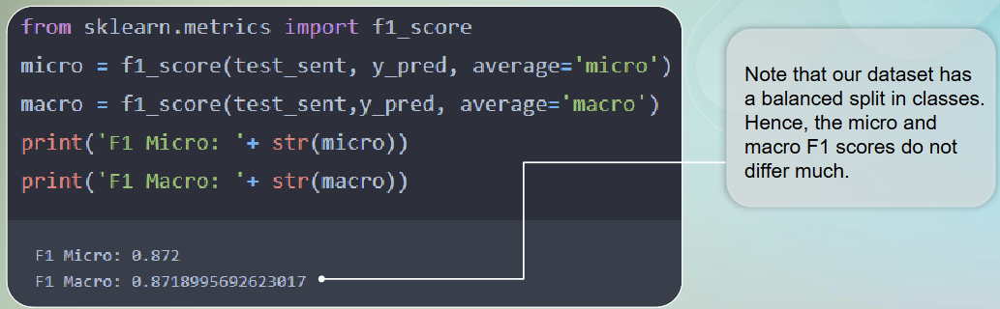

### Area Under Curve (AUC-ROC)

▪ The Receiver Operating Characteristic (ROC) curve is a graphical representation of a model's performance.接收者工作特征曲线（ROC）是模型性能的图形表示。
▪ The Area Under Curve of the ROC curve (AUC-ROC) is the most widely used metric in measuring the performance of binary classification models where the underlying model outputs are probabilistic values.ROC 曲线下面积（AUC-ROC）是衡量二元分类模型性能最广泛使用的指标，在这些模型中，基础模型输出是概率值。
▪ For these models, classification is done by choosing a decision boundary (threshold value). For example, model outputs with a value >=0.5 can be labeled to the class 1, and <0.5 to the class 0.对于这些模型，分类是通过选择一个决策边界（阈值）来完成的。例如，数值 >=0.5 的模型输出可标记为类别 1，而 <0.5 则标记为类别 0。
▪ Different choices of decision boundary will give different True Positive Rate and False Positive Rate不同的判定边界会产生不同的真阳性率和假阳性率。
▪ The ROC curve is created by plotting the True Positive Rate against the False Positive Rate as we vary the model decision boundary (threshold).当我们改变模型的判定边界（阈值）时，通过绘制真阳性率与假阳性率的对比曲线，可以创建 ROC 曲线。
▪ The ROC curve reflects the trade-off between a model's ability to correctly identify positive instances (True Positives) and its tendency to incorrectly classify negative instances as positive (False Positives).ROC 曲线反映了模型正确识别阳性实例（真阳性）的能力与错误地将阴性实例归类为阳性（假阳性）的倾向之间的权衡。

▪ The Receiver Operating Characteristic (ROC) curve is a graphical representation of a model’s performance.接收者工作特征曲线 (ROC) 是模型性能的图形表示。AUC-ROC 是一个标量值，表示 ROC 曲线下的面积。
▪ The AUC-ROC is a scalar value that represents the area under the ROC curve.
▪ Values range from 0-1:数值范围为 0-1：
▪ A model with an AUC-ROC value of 0.5 performs no better than random chance.AUC-ROC 值为 0.5 的模型的表现并不比随机概率好。
▪ A model with an AUC-ROC value greater than 0.5 indicates a better-than-random classifier.AUC-ROC 值大于 0.5 的模型表示分类器优于随机分类器。
▪ A model with an AUC-ROC value of 1 is a perfect classifier, meaning it has achieved perfect discrimination between the classes.AUC-ROC 值为 1 的模型是完美的分类器，这意味着它实现了类别之间的完美区分。

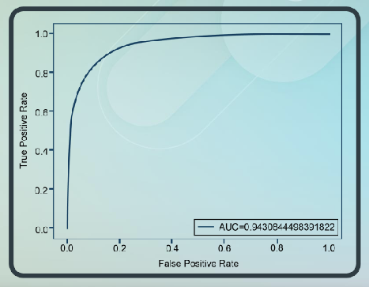

To generate a ROC curve, we can use the metrics library in SKLearn.

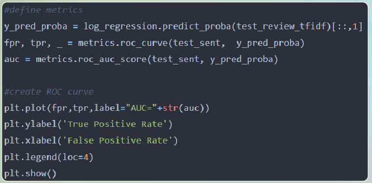

### BLEU

▪ Bilingual Evaluation Understudy (BLEU) evaluates the similarity between a target sentence and a generated sentence.双语评估（BLEU）评估目标句和生成句之间的相似性。
▪ BLEU counts the number of n-grams that appear in both the generated sentence and the target sentence.BLEU 计算同时出现在生成句和目标句中的 n-gram 的数量。
▪ Common n-gram sizes used are 1, 2, 3, or 4.常用的 n-gram 大小为 1、2、3 或 4。
▪ BLEU calculates the precision of matching n-grams.BLEU 计算 n-gram 匹配的精确度。
▪ Mostly used in machine translation applications.多用于机器翻译应用。

▪ Precision is defined as:

\[
    𝑃𝑟𝑒𝑐𝑖𝑠𝑖𝑜𝑛 = \frac {𝑇𝑜𝑡𝑎𝑙 𝑛𝑢𝑚𝑏𝑒𝑟 𝑜𝑓 𝑐𝑜𝑟𝑟𝑒𝑐𝑡𝑙𝑦 𝑝𝑟𝑒𝑑𝑖𝑐𝑡𝑒𝑑 𝑛−𝑔𝑟𝑎𝑚𝑠 𝑖𝑛 𝑡ℎ𝑒 𝑡𝑎𝑟𝑔𝑒𝑡 𝑠𝑒𝑛𝑡𝑒𝑛𝑐𝑒}{𝑇𝑜𝑡𝑎𝑙 𝑛𝑢𝑚𝑏𝑒𝑟 𝑜𝑓 𝑛−𝑔𝑟𝑎𝑚𝑠 𝑖𝑛 𝑡ℎ𝑒 𝑝𝑟𝑒𝑑𝑖𝑐𝑡𝑒𝑑 𝑠𝑒𝑛𝑡𝑒𝑛𝑐𝑒}
\]

We first focus on 1-grams (single words).

Predicted Sentence: He eats an apple.
Target Sentence: He ate an apple.
In this case, the precision for the predicted sentence is 3/4.在这种情况下，预测句子的精确度为 3/4。

However, consider the following:
Predicted Sentence: He He He.
Target Sentence: He ate an apple.

Predicted Sentence: He He He eats tasty fruit.
Target Sentence: He ate an apple.
Target Sentence: He is eating a tasty apple.

To avoid repetitions, we use clipped precision instead of precision:为避免重复，我们使用精确度剪切代替精确度：
▪ We compare each word from the predicted sentence with all the target sentences. If the word has a match in any target sentence, it is considered correct.我们将预测句子中的每个单词与所有目标句子进行比较。如果该词在任何目标句中都有匹配，则认为该词是正确的。
▪ We limit the count for each correct word to the maximum number of times that that word occurs across all target sentences. This helps to avoid the repetition problem. 我们将每个正确单词的计数限制为该单词在所有目标句中出现的最大次数。这有助于避免重复问题。
The clipped precision of our predicted sentence is 2/6 (As the repeated “He”s are not counted.)我们预测句子的剪切精度为 2/6（因为重复出现的 “他 ”没有计算在内）。

BLEU calculated the precision n-gram scores for translated sentences.BLEU 计算翻译句子的精确度 n-gram 分数。

Predicted Sentence: The guard arrived late because it was raining.
Target Sentence: The guard arrived late because of the rain.

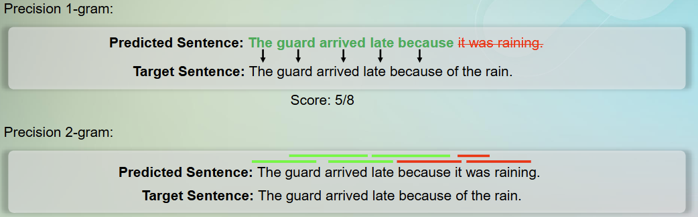

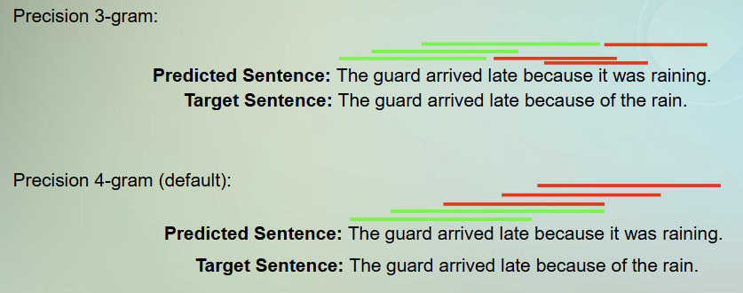

The geometric average of the 4-gram is computed as such:4-gram 的几何平均数就是这样计算出来的：

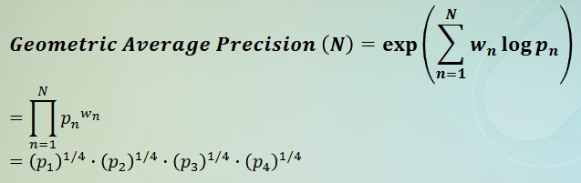

A brevity penalty is then added to penalize sentences that are too short. (As shorter sentences can generate a misleading probability).然后再加上简短惩罚，以惩罚过于简短的句子。(因为较短的句子会产生误导概率)。

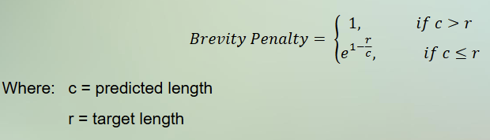

The BLEU score is then given by:

\[
    𝐵𝐿𝐸𝑈 = 𝐵𝑟𝑒𝑣𝑖𝑡𝑦 𝑃𝑒𝑛𝑎𝑙𝑡𝑦 ∙ 𝐺𝑒𝑜𝑚𝑒𝑡𝑟𝑖𝑐 𝐴𝑣𝑒𝑟𝑎𝑔𝑒 𝑃𝑟𝑒𝑐𝑖𝑠𝑖𝑜𝑛 (𝑁)
\]

Python implementation of BLEU:

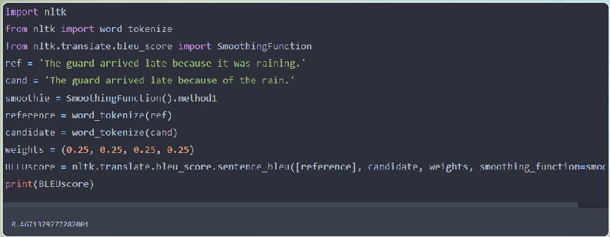

### ROUGE

▪ Recall-Oriented Understudy for Gisting Evaluation (ROUGE) is a set of metrics commonly used for text summarisation tasks.以召回为导向的摘要评估研究（ROUGE）是一组常用于文本摘要任务的指标。
▪ ROUGE scores are designed to assess the similarity and overlap between the words or phrases in the machine-generated text and the reference text.ROUGE 分数旨在评估机器生成文本中的单词或短语与参考文本之间的相似度和重叠度。
▪ The general formula for ROUGE is given as:

\[
    ROUGE = \Sigma (𝑅𝑒𝑐𝑎𝑙𝑙 𝑜𝑓 𝑛 − 𝑔𝑟𝑎𝑚𝑠)
\]

▪ ROUGE is split into 3 types:
▪ ROUGE-N: ROUGE-N measures the overlap of n-grams.ROUGE-N 测量 n-grams 的重叠度。
▪ ROUGE-L: ROUGE-L measures the longest common subsequence (LCS) between the candidate text and the reference text.ROUGE-L 测量候选文本与参考文本之间的最长共同子序列 (LCS)。
▪ ROUGE-S: ROUGE-S measures the skip-bigram (bi-gram with at most one intervening word) overlap between the candidate text and the reference text.ROUGE-S： ROUGE-S 测量候选文本与参考文本之间的跳字重合度（最多有一个间隔词的双元组）。

#### ROUGE-N

▪ ROUGE-N measures the overlap of n-grams (contiguous sequences of n words) between the candidate text and the reference text.ROUGE-N 衡量候选文本和参考文本之间 n-grams（n 个单词的连续序列）的重叠度。
▪ Precision, recall, and F1-score are computed based on the n-gram overlap.精确度、召回率和 F1 分数根据 n-gram 重叠度计算。
▪ Used to evaluate the grammatical correctness and fluency of generated text.用于评估生成文本的语法正确性和流畅性。
▪ Precision and Recall given by:精确度和召回率由以下公式给出：

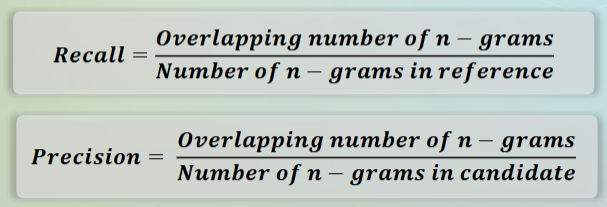

#### ROUGE-L

▪ Measures the longest common subsequence (LCS) between the candidate text and the reference text.测量候选文本与参考文本之间的最长公共子序列（LCS）。
▪ Precision, recall, and F1-score are computed based on the length of the LCS.根据 LCS 的长度计算精确度、召回率和 F1 分数。
▪ Used to evaluate the semantic similarity and content coverage of generated text.用于评估生成文本的语义相似性和内容覆盖率。
▪ Precision and Recall given by:精确度和召回率由以下公式给出：

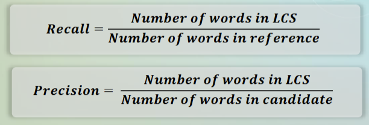

#### ROUGE-S

▪ Measures the skip-bigram (bi-gram with at most one intervening word) overlap between the candidate text and the reference text.测量候选文本与参考文本之间的跳格（最多有一个间隔词的双格）重叠度。
▪ Precision, recall, and F1-score are computed based on the skip-bigram overlap.精确度、召回率和 F1 分数都是根据跳读重合度计算的。
▪ Used to evaluate the coherence and local cohesion of generated text.用于评估生成文本的连贯性和局部内聚性。
▪ Precision and Recall given by:精确度和召回率由以下公式给出：

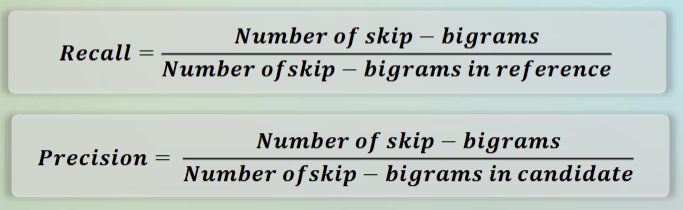

To implement the ROUGE score, we can use the evaluate library from HuggingFace

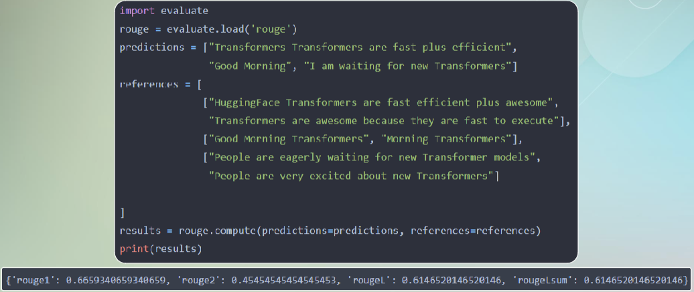

### METEOR

▪ Metric for Evaluation of Translation with Explicit Ordering (METEOR) is used to assess the quality of machine translation systems.显式排序翻译评估指标 (METEOR) 用于评估机器翻译系统的质量。
▪ It complements other popular metrics like BLEU and ROUGE.它是对 BLEU 和 ROUGE 等其他流行指标的补充。
▪ METEOR takes into account the sequence of words in the output sentence.METEOR 考虑了输出句子中单词的顺序
▪ It considers the importance of word order in evaluating the translation quality.它考虑了词序在评估翻译质量中的重要性。

▪ To account for word order, a chunk penalty is included in the calculation of the METEOR metric.为了考虑词序问题，在计算 METEOR 指标时加入了词块惩罚。
▪ Intuitively, it represents the idea that a good translation should not only have words that are synonymous with the reference, but the words should also be in the correct order and grouped together in meaningful chunks.直观地说，它代表了这样一种理念，即好的译文不仅要有与参考文献同义的词语，而且词语的顺序也要正确，并以有意义的语块形式组合在一起。
▪ The chunk penalty is computed as:语块惩罚的计算公式为

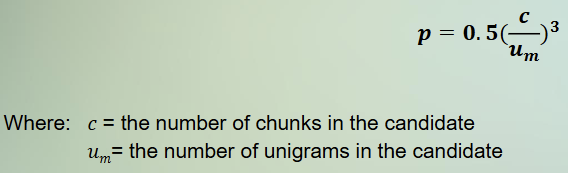

▪ The final METEOR score is then given by: 𝑀=𝐹𝑚𝑒𝑎𝑛 (1−𝑝), where Fmean is a modified F1 score specifically used in METEOR. METEOR 的最终得分由以下公式得出： 𝑀=𝐹𝑚𝑒𝑎𝑛 (1-𝑝)，其中 Fmean 是 METEOR 专门使用的修正 F1 分数。

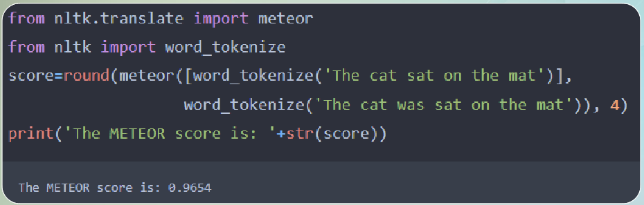

## Word Embeddings 词语嵌入

▪ To process textual data, we must convert raw text data into meaningful numerical representations.要处理文本数据，我们必须将原始文本数据转换成有意义的数字表示。
▪ We have previously covered methods like BOW and TF-IDF.我们之前介绍过 BOW 和 TF-IDF 等方法。
▪ These methods however, have important drawbacks:但是，这些方法都有重要的缺点
- They have limited ability in capture semantic meaning of the words.它们捕捉词语语义的能力有限。
- They are computationally inefficient and require high-dimensional presentation when the corpus is large.计算效率低，当语料库较大时需要高维呈现。
▪ We will introduce two advanced embedding methods that significantly improves on these issues:我们将介绍两种先进的嵌入方法，它们能显著改善这些问题：
- Word2Vec
▪ A neural network approach to train word embeddings.训练词嵌入的神经网络方法。
- GloVE
▪ A model using a global count-based matrix factorisation approach.一种使用基于全局计数的矩阵因式分解方法的模型。

### Word2Vec

▪ Word2Vec's key idea is that words that have similar meanings or are used in similar contexts should have similar vector representations.Word2Vec 的主要理念是，具有相似含义或在相似语境中使用的单词应具有相似的向量表示。
▪ This enables Word2Vec to capture the semantic relationships between words. For example, it can represent that "king" is to "queen" as "man" is to "woman”.这使得 Word2Vec 能够捕捉词语之间的语义关系。例如，它可以表示 “国王 ”与 “王后 ”的关系，就像 “男人 ”与 “女人 ”的关系一样。
▪ Word2Vec includes two main models:Word2Vec 包括两个主要模型：
▪ Continuous Bag of Words (CBOW):连续词袋 ：
▪ Aims to predict a target word based on its context words.旨在根据上下文单词预测目标单词。
▪ Skip-gram:
▪ Predicts context words given a target word.根据目标词预测上下文词。

#### Word2Vec - CBOW

Goal: Predict a target word based on context words surrounding the target word.目标： 根据目标词周围的语境词预测目标词。

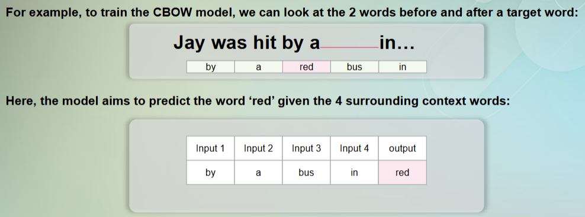

#### Word2Vec – Skip-gram

Goal: Predict context words from a target word.目标：根据目标单词预测上下文单词。

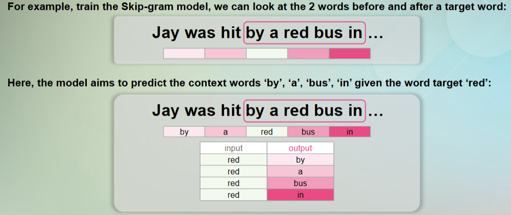

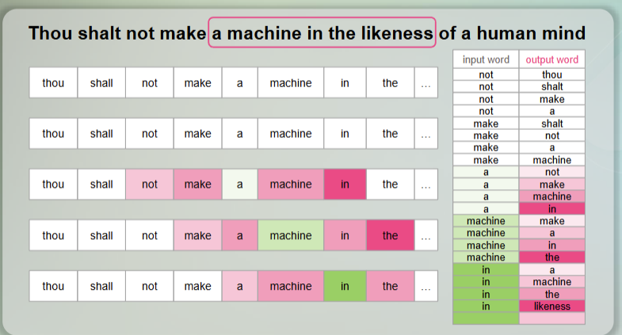

More data is generated using the same sliding window in the Skip-gram model.在跳过图模型中，使用相同的滑动窗口生成更多数据。

CBOW
▪ CBOW is computationally more efficient and often trains faster than Skip-gram.CBOW 的计算效率更高，通常比 Skip-gram 的训练速度更快。
▪ A good choice for smaller datasets or when you want to quickly generate word embeddings.对于较小的数据集或想要快速生成词嵌入时，CBOW 是一个不错的选择。
▪ It can be more effective when the context window size is relatively small, as it directly predicts the target word based on nearby words.当上下文窗口相对较小时，它可能会更有效，因为它会根据附近的单词直接预测目标单词。

Skip-gram
▪ Skip-gram is often preferred when you have a large dataset with a rich vocabulary and you want to capture semantic relationships between words effectively.当你拥有一个词汇丰富的大型数据集，并希望有效捕捉词与词之间的语义关系时，通常会首选跳过图。
▪ It can capture rare words and infrequent word associations better than CBOW.与 CBOW 相比，它能更好地捕捉罕见词和不常见词的关联。

The Skip-gram model is preferred when training on large datasets.在大型数据集上进行训练时，首选跳过图模型。

▪ The Word2Vec model is based on a shallow neural network consisting of an input layer, a densely connected hidden layer and an output layer.Word2Vec 模型基于浅层神经网络，由输入层、密集连接的隐藏层和输出层组成。

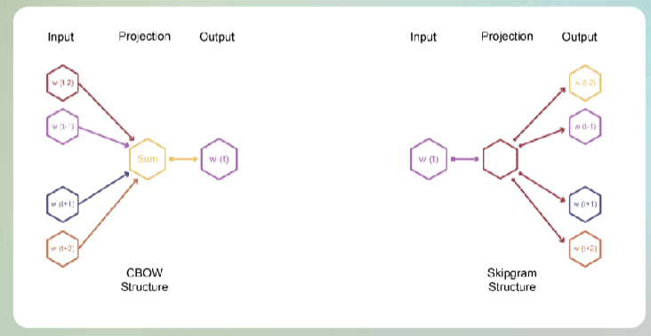

▪ Word2Vec is trained iteratively as follows:Word2Vec 的迭代训练过程如下：
▪ Given a large text corpus;给定一个大型文本语料库；
▪ Go over the text with a sliding window, moving one word at a time.用滑动窗口浏览文本，每次移动一个词。
▪ At each step, there is a target word and surrounding context words;每一步都有一个目标词和周围的语境词；
▪ In the Skip-gram setup, compute prediction probabilities of context words based on the target word;在跳格设置中，根据目标词计算上下文词的预测概率；
▪ These predictions are updated through standard neural network iterations.通过标准神经网络迭代更新这些预测结果。

#### Training:

▪ Create 2 matrices, the Embedding and Context Matrix.创建 2 个矩阵，即嵌入矩阵和上下文矩阵。
▪ Initialise matrix with random numbers.用随机数初始化矩阵。
▪ In each training step, we take one positive example and its associated negative examples.在每个训练步骤中，我们取一个正面示例及其相关的负面示例。

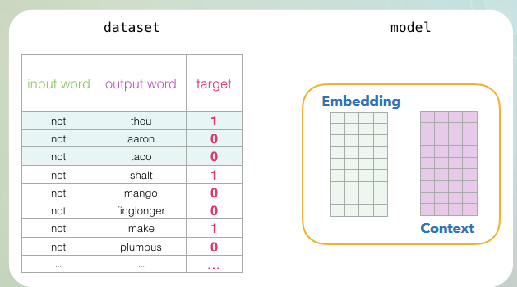

▪ Input words are found in the embedding matrix.在嵌入矩阵中找到输入词。
▪ We find the corresponding output words in the context matrix.在上下文矩阵中找到相应的输出词。
▪ Calculate similarity between input and output words using dot product.使用点积计算输入词和输出词之间的相似度。
▪ Pass it through a sigmoid function to convert it into probabilities.通过 sigmoid 函数将其转换为概率。
▪ Calculate loss function.计算损失函数。

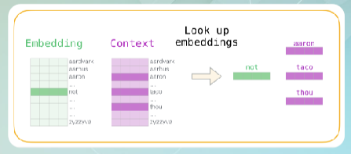

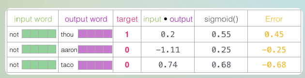

▪ The error score is used to adjust the embeddings of output words.误差分值用于调整输出词的嵌入。
▪ The next time this calculation is made, the result would be closer to the target scores.下一次计算时，结果将更接近目标分数。
▪ Iteratively perform this through every input word.对每个输入单词进行迭代计算。
▪ After training, the context embeddings are discarded, leaving us with the final embedding vector.训练结束后，丢弃上下文嵌入，留下最终的嵌入向量。

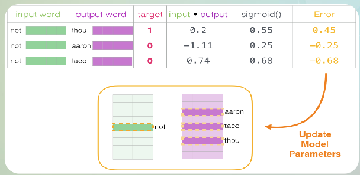

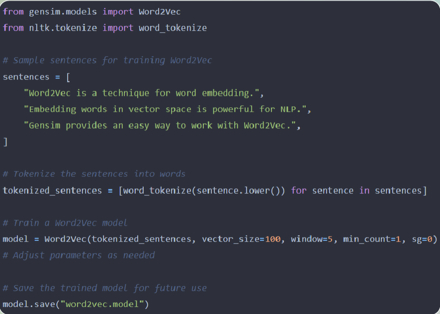

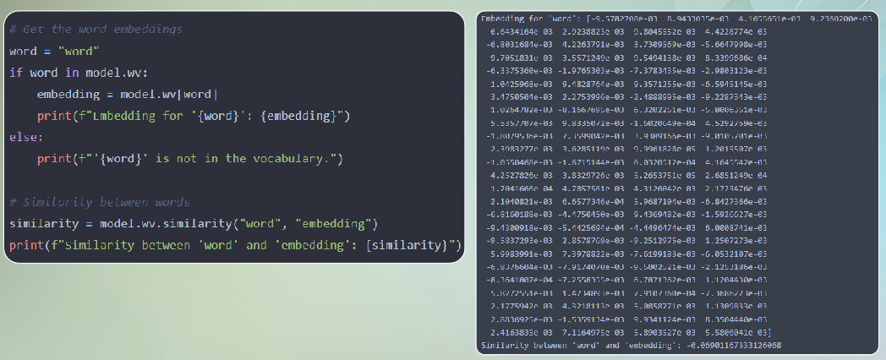

#### Probability

▪ For the Word2Vec model, the objective is to maximise the average log-probability of the context words occurring around the input word over the entire vocabulary.对于 Word2Vec 模型，其目标是最大限度地提高整个词汇量中输入单词周围出现的上下文单词的平均对数概率。

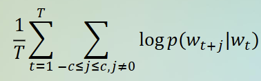

Where T is all the words in the training data and c is the training context window其中，T 是训练数据中的所有单词，c 是训练上下文窗口

One way to calculate the above probability is to use the SoftMax function: 计算上述概率的一种方法是使用 SoftMax 函数：

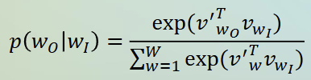

Where 𝑣𝑤 and 𝑣′𝑤 are the vector representations of the word w as the input and output, respectively. Also, W is the number of words in the entire vocabulary.其中，𝑣𝑤 和 𝑣′𝑤 分别是输入和输出词 w 的向量表示。此外，W 是整个词汇表中的单词数。

#### SoftMax

▪ The intuition is that words that appear in the same context will have similar vector representations.直觉告诉我们，在相同语境中出现的单词会有相似的向量表示。
▪ The numerator in the equation will show this by assigning a larger value for similar words through the dot product of the two vectors.等式中的分子会通过两个向量的点积为相似的单词分配一个较大的值，从而显示出这一点。
▪ However, the denominator, which is a normalizing factor that has to be computed over the entire vocabulary, is extremely difficult to compute for large vocabularies.然而，分母是一个归一化系数，必须在整个词汇量中计算，对于庞大的词汇量来说计算起来非常困难。

#### Negative Sampling

▪ Negative sampling is a workaround that aims at maximising the similarity of the words in the same context and minimising it when they occur in different contexts.负抽样是一种变通方法，其目的是在同一上下文中最大限度地提高词语的相似度，而在不同上下文中最大限度地降低词语的相似度。
▪ Instead of doing the minimisation for all the words in the dictionary except for the context words, it randomly selects a handful of words (2 ≤ k ≤ 20) depending on the training size and uses them to optimize the objective.它不是对词典中除上下文单词以外的所有单词进行最小化处理，而是根据训练规模随机选择少量单词（2 ≤ k ≤ 20），并用它们来优化目标。
▪ A larger k is chosen for smaller datasets and vice versa较小的数据集选择较大的 k，反之亦然。

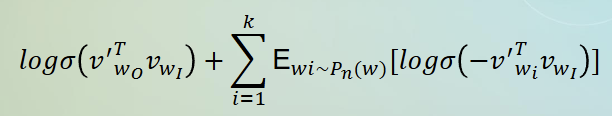

Where 𝜎 is the sigmoid function and 𝑃𝑛(𝑤)is the noise distribution with the negative samples drawn fromit. It’s calculated as the unigram distribution of the words to the power of ¾.其中，𝜎 为 sigmoid 函数，𝑃𝑛(𝑤)为噪声分布，并从中抽取负样本。它的计算方法是单字分布为 ¾ 的幂。

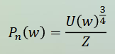

Where Z is a normalisation constant.其中，Z 是归一化常数。

### GloVe

▪ Global Vectors for Word Representation (GloVe) is an unsupervised machine learning algorithm used for generating word embeddings.用于单词表示的全局向量（GloVe）是一种用于生成单词嵌入的无监督机器学习算法。
▪ Designed to capture the global co-occurrence statistics of words from a large corpus of text.旨在从大量文本语料库中捕捉词语的全局共现统计。
▪ It counts the frequency of each word appearing in the context of every other word in a fixed window size.它可以统计每个词在固定窗口大小的上下文中与其他每个词出现的频率。
▪ A co-occurrence matrix X is constructed, where a cell Xij is a “strength” which represents how often the word i appears in the context of the word j.构建共现矩阵 X，其中单元格 Xij 是 “强度”，表示单词 i 在单词 j 的上下文中出现的频率。
▪ In some sense, GloVe goes beyond Word2Vec, but not only considering local context, but also aggregating the results to a global count.从某种意义上说，GloVe 超越了 Word2Vec，它不仅考虑了本地上下文，还将结果汇总为全局计数。

▪ For each pair of words, i, j, we can build a cost (loss) term as follows:对于每一对词 i、j，我们可以建立一个成本（损失）项如下：

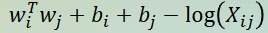

where 𝑏𝑖 and 𝑏𝑗 are scalar bias terms associated with words i and j, respectively.其中，𝑏𝑖 和 𝑏𝑗 分别是与词 i 和词 j 相关的标量偏差项。
▪ To generate these vectors, we minimise an objective function, J which evaluates the sum of all squared errors based on the above equation, weighted with a function f:为了生成这些向量，我们要最小化目标函数 J，该函数根据上述等式评估所有平方误差之和，并用函数 f 加权：

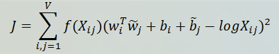

Where V is the size of the vocabulary.其中，V 是词汇量的大小。
▪ The function f is used to prevent the model from being overly influenced by very common word pairs.函数 f 用于防止模型受到非常常见的词对的过度影响。
▪ A typical form of the function f is as follows.函数 f 的典型形式如下。

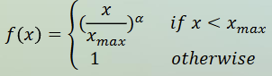

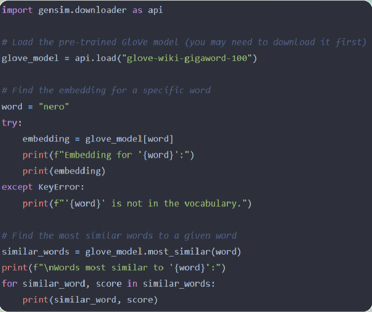

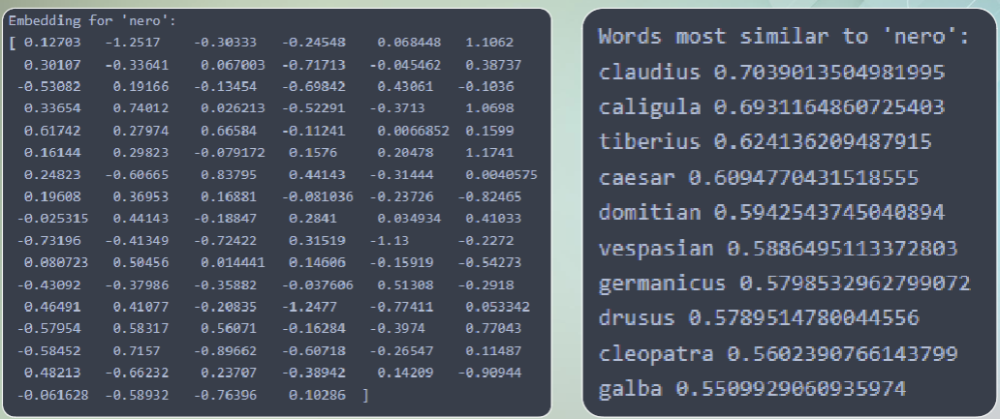

## Summary

Evaluation Metrics:
Confusion Matrix:
A table used in machine learning that summarises the performance of a classification model by comparing actual and predicted values, showing counts of true positives, true negatives, false positives, and false negatives.机器学习中使用的表格，通过比较实际值和预测值来总结分类模型的性能，显示真阳性、真阴性、假阳性和假阴性的计数。
F1 Scores:
A single metric that combines precision and recall into a single value, providing a balanced measure of a model's accuracy in binary classification tasks.将精确度和召回率合并为一个值的单一指标，可均衡地衡量模型在二元分类任务中的准确性。
AUC-ROC:
A metric used to evaluate the performance of a binary classification model by measuring the area under the Receiver Operating Characteristic (ROC) curve, reflecting the model's ability to distinguish between classes.用于评估二元分类模型性能的指标，通过测量接收者工作特征曲线（ROC）下的面积来反映模型区分类别的能力。

BLEU:
A metric for evaluating the quality of machine-generated text by comparing it to human-generated reference text based on n-gram overlap and precision.基于 n-gram 重合度和精确度，将机器生成的文本与人工生成的参考文本进行比较，从而评估机器生成文本质量的指标。
ROUGE:
A set of metrics used for evaluating the quality of machine-generated text by measuring the overlap of n-grams and other text units between the generated text and reference text.通过测量生成文本与参考文本之间的 n-grams 和其他文本单位的重叠度，用于评估机器生成文本质量的一组指标。
METEOR:
A metric that emphasizes on the importance of word order in machine translations.强调词序在机器翻译中重要性的指标。

Word Embeddings:
Word2Vec:
A popular word embedding technique that learns dense vector representations of words by predicting words in their context, capturing semantic relationships between words in a continuous vector space.一种流行的单词嵌入技术，通过预测单词的上下文来学习单词的密集向量表示，从而在连续向量空间中捕捉单词之间的语义关系。
GloVe:
An unsupervised word embedding algorithm that captures global co-occurrence statistics of words from a large text corpus to create vector representations that encode semantic meaning and relationships between words.一种无监督的词语嵌入算法，可从大型文本语料库中捕捉词语的全局共现统计信息，从而创建可编码词语语义和词语间关系的向量表示。

# Week 6

## Sequential Data

Sequential data is organised in a specific order, often with a time-based or chronological sequence.顺序数据是按照特定的顺序组织的，通常以时间或年代为顺序。
▪ The order in which the data points occur is essential for understanding the data's meaning.数据点出现的顺序对于理解数据的含义至关重要。
▪ In sequential data, each data point is likely correlated to both the earlier and later data points in the sequence.在顺序数据中，每个数据点都可能与序列中的前一个和后一个数据点相关。

Textual Data：
▪ The meaning of a text often depends on the order of words and the grammatical rules that govern their arrangement.文本的含义通常取决于词语的顺序和规范词语排列的语法规则。
▪ Understanding the text often requires knowledge of what came before and what follows.理解文本通常需要了解前文和后文的内容。
▪ The meaning of a word or phrase can change based on the context provided by the surrounding text.一个单词或短语的含义会根据周围文本提供的上下文发生变化。

Traditional models, such as simple linear regression or basic feedforward neural networks,
often struggle with handling sequential data for several reasons:传统的模型，如简单的线性回归或基本的前馈神经网络，在处理连续数据时往往会遇到困难，原因有以下几点：

Lack of Memory
Traditional models do not possess the inherent ability to remember or capture long-term dependencies within the sequence.传统模式不具备记忆或捕捉序列中长期依赖关系的内在能力。

Order Insensitivity
Traditional models treat data as unordered, meaning they do not inherently understand the significance of the order of data points in a sequence.传统模型将数据视为无序数据，这意味着它们本质上并不了解序列中数据点顺序的重要性。

Variable-Length Limitation
Traditional models are designed to work with fixed- length input. However, sequential data often comes in variable lengths.传统模型设计用于固定长度的输入。然而，顺序数据通常是可变长度的。

▪ To process sequential data effectively, we need models that can account for the interconnectedness of sequential data.要有效处理顺序数据，我们需要能够考虑顺序数据相互关联性的模型。
▪ Models can handle sequential data through various techniques and architectures designed to capture the temporal dependencies and patterns within the data.模型可以通过各种技术和架构来处理顺序数据，这些技术和架构旨在捕捉数据中的时间依赖关系和模式。
▪ Some of these models include:

Recurrent Neural Networks (RNNs)
Long Short-Term Memory (LSTM) Networks
Gated Recurrent Units (GRUs)
Bi-directional Networks
Transformers

## RNNs

▪ Recurrent Neural Networks (RNNs) are a type of neural network designed for tasks involving sequences or time series data.递归神经网络（RNN）是一种专为涉及序列或时间序列数据的任务而设计的神经网络。
▪ Unlike traditional feedforward neural networks, RNNs have connections that loop back on themselves, allowing them to maintain memory of previous inputs.与传统的前馈神经网络不同，RNN 具有自我循环的连接，使其能够保持对先前输入的记忆。
▪ RNNs can model dependencies over time, making them great for tasks like language translation, speech recognition, and predicting future values in a time series.RNN 可以模拟随时间变化的依赖关系，因此非常适合语言翻译、语音识别和预测时间序列中的未来值等任务。

Each RNN unit computes a new hidden state using the previous state and a new input. 每个 RNN 单元利用之前的状态和新的输入计算出一个新的隐藏状态。

\[
    ℎ_𝑡 = 𝑔(𝑥_𝑡, ℎ_{𝑡−1})
\]

Each RNN unit (optionally) makes an output using the current hidden state.每个 RNN 单元（可选）利用当前的隐藏状态进行输出。

\[
    𝑦_𝑡 = 𝑓(ℎ_𝑡)
\]

Hidden states ℎ𝑡∈𝑅𝐷 are continuous vectors隐藏状态𝑡∈𝑅𝐷是连续向量
– Can represent very rich information可以表示非常丰富的信息
– Possibly the entire history from the beginning可能代表从一开始的整个历史
▪ Parameters are shared (tied) across all RNN units (unlike feedforward NNs).所有 RNN 单元共享（绑定）参数（与前馈 NN 不同）。

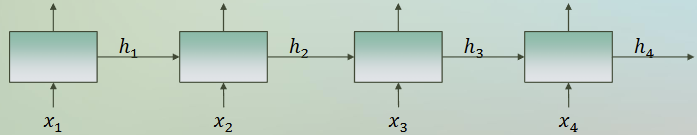

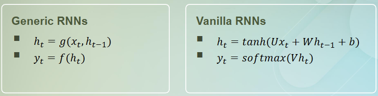

Vanilla RNN is the simplest form of a recurrent neural network.Vanilla RNN 是递归神经网络的最简单形式。

### Recurrent Neural Networks (Activation Functions)递归神经网络（激活函数）

Sigmoid

\[
    σ (𝑥) = \frac{1}{1 + 𝑒^{−𝑥}}
\]
\[
    𝜎′(𝑥) = σ (𝑥) (1- σ( 𝑥 ))
\]

▪ Often used for gates, and output layer for classification通常用于门，输出层用于分类
▪ Pros: Non-linear, smooth gradient非线性、平滑梯度
▪ Cons: Not zero-centered, vanishing gradients不以零为中心，梯度消失

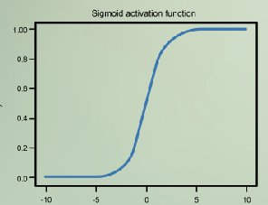

Tanh

▪ Used for hidden states & cells in RNNs, LSTMs.用于 RNN 和 LSTM 的隐藏状态和单元。
▪ Pros: Zero-centred, often converges faster than sigmoid.零中心，收敛速度通常比 sigmoid 快。
▪ Cons: Also suffer from vanishing gradients.也有梯度消失的问题。

\[
    tanh (𝑥) = \frac{𝑒^{𝑥} - 𝑒^{−𝑥}}{𝑒^{𝑥} + 𝑒^{−𝑥}}
\]
\[
    tanh′(𝑥) = 1 - tanh^2(x)
\]
\[
    tanh(𝑥) = 2σ(2x) - 1
\]

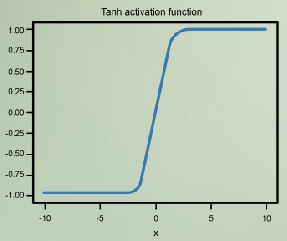

### Recurrent Neural Networks – Classifier

▪ Follows a sequence-to-one architecture.遵循序列到一架构。
▪ Input: A sequence.
▪ Output: One Label (A classification).
▪ Use Case: Sentiment Analysis.

\[
    ℎ_𝑡 = 𝑔(𝑥_𝑡, ℎ_{𝑡−1})
\]
\[
    𝑦 = 𝑓(ℎ_𝑛)
\]

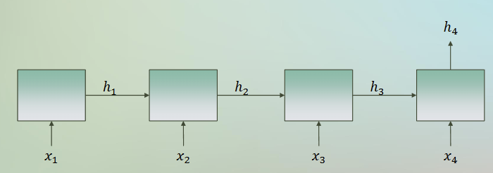

### Recurrent Neural Networks – One to Seq

Follows a one-to-sequence architecture 遵循一对一序列结构
▪ Input: One item
▪ Output: A sequence
▪ Use Case: Image Captions图像标题

\[
    ℎ_𝑡 = 𝑔(𝑥_𝑡, ℎ_{𝑡−1})
\]
\[
    𝑦_t = 𝑓(ℎ_t)
\]

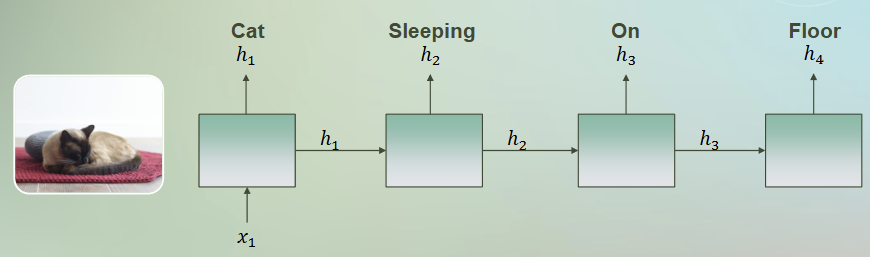

### Recurrent Neural Networks – Seq to Seq

▪ Follows a sequence-to-sequence architecture遵循序列到序列架构
▪ Input: A sequence
▪ Output: A sequence
▪ Use Case: POS tagging, Named Entity Recognition

\[
    ℎ_𝑡 = 𝑔(𝑥_𝑡, ℎ_{𝑡−1})
\]
\[
    𝑦_t = 𝑓(ℎ_t)
\]

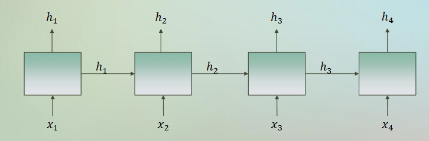

Recurrent Neural Networks – Limitations

▪ Vanishing Gradients: RNNs can struggle with long sequences because gradients can become too small, making it hard to learn from distant past information.梯度消失： RNN 在处理长序列时可能会遇到困难，因为梯度可能会变得太小，从而难以从遥远的过去信息中学习。
▪ Exploding Gradients: Conversely, gradients can become too large, causing unstable training.梯度爆炸： 相反，梯度会变得过大，导致训练不稳定。
▪ Memory Limitations: RNNs have limited short-term memory and may not remember relevant information from very early in a sequence due to Vanishing Gradients.记忆限制： 由于梯度消失，RNN 的短期记忆有限，可能无法记住序列早期的相关信息。

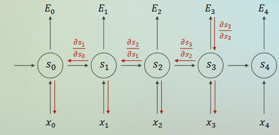

## Long Short-Term Networks

▪ LSTM, short for Long Short-Term Memory, is a type of RNN architecture.LSTM 是长短时记忆的简称，是一种 RNN 架构。
▪ Designed to address the vanishing gradient problem in RNNs.旨在解决 RNN 中的梯度消失问题。
▪ LSTMs incorporate unique gating mechanisms, including forget, input, and output gates, which allow them to regulate the flow of information and avoid the vanishing gradient problem common in standard RNNs.LSTM 具有独特的门控机制，包括遗忘门、输入门和输出门，可以调节信息流，避免标准 RNN 中常见的梯度消失问题。
▪ RNNs can struggle with long sequences, where information from early time steps may become difficult to capture. LSTMs overcome this limitation.RNN 在处理长序列时可能会遇到困难，因为早期时间步的信息可能难以捕捉。LSTM 克服了这一限制。
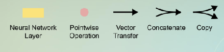
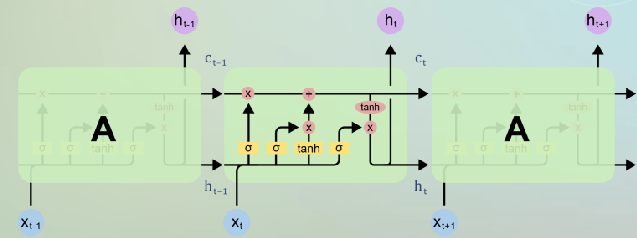

### LSTM – Cell States

▪ Cell States represent long term memory.细胞状态代表长期记忆。
▪ The cell state is modulated by three gates (forget, input, and output), which selectively add, retain, or remove information, thereby preventing the gradients from vanishing during long sequences.细胞状态由三个门（遗忘、输入和输出）调制，这三个门可选择性地添加、保留或删除信息，从而防止梯度在长序列中消失。
▪ Cell states enable LSTMs to capture and retain long-term dependencies.细胞状态使 LSTM 能够捕捉和保留长期依赖关系。

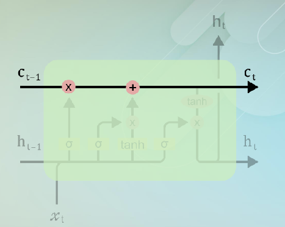

### LSTM – Forget Gates

▪ Decides what long term information should be kept in the cell state.决定应在单元状态中保留哪些长期信息。
▪ Information from previous hidden state and current input passed through sigmoid function.上一个隐藏状态和当前输入的信息通过 sigmoid 函数传递。

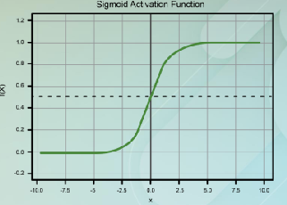

▪ Output closer to 0 means forget, close to 1 means keep.输出接近 0 表示遗忘，接近 1 表示保留。
▪ Equation given by:

\[
    𝑓_𝑡 = 𝜎(𝑊_𝑓 ∙ [ℎ_{𝑡−1}, 𝑥_𝑡] + 𝑏_𝑓)
\]

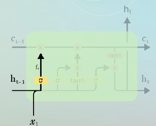

### LSTM – Input Gates

▪ Decides what new information to add to the cell state.决定将哪些新信息添加到细胞状态中。
▪ First, a sigmoid layer decides which value to update and how much to update.首先，一个 sigmoid 层决定更新哪个值以及更新多少。
▪ Next, a tanh layer scales the input between 1 and -1.接下来，一个 tanh 层在 1 和 -1 之间对输入进行缩放。
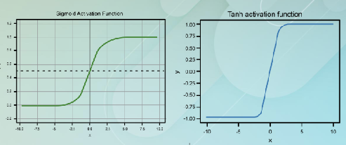
▪ Combine them to create an update to the state of the long term memory.将它们结合起来，创建对长期记忆状态的更新。
▪ The input gate formula is given by:

\[
    𝑖_𝑡 = 𝜎(𝑈^{(𝑖)} 𝑥_𝑡 + 𝑊^{(𝑖)} ℎ_{𝑡−1} + 𝑏^{(𝑖)})
\]

▪ The equation for temporary new cell content is given by:临时新单元格内容的方程为

\[
    \bar 𝑐_𝑡 = tanh(𝑈^{(c)} 𝑥_𝑡 + 𝑊^{(c)} ℎ_{𝑡−1} + 𝑏 ^{(c)} )
\]

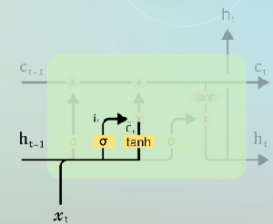

### LSTM – Cell State Update

▪ The cell state is updated by a combination of the results from the forget gate and the input gate.单元状态由遗忘门和输入门的结果组合更新。
▪ The updated cell content is given by the equation:

\[
    𝑐_𝑡 = 𝑓_𝑡𝑐_{𝑡−1} + 𝑖_𝑡 \bar 𝑐_𝑡
\]

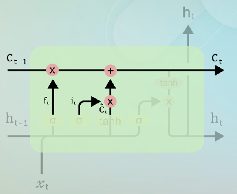

### LSTM – Output Gates

▪ The output gate determines which parts of the cell state are used to generate the output at the current time step.输出门决定单元状态的哪些部分用于生成当前时间步的输出。
▪ The sigmoid layer decides how the current input and hidden state contribute to the output.sigmoid 层决定当前输入和隐藏状态对输出的贡献。
▪ The cell state passes through tanh function for normalisation.单元状态通过 tanh 函数进行归一化。
▪ The two outputs are multiplied to produce the final output.两个输出相乘产生最终输出。
▪ The output gate equation is given by:

\[
    𝑜_𝑡 = 𝜎(𝑈^{(𝑜)} 𝑥_𝑡 + 𝑊^{(𝑜)} ℎ_{𝑡−1} + 𝑏^{(𝑜)})
\]

▪ The hidden state is given by:

\[
    ℎ_𝑡 = 𝑜_𝑡tanh(𝑐_𝑡)
\]

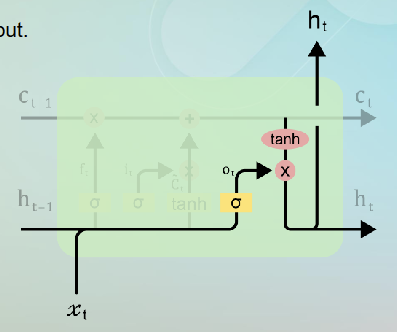

## GRUs

▪ Gated Recurrent Units (GRUs) were introduced in 2014 as a simplified variant of LSTM.作为 LSTM 的简化变体，门控循环单元（GRU）于 2014 年问世。
▪ They aim to achieve similar results with a reduced number of gates and parameters.它们旨在通过减少门的数量和参数来实现类似的结果。
▪ GRUs do not have a separate cell state like LSTMs, and they merge the roles of the cell state and hidden state.GRU 不像 LSTM 那样有单独的单元态，它们合并了单元态和隐藏态的作用。
▪ As a result, they are computationally less expensive.因此，它们的计算成本更低。
▪ A GRU has two fundamental components:

Update Gate:
Controls the extent to which the previous hidden state is updated.控制上一个隐藏状态的更新程度。

Reset Gate:
Controls the extent to which the previous hidden state is reset, allowing it to forget some information.控制重置前一个隐藏状态的程度，使其能够遗忘某些信息。

### GRUs – Reset Gates

▪ The reset gate, denoted as 𝑟𝑡 determines how much of the previous hidden state ℎ𝑡−1 should be forgotten.复位门（𝑟𝑡）决定了前一个隐藏状态 𝑡-1 的遗忘程度。
▪ The information from the previous hidden state and the current input passes through a sigmod:来自前一个隐藏状态和当前输入的信息会经过一个 sigmod：

\[
    𝑟_𝑡 = 𝜎(𝑊_𝑟 ∙ [ℎ_{𝑡−1}, 𝑥_𝑡] + 𝑏_𝑟)
\]

▪ The result scales the previous hidden state.结果会对之前的隐藏状态进行缩放。
▪ The modified previous hidden state is then combined with current input and passes through a tanh to produce a candidate hidden state ℎ𝑡.修改后的前一个隐藏状态与当前输入相结合，并通过 tanh 生成候选隐藏状态 𝑡。

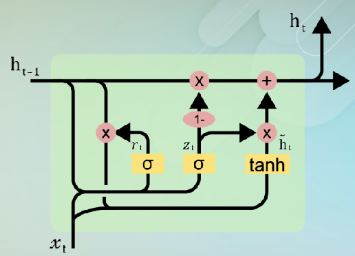

### GRUs – Update Gates

▪ The update gate, denoted as 𝑧𝑡 determines how much of the previous hidden state ℎ𝑡−1 should be retained and how much of the new candidate hidden state ℎ𝑡 should be added to the current state.更新门（表示为 𝑧𝑡 ）决定了应保留多少先前的隐藏状态 𝑠𝑡-1 以及应将多少新的候选隐藏状态 𝑠𝑡 添加到当前状态。
▪ The formula for the update gate is given by:

\[
    z_𝑡 = 𝜎(𝑊_z ∙ [ℎ_{𝑡−1}, 𝑥_𝑡] + 𝑏_z)
\]

▪ The final new hidden state is scaled combination of the previous hidden state and the new candidate hidden state.最终的新隐藏状态是前一个隐藏状态和新的候选隐藏状态的缩放组合。

## Bi-Directional RNNs

▪ Bi-Directional RNNs consist of two separate RNNs: one moving forward through the input sequence and the other moving backward.双向 RNN 由两个独立的 RNN 组成：一个通过输入序列向前移动，另一个向后移动。
▪ Bi-Directional RNNs are especially useful in applications where understanding the context from both past and future data points in a sequence is crucial.双向 RNN 在理解序列中过去和未来数据点的上下文至关重要的应用中特别有用。
▪ LSTM and GRU are commonly used in Bi-RNNs.LSTM 和 GRU 通常用于双向 RNN。

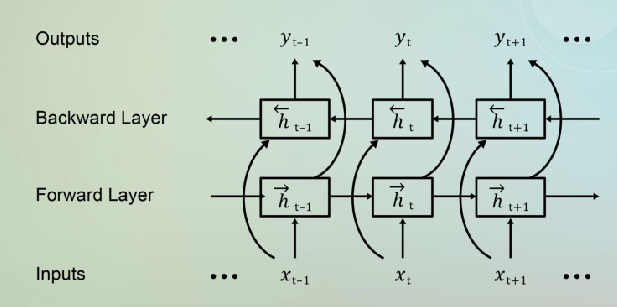

Summary
▪ Sequential data: Data that is chronologically ordered. Textual data falls under this category.顺序数据： 按时间顺序排列的数据。文本数据就属于这一类
– How traditional models fail to capture this sequential nature due to a lack of memory.由于内存不足，传统模型无法捕捉这种顺序性。

▪ Models that handle sequential data:
– RNNS:
A neural network for processing sequential data, capturing temporal information through its internal state.处理顺序数据的神经网络，通过其内部状态捕捉时间信息。
– LSTMS:
An advanced RNN variant designed to learn long-term dependencies using special structures called gates.一种先进的 RNN 变种，旨在使用称为门的特殊结构来学习长期依赖关系。
– GRUs:
A streamlined version of LSTM with a simpler architecture, combining several gates for efficient learning of dependencies in sequences.LSTM 的精简版，结构更简单，结合了多个门，可高效学习序列中的依赖关系。
– Bi-RNNs:
An RNN that processes data in both forward and backward directions to capture context from the entire sequence.一种 RNN，可在前向和后向处理数据，以捕捉整个序列的上下文。

# Week 7

## Seq2Seq Models

▪ Sequence-to-sequence (Seq2Seq) models are models that take a sequence of items (words, letters, features of an images…etc) and outputs another sequence of items.序列到序列（Seq2Seq）模型是将一个项目序列（单词、字母、图像特征......等）转换为另一个项目序列的模型。

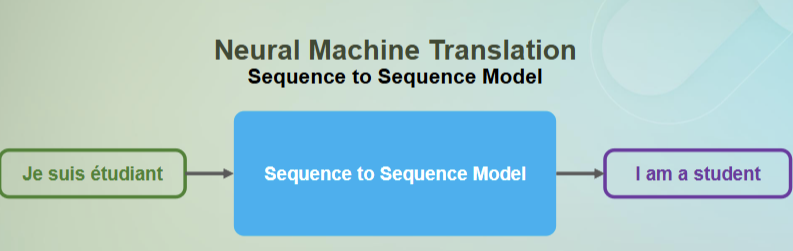

▪ Seq2Seq models follow an encoder-decoder architecture.Seq2Seq 模型采用编码器-解码器架构。
▪ The encoder processes the input sequence step by step, typically using RNN or more advanced models like LSTMs or GRUs.编码器通常使用 RNN 或更先进的模型（如 LSTM 或 GRU）逐步处理输入序列。
▪ A context vector that captures the input meaning is generated by the encoder.编码器生成能捕捉输入含义的上下文向量。
▪ The decoder takes the context vector produced by the encoder and uses it to generate the output sequence.解码器接收编码器生成的上下文向量，并用它来生成输出序列。

## Attention Mechanism

▪ Seq2Seq models often experience an information bottleneck in the context vectors.Seq2Seq 模型经常会遇到上下文向量的信息瓶颈。
▪ As the length of the input sequence increases, it becomes increasingly difficult for the context vector to retain all the relevant information, leading to a degradation in the performance of the model.随着输入序列长度的增加，上下文向量越来越难以保留所有相关信息，从而导致模型性能下降。
▪ LSTMs and GRUs are not sufficient to capture dependencies in very long sequences.LSTM 和 GRU 不足以捕捉超长序列中的依赖关系。
▪ Attention mechanism resolves this problem by allowing the model to focus on the relevant parts of an input sequence.注意机制允许模型关注输入序列的相关部分，从而解决了这一问题。

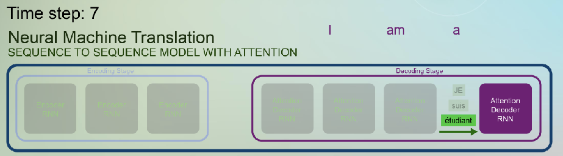

▪ The general attention mechanism makes use of three main components namely the queries (𝑄), the keys (𝐾) and the values (𝑉).一般关注机制由三个主要部分组成，即查询 (𝑄)、键 (绊) 和值 (𝑉)。
▪ The general attention mechanism then performs the following computations:然后，一般注意力机制会执行以下计算：
▪ Each query vector, 𝑞 = 𝑠𝑡−1, is matched against a database of keys to compute a score value. This matching operation is computed as the dot product of the specific query under consideration with each key vector, 𝑘𝑖.每个查询向量（△ = 𝑠𝑡-1）都要与密钥数据库进行匹配，以计算得分值。这一匹配操作的计算方法是，将正在考虑的特定查询与每个密钥向量𝑘𝑖进行点乘。

\[
    𝑒_{𝑞,𝑘𝑖} = 𝑞 ∙ 𝑘_𝑖
\]
▪ The scores are passed through a softmax operation to generate the weights:分数通过软最大运算生成权重：

\[
    𝛼_{𝑞,𝑘𝑖} = 𝑠𝑜𝑓𝑡𝑚𝑎𝑥(𝑒𝑞,𝑘𝑖 )
\]
▪ The generalised attention is then computed by a weighted sum of the value vectors, 𝑣𝑘𝑖 , where each value vector is paired with a corresponding key:然后通过值向量的加权和𝑣𝑘𝑖来计算广义注意力，其中每个值向量都与相应的关键字配对：

\[
    𝒂𝒕𝒕𝒆𝒏𝒕𝒊𝒐𝒏 (𝒒, 𝑲, 𝑽) = \sum_i{𝜶_{𝒒,𝒌𝒊} 𝒗_{𝒌𝒊}}
\]

▪ When the generalized attention mechanism is presented with a sequence of words:当泛化注意力机制看到一串单词时：
– The query vector attributed to some specific word in the sequence is scored against each key in the database. 根据数据库中的每个关键字，对序列中某个特定单词的查询向量进行评分。
– In doing so, it captures how the word under consideration relates to the others in the sequence.这样，它就能捕捉到所考虑的单词与序列中其他单词之间的关系。
– The values are then scaled according to the attention weights (computed from the scores) to retain focus on those words relevant to the query.然后根据关注度权重（根据分数计算得出）对这些值进行缩放，以便将注意力集中在与查询相关的单词上。
– An attention output for the word under consideration is then produced.然后，就会产生所考虑的词的关注度输出。

▪ Scores are computed using each of encoder hidden state (keys) and the current decoder hidden state (query).使用编码器隐藏状态（密钥）和当前解码器隐藏状态（查询）计算分数。
▪ The scores are passed through a softmax function to obtain normalised attention weights.通过软最大函数计算得分，以获得归一化的注意力权重。
▪ The attention weights obtained from the softmax operation are used to calculate a weighted sum of the encoder hidden states.从软最大运算中获得的注意力权重用于计算编码器隐藏状态的加权和。
▪ This weighted sum is then used to provide context information to the decoder for the current time step.这个加权和将用于为解码器提供当前时间步的上下文信息。
▪ This sum is concatenated with the input to the decoder at the current time step. The concatenated vector is then used as input to the decoder's recurrent unit.该和与当前时间步长的解码器输入相串联。然后，合并后的矢量被用作解码器递归单元的输入。

▪ Scores are computed using each of encoder hidden state (keys) and the current decoder hidden state (query).使用编码器隐藏状态（密钥）和当前解码器隐藏状态（查询）计算分数。
▪ The scores are passed through a softmax function to obtain normalised attention weights.通过软最大函数计算得分，以获得归一化的注意力权重。
▪ The attention weights obtained from the softmax operation are used to calculate a weighted sum of the encoder hidden states.从软最大运算中获得的注意力权重用于计算编码器隐藏状态的加权和。
▪ This weighted sum is then used to provide context information to the decoder for the current time step.这个加权和将用于为解码器提供当前时间步的上下文信息。
▪ This sum is concatenated with the input to the decoder at the current time step. The concatenated vector is then used as input to the decoder's recurrent unit.该和与当前时间步长的解码器输入相串联。然后，合并后的矢量被用作解码器递归单元的输入。

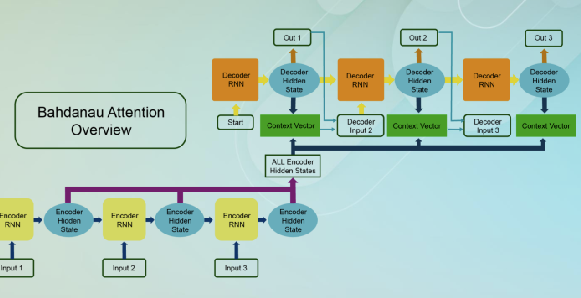

## Transformer Models

▪ Transformers are a type of deep learning architecture introduced in the paper "Attention Is All You Need" by Vaswani et al. in 2017.是 Vaswani 等人在 2017 年发表的论文《Attention Is All You Need》中介绍的一种深度学习架构。
▪ RNNs, LSTMs and GRUs all face challenges when dealing with long-range dependencies in sequences.RNN、LSTM 和 GRU 在处理序列中的长程依赖关系时都面临挑战。
▪ We have seen that attention mechanism can help address the long-range issue.我们看到，注意力机制有助于解决长程问题。
▪ Given that attention gives us access to any state, do we still need the underlying RNNs (or LSTMs or GRUs)? Or can we build something simpler based on the attention mechanism?既然注意力能让我们访问任何状态，我们还需要底层的 RNN（或 LSTM 或 GRU）吗？还是说我们可以在注意力机制的基础上构建更简单的机制？

▪ Transformers are sequence-to sequence encoder-decoder models.变换器是序列到序列的编码器-解码器模型。
▪ Uses attention mechanisms to weigh the importance of different elements in the input sequence.使用注意力机制来权衡输入序列中不同元素的重要性。
▪ Transformer models have the following key components:变换器模型有以下主要组成部分：

Input Embeddings
convert input tokens into embeddings将输入标记转换为嵌入
Positional Encoding
add positional information to embeddings为嵌入词添加位置信息
Multi-Head Self-Attention
compute attention scores across different positions计算不同位置的注意力分数

Encoder Layers:
– Multi-Head Self-Attention: Compute attention scores across different positions多头自我注意力 计算不同位置的注意力分数
– Feed-Forward Neural Network: Processes the output from the self-attention mechanism前馈神经网络 处理来自自我注意机制的输出
– Residual Connection & Layer Normalisations: Applied after self-attention and after the feed-forward network剩余连接和层归一化： 在自我注意和前馈网络之后应用

Decoder Layers:
– Masked Self-Attention: Prevents positions from attending to subsequent positions.屏蔽自关注： 防止位置关注后续位置。
– Encoder-Decoder Attention: Focuses on relevant parts of the input sequence.编码器-解码器关注： 关注输入序列的相关部分。

### Transformer Models – Encoder

The input to encoder setup is as follows:
▪ The input is first converted into an embedding.首先将输入转换为嵌入。
▪ This is followed by a positional encoding layer.然后是位置编码层。
▪ The encoder layer consist of multi-head self-attention.编码器层由多头自注意力组成。
▪ Followed by a feedforward neural network.之后是前馈神经网络
▪ Normalisation is done in the Add & Norm steps.在添加和规范步骤中进行规范化。
▪ This encoder layer can be stacked multiple times depending on complexity of the task根据任务的复杂程度，该编码器层可堆叠多次
▪ In the original paper, the encoder layer is stacked 6 times.在原始论文中，编码器层被堆叠了 6 次。

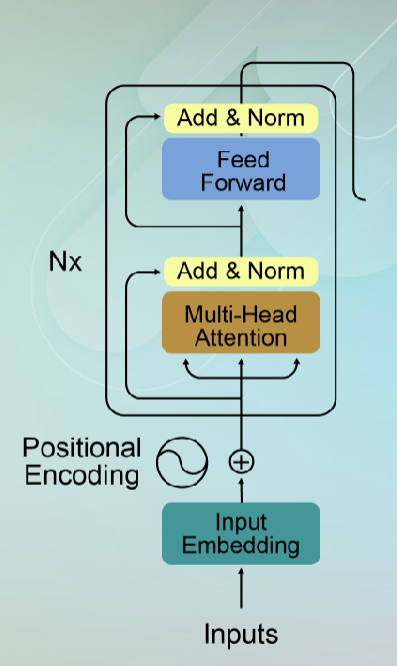

### Transformer Models – Positional Encodings

▪ Since Transformer models do not inherently process sequences in order (like RNNs or LSTMs), positional encodings are added to input embeddings to give the model information about the position of each token in the sequence.由于变换器模型本身并不按顺序处理序列（如 RNN 或 LSTM），因此位置编码被添加到输入嵌入中，以便为模型提供序列中每个标记的位置信息。
▪ Positional encodings ensure that each position in the sequence has a unique representation.位置编码确保序列中的每个位置都有唯一的表示。
▪ Positional encodings are added to the token embeddings. This combination allows the model to process both the content of the tokens and their positions in the sequence simultaneously.位置编码被添加到标记嵌入中。这种组合使模型能够同时处理标记的内容及其在序列中的位置。
▪ In the original paper, positional encodings are created using sinusoidal functions of different frequencies, ensuring that each position generates a unique encoding and that these encodings are consistent across different sequence lengths.在最初的论文中，位置编码是使用不同频率的正弦函数创建的，以确保每个位置都能生成唯一的编码，并且这些编码在不同长度的序列中保持一致。

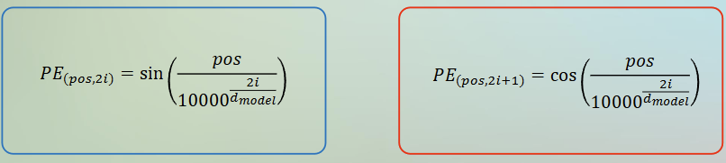

▪ The complete transformer block has two sublayers:
– Multi-head Self-Attention: - 多头自关注：Processes input by attending to different positions of the sequence simultaneously in multiple representational subspaces.通过在多个表征子空间中同时关注序列的不同位置来处理输入。
– Feedforward neural network前馈神经网络: Applies two linear transformations with an activation function in between to each position, enhancing the representation independently for each position.对每个位置应用两个线性变换，中间有一个激活函数，对每个位置独立增强表征。
▪ Each of these two sublayers also has:这两个子层中的每个子层还具有
– Residual connection: Facilitates deeper model architectures and mitigating the vanishing gradient problem.残余连接： 促进更深层次的模型架构，缓解梯度消失问题。
– Layer Normalisation: Normalises the output of each sublayer层归一化： 将每个子层的输出归一化
post-residual connection, stabilizing and accelerating the training process.剩余连接后的输出归一化，从而稳定并加速训练过程。

### Transformer Models – Self Attention

▪ Self-attention operates on a single sequence, allowing each position in the sequence to attend to all other positions within the same sequence.自我注意在单个序列上运行，允许序列中的每个位置注意同一序列中的所有其他位置。
▪ This contrasts with general attention mechanisms, which often involve attending to a different sequence (like in seq2seq models where the decoder attends to the encoder's output).这与一般的注意机制形成鲜明对比，后者通常涉及对不同序列的注意（如在 seq2seq 模型中，解码器注意编码器的输出）。
▪ Specifically, key, query, and value all come directly from the same input sequence.具体来说，键、查询和值都直接来自同一输入序列。
▪ Each query is compared to all keys (including itself) using a dot product operation to compute attention scores, indicating the relevance of each key to the query.使用点乘运算将每个查询与所有关键字（包括其本身）进行比较，以计算关注度分数，表明每个关键字与查询的相关性。
▪ The scores can be scaled by a factor, typically the square root of the dimension of the key vectors, to control the magnitude of the scores.分数可以用一个因子缩放，通常是密钥向量维度的平方根，以控制分数的大小。
▪ These scores are then normalised (typically using a softmax function) and used to create a weighted sum of the values.然后对这些分数进行归一化处理（通常使用 softmax 函数），并用于创建数值的加权和。

This self-attention allows the model to register the following:这种自我关注使模型能够记录以下内容：
▪ The animal didn’t cross the street because it was too tired.
▪ Self-attention allows the model to associate the “it” in the sentence with the word “animal”.自我注意让模型将句子中的 “它 ”与 “动物 ”联系起来。

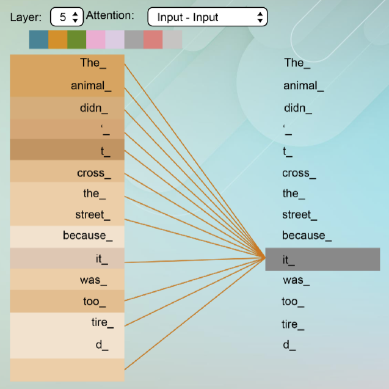

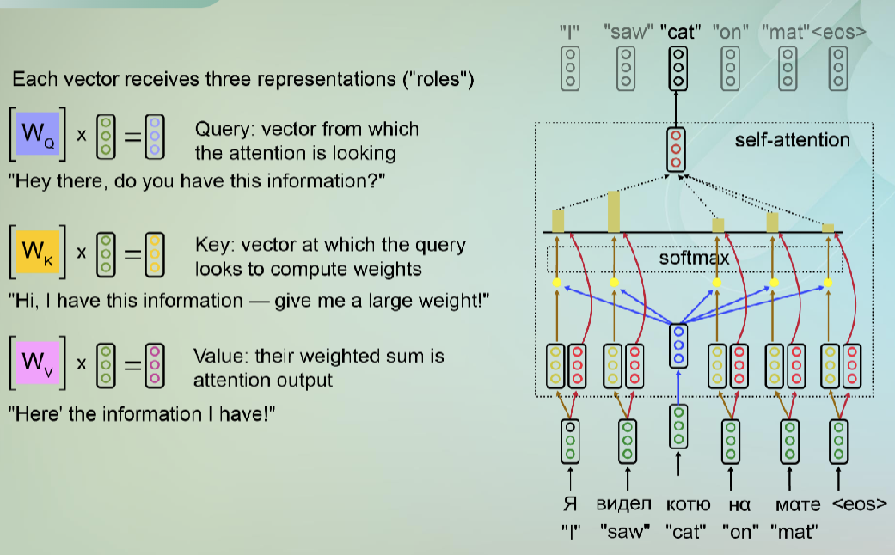

▪ To calculate the self-attention for the first word in this example, “Thinking”.计算本例中第一个单词 “思考 ”的自我关注度。
▪ We need to score each word of the input sentence against this word.我们需要对输入句子中的每个单词进行评分。
▪ The score determines how much focus to place on other parts of the input sentence as we encode a word at a certain position.分数决定了我们在某个位置编码某个单词时，对输入句子其他部分的关注程度。
▪ The score is calculated by taking the dot product of the query vector with the key vector of the respective word that we are scoring.分数的计算方法是将查询向量与我们要评分的各个单词的关键向量进行点乘。

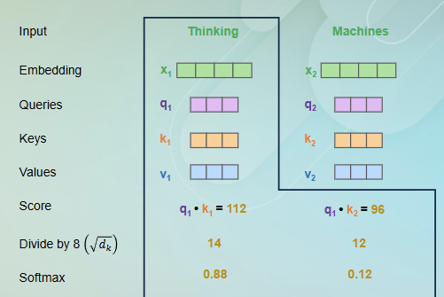

▪ The scores are then divided by 8, to allow for more stable gradients.然后将分数除以 8，以获得更稳定的梯度。
▪ The result is passed through a softmax operation.将结果通过软最大运算。
▪ Softmax normalises the scores so they’re all positive and add up to 1.Softmax 对分数进行归一化处理，使其全部为正值，加起来等于 1。
▪ The softmax score determines how much each word will be expressed at this position.Softmax 分数决定了每个单词在该位置的表达量。

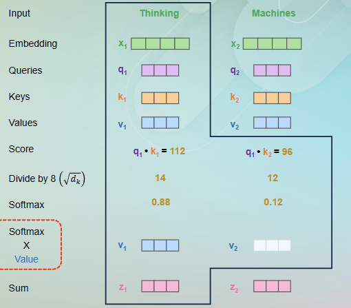

▪ Multiply each value vector by the softmax score.将每个值向量乘以 softmax 分数。
▪ Keep intact the values of the word(s) we want to focus on and drown-out irrelevant words.保留我们想要关注的单词的值，忽略不相关的单词。
▪ Sum up the weighted value vectors. This produces the output of the self-attention layer at this position for the first word.将加权值向量相加。这将产生自我关注层在此位置对第一个单词的输出。

### Transformer Models – Multi Head Attention

▪ Parallel Attention Heads: Executes several self-attention mechanisms (attention heads) in parallel, allowing the model to capture different relationships in the data simultaneously.平行注意头： 并行执行多个自我注意机制（注意头），使模型能够同时捕捉数据中的不同关系。
▪ Diverse Representations: Each head can learn distinct aspects of the input, providing a more comprehensive understanding of the sequence.多种表征： 每个注意头都能学习输入的不同方面，从而提供对序列更全面的理解。
▪ Concatenation and Transformation: Outputs of all heads are concatenated and linearly transformed to produce the final attention output.▪ 连接和转换： 所有头部的输出都经过串联和线性变换，以产生最终的注意力输出。
▪ Enhanced Capacity: Increases the model's capacity and expressiveness without significantly raising computational complexity.增强容量： 在不显著提高计算复杂度的情况下，提高模型的容量和表现力。

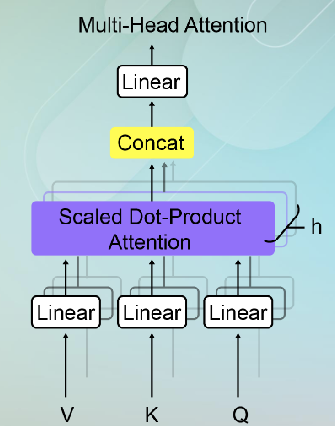

### Transformer Models – Decoder

▪ The decoder in the transformer contains 3 layers:
– Masked multi-head self-attention.屏蔽多头自我注意。
– Encoder-decoder attention.编码器-解码器注意。
– Feed-forward neural network.前馈神经网络
▪ Similar to the encoder, each of the sublayers also has:
– Residual connection剩余连接
– Layer Normalisation层归一化
▪ In the original paper, the decoder blocks are also repeated 6 times.在原始论文中，解码器块也重复了 6 次
▪ Finally, the results go through a linear layer and softmax to generate the final output probabilities.最后，结果经过线性层和 softmax 生成最终输出概率

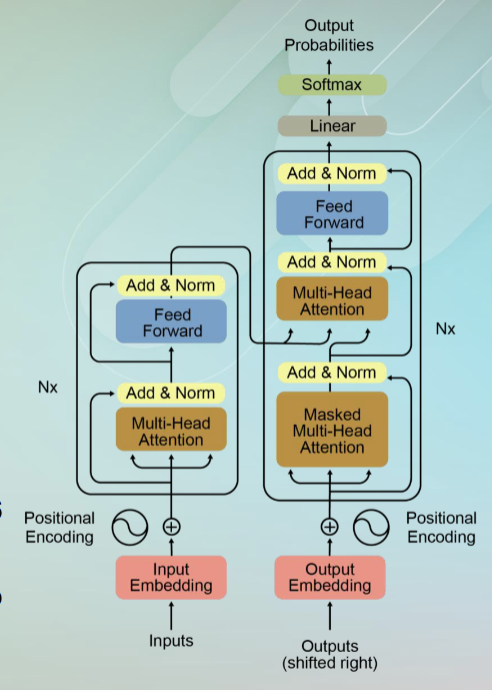

▪ Masked multi-head self-attention:
– Allows each position in the decoder to attend to all positions up to and including that position in the decoder sequence.允许解码器中的每个位置关注解码器序列中包括该位置在内的所有位置。
– The masking prevents positions from attending to subsequent positions, maintaining the auto-regressive property.屏蔽可防止位置关注后续位置，从而保持自动回归特性。
▪ Encoder-Decoder Attention:
– Allows the decoder to focus on different parts of the input sequence.允许解码器关注输入序列的不同部分。
– It's similar to multi-head self-attention but the queries come from the previous decoder layer, and the keys and values come from the output of the encoder stack.它类似于多头自注意，但查询来自前一个解码器层，而键和值来自编码器堆栈的输出。

Summary

▪ Sequence-to-Sequence (Seq2Seq) Model:
A neural network architecture designed for converting sequences from one domain to sequences in another domain, commonly used in tasks like machine translation.
▪ Transformer Models:
– Utilise self-attention mechanisms to process entire input sequences simultaneously, providing efficiency and effectiveness in capturing long-range dependencies.
– Feature an encoder-decoder architecture with multi-head attention, allowing the model to capture a diverse range of information and relationships within the data.
– Do not rely on recurrence or convolution, making them well-suited for parallel processing and handling sequences with complex structures.
▪ Attention Mechanisms:
– A mechanism that allows neural networks to focus on different parts of input sequences when making predictions, enhancing their ability to capture and utilize relevant information.
– Resolves the performance issue on long sequences that plagues RNNs and LSTMS.

序列到序列（Seq2Seq）模型：
一种神经网络架构，设计用于将一个领域的序列转换为另一个领域的序列，常用于机器翻译等任务。

转换器模型：
- 利用自我注意机制同时处理整个输入序列，在捕捉长距离依赖关系方面提供高效率和有效性。
- 采用多头注意的编码器-解码器架构，使模型能够捕捉数据中的各种信息和关系。
- 不依赖递归或卷积，因此非常适合并行处理和处理具有复杂结构的序列。

注意机制：
- 这种机制允许神经网络在进行预测时关注输入序列的不同部分，从而提高捕捉和利用相关信息的能力。
- 解决了困扰 RNN 和 LSTMS 的长序列性能问题。
